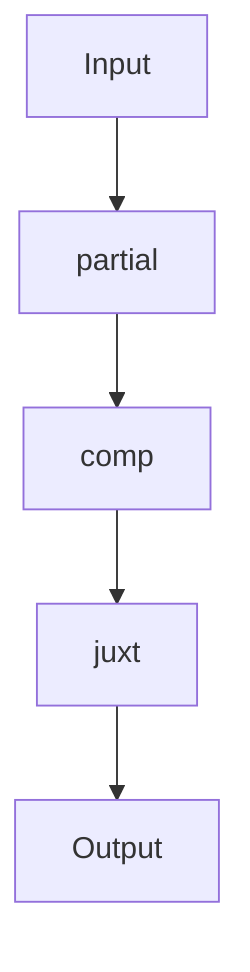

## 5.22. Using `partial`, `comp`, and `juxt` for Function Composition

In the world of functional programming, composing functions is a fundamental concept that allows developers to build complex operations from simple, reusable components. Clojure, being a functional language, provides powerful tools for function composition, including `partial`, `comp`, and `juxt`. These tools not only enhance code reuse and clarity but also promote a more declarative style of programming. In this section, we will explore these functional helpers in detail, providing practical examples and use cases to illustrate their power and versatility.

### Understanding `partial`

The `partial` function in Clojure is used to fix a certain number of arguments to a function, creating a new function with fewer arguments. This is particularly useful when you want to pre-configure a function with some default values or when you need to pass a function as an argument to higher-order functions.

#### How `partial` Works

The `partial` function takes a function and one or more arguments, returning a new function that takes the remaining arguments. When the new function is called, it combines the pre-specified arguments with the new ones and applies them to the original function.

```clojure
(defn add [a b]
  (+ a b))

(def add-five (partial add 5))

;; Usage
(println (add-five 10)) ; Output: 15
```

In this example, `add-five` is a new function created by partially applying the `add` function with the argument `5`. When `add-five` is called with `10`, it effectively calls `(add 5 10)`.

#### Practical Use Cases for `partial`

1. **Configuration of Functions**: Use `partial` to configure functions with default parameters, making them easier to use in different contexts.

2. **Higher-Order Functions**: When passing functions as arguments, `partial` can simplify the process by pre-filling some arguments.

3. **Event Handling**: In event-driven programming, `partial` can be used to bind specific data to event handlers.

```clojure
(defn log-event [event-type message]
  (println (str "[" event-type "] " message)))

(def info-log (partial log-event "INFO"))

(info-log "Application started") ; Output: [INFO] Application started
```

### Exploring `comp`

The `comp` function is used to compose multiple functions into a single function. It takes a variable number of functions as arguments and returns a new function that is the composition of those functions. The resulting function applies the rightmost function first, then the next one to its result, and so on.

#### How `comp` Works

The `comp` function allows you to chain functions together, creating a pipeline of operations. This is particularly useful for data transformations and processing sequences of operations.

```clojure
(defn square [x]
  (* x x))

(defn increment [x]
  (+ x 1))

(def square-and-increment (comp increment square))

;; Usage
(println (square-and-increment 3)) ; Output: 10
```

In this example, `square-and-increment` is a composed function that first squares the input and then increments the result.

#### Practical Use Cases for `comp`

1. **Data Transformation Pipelines**: Use `comp` to create pipelines that transform data through a series of functions.

2. **Function Chaining**: Simplify complex operations by chaining functions together, improving readability and maintainability.

3. **Middleware and Interceptors**: In web applications, `comp` can be used to chain middleware functions that process requests and responses.

```clojure
(defn trim [s]
  (clojure.string/trim s))

(defn capitalize [s]
  (clojure.string/capitalize s))

(def process-string (comp capitalize trim))

(process-string "  hello world  ") ; Output: "Hello world"
```

### Introducing `juxt`

The `juxt` function is used to apply multiple functions to the same set of arguments, returning a vector of results. This is useful when you need to perform several operations on the same input and collect the results.

#### How `juxt` Works

The `juxt` function takes a variable number of functions and returns a new function. When this new function is called with arguments, it applies each of the original functions to those arguments and returns a vector of results.

```clojure
(defn double [x]
  (* 2 x))

(defn triple [x]
  (* 3 x))

(def double-and-triple (juxt double triple))

;; Usage
(println (double-and-triple 5)) ; Output: [10 15]
```

In this example, `double-and-triple` applies both `double` and `triple` to the input `5`, returning a vector of results.

#### Practical Use Cases for `juxt`

1. **Parallel Computation**: Use `juxt` to perform multiple computations in parallel on the same data.

2. **Data Aggregation**: Collect different metrics or transformations of the same data point.

3. **Multi-Aspect Analysis**: Analyze data from different perspectives by applying various functions.

```clojure
(defn min-max [coll]
  (juxt min max))

(min-max [3 1 4 1 5 9]) ; Output: [1 9]
```

### Promoting Code Reuse and Clarity

The use of `partial`, `comp`, and `juxt` promotes code reuse and clarity by allowing developers to build modular, reusable components. These tools encourage a declarative style of programming, where the focus is on what needs to be done rather than how to do it.

- **Code Reuse**: By creating small, reusable functions and composing them, you can build complex operations without duplicating code.

- **Clarity**: Function composition makes the code more readable and easier to understand, as it clearly expresses the sequence of operations.

- **Maintainability**: Modular code is easier to maintain and extend, as changes can be made to individual components without affecting the entire system.

### Visualizing Function Composition

To better understand how `partial`, `comp`, and `juxt` work together, let's visualize their operations using a flowchart.



**Figure 1**: This diagram illustrates the flow of data through `partial`, `comp`, and `juxt`, showing how each function transforms the input and passes it to the next stage.

### Try It Yourself

Experiment with the following code examples to deepen your understanding of `partial`, `comp`, and `juxt`. Try modifying the functions and arguments to see how the output changes.

```clojure
;; Experiment with partial
(defn subtract [a b]
  (- a b))

(def subtract-ten (partial subtract 10))

(println (subtract-ten 3)) ; Try changing the argument

;; Experiment with comp
(defn negate [x]
  (- x))

(def negate-and-square (comp square negate))

(println (negate-and-square 4)) ; Try changing the input

;; Experiment with juxt
(defn sum [x y]
  (+ x y))

(defn product [x y]
  (* x y))

(def sum-and-product (juxt sum product))

(println (sum-and-product 3 4)) ; Try different pairs of numbers
```

### Key Takeaways

- **`partial`**: Pre-configures functions with fixed arguments, simplifying function calls and enhancing code reuse.
- **`comp`**: Chains functions together, creating pipelines for data transformation and processing.
- **`juxt`**: Applies multiple functions to the same arguments, collecting results in a vector for parallel computation and analysis.

### References and Further Reading

- [Clojure Documentation on `partial`](https://clojure.org/reference/partial)
- [Clojure Documentation on `comp`](https://clojure.org/reference/comp)
- [Clojure Documentation on `juxt`](https://clojure.org/reference/juxt)

## **Ready to Test Your Knowledge?**



### What does the `partial` function do in Clojure?

- [x] Fixes a certain number of arguments to a function.
- [ ] Composes multiple functions into one.
- [ ] Applies multiple functions to the same arguments.
- [ ] Creates a new function with additional arguments.

> **Explanation:** `partial` is used to fix a certain number of arguments to a function, creating a new function with fewer arguments.

### How does the `comp` function work?

- [x] Composes multiple functions into a single function.
- [ ] Fixes arguments to a function.
- [ ] Applies functions to the same arguments.
- [ ] Creates a new function with default parameters.

> **Explanation:** `comp` takes multiple functions and returns a new function that is the composition of those functions.

### What is the purpose of the `juxt` function?

- [x] Applies multiple functions to the same arguments and returns a vector of results.
- [ ] Composes functions into a single function.
- [ ] Fixes arguments to a function.
- [ ] Chains functions together for data transformation.

> **Explanation:** `juxt` applies multiple functions to the same arguments and returns a vector of results.

### Which function would you use to create a pipeline of operations?

- [x] `comp`
- [ ] `partial`
- [ ] `juxt`
- [ ] `map`

> **Explanation:** `comp` is used to create a pipeline of operations by chaining functions together.

### How can `partial` be useful in event-driven programming?

- [x] By binding specific data to event handlers.
- [ ] By composing event handlers into a single function.
- [ ] By applying multiple handlers to the same event.
- [ ] By creating a new event with additional parameters.

> **Explanation:** `partial` can be used to bind specific data to event handlers, simplifying event-driven programming.

### What is a practical use case for `juxt`?

- [x] Performing multiple computations in parallel on the same data.
- [ ] Creating a pipeline of operations.
- [ ] Fixing arguments to a function.
- [ ] Simplifying function calls with default parameters.

> **Explanation:** `juxt` is useful for performing multiple computations in parallel on the same data.

### What does `comp` return?

- [x] A new function that is the composition of the input functions.
- [ ] A vector of results from applying functions.
- [ ] A function with fixed arguments.
- [ ] A function with default parameters.

> **Explanation:** `comp` returns a new function that is the composition of the input functions.

### How does `partial` enhance code reuse?

- [x] By creating functions with fixed arguments that can be reused in different contexts.
- [ ] By composing functions into a single function.
- [ ] By applying functions to the same arguments.
- [ ] By creating a pipeline of operations.

> **Explanation:** `partial` enhances code reuse by creating functions with fixed arguments that can be reused in different contexts.

### Which function is best for data aggregation?

- [x] `juxt`
- [ ] `comp`
- [ ] `partial`
- [ ] `reduce`

> **Explanation:** `juxt` is best for data aggregation as it applies multiple functions to the same data and collects the results.

### True or False: `comp` applies the leftmost function first.

- [ ] True
- [x] False

> **Explanation:** `comp` applies the rightmost function first, then the next one to its result, and so on.



Remember, this is just the beginning. As you progress, you'll build more complex and interactive applications using these powerful tools. Keep experimenting, stay curious, and enjoy the journey!
