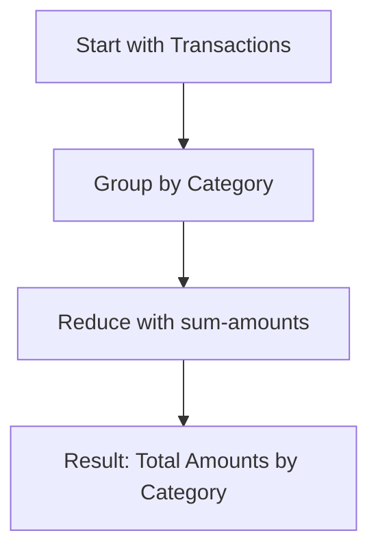

## 5.23. Leveraging `reduce-kv`, `into`, and Collection Helpers

In the world of Clojure, collections are at the heart of data manipulation. Clojure provides a rich set of functions to work with collections, enabling developers to write concise and expressive code. In this section, we will delve into some advanced collection manipulation techniques using `reduce-kv`, `into`, and other collection helpers like `group-by`, `frequencies`, and `merge-with`. These tools are essential for simplifying complex data transformations and ensuring efficient data processing.

### Understanding `reduce-kv`

`reduce-kv` is a powerful function specifically designed for reducing associative collections, such as maps. It iterates over each key-value pair in the collection, applying a function that accumulates a result. The signature of `reduce-kv` is as follows:

```clojure
(reduce-kv f init coll)
```

- `f`: A function that takes three arguments: the accumulator, the key, and the value.
- `init`: The initial value of the accumulator.
- `coll`: The associative collection to be reduced.

#### Example: Summing Values in a Map

Let's start with a simple example where we sum the values in a map:

```clojure
(def my-map {:a 1 :b 2 :c 3})

(defn sum-values [acc k v]
  (+ acc v))

(reduce-kv sum-values 0 my-map)
;; => 6
```

In this example, `reduce-kv` iterates over each key-value pair in `my-map`, applying the `sum-values` function, which adds the value to the accumulator.

#### Example: Transforming a Map

Suppose we want to transform a map by applying a function to each value. We can achieve this using `reduce-kv`:

```clojure
(defn transform-values [acc k v]
  (assoc acc k (* v 2)))

(reduce-kv transform-values {} my-map)
;; => {:a 2, :b 4, :c 6}
```

Here, `transform-values` multiplies each value by 2 and associates it back into the accumulator map.

### Building Collections with `into`

`into` is a versatile function for building collections. It takes a target collection and a source collection, and efficiently adds the elements of the source to the target. The signature of `into` is:

```clojure
(into to from)
```

- `to`: The target collection.
- `from`: The source collection.

#### Example: Merging Collections

Let's see how `into` can be used to merge two collections:

```clojure
(def vec1 [1 2 3])
(def vec2 [4 5 6])

(into vec1 vec2)
;; => [1 2 3 4 5 6]
```

In this example, `into` appends the elements of `vec2` to `vec1`.

#### Example: Converting a Map to a Vector

`into` can also be used to convert a map into a vector of key-value pairs:

```clojure
(into [] my-map)
;; => [[:a 1] [:b 2] [:c 3]]
```

This is particularly useful when you need to process or iterate over key-value pairs in a sequential manner.

### Exploring Other Collection Helpers

Clojure provides several other collection helpers that simplify common data transformation tasks. Let's explore some of these functions.

#### `group-by`

`group-by` partitions a collection into a map of collections, grouped by the result of a function applied to each element. The signature is:

```clojure
(group-by f coll)
```

- `f`: A function that returns the key for grouping.
- `coll`: The collection to be grouped.

##### Example: Grouping by Even and Odd

```clojure
(def numbers [1 2 3 4 5 6])

(group-by even? numbers)
;; => {false [1 3 5], true [2 4 6]}
```

In this example, `group-by` partitions the numbers into even and odd groups.

#### `frequencies`

`frequencies` returns a map from distinct items in a collection to the number of times they appear. It's a simple way to count occurrences.

##### Example: Counting Character Frequencies

```clojure
(def chars [\a \b \a \c \b \a])

(frequencies chars)
;; => {\a 3, \b 2, \c 1}
```

Here, `frequencies` counts how many times each character appears in the list.

#### `merge-with`

`merge-with` combines multiple maps, using a function to resolve conflicts when keys overlap. The signature is:

```clojure
(merge-with f & maps)
```

- `f`: A function to combine values for duplicate keys.
- `maps`: The maps to be merged.

##### Example: Merging Maps with Addition

```clojure
(def map1 {:a 1 :b 2})
(def map2 {:b 3 :c 4})

(merge-with + map1 map2)
;; => {:a 1, :b 5, :c 4}
```

In this example, `merge-with` uses addition to resolve conflicts for the key `:b`.

### Simplifying Complex Data Transformations

By combining these functions, you can simplify complex data transformations. Let's look at a practical example.

#### Example: Transforming and Grouping Data

Suppose we have a collection of transactions, and we want to group them by category and calculate the total amount for each category.

```clojure
(def transactions
  [{:category :food :amount 10}
   {:category :clothing :amount 20}
   {:category :food :amount 15}
   {:category :electronics :amount 100}])

(defn sum-amounts [acc {:keys [amount]}]
  (+ acc amount))

(def grouped-transactions
  (group-by :category transactions))

(reduce-kv
  (fn [acc category trans]
    (assoc acc category (reduce sum-amounts 0 trans)))
  {}
  grouped-transactions)
;; => {:food 25, :clothing 20, :electronics 100}
```

In this example, we first group transactions by category using `group-by`. Then, we use `reduce-kv` to sum the amounts for each category.

### Choosing the Right Tool for the Task

Choosing the right tool for the task is crucial in Clojure. Each of these functions has its strengths, and understanding when to use each one can lead to more efficient and readable code.

- Use `reduce-kv` when working with associative collections and you need to accumulate a result based on keys and values.
- Use `into` for efficient collection building, especially when converting between collection types or merging collections.
- Use `group-by`, `frequencies`, and `merge-with` for common data transformation tasks like grouping, counting, and merging.

### Try It Yourself

Experiment with the examples provided. Try modifying the code to see how changes affect the output. For instance, change the transformation function in the `reduce-kv` example to apply a different operation, or use `into` to build a different type of collection.

### Visualizing Collection Operations

To better understand how these functions work, let's visualize the process of transforming and grouping data using `reduce-kv` and `group-by`.



This diagram illustrates the flow of data from the initial collection of transactions, through grouping by category, and finally reducing to calculate total amounts.

### References and Further Reading

- [Clojure Documentation](https://clojure.org/reference/collections)
- [Clojure Cheat Sheet](https://clojure.org/api/cheatsheet)
- [Functional Programming in Clojure](https://www.braveclojure.com/)

### Knowledge Check

To reinforce your understanding, try answering the following questions and challenges.

## **Ready to Test Your Knowledge?**



### What is the primary use of `reduce-kv` in Clojure?

- [x] To reduce associative collections by iterating over key-value pairs.
- [ ] To reduce sequential collections by iterating over elements.
- [ ] To convert maps into vectors.
- [ ] To group collections by a specific key.

> **Explanation:** `reduce-kv` is specifically designed for reducing associative collections, such as maps, by iterating over key-value pairs.

### How does `into` differ from `conj` when building collections?

- [x] `into` efficiently merges collections, while `conj` adds individual elements.
- [ ] `into` adds individual elements, while `conj` merges collections.
- [ ] Both `into` and `conj` are used for merging collections.
- [ ] `into` is used for associative collections, while `conj` is for sequential collections.

> **Explanation:** `into` is used to efficiently merge collections, while `conj` is used to add individual elements to a collection.

### Which function would you use to count occurrences of elements in a collection?

- [ ] `group-by`
- [x] `frequencies`
- [ ] `merge-with`
- [ ] `reduce-kv`

> **Explanation:** `frequencies` returns a map from distinct items in a collection to the number of times they appear.

### What is the purpose of `merge-with` in Clojure?

- [x] To combine maps using a function to resolve key conflicts.
- [ ] To merge collections into a single sequence.
- [ ] To group elements by a specific key.
- [ ] To transform values in a map.

> **Explanation:** `merge-with` is used to combine multiple maps, using a function to resolve conflicts when keys overlap.

### Which function is best suited for grouping elements in a collection?

- [x] `group-by`
- [ ] `frequencies`
- [ ] `reduce-kv`
- [ ] `into`

> **Explanation:** `group-by` partitions a collection into a map of collections, grouped by the result of a function applied to each element.

### True or False: `reduce-kv` can be used with vectors.

- [ ] True
- [x] False

> **Explanation:** `reduce-kv` is designed for associative collections like maps, not for sequential collections like vectors.

### What is a common use case for `into`?

- [x] Converting a map into a vector of key-value pairs.
- [ ] Counting occurrences of elements in a collection.
- [ ] Grouping elements by a specific key.
- [ ] Reducing a collection by summing values.

> **Explanation:** `into` can be used to convert a map into a vector of key-value pairs, among other uses.

### Which function would you use to transform a map by applying a function to each value?

- [x] `reduce-kv`
- [ ] `group-by`
- [ ] `frequencies`
- [ ] `into`

> **Explanation:** `reduce-kv` can be used to transform a map by applying a function to each value and accumulating the results.

### What is the result of `(into [] {:a 1 :b 2 :c 3})`?

- [x] `[[:a 1] [:b 2] [:c 3]]`
- [ ] `{:a 1, :b 2, :c 3}`
- [ ] `[1 2 3]`
- [ ] `{:a 1, :b 2, :c 3, :d 4}`

> **Explanation:** `into` converts the map into a vector of key-value pairs.

### True or False: `merge-with` can be used to resolve conflicts in vectors.

- [ ] True
- [x] False

> **Explanation:** `merge-with` is used for maps, not vectors, to resolve key conflicts using a function.



Remember, mastering these functions will greatly enhance your ability to manipulate and transform data in Clojure. Keep experimenting, stay curious, and enjoy the journey!
