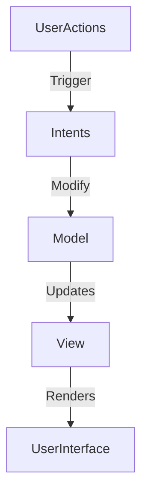

## 5.3 Model-View-Intent (MVI) in Clojure

### Introduction

Model-View-Intent (MVI) is an architectural pattern designed to manage user interfaces through a unidirectional data flow. This pattern is particularly beneficial for ClojureScript applications, especially when using libraries like Reagent or Rum, which facilitate reactive UI development. MVI separates the system into three distinct components: Model, View, and Intent, each playing a crucial role in maintaining a clean and manageable codebase.

### Detailed Explanation

#### MVI Components

1. **Model**: Represents the application state. In Clojure, this is typically managed using immutable data structures and atoms for state management.
2. **View**: The UI representation of the state. It reacts to changes in the Model and renders the UI accordingly.
3. **Intent**: Captures user actions and translates them into state changes. This component ensures that user interactions are processed and reflected in the Model.

#### Unidirectional Data Flow

The core principle of MVI is unidirectional data flow, which simplifies reasoning about the application state and its transitions. The flow can be summarized as follows:

- **User Actions**: Trigger Intents.
- **Intents**: Modify the Model.
- **Model Changes**: Automatically update the View.

This clear separation of concerns leads to more predictable and maintainable code.

### Visual Aids

#### MVI Architecture Diagram



### Code Examples

Let's explore how to implement the MVI pattern in a ClojureScript application using Reagent.

#### Define the Model

The Model is represented by an atom that holds the application state. Here, we define a simple state with a count.

```clojure
(def app-state (atom {:count 0}))
```

#### Implement the View

The View is a Reagent component that renders the current state and provides buttons for user interaction.

```clojure
(defn counter-view []
  [:div
   [:p "Count: " (:count @app-state)]
   [:button {:on-click #(dispatch :increment)} "Increment"]
   [:button {:on-click #(dispatch :decrement)} "Decrement"]])
```

#### Handle Intents (User Actions)

Intents are handled by a dispatch function that updates the Model based on user actions.

```clojure
(defn dispatch [action]
  (case action
    :increment (swap! app-state update :count inc)
    :decrement (swap! app-state update :count dec)))
```

### Use Cases

The MVI pattern is particularly useful in applications where:

- **Complex State Management**: The application has a complex state that needs to be managed predictably.
- **Reactive UIs**: The UI needs to react to state changes efficiently.
- **Separation of Concerns**: There is a need to separate the UI logic from the business logic.

### Advantages and Disadvantages

#### Advantages

- **Predictability**: Unidirectional data flow makes it easier to predict how changes in the state affect the UI.
- **Maintainability**: Clear separation of concerns leads to more maintainable code.
- **Scalability**: The pattern scales well with application complexity.

#### Disadvantages

- **Initial Complexity**: Setting up the MVI pattern can be complex for small applications.
- **Boilerplate Code**: May introduce additional boilerplate compared to simpler patterns.

### Best Practices

- **Use Reagent for Reactive Views**: Leverage Reagent's reactive capabilities to automatically update the UI when the state changes.
- **Separate Side Effects**: Use middleware or effect handlers to manage asynchronous operations or side effects, keeping the core logic pure.
- **Keep Intents Simple**: Ensure that Intents only handle user actions and do not contain business logic.

### Comparisons

MVI can be compared to other patterns like Model-View-Controller (MVC) and Model-View-ViewModel (MVVM). Unlike MVC, MVI enforces a strict unidirectional flow, reducing the complexity of state management. Compared to MVVM, MVI is more explicit in handling user actions and state updates.

### Conclusion

The Model-View-Intent pattern provides a robust framework for managing complex user interfaces in ClojureScript applications. By enforcing unidirectional data flow and separating concerns, MVI enhances code maintainability and predictability. Leveraging libraries like Reagent or Rum, developers can create responsive and scalable applications with ease.

## Quiz Time!



### What is the primary benefit of using the MVI pattern in ClojureScript applications?

- [x] Unidirectional data flow simplifies state management.
- [ ] It reduces the need for state management.
- [ ] It eliminates the need for a view layer.
- [ ] It allows for bidirectional data flow.

> **Explanation:** MVI's unidirectional data flow simplifies reasoning about state changes and their effects on the UI.

### In MVI, what component is responsible for capturing user actions?

- [ ] Model
- [ ] View
- [x] Intent
- [ ] Controller

> **Explanation:** The Intent component captures user actions and translates them into state changes.

### How does the View component in MVI update the UI?

- [x] It reacts to changes in the Model.
- [ ] It directly modifies the Model.
- [ ] It listens for changes in the Intent.
- [ ] It updates based on user input.

> **Explanation:** The View component reacts to changes in the Model, automatically updating the UI.

### Which library is commonly used in ClojureScript for reactive views in MVI?

- [ ] Redux
- [x] Reagent
- [ ] Angular
- [ ] Vue.js

> **Explanation:** Reagent is commonly used in ClojureScript for creating reactive views in MVI.

### What is the role of the Model in the MVI pattern?

- [x] It represents the application state.
- [ ] It captures user actions.
- [ ] It renders the UI.
- [ ] It handles side effects.

> **Explanation:** The Model represents the application state, which is updated by Intents and observed by the View.

### What is a potential disadvantage of using the MVI pattern?

- [x] Initial complexity for small applications.
- [ ] Lack of state management.
- [ ] Difficulty in handling user actions.
- [ ] Inability to scale with application complexity.

> **Explanation:** MVI can introduce initial complexity and boilerplate, especially in smaller applications.

### How are side effects typically handled in an MVI architecture?

- [ ] Directly in the View component.
- [ ] Within the Model.
- [x] Using middleware or effect handlers.
- [ ] In the Intent component.

> **Explanation:** Side effects are managed separately using middleware or effect handlers to keep the core logic pure.

### What is the main difference between MVI and MVC?

- [x] MVI enforces unidirectional data flow.
- [ ] MVC has no view component.
- [ ] MVI lacks a model component.
- [ ] MVC enforces unidirectional data flow.

> **Explanation:** MVI enforces unidirectional data flow, unlike MVC, which can have bidirectional flow between components.

### Which of the following is a key principle of MVI?

- [x] Separation of concerns
- [ ] Bidirectional data flow
- [ ] Direct state mutation
- [ ] Single-layer architecture

> **Explanation:** MVI emphasizes separation of concerns, dividing the application into Model, View, and Intent.

### True or False: MVI is suitable for applications with complex state management needs.

- [x] True
- [ ] False

> **Explanation:** MVI is well-suited for applications with complex state management due to its clear separation of concerns and unidirectional data flow.


