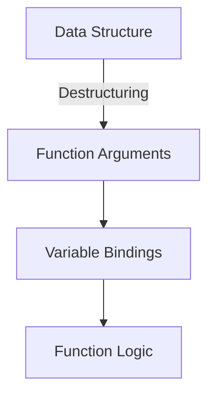

## 5.3. Destructuring in Function Arguments

Destructuring in Clojure is a powerful feature that allows developers to extract values from complex data structures directly within function arguments or `let` bindings. This technique enhances code readability and reduces boilerplate, making your code more concise and expressive. In this section, we'll explore the various facets of destructuring, including positional and associative destructuring, advanced techniques, and practical examples.

### What is Destructuring?

Destructuring is a syntactic convenience that allows you to bind names to values within a data structure, such as vectors, maps, or lists, directly in the function parameters or `let` bindings. This feature simplifies the process of accessing nested data and improves code clarity by reducing the need for repetitive access patterns.

#### Advantages of Destructuring

- **Improved Readability**: By naming elements directly, destructuring makes the code more understandable.
- **Reduced Boilerplate**: It eliminates the need for explicit extraction of values, reducing repetitive code.
- **Expressiveness**: Destructuring allows you to express complex data manipulations succinctly.

### Positional Destructuring with Vectors

Positional destructuring is used with sequential data structures like vectors and lists. It allows you to bind variables to elements based on their position.

#### Basic Example

```clojure
(defn greet [name age]
  (println "Hello," name "! You are" age "years old."))

(greet "Alice" 30)
```

With destructuring, you can achieve the same result more concisely:

```clojure
(defn greet [[name age]]
  (println "Hello," name "! You are" age "years old."))

(greet ["Alice" 30])
```

In this example, the vector `[name age]` in the function parameters directly binds `name` to the first element and `age` to the second element of the input vector.

#### Advanced Positional Destructuring

You can also use the rest operator `&` to capture remaining elements:

```clojure
(defn process-numbers [[first second & rest]]
  (println "First:" first ", Second:" second ", Rest:" rest))

(process-numbers [1 2 3 4 5])
```

**Output:**

```
First: 1 , Second: 2 , Rest: (3 4 5)
```

### Associative Destructuring with Maps

Associative destructuring is used with maps, allowing you to bind variables to values based on keys.

#### Basic Example

```clojure
(defn print-person [{:keys [name age]}]
  (println "Name:" name ", Age:" age))

(print-person {:name "Bob" :age 25})
```

Here, `{:keys [name age]}` binds `name` to the value associated with the `:name` key and `age` to the value associated with the `:age` key.

#### Nested Destructuring

You can destructure nested maps by nesting destructuring forms:

```clojure
(defn print-person-details [{:keys [name age address]}]
  (let [{:keys [city state]} address]
    (println "Name:" name ", Age:" age ", City:" city ", State:" state)))

(print-person-details {:name "Bob" :age 25 :address {:city "New York" :state "NY"}})
```

**Output:**

```
Name: Bob , Age: 25 , City: New York , State: NY
```

### Advanced Destructuring Techniques

#### Providing Default Values

You can provide default values for destructured elements using the `:or` keyword:

```clojure
(defn print-person [{:keys [name age] :or {name "Unknown" age 0}}]
  (println "Name:" name ", Age:" age))

(print-person {:age 25})
```

**Output:**

```
Name: Unknown , Age: 25
```

#### Combining Positional and Associative Destructuring

You can combine both positional and associative destructuring in function arguments:

```clojure
(defn process-data [[x y] {:keys [a b]}]
  (println "x:" x ", y:" y ", a:" a ", b:" b))

(process-data [1 2] {:a 3 :b 4})
```

**Output:**

```
x: 1 , y: 2 , a: 3 , b: 4
```

### Practical Examples

#### Destructuring in Function Parameters

Destructuring is particularly useful in functions that process complex data structures:

```clojure
(defn calculate-total [{:keys [price quantity]}]
  (* price quantity))

(calculate-total {:price 10 :quantity 5})
```

**Output:**

```
50
```

#### Destructuring in `let` Bindings

Destructuring can also be used in `let` bindings to simplify variable assignments:

```clojure
(let [{:keys [name age]} {:name "Charlie" :age 28}]
  (println "Name:" name ", Age:" age))
```

**Output:**

```
Name: Charlie , Age: 28
```

### Enhancing Code Readability

Destructuring enhances code readability by allowing you to focus on the logic rather than the mechanics of data extraction. It reduces the cognitive load on developers by making the code more declarative and less procedural.

### Visualizing Destructuring

Below is a diagram illustrating how destructuring works in Clojure:



**Diagram Description**: This diagram shows how destructuring takes a data structure and directly binds its elements to variables in function arguments, which are then used in the function logic.

### Try It Yourself

Experiment with the provided code examples by modifying the data structures or destructuring patterns. Try adding more keys or elements, or changing the order of elements in vectors to see how destructuring adapts.

### References and Links

- [Clojure Documentation on Destructuring](https://clojure.org/reference/destructuring)
- [MDN Web Docs on Destructuring Assignment](https://developer.mozilla.org/en-US/docs/Web/JavaScript/Reference/Operators/Destructuring_assignment)

### Knowledge Check

- What are the benefits of using destructuring in Clojure?
- How does positional destructuring differ from associative destructuring?
- Can you provide default values in destructuring? How?
- How does destructuring improve code readability?

### Embrace the Journey

Remember, mastering destructuring is just one step in becoming proficient in Clojure. As you continue to explore and experiment with these patterns, you'll find new ways to write more efficient and elegant code. Keep experimenting, stay curious, and enjoy the journey!

## **Ready to Test Your Knowledge?**



### What is the primary advantage of destructuring in Clojure?

- [x] It improves code readability and reduces boilerplate.
- [ ] It increases the execution speed of the program.
- [ ] It allows for dynamic typing.
- [ ] It enables the use of macros.

> **Explanation:** Destructuring primarily improves code readability and reduces boilerplate by allowing direct extraction of values from complex data structures.

### How does positional destructuring work in Clojure?

- [x] It binds variables to elements based on their position in a sequence.
- [ ] It binds variables to elements based on their keys.
- [ ] It uses macros to extract values.
- [ ] It requires the use of `let` bindings.

> **Explanation:** Positional destructuring binds variables to elements based on their position in a sequence like vectors or lists.

### Can you provide default values in destructuring?

- [x] Yes, using the `:or` keyword.
- [ ] No, default values are not supported.
- [ ] Yes, using the `:default` keyword.
- [ ] Yes, using the `:def` keyword.

> **Explanation:** Default values can be provided in destructuring using the `:or` keyword.

### Which of the following is an example of associative destructuring?

- [x] `{:keys [name age]}`
- [ ] `[name age]`
- [ ] `{:values [name age]}`
- [ ] `(name age)`

> **Explanation:** Associative destructuring uses the `:keys` keyword to bind variables to values based on map keys.

### What is the result of the following code: `(let [{:keys [x y]} {:x 10 :y 20}] (+ x y))`?

- [x] 30
- [ ] 10
- [ ] 20
- [ ] 0

> **Explanation:** The code destructures the map and binds `x` to 10 and `y` to 20, resulting in the sum of 30.

### How can you capture remaining elements in positional destructuring?

- [x] Using the `&` operator.
- [ ] Using the `*` operator.
- [ ] Using the `...` operator.
- [ ] Using the `rest` function.

> **Explanation:** The `&` operator is used to capture remaining elements in positional destructuring.

### What is the output of `(defn greet [[name age]] (println "Hello," name "! You are" age "years old.")) (greet ["Alice" 30])`?

- [x] `Hello, Alice ! You are 30 years old.`
- [ ] `Hello, Alice ! You are years old.`
- [ ] `Hello, ! You are 30 years old.`
- [ ] `Hello, Alice ! You are 0 years old.`

> **Explanation:** The function destructures the vector and binds `name` to "Alice" and `age` to 30, resulting in the correct greeting message.

### What is the purpose of nested destructuring?

- [x] To destructure nested data structures within a single expression.
- [ ] To increase the complexity of code.
- [ ] To avoid using `let` bindings.
- [ ] To improve performance.

> **Explanation:** Nested destructuring allows you to destructure nested data structures within a single expression, simplifying code.

### Which keyword is used for associative destructuring?

- [x] `:keys`
- [ ] `:values`
- [ ] `:assoc`
- [ ] `:map`

> **Explanation:** The `:keys` keyword is used in associative destructuring to bind variables to map values.

### True or False: Destructuring can only be used in function arguments.

- [ ] True
- [x] False

> **Explanation:** Destructuring can be used in both function arguments and `let` bindings, among other contexts.




