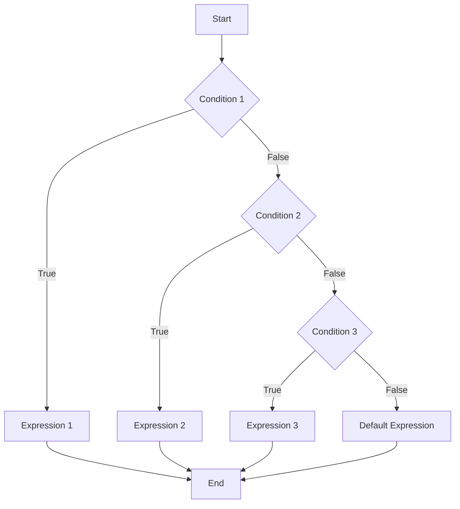

## 5.4. Using `cond`, `case`, and `cond->` for Control Flow

In Clojure, control flow is an essential aspect of writing expressive and efficient code. The language provides several constructs that allow developers to handle multiple conditions and transformations in a clean and idiomatic way. In this section, we will explore three powerful constructs: `cond`, `case`, and `cond->`. These tools enable developers to write more readable and maintainable code by reducing the complexity often associated with nested `if` statements and other imperative control structures.

### Understanding `cond`: A More Expressive Alternative to Nested `if`

The `cond` macro in Clojure is a versatile tool for handling multiple conditions. It serves as a more expressive alternative to nested `if` statements, allowing you to evaluate conditions in a sequential manner until one is found to be true. This construct is particularly useful when you have a series of conditions that need to be checked in order.

#### How `cond` Works

The `cond` macro takes a series of test-expression pairs. It evaluates each test in order, and when a test returns true, it evaluates and returns the corresponding expression. If none of the tests are true, `cond` returns `nil`.

```clojure
(cond
  (< x 0) "Negative"
  (= x 0) "Zero"
  (> x 0) "Positive")
```

In this example, `cond` checks if `x` is less than zero, equal to zero, or greater than zero, and returns a corresponding string. This approach is much cleaner than using nested `if` statements.

#### Practical Example of `cond`

Let's consider a practical example where we need to determine the category of a given temperature:

```clojure
(defn temperature-category [temp]
  (cond
    (< temp 0) "Freezing"
    (< temp 10) "Cold"
    (< temp 20) "Cool"
    (< temp 30) "Warm"
    :else "Hot"))

(println (temperature-category 15)) ; Output: "Cool"
```

In this function, `cond` is used to categorize the temperature into different ranges. The `:else` keyword acts as a default case, similar to the `else` clause in an `if` statement.

### Introducing `case`: Value-Based Dispatching

While `cond` is great for evaluating conditions, `case` is more suited for value-based dispatching. It allows you to choose an expression to evaluate based on the value of a single expression. This is similar to a switch statement in other languages but is more efficient in Clojure.

#### How `case` Works

The `case` macro evaluates an expression and compares it against a set of constant values. If a match is found, the corresponding expression is evaluated and returned. If no match is found, an optional default expression can be provided.

```clojure
(case day
  :monday "Start of the work week"
  :friday "End of the work week"
  :saturday "Weekend!"
  :sunday "Weekend!"
  "Midweek")
```

In this example, `case` checks the value of `day` and returns a corresponding string. If `day` is not one of the specified values, it defaults to "Midweek".

#### Practical Example of `case`

Let's use `case` to determine the type of a given day:

```clojure
(defn day-type [day]
  (case day
    :monday "Workday"
    :tuesday "Workday"
    :wednesday "Workday"
    :thursday "Workday"
    :friday "Workday"
    :saturday "Weekend"
    :sunday "Weekend"
    "Unknown"))

(println (day-type :friday)) ; Output: "Workday"
```

In this function, `case` is used to map each day to its type, either "Workday" or "Weekend".

### Exploring `cond->` and `cond->>`: Conditional Threading

Clojure's `cond->` and `cond->>` macros provide a way to conditionally thread expressions through a series of transformations. These constructs are particularly useful when you want to apply a series of transformations to a value, but only under certain conditions.

#### How `cond->` Works

The `cond->` macro takes an initial value and a series of condition-expression pairs. It threads the value through each expression where the condition is true.

```clojure
(cond-> x
  (even? x) (* 2)
  (> x 10) (+ 5))
```

In this example, if `x` is even, it is multiplied by 2. If `x` is greater than 10, 5 is added to it.

#### Practical Example of `cond->`

Let's use `cond->` to apply a series of transformations to a map:

```clojure
(defn update-map [m]
  (cond-> m
    (:active m) (assoc :status "active")
    (:admin m) (assoc :role "admin")))

(println (update-map {:active true :admin false})) ; Output: {:active true, :status "active", :admin false}
```

In this function, `cond->` is used to conditionally update a map based on its keys.

#### How `cond->>` Works

The `cond->>` macro is similar to `cond->`, but it threads the value as the last argument of each expression. This is useful when the transformation functions expect the value as their last argument.

```clojure
(cond->> x
  (even? x) (str " is even")
  (> x 10) (str " and greater than 10"))
```

In this example, if `x` is even, it is converted to a string with " is even" appended. If `x` is greater than 10, " and greater than 10" is appended.

#### Practical Example of `cond->>`

Let's use `cond->>` to build a string description of a number:

```clojure
(defn describe-number [n]
  (cond->> n
    (even? n) (str "even ")
    (> n 10) (str "large ")))

(println (describe-number 12)) ; Output: "even large "
```

In this function, `cond->>` is used to build a description of the number based on its properties.

### Best Practices and Choosing the Right Construct

When deciding which control flow construct to use, consider the following guidelines:

- **Use `cond`** when you have multiple conditions to evaluate and want a clear, sequential flow of logic.
- **Use `case`** when you need to dispatch based on a single value and have a fixed set of possible values.
- **Use `cond->` and `cond->>`** when you need to apply a series of transformations conditionally, especially when working with data structures or building pipelines.

### Visualizing Control Flow Constructs

To better understand how these constructs work, let's visualize the flow of a `cond` statement:



This diagram illustrates how `cond` evaluates each condition in sequence and executes the corresponding expression when a condition is true.

### Try It Yourself

Experiment with the following code examples to deepen your understanding of Clojure's control flow constructs. Try modifying the conditions and expressions to see how the output changes.

```clojure
(defn categorize-number [n]
  (cond
    (neg? n) "Negative"
    (zero? n) "Zero"
    (pos? n) "Positive"
    :else "Unknown"))

(println (categorize-number -5)) ; Output: "Negative"
```

```clojure
(defn fruit-color [fruit]
  (case fruit
    :apple "Red"
    :banana "Yellow"
    :grape "Purple"
    "Unknown"))

(println (fruit-color :banana)) ; Output: "Yellow"
```

```clojure
(defn transform-number [n]
  (cond-> n
    (even? n) (* 2)
    (> n 10) (+ 5)))

(println (transform-number 8)) ; Output: 16
```

### Knowledge Check

Before moving on, take a moment to reflect on what you've learned. Consider the following questions:

- How does `cond` differ from nested `if` statements?
- When would you choose `case` over `cond`?
- What are the benefits of using `cond->` for data transformations?

### Summary

In this section, we've explored the power of Clojure's control flow constructs: `cond`, `case`, and `cond->`. These tools provide flexible and expressive ways to handle multiple conditions and transformations, improving code clarity and maintainability. By understanding when and how to use each construct, you can write more idiomatic and efficient Clojure code.

Remember, this is just the beginning. As you progress, you'll discover even more ways to leverage Clojure's unique features to build robust and elegant applications. Keep experimenting, stay curious, and enjoy the journey!

## **Ready to Test Your Knowledge?**



### What is the primary use of the `cond` macro in Clojure?

- [x] To evaluate multiple conditions sequentially
- [ ] To perform value-based dispatching
- [ ] To thread expressions conditionally
- [ ] To handle exceptions

> **Explanation:** The `cond` macro is used to evaluate multiple conditions sequentially until one is true.

### Which construct is best for value-based dispatching in Clojure?

- [ ] `cond`
- [x] `case`
- [ ] `cond->`
- [ ] `if`

> **Explanation:** The `case` construct is best suited for value-based dispatching, similar to a switch statement.

### How does `cond->` differ from `cond`?

- [x] `cond->` threads a value through expressions conditionally
- [ ] `cond->` is used for value-based dispatching
- [ ] `cond->` evaluates conditions in reverse order
- [ ] `cond->` is a variant of `case`

> **Explanation:** `cond->` threads a value through a series of expressions conditionally, unlike `cond`, which evaluates conditions sequentially.

### What is the role of `:else` in a `cond` expression?

- [x] It acts as a default case when no conditions are true
- [ ] It is used to terminate the `cond` expression
- [ ] It specifies a fallback value for `case`
- [ ] It is a keyword for error handling

> **Explanation:** The `:else` keyword acts as a default case in a `cond` expression when no other conditions are true.

### When should you use `cond->>` over `cond->`?

- [x] When the value should be threaded as the last argument
- [ ] When the value should be threaded as the first argument
- [ ] When you need to handle exceptions
- [ ] When you want to perform value-based dispatching

> **Explanation:** `cond->>` threads the value as the last argument of each expression, unlike `cond->`, which threads it as the first argument.

### Which construct is most similar to a switch statement in other languages?

- [ ] `cond`
- [x] `case`
- [ ] `cond->`
- [ ] `if`

> **Explanation:** The `case` construct is most similar to a switch statement, as it dispatches based on a single value.

### What is a key advantage of using `cond->`?

- [x] It allows for conditional threading of transformations
- [ ] It simplifies value-based dispatching
- [ ] It provides a default case for unmatched conditions
- [ ] It handles exceptions more gracefully

> **Explanation:** `cond->` allows for conditional threading of transformations, making it useful for data processing pipelines.

### How does `case` handle unmatched values?

- [x] It returns an optional default expression
- [ ] It throws an exception
- [ ] It returns `nil`
- [ ] It evaluates all expressions

> **Explanation:** `case` can return an optional default expression if no match is found.

### What is the output of `(case :apple :apple "Red" :banana "Yellow" "Unknown")`?

- [x] "Red"
- [ ] "Yellow"
- [ ] "Unknown"
- [ ] `nil`

> **Explanation:** The `case` expression matches `:apple` and returns "Red".

### True or False: `cond->` and `cond->>` are used for exception handling.

- [ ] True
- [x] False

> **Explanation:** `cond->` and `cond->>` are used for conditional threading of expressions, not for exception handling.


