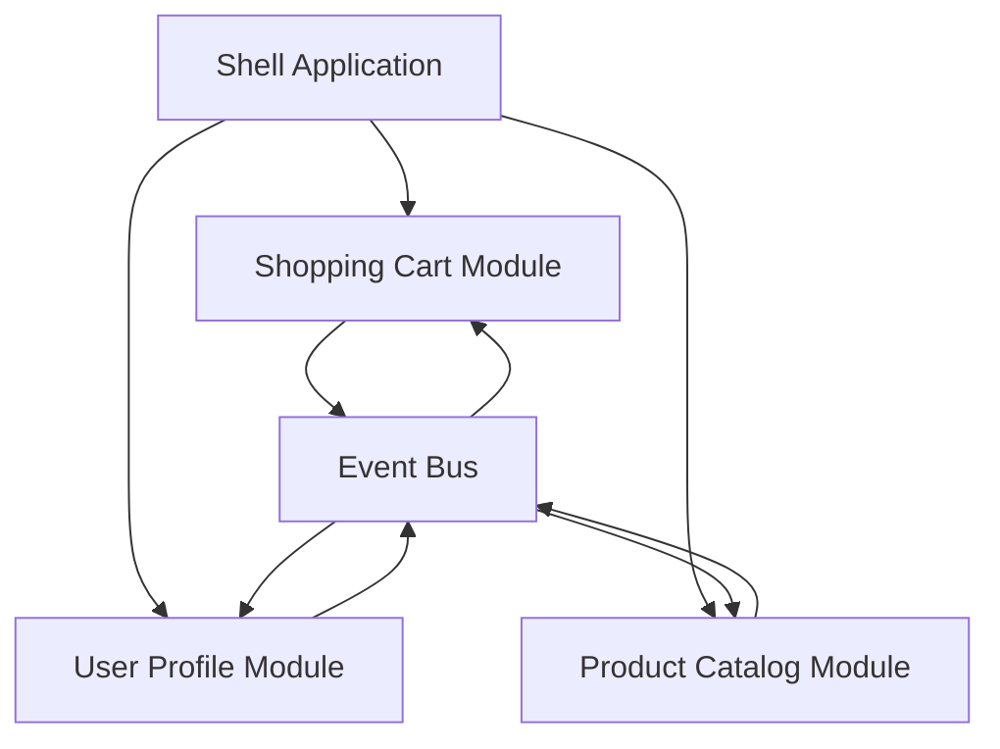

## 5.4 Micro Frontends in Clojure

In the ever-evolving landscape of web development, the concept of micro frontends has emerged as a powerful architectural pattern. This approach allows developers to break down a monolithic frontend application into smaller, independently deployable units, each responsible for a distinct feature or domain. In this article, we will explore how to implement micro frontends using ClojureScript, leveraging its functional programming paradigm to create scalable and maintainable frontend architectures.

### Introduction to Micro Frontends

Micro frontends extend the principles of microservices to the frontend world. By splitting a frontend application into smaller, self-contained modules, teams can work on different parts of the application simultaneously, reducing dependencies and improving scalability. Each micro frontend can be developed, tested, and deployed independently, allowing for faster iteration and more flexible deployment strategies.

### Detailed Explanation

#### Designing Independent Modules

The first step in implementing micro frontends is to determine the boundaries of each module. These boundaries are typically defined by features or domains within the application. For example, an e-commerce application might have separate modules for the shopping cart, user profile, and product catalog.

**Example Modules:**
- `shopping-cart`: Manages the user's cart, including adding, removing, and updating items.
- `user-profile`: Handles user information, preferences, and authentication.
- `product-catalog`: Displays available products and their details.

By clearly defining these boundaries, teams can focus on specific areas of the application without interfering with each other's work.

#### Using Separate ClojureScript Builds

To implement micro frontends in ClojureScript, we can create separate build configurations for each module. This allows each micro frontend to be compiled and deployed independently. Leiningen, a popular build tool for Clojure, can be used to manage these configurations.

**Example Leiningen Profiles:**

```clojure
:profiles {:cart {:cljsbuild {:builds [{:id "cart"
                                        :source-paths ["src/cart"]
                                        :compiler {:output-to "resources/public/js/cart.js"
                                                   :optimizations :advanced}}]}}
           :profile {:cljsbuild {:builds [{:id "profile"
                                           :source-paths ["src/profile"]
                                           :compiler {:output-to "resources/public/js/profile.js"
                                                      :optimizations :advanced}}]}}
           :catalog {:cljsbuild {:builds [{:id "catalog"
                                           :source-paths ["src/catalog"]
                                           :compiler {:output-to "resources/public/js/catalog.js"
                                                      :optimizations :advanced}}]}}}
```

Each profile corresponds to a micro frontend, specifying its source paths and compiler options. This setup ensures that changes to one module do not affect others, facilitating independent development and deployment.

#### Implementing a Shell Application

A shell application acts as the orchestrator, integrating the various micro frontends into a cohesive user experience. This shell can be a simple HTML page that loads the necessary scripts for each module.

**Example Shell HTML:**

```html
<!DOCTYPE html>
<html lang="en">
<head>
    <meta charset="UTF-8">
    <title>Micro Frontends Example</title>
    <link rel="stylesheet" href="styles/main.css">
</head>
<body>
    <div id="app"></div>
    <script src="js/cart.js"></script>
    <script src="js/profile.js"></script>
    <script src="js/catalog.js"></script>
    <script>
        // Initialize the application
        initApp();
    </script>
</body>
</html>
```

The shell loads each micro frontend's JavaScript file, allowing them to render their components within the designated `div` element. This setup provides a seamless user experience while maintaining the independence of each module.

#### Communication Between Micro Frontends

Effective communication between micro frontends is crucial for maintaining a consistent state and user experience. This can be achieved through events, global state management, or shared services.

**Example: Global Event Bus Using Reagent**

```clojure
(def event-bus (reagent.core/atom {}))

(defn publish [event data]
  (swap! event-bus assoc event data))

(defn subscribe [event handler]
  (add-watch event-bus event
             (fn [_ _ old-state new-state]
               (when-let [data (get new-state event)]
                 (handler data)))))
```

In this example, we use a global event bus to facilitate communication between micro frontends. The `publish` function allows a module to emit events, while the `subscribe` function enables other modules to listen for and react to these events. This decoupled approach ensures that modules remain independent while still being able to coordinate actions.

#### Ensuring Consistent Styling and User Experience

To maintain a consistent look and feel across micro frontends, it's important to share CSS frameworks or style guides. This can be achieved by centralizing styles in a shared repository or using a CSS-in-JS solution that allows for dynamic styling.

### Visual Aids

#### Architectural Diagram

Below is a conceptual diagram illustrating the architecture of a micro frontend application:



This diagram shows how the shell application integrates various micro frontends, with an event bus facilitating communication between them.

### Use Cases

Micro frontends are particularly beneficial in scenarios where:

- **Large Teams:** Multiple teams work on different parts of the application, requiring clear boundaries and independent deployment.
- **Frequent Updates:** Features need to be updated or deployed frequently without affecting the entire application.
- **Scalability:** The application needs to scale horizontally, with each module being able to handle its own load.

### Advantages and Disadvantages

**Advantages:**
- **Scalability:** Each module can be scaled independently.
- **Flexibility:** Teams can choose different technologies or frameworks for each module.
- **Faster Development:** Independent modules allow for parallel development and deployment.

**Disadvantages:**
- **Complexity:** Managing multiple modules can increase the complexity of the build and deployment process.
- **Integration Challenges:** Ensuring seamless integration and communication between modules can be challenging.

### Best Practices

- **Define Clear Boundaries:** Ensure that each micro frontend has a well-defined scope and responsibility.
- **Use Shared Libraries:** Centralize common utilities and styles to maintain consistency.
- **Automate Deployment:** Use CI/CD pipelines to automate the build and deployment of each module.

### Conclusion

Micro frontends offer a powerful approach to building scalable and maintainable frontend applications. By leveraging ClojureScript's modular capabilities, developers can create independent, feature-rich modules that integrate seamlessly into a cohesive user experience. As with any architectural pattern, it's important to weigh the benefits against the potential challenges and tailor the implementation to fit the specific needs of your project.

## Quiz Time!



### What is the primary benefit of using micro frontends?

- [x] Scalability and independent deployment
- [ ] Reduced server load
- [ ] Simplified backend logic
- [ ] Enhanced database performance

> **Explanation:** Micro frontends allow for scalability and independent deployment by splitting the frontend into smaller, manageable units.

### How can micro frontends be implemented in ClojureScript?

- [x] Using separate build configurations for each module
- [ ] By combining all modules into a single build
- [ ] By using only server-side rendering
- [ ] By avoiding the use of ClojureScript

> **Explanation:** Separate build configurations allow each micro frontend to be compiled and deployed independently.

### What role does the shell application play in a micro frontend architecture?

- [x] It orchestrates and integrates the micro frontends
- [ ] It handles all backend logic
- [ ] It serves as the main database
- [ ] It provides authentication services

> **Explanation:** The shell application acts as the orchestrator, integrating various micro frontends into a cohesive user experience.

### Which method can be used for communication between micro frontends?

- [x] Global event bus
- [ ] Direct database access
- [ ] Shared file system
- [ ] Hardcoded URLs

> **Explanation:** A global event bus facilitates communication between micro frontends by allowing them to publish and subscribe to events.

### What is a potential disadvantage of micro frontends?

- [x] Increased complexity in build and deployment
- [ ] Reduced modularity
- [ ] Slower development cycles
- [ ] Limited scalability

> **Explanation:** Managing multiple modules can increase the complexity of the build and deployment process.

### How can consistent styling be ensured across micro frontends?

- [x] By sharing CSS frameworks or style guides
- [ ] By using different styles for each module
- [ ] By avoiding the use of CSS
- [ ] By hardcoding styles in HTML

> **Explanation:** Sharing CSS frameworks or style guides helps maintain a consistent look and feel across micro frontends.

### What is a key consideration when defining micro frontend boundaries?

- [x] Features or domains
- [ ] Database schema
- [ ] Server architecture
- [ ] Network topology

> **Explanation:** Boundaries are typically defined by features or domains within the application to ensure clear separation of concerns.

### Which tool is commonly used for managing ClojureScript builds?

- [x] Leiningen
- [ ] Maven
- [ ] Gradle
- [ ] Ant

> **Explanation:** Leiningen is a popular build tool for Clojure and ClojureScript, used to manage build configurations.

### True or False: Micro frontends allow for different technologies to be used for each module.

- [x] True
- [ ] False

> **Explanation:** Micro frontends provide the flexibility to use different technologies or frameworks for each module.

### What is the purpose of using an event bus in micro frontends?

- [x] To facilitate communication between modules
- [ ] To store user data
- [ ] To manage server load
- [ ] To handle database transactions

> **Explanation:** An event bus allows micro frontends to communicate by publishing and subscribing to events, ensuring coordination and state consistency.


