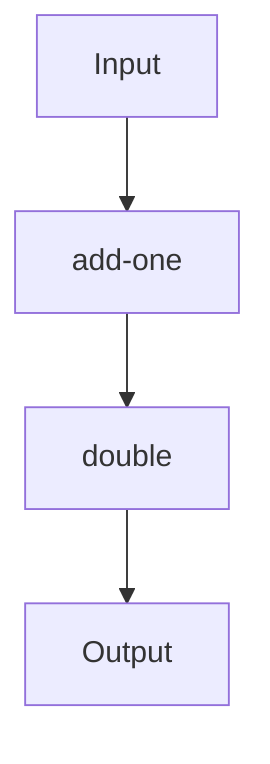

## 5.5. Higher-Order Functions and Function Composition

In the realm of functional programming, higher-order functions and function composition are fundamental concepts that empower developers to write modular, reusable, and expressive code. Clojure, being a functional language, embraces these concepts wholeheartedly. In this section, we will delve into the intricacies of higher-order functions, explore the `comp` function for composing functions, and introduce `partial` and `juxt` functions to further enhance your Clojure programming skills.

### Understanding Higher-Order Functions

Higher-order functions are functions that can take other functions as arguments or return them as results. This capability allows for a high degree of abstraction and code reuse. In Clojure, higher-order functions are prevalent and form the backbone of many idiomatic patterns.

#### Key Characteristics of Higher-Order Functions

- **Function as Argument**: A higher-order function can accept one or more functions as parameters.
- **Function as Return Value**: It can return a function as its result.
- **Abstraction and Reusability**: By abstracting behavior, higher-order functions promote code reuse and modularity.

#### Example: Using `map` as a Higher-Order Function

The `map` function in Clojure is a classic example of a higher-order function. It takes a function and a collection, applying the function to each element of the collection.

```clojure
(defn square [x]
  (* x x))

(def numbers [1 2 3 4 5])

;; Using map to apply the square function to each element in the numbers collection
(def squared-numbers (map square numbers))

(println squared-numbers) ; Output: (1 4 9 16 25)
```

In this example, `map` takes the `square` function and applies it to each element of the `numbers` collection, demonstrating the power of higher-order functions to transform data.

### Function Composition with `comp`

Function composition is the process of combining two or more functions to produce a new function. In Clojure, the `comp` function is used to compose functions. It takes a variable number of functions and returns a new function that is the composition of those functions.

#### Syntax and Usage of `comp`

The `comp` function works by applying the rightmost function first and then applying each subsequent function to the result of the previous one.

```clojure
(defn add-one [x]
  (+ x 1))

(defn double [x]
  (* x 2))

;; Composing add-one and double functions
(def add-one-and-double (comp double add-one))

(println (add-one-and-double 5)) ; Output: 12
```

In this example, `add-one-and-double` is a composed function that first adds one to its input and then doubles the result. The `comp` function allows us to build complex operations from simple, reusable components.

#### Benefits of Function Composition

- **Modularity**: Functions can be developed independently and then composed to form more complex operations.
- **Reusability**: Composed functions can be reused across different parts of an application.
- **Declarative Code**: Function composition leads to more declarative and expressive code, focusing on what needs to be done rather than how.

### Enhancing Composition with `partial` and `juxt`

Clojure provides additional tools like `partial` and `juxt` to further enhance function composition and modularity.

#### `partial` Function

The `partial` function creates a new function by pre-filling some of the arguments of an existing function. This is useful for creating specialized versions of more general functions.

```clojure
(defn multiply [x y]
  (* x y))

;; Creating a new function that multiplies by 10
(def multiply-by-10 (partial multiply 10))

(println (multiply-by-10 5)) ; Output: 50
```

Here, `partial` is used to create `multiply-by-10`, a function that multiplies its input by 10. This demonstrates how `partial` can be used to create more specific functions from general ones.

#### `juxt` Function

The `juxt` function takes a set of functions and returns a new function that applies each of the original functions to its arguments and returns a vector of the results.

```clojure
(defn increment [x]
  (+ x 1))

(defn decrement [x]
  (- x 1))

;; Using juxt to apply both increment and decrement to the same input
(def inc-and-dec (juxt increment decrement))

(println (inc-and-dec 5)) ; Output: [6 4]
```

In this example, `juxt` creates a function `inc-and-dec` that applies both `increment` and `decrement` to its input, returning a vector of results. This is particularly useful for parallel computations where multiple results are needed from the same input.

### Visualizing Function Composition

To better understand function composition, let's visualize the process using a flowchart.



**Caption**: This flowchart represents the composition of the `add-one` and `double` functions. The input is first processed by `add-one`, and the result is then passed to `double`, producing the final output.

### Try It Yourself

Experiment with the provided code examples by modifying the functions involved in the composition. Try creating new composed functions using `comp`, `partial`, and `juxt` to see how they can be combined to achieve different results.

### Knowledge Check

- What is a higher-order function, and how does it differ from a regular function?
- How does the `comp` function work, and what are its benefits?
- How can `partial` and `juxt` enhance function composition in Clojure?

### Key Takeaways

- Higher-order functions allow for abstraction and code reuse by accepting functions as arguments or returning them as results.
- Function composition with `comp` enables the creation of complex operations from simple, reusable components.
- `partial` and `juxt` provide additional flexibility and power in composing functions, leading to more modular and declarative code.

Remember, this is just the beginning. As you progress, you'll build more complex and interactive applications using these powerful patterns. Keep experimenting, stay curious, and enjoy the journey!

## **Ready to Test Your Knowledge?**



### What is a higher-order function?

- [x] A function that takes other functions as arguments or returns them as results.
- [ ] A function that only performs arithmetic operations.
- [ ] A function that cannot be composed with other functions.
- [ ] A function that is always recursive.

> **Explanation:** Higher-order functions are those that can take other functions as arguments or return them as results, allowing for greater abstraction and code reuse.

### How does the `comp` function work in Clojure?

- [x] It composes multiple functions into a single function, applying them from right to left.
- [ ] It applies functions from left to right.
- [ ] It only works with two functions at a time.
- [ ] It is used for creating partial functions.

> **Explanation:** The `comp` function in Clojure composes multiple functions into a single function, applying them from right to left.

### What is the purpose of the `partial` function?

- [x] To create a new function by pre-filling some arguments of an existing function.
- [ ] To compose two functions into one.
- [ ] To apply a function to a collection.
- [ ] To create anonymous functions.

> **Explanation:** The `partial` function creates a new function by pre-filling some of the arguments of an existing function, allowing for more specialized functions.

### What does the `juxt` function do?

- [x] It applies multiple functions to the same arguments and returns a vector of results.
- [ ] It composes functions into a single function.
- [ ] It creates a new function by pre-filling arguments.
- [ ] It is used for error handling.

> **Explanation:** The `juxt` function applies multiple functions to the same arguments and returns a vector of results, useful for parallel computations.

### Which of the following is a benefit of function composition?

- [x] Modularity
- [ ] Increased complexity
- [x] Reusability
- [ ] Reduced readability

> **Explanation:** Function composition promotes modularity and reusability, allowing functions to be developed independently and reused across different parts of an application.

### What is a key characteristic of higher-order functions?

- [x] They can return functions as results.
- [ ] They can only take numbers as arguments.
- [ ] They cannot be used with collections.
- [ ] They are always recursive.

> **Explanation:** A key characteristic of higher-order functions is that they can return functions as results, enabling greater abstraction.

### How does function composition lead to declarative code?

- [x] By focusing on what needs to be done rather than how.
- [ ] By increasing the number of lines of code.
- [ ] By using more loops and conditionals.
- [ ] By making code harder to read.

> **Explanation:** Function composition leads to declarative code by focusing on what needs to be done rather than how, making code more expressive and easier to understand.

### What is the output of the following code: `(comp inc dec)` applied to 5?

- [x] 5
- [ ] 6
- [ ] 4
- [ ] 0

> **Explanation:** The `comp` function composes `inc` and `dec`, which cancel each other out, resulting in the original input value of 5.

### Which function is used to create specialized versions of more general functions?

- [x] `partial`
- [ ] `comp`
- [ ] `juxt`
- [ ] `map`

> **Explanation:** The `partial` function is used to create specialized versions of more general functions by pre-filling some of the arguments.

### True or False: Function composition can only be used with two functions.

- [ ] True
- [x] False

> **Explanation:** False. Function composition can be used with any number of functions, allowing for complex operations to be built from multiple simple functions.


