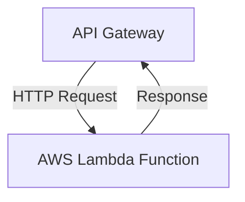

## 5.5 Serverless Patterns with Clojure

In the rapidly evolving landscape of cloud computing, serverless architectures have emerged as a powerful paradigm for building scalable, event-driven applications. Clojure, with its functional programming model and JVM compatibility, is well-suited for serverless environments. This section explores how to adapt Clojure applications to serverless architectures, leveraging cloud services for scalability and efficiency.

### Introduction to Serverless Architectures

Serverless computing allows developers to focus on writing code without worrying about the underlying infrastructure. Functions are deployed as standalone units that are triggered by events, such as HTTP requests, database changes, or scheduled tasks. Common platforms include AWS Lambda, Google Cloud Functions, and Azure Functions.

### Choosing a Serverless Platform

When selecting a serverless platform for Clojure applications, consider the following:

- **AWS Lambda:** Offers robust support for JVM languages, making it a popular choice for Clojure developers.
- **Google Cloud Functions:** Provides a flexible environment for deploying functions with support for various languages.
- **Azure Functions:** Supports JVM languages and integrates well with other Azure services.

### Setting Up the Clojure Project

To begin, set up a Clojure project using tools like Leiningen or deps.edn. These tools help manage dependencies and build configurations.

#### Using Leiningen

Create a new project with Leiningen:

```bash
lein new app my-lambda
```

Add necessary dependencies to the `project.clj` file for the chosen platform's SDK.

#### Using deps.edn

For a deps.edn setup, create a new directory and add a `deps.edn` file with the required dependencies.

```clojure
{:deps {org.clojure/clojure {:mvn/version "1.10.3"}
        com.amazonaws/aws-lambda-java-core {:mvn/version "1.2.1"}}}
```

### Writing Functions Compatible with the Platform

Writing functions for serverless platforms involves implementing specific interfaces or extending classes provided by the platform SDK.

#### Example: AWS Lambda

For AWS Lambda, implement the `RequestStreamHandler` interface:

```clojure
(ns my-lambda.handler
  (:gen-class
   :implements [com.amazonaws.services.lambda.runtime.RequestStreamHandler]))

(defn -handleRequest [this inputStream outputStream context]
  ;; Read input, process, and write output
  (let [input (slurp inputStream)
        output (str "Processed: " input)]
    (.write outputStream (.getBytes output))))
```

### Bundling the Application

Once the function is written, bundle the application using an Uberjar or other packaging tools required by the platform.

#### Creating an Uberjar

With Leiningen, create an Uberjar:

```bash
lein uberjar
```

This command packages the application and its dependencies into a single JAR file.

### Deploying the Function

Deploy the function using platform-specific tools or APIs.

#### Example: AWS Lambda Deployment

Use the AWS CLI or Terraform to deploy the function:

```bash
aws lambda create-function --function-name my-lambda \
  --zip-file fileb://target/my-lambda-standalone.jar \
  --handler my-lambda.handler::handleRequest \
  --runtime java11 \
  --role arn:aws:iam::123456789012:role/execution_role
```

### Handling Dependencies and Cold Starts

Serverless functions can experience cold starts, where the function takes longer to execute due to initialization time. To mitigate this:

- **Minimize Dependencies:** Keep the function lightweight by reducing unnecessary dependencies.
- **Use GraalVM:** Consider compiling the function to a native image with GraalVM, if supported, to reduce startup time.

### Implementing Event Triggers

Configure event triggers to invoke the function based on specific events.

#### Example: HTTP Trigger

For AWS Lambda, use API Gateway to trigger the function via HTTP requests.



### Advantages and Disadvantages

**Advantages:**

- **Scalability:** Automatically scales with demand.
- **Cost-Effective:** Pay only for the compute time consumed.
- **Focus on Code:** Developers can concentrate on writing code without managing servers.

**Disadvantages:**

- **Cold Starts:** Initial invocation latency can be an issue.
- **Vendor Lock-In:** Tightly coupled with specific cloud providers.
- **Limited Execution Time:** Functions have a maximum execution time limit.

### Best Practices

- **Optimize Cold Starts:** Use techniques like GraalVM native images to reduce startup latency.
- **Monitor and Log:** Implement robust logging and monitoring to track function performance and errors.
- **Security:** Ensure secure handling of data and credentials, especially when integrating with other services.

### Conclusion

Serverless architectures offer a compelling approach to building scalable and efficient applications. By leveraging Clojure's strengths and integrating with cloud services, developers can create powerful serverless solutions. As you explore serverless patterns, consider the trade-offs and best practices to maximize the benefits of this architecture.

## Quiz Time!



### What is a key advantage of serverless architectures?

- [x] Scalability
- [ ] Fixed infrastructure costs
- [ ] Manual server management
- [ ] Unlimited execution time

> **Explanation:** Serverless architectures automatically scale with demand, making them highly scalable.

### Which tool is commonly used to manage Clojure project dependencies?

- [x] Leiningen
- [ ] Maven
- [ ] Gradle
- [ ] Ant

> **Explanation:** Leiningen is a popular tool for managing Clojure project dependencies and build configurations.

### What is a common issue with serverless functions that can affect performance?

- [x] Cold starts
- [ ] High memory usage
- [ ] Lack of scalability
- [ ] Manual scaling

> **Explanation:** Cold starts occur when a serverless function takes longer to execute due to initialization time.

### Which cloud platform is known for robust support for JVM languages, including Clojure?

- [x] AWS Lambda
- [ ] Google Cloud Functions
- [ ] Azure Functions
- [ ] IBM Cloud Functions

> **Explanation:** AWS Lambda offers robust support for JVM languages, making it a popular choice for Clojure developers.

### What is the purpose of using GraalVM in serverless functions?

- [x] To reduce startup time
- [ ] To increase memory usage
- [ ] To enhance security
- [ ] To limit execution time

> **Explanation:** GraalVM can compile functions to native images, reducing startup time and improving performance.

### Which of the following is a disadvantage of serverless architectures?

- [x] Vendor lock-in
- [ ] Manual server management
- [ ] High fixed costs
- [ ] Lack of scalability

> **Explanation:** Serverless architectures can lead to vendor lock-in due to tight coupling with specific cloud providers.

### How can you deploy a Clojure function to AWS Lambda?

- [x] Using AWS CLI
- [ ] Using Docker
- [ ] Using Kubernetes
- [ ] Using Jenkins

> **Explanation:** AWS CLI is a tool that can be used to deploy functions to AWS Lambda.

### What is a common trigger for serverless functions?

- [x] HTTP requests
- [ ] Manual execution
- [ ] Direct database access
- [ ] File system changes

> **Explanation:** HTTP requests are a common trigger for serverless functions, often configured through API Gateway.

### Which of the following is a best practice for serverless functions?

- [x] Minimize dependencies
- [ ] Maximize execution time
- [ ] Use fixed infrastructure
- [ ] Avoid monitoring

> **Explanation:** Minimizing dependencies helps keep serverless functions lightweight and reduces cold start times.

### True or False: Serverless functions have unlimited execution time.

- [ ] True
- [x] False

> **Explanation:** Serverless functions have a maximum execution time limit, which varies by platform.


