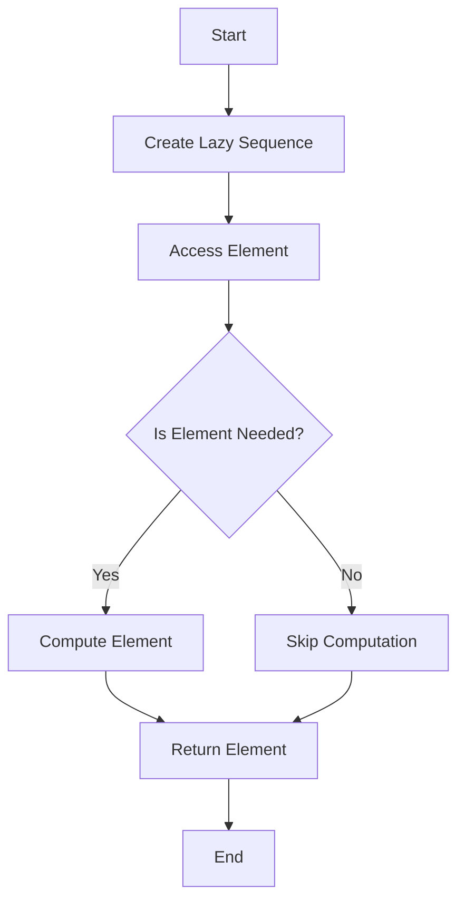

## 5.6. Lazy Evaluation and Infinite Sequences

In the realm of functional programming, lazy evaluation is a powerful concept that allows computations to be deferred until their results are actually needed. Clojure, a modern Lisp dialect on the JVM, leverages lazy evaluation to enable efficient handling of potentially infinite sequences. In this section, we will delve into the intricacies of lazy evaluation in Clojure, explore how it differs from eager evaluation, and demonstrate how to create and manipulate infinite sequences effectively.

### Understanding Lazy Evaluation

Lazy evaluation is a strategy that delays the computation of expressions until their values are required. This contrasts with eager evaluation, where expressions are evaluated as soon as they are bound to a variable. Lazy evaluation can lead to significant performance improvements, especially when dealing with large or infinite data structures, as it avoids unnecessary computations and reduces memory usage.

#### Key Differences Between Lazy and Eager Evaluation

- **Eager Evaluation**: Computes values immediately, which can lead to unnecessary calculations and increased memory usage if the values are not used.
- **Lazy Evaluation**: Defers computation until the value is needed, allowing for more efficient use of resources and the ability to work with infinite data structures.

### Creating Lazy Sequences in Clojure

Clojure provides several functions to create lazy sequences, allowing developers to work with potentially infinite data structures without exhausting system resources. Let's explore some of these functions and how they can be used to create lazy sequences.

#### Using `range` to Create Lazy Sequences

The `range` function in Clojure generates a lazy sequence of numbers. By default, it creates an infinite sequence starting from zero:

```clojure
(def infinite-numbers (range))
```

This sequence will not be realized until we attempt to access its elements. For example, we can take the first ten numbers from this sequence:

```clojure
(take 10 infinite-numbers)
;; => (0 1 2 3 4 5 6 7 8 9)
```

#### Using `iterate` for Custom Lazy Sequences

The `iterate` function generates an infinite lazy sequence by repeatedly applying a function to a value. This is useful for creating sequences with custom logic:

```clojure
(def powers-of-two (iterate #(* 2 %) 1))

(take 5 powers-of-two)
;; => (1 2 4 8 16)
```

Here, `iterate` starts with the value `1` and repeatedly applies the function `#(* 2 %)`, doubling the value at each step.

### Benefits of Lazy Evaluation

Lazy evaluation offers several advantages, particularly in terms of performance and memory efficiency:

- **Reduced Memory Usage**: Since values are computed only when needed, lazy evaluation can significantly reduce memory consumption.
- **Improved Performance**: By avoiding unnecessary computations, lazy evaluation can enhance the performance of applications, especially those dealing with large data sets.
- **Ability to Handle Infinite Data Structures**: Lazy evaluation enables the creation and manipulation of infinite sequences, which would be impossible with eager evaluation.

### Working with Infinite Sequences Safely

While lazy evaluation allows for the creation of infinite sequences, it's crucial to handle them carefully to avoid potential pitfalls, such as inadvertently realizing the entire sequence.

#### Avoiding Full Realization

One common mistake is to accidentally realize an entire infinite sequence, which can lead to performance issues or even application crashes. To prevent this, always use functions like `take`, `drop`, or `filter` to work with finite portions of the sequence:

```clojure
(def infinite-evens (filter even? (range)))

(take 10 infinite-evens)
;; => (0 2 4 6 8 10 12 14 16 18)
```

#### Using `lazy-seq` for Custom Lazy Sequences

The `lazy-seq` macro allows you to define custom lazy sequences. It defers the computation of the sequence until its elements are accessed:

```clojure
(defn lazy-fib
  ([] (lazy-fib 0 1))
  ([a b] (cons a (lazy-seq (lazy-fib b (+ a b))))))

(take 10 (lazy-fib))
;; => (0 1 1 2 3 5 8 13 21 34)
```

In this example, `lazy-fib` generates an infinite sequence of Fibonacci numbers using `lazy-seq`.

### Potential Pitfalls of Lazy Evaluation

While lazy evaluation offers numerous benefits, it also comes with potential pitfalls that developers should be aware of:

- **Unintentional Realization**: As mentioned earlier, realizing an entire infinite sequence can lead to performance issues. Always ensure that operations on lazy sequences are bounded.
- **Debugging Challenges**: Lazy evaluation can make debugging more challenging, as the computation is deferred. Use tools like `clojure.repl` to inspect lazy sequences during development.
- **Resource Management**: Be mindful of resource management when working with lazy sequences, especially in concurrent environments.

### Visualizing Lazy Evaluation and Infinite Sequences

To better understand how lazy evaluation works, let's visualize the process of creating and accessing elements in a lazy sequence:



This diagram illustrates the flow of lazy evaluation, where elements are only computed when needed.

### Try It Yourself

Experiment with the following code snippets to deepen your understanding of lazy evaluation and infinite sequences in Clojure:

1. Modify the `iterate` example to generate a sequence of powers of three.
2. Create a lazy sequence of prime numbers using `filter` and `range`.
3. Implement a custom lazy sequence using `lazy-seq` that generates the sequence of triangular numbers.

### References and Further Reading

- [Clojure Documentation on Lazy Sequences](https://clojure.org/reference/sequences)
- [Functional Programming in Clojure](https://www.braveclojure.com/functional-programming/)
- [Understanding Lazy Evaluation](https://en.wikipedia.org/wiki/Lazy_evaluation)

### Knowledge Check

To reinforce your understanding of lazy evaluation and infinite sequences, try answering the following questions:

## **Ready to Test Your Knowledge?**



### What is lazy evaluation?

- [x] A strategy that delays computation until the value is needed
- [ ] A strategy that computes values immediately
- [ ] A method for optimizing memory usage
- [ ] A technique for parallel processing

> **Explanation:** Lazy evaluation defers computation until the value is actually required, which can improve performance and reduce memory usage.

### Which function generates an infinite sequence of numbers in Clojure?

- [x] `range`
- [ ] `map`
- [ ] `filter`
- [ ] `reduce`

> **Explanation:** The `range` function can generate an infinite sequence of numbers when called without arguments.

### How can you safely work with infinite sequences?

- [x] Use functions like `take` to limit the number of elements processed
- [ ] Always realize the entire sequence
- [ ] Avoid using lazy sequences
- [ ] Use eager evaluation

> **Explanation:** Using functions like `take` allows you to work with a finite portion of an infinite sequence, preventing performance issues.

### What is a potential pitfall of lazy evaluation?

- [x] Unintentional realization of the entire sequence
- [ ] Increased memory usage
- [ ] Slower performance
- [ ] Lack of flexibility

> **Explanation:** Unintentionally realizing an entire infinite sequence can lead to performance issues or application crashes.

### Which macro is used to create custom lazy sequences in Clojure?

- [x] `lazy-seq`
- [ ] `defmacro`
- [ ] `let`
- [ ] `fn`

> **Explanation:** The `lazy-seq` macro is used to define custom lazy sequences in Clojure.

### What is the benefit of lazy evaluation?

- [x] Reduced memory usage
- [ ] Increased memory usage
- [ ] Immediate computation of values
- [ ] Simplified debugging

> **Explanation:** Lazy evaluation reduces memory usage by deferring computation until the value is needed.

### How does `iterate` function work in Clojure?

- [x] It generates an infinite sequence by repeatedly applying a function to a value
- [ ] It generates a finite sequence of numbers
- [ ] It filters elements from a sequence
- [ ] It reduces a sequence to a single value

> **Explanation:** The `iterate` function generates an infinite sequence by applying a function to a value repeatedly.

### What should you avoid when working with lazy sequences?

- [x] Realizing the entire sequence unintentionally
- [ ] Using `take` to limit elements
- [ ] Creating infinite sequences
- [ ] Using `lazy-seq`

> **Explanation:** Realizing the entire sequence unintentionally can lead to performance issues.

### Which of the following is a lazy sequence in Clojure?

- [x] `(range)`
- [ ] `(list 1 2 3)`
- [ ] `(vector 1 2 3)`
- [ ] `(hash-map :a 1 :b 2)`

> **Explanation:** `(range)` generates a lazy sequence of numbers.

### True or False: Lazy evaluation can improve performance by avoiding unnecessary computations.

- [x] True
- [ ] False

> **Explanation:** Lazy evaluation improves performance by deferring computation until the value is needed, avoiding unnecessary calculations.



Remember, mastering lazy evaluation and infinite sequences in Clojure is a journey. As you continue to explore these concepts, you'll unlock new levels of performance and efficiency in your applications. Keep experimenting, stay curious, and enjoy the journey!
