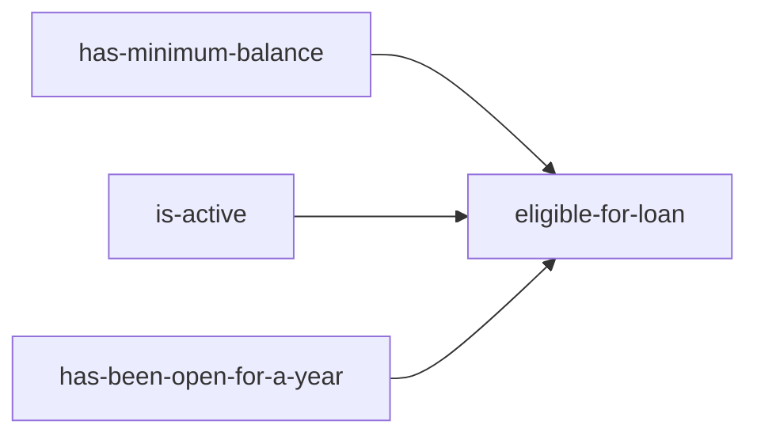

## 5.6 Specification Pattern in Clojure

In the realm of software design, the Specification Pattern stands out as a powerful tool for defining and combining business rules. This pattern allows developers to create flexible and reusable rule definitions that can be easily extended and configured. In Clojure, the Specification Pattern can be elegantly implemented using predicates and combinators, leveraging the language's functional programming strengths.

### Introduction

The Specification Pattern is a design pattern that enables the definition of business rules as specifications. These specifications can be combined using logical operations such as AND, OR, and NOT, allowing for complex rule compositions. This pattern is particularly useful in scenarios where business rules need to be flexible, reusable, and easily configurable.

### Detailed Explanation

#### Defining Specifications as Predicates

In Clojure, specifications can be represented as predicates—functions that return a boolean value. Each predicate encapsulates a specific business rule. For example, consider the following predicates that define rules for a bank account:

```clojure
(defn has-minimum-balance [account]
  (>= (:balance account) 1000))

(defn is-active [account]
  (:active account))
```

Here, `has-minimum-balance` checks if an account has a balance of at least 1000, and `is-active` verifies if the account is active.

#### Creating Specification Combinators

To combine these specifications, we can define combinators that apply logical operations to predicates. The following combinators allow us to create complex specifications by combining simpler ones:

```clojure
(defn and-spec [& specs]
  (fn [item]
    (every? #(apply % [item]) specs)))

(defn or-spec [& specs]
  (fn [item]
    (some #(apply % [item]) specs)))

(defn not-spec [spec]
  (fn [item]
    (not (spec item))))
```

- **`and-spec`**: Combines multiple specifications using logical AND.
- **`or-spec`**: Combines multiple specifications using logical OR.
- **`not-spec`**: Negates a specification.

#### Combining Specifications

Using these combinators, we can define complex specifications. For instance, to determine if an account is eligible for a loan, we can combine the `has-minimum-balance` and `is-active` specifications:

```clojure
(def eligible-for-loan
  (and-spec has-minimum-balance is-active))
```

#### Using Specifications for Filtering or Validation

Once specifications are defined, they can be used to filter collections or validate data. For example, to filter a list of accounts to find those eligible for a loan:

```clojure
(filter eligible-for-loan accounts)
```

This expression returns a sequence of accounts that satisfy the `eligible-for-loan` specification.

#### Extending Specifications Easily

One of the key advantages of the Specification Pattern is its extensibility. New specifications can be added without modifying existing ones. For example, if we want to add a rule that an account must have been opened for at least a year to be eligible for a loan, we can define a new predicate:

```clojure
(defn has-been-open-for-a-year [account]
  (>= (calculate-account-age (:opened-date account)) 1))
```

And update the `eligible-for-loan` specification:

```clojure
(def eligible-for-loan
  (and-spec has-minimum-balance is-active has-been-open-for-a-year))
```

#### Externalizing Specifications for Configurability

Specifications can also be externalized, allowing them to be defined in configuration files and interpreted at runtime. This approach enhances configurability and adaptability to changing business requirements.

### Visual Aids

To better understand the Specification Pattern, consider the following conceptual diagram illustrating the combination of specifications:



This diagram shows how individual specifications are combined to form a complex rule.

### Advantages and Disadvantages

#### Advantages

- **Flexibility**: Specifications can be easily combined and extended.
- **Reusability**: Specifications can be reused across different parts of the application.
- **Configurability**: Externalizing specifications allows for dynamic rule changes.

#### Disadvantages

- **Complexity**: Overuse of combinators can lead to complex and hard-to-read code.
- **Performance**: Combining many specifications may impact performance if not managed carefully.

### Best Practices

- **Keep Specifications Simple**: Define simple, focused predicates that encapsulate a single rule.
- **Use Combinators Judiciously**: Avoid overly complex combinations that reduce code readability.
- **Externalize When Necessary**: Consider externalizing specifications for applications with frequently changing rules.

### Comparisons

The Specification Pattern is often compared to other rule-based patterns like the Strategy Pattern. While both allow for dynamic behavior changes, the Specification Pattern is more suited for scenarios involving complex rule combinations.

### Conclusion

The Specification Pattern in Clojure provides a powerful mechanism for defining and combining business rules. By leveraging predicates and combinators, developers can create flexible, reusable, and easily configurable specifications. This pattern is particularly valuable in domains where business rules are complex and subject to frequent changes.

## Quiz Time!



### What is the primary purpose of the Specification Pattern?

- [x] To define and combine business rules using logical operations.
- [ ] To encapsulate object creation logic.
- [ ] To manage object lifecycles and dependencies.
- [ ] To separate data access logic from business logic.

> **Explanation:** The Specification Pattern is used to define business rules that can be combined using logical operations.

### How are specifications represented in Clojure?

- [x] As predicates (functions returning boolean values).
- [ ] As classes with methods.
- [ ] As XML configuration files.
- [ ] As JSON objects.

> **Explanation:** In Clojure, specifications are represented as predicates, which are functions that return boolean values.

### Which combinator is used to combine specifications with logical AND?

- [x] `and-spec`
- [ ] `or-spec`
- [ ] `not-spec`
- [ ] `xor-spec`

> **Explanation:** The `and-spec` combinator is used to combine multiple specifications using logical AND.

### What is a key advantage of the Specification Pattern?

- [x] Flexibility and reusability of business rules.
- [ ] Simplifies object creation.
- [ ] Enhances database access efficiency.
- [ ] Reduces the need for testing.

> **Explanation:** The Specification Pattern allows for flexible and reusable business rule definitions.

### How can specifications be externalized for configurability?

- [x] By defining rules in configuration files and interpreting them at runtime.
- [ ] By hardcoding rules in the application.
- [ ] By using environment variables.
- [ ] By storing rules in a database.

> **Explanation:** Specifications can be externalized by defining them in configuration files, allowing for dynamic rule changes.

### What is a potential disadvantage of the Specification Pattern?

- [x] Complexity in combining many specifications.
- [ ] Difficulty in creating objects.
- [ ] Inability to handle large datasets.
- [ ] Lack of support for concurrency.

> **Explanation:** Combining many specifications can lead to complex and hard-to-read code.

### Which of the following is NOT a combinator used in the Specification Pattern?

- [ ] `and-spec`
- [ ] `or-spec`
- [ ] `not-spec`
- [x] `xor-spec`

> **Explanation:** `xor-spec` is not a standard combinator used in the Specification Pattern.

### What is the role of the `not-spec` combinator?

- [x] To negate a specification.
- [ ] To combine specifications with logical AND.
- [ ] To combine specifications with logical OR.
- [ ] To create a new specification from scratch.

> **Explanation:** The `not-spec` combinator negates a specification.

### Can the Specification Pattern be used for validation?

- [x] Yes
- [ ] No

> **Explanation:** The Specification Pattern can be used for filtering or validating data against defined rules.

### True or False: The Specification Pattern is only applicable in object-oriented programming.

- [ ] True
- [x] False

> **Explanation:** The Specification Pattern is applicable in both object-oriented and functional programming paradigms, including Clojure.


