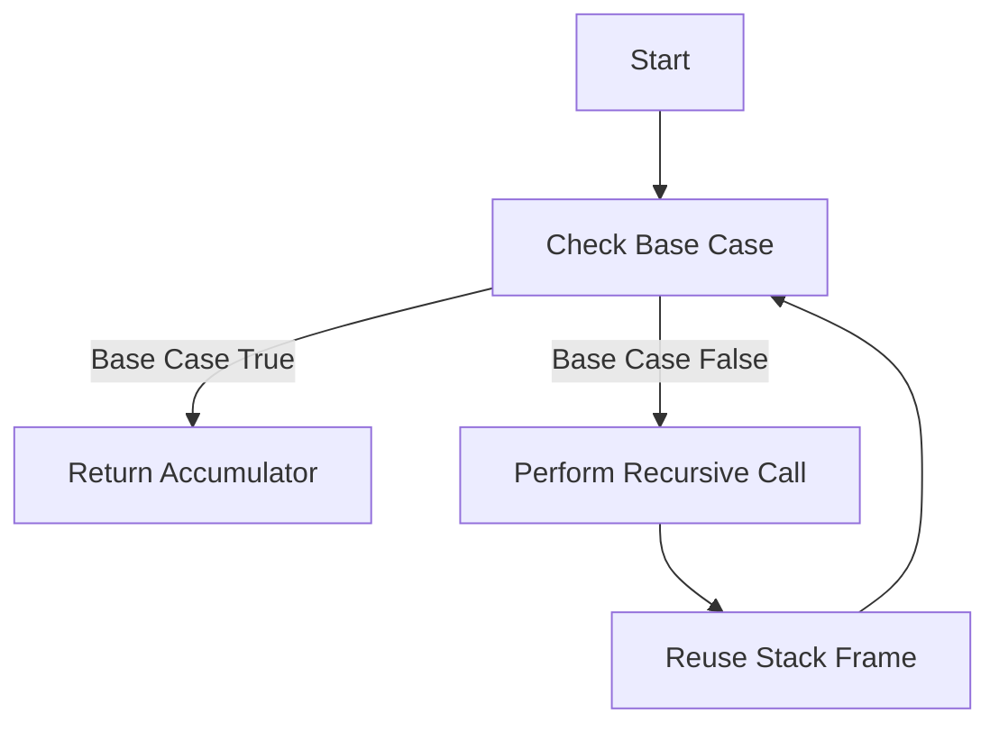

## 5.7. Recursion with `recur` and Tail Call Optimization

Recursion is a fundamental concept in functional programming, allowing functions to call themselves to solve problems. In Clojure, recursion is made efficient and stack-safe through the use of `recur`, which enables tail call optimization. This section delves into the intricacies of recursion in Clojure, highlighting the importance of tail recursion, the role of `recur`, and how it compares to traditional iterative constructs.

### Understanding Tail Recursion

Tail recursion is a special form of recursion where the recursive call is the last operation in the function. This allows the language runtime to optimize the call, reusing the current function's stack frame for the next call, thus preventing stack overflow errors. This optimization is crucial for functional languages, where recursion is often preferred over iterative loops.

#### Importance of Tail Recursion

- **Stack Safety**: Tail recursion ensures that recursive functions do not consume additional stack space with each call, making them safe for deep recursion.
- **Performance**: By reusing stack frames, tail-recursive functions can perform as efficiently as their iterative counterparts.
- **Elegance**: Tail recursion allows for elegant solutions to problems that naturally fit a recursive approach, such as traversing data structures or performing repeated calculations.

### The Role of `recur` in Clojure

Clojure provides the `recur` keyword to facilitate tail call optimization. When a function or loop uses `recur`, it signals to the Clojure compiler that the recursive call is in the tail position, allowing the stack frame to be reused.

#### How `recur` Works

- **Tail Position**: `recur` can only be used in the tail position of a function or loop. This means it must be the last operation performed before the function returns.
- **Local Recursion**: `recur` is limited to the current function or loop. It cannot be used for mutual recursion between different functions.
- **Performance**: By using `recur`, Clojure can optimize recursive calls to be as efficient as loops, avoiding stack overflow.

### Implementing Recursive Processes with `recur`

Let's explore how `recur` can be used to implement iterative processes in a recursive manner.

#### Example: Calculating Factorials

A classic example of recursion is calculating the factorial of a number. Here's how you can implement it using `recur`:

```clojure
(defn factorial [n]
  (let [fact (fn [n acc]
               (if (zero? n)
                 acc
                 (recur (dec n) (* acc n))))]
    (fact n 1)))

;; Usage
(factorial 5) ; => 120
```

**Explanation**:
- We define an inner function `fact` that takes two parameters: `n` (the number) and `acc` (the accumulator).
- The base case checks if `n` is zero, returning the accumulator.
- The recursive case uses `recur` to call `fact` with `n` decremented and `acc` multiplied by `n`.

#### Example: Fibonacci Sequence

Calculating Fibonacci numbers is another common recursive problem. Here's how you can implement it using `recur`:

```clojure
(defn fibonacci [n]
  (let [fib (fn [a b count]
              (if (zero? count)
                a
                (recur b (+ a b) (dec count))))]
    (fib 0 1 n)))

;; Usage
(fibonacci 10) ; => 55
```

**Explanation**:
- We define an inner function `fib` with three parameters: `a` (current Fibonacci number), `b` (next Fibonacci number), and `count` (remaining steps).
- The base case returns `a` when `count` is zero.
- The recursive case uses `recur` to update `a`, `b`, and `count`.

### Limitations of `recur`

While `recur` is powerful, it has limitations:

- **Tail Position Only**: `recur` must be in the tail position. It cannot be used if there are operations after the recursive call.
- **Single Function Scope**: `recur` is limited to the current function or loop. It cannot be used for mutual recursion between different functions.

### Comparing Recursive Solutions with Iterative Constructs

In many programming languages, iterative constructs like loops are used to perform repetitive tasks. In Clojure, recursion with `recur` can achieve the same results, often with more elegance and clarity.

#### Iterative vs. Recursive Factorial

**Iterative Approach**:

```clojure
(defn factorial-iter [n]
  (loop [i n acc 1]
    (if (zero? i)
      acc
      (recur (dec i) (* acc i)))))

;; Usage
(factorial-iter 5) ; => 120
```

**Recursive Approach with `recur`**:

```clojure
(defn factorial-recur [n]
  (let [fact (fn [n acc]
               (if (zero? n)
                 acc
                 (recur (dec n) (* acc n))))]
    (fact n 1)))

;; Usage
(factorial-recur 5) ; => 120
```

**Comparison**:
- Both approaches achieve the same result, but the recursive approach with `recur` can be more intuitive for problems that naturally fit a recursive pattern.
- The iterative approach uses a `loop` construct, while the recursive approach uses a helper function with `recur`.

### Visualizing Tail Call Optimization

To better understand how tail call optimization works, let's visualize the process using a flowchart.



**Description**: This flowchart illustrates the process of tail call optimization. When the base case is false, a recursive call is made, and the stack frame is reused, looping back to the base case check.

### Try It Yourself

Experiment with the provided examples by modifying them:

- Change the base case or recursive logic to see how it affects the result.
- Implement a new recursive function using `recur`, such as calculating the sum of a list or finding the greatest common divisor (GCD).

### Key Takeaways

- **Tail Recursion**: A form of recursion where the recursive call is the last operation, allowing for stack frame reuse.
- **`recur` in Clojure**: Enables tail call optimization, making recursion stack-safe and efficient.
- **Limitations**: `recur` must be in the tail position and is limited to the current function or loop.
- **Comparison**: Recursive solutions with `recur` can be more elegant and intuitive than iterative constructs for certain problems.

### References and Further Reading

- [Clojure Documentation on recur](https://clojure.org/reference/special_forms#recur)
- [Functional Programming Concepts](https://en.wikipedia.org/wiki/Functional_programming)
- [Tail Call Optimization](https://en.wikipedia.org/wiki/Tail_call)

## **Ready to Test Your Knowledge?**



### What is tail recursion?

- [x] A form of recursion where the recursive call is the last operation in the function.
- [ ] A recursion that uses multiple stack frames.
- [ ] A recursion that cannot be optimized.
- [ ] A recursion that uses `loop`.

> **Explanation:** Tail recursion allows the language runtime to optimize the call by reusing the current function's stack frame for the next call.

### How does `recur` enable tail call optimization in Clojure?

- [x] By allowing the stack frame to be reused for the next call.
- [ ] By creating a new stack frame for each call.
- [ ] By using mutual recursion between functions.
- [ ] By eliminating the need for a base case.

> **Explanation:** `recur` signals to the Clojure compiler that the recursive call is in the tail position, allowing the stack frame to be reused.

### What is a limitation of using `recur`?

- [x] It can only be used in the tail position.
- [ ] It can be used for mutual recursion.
- [ ] It can be used in any position within a function.
- [ ] It eliminates the need for a base case.

> **Explanation:** `recur` must be in the tail position, meaning it must be the last operation performed before the function returns.

### Which of the following is a benefit of tail recursion?

- [x] Stack safety and performance.
- [ ] Increased memory usage.
- [ ] Slower execution times.
- [ ] More complex code.

> **Explanation:** Tail recursion ensures that recursive functions do not consume additional stack space with each call, making them safe for deep recursion and improving performance.

### What is the purpose of the `recur` keyword in Clojure?

- [x] To enable tail call optimization.
- [ ] To create new stack frames.
- [ ] To eliminate the need for recursion.
- [ ] To perform mutual recursion.

> **Explanation:** `recur` enables tail call optimization by allowing the stack frame to be reused for the next call.

### In the factorial example, what does the `acc` parameter represent?

- [x] The accumulator for the factorial result.
- [ ] The current number being processed.
- [ ] The base case condition.
- [ ] The recursive call count.

> **Explanation:** The `acc` parameter is used to accumulate the result of the factorial calculation.

### How does the iterative approach to calculating factorial differ from the recursive approach with `recur`?

- [x] The iterative approach uses a `loop` construct.
- [ ] The iterative approach uses `recur`.
- [ ] The iterative approach is more intuitive for recursive problems.
- [ ] The iterative approach eliminates the need for a base case.

> **Explanation:** The iterative approach uses a `loop` construct, while the recursive approach uses a helper function with `recur`.

### What is a key advantage of using recursion with `recur` over traditional loops?

- [x] Elegance and clarity for problems that naturally fit a recursive pattern.
- [ ] Increased complexity and verbosity.
- [ ] Slower execution times.
- [ ] More memory usage.

> **Explanation:** Recursive solutions with `recur` can be more elegant and intuitive for problems that naturally fit a recursive pattern.

### True or False: `recur` can be used for mutual recursion between different functions.

- [ ] True
- [x] False

> **Explanation:** `recur` is limited to the current function or loop and cannot be used for mutual recursion between different functions.

### True or False: Tail call optimization allows recursive functions to perform as efficiently as iterative loops.

- [x] True
- [ ] False

> **Explanation:** Tail call optimization allows the stack frame to be reused, making recursive functions perform as efficiently as iterative loops.


