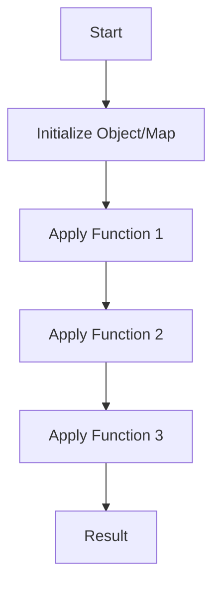

## 5.7 Fluent Interface Pattern in Clojure

### Introduction

The Fluent Interface Pattern is a design pattern that aims to provide an intuitive and readable way to construct complex objects or perform operations by chaining method calls. This pattern is particularly useful in creating Domain-Specific Languages (DSLs) and builder patterns, where readability and expressiveness are paramount. While Clojure, being a functional language, does not inherently support method chaining as seen in object-oriented languages, it offers powerful alternatives through threading macros and macros for achieving similar fluency.

### Detailed Explanation

#### Fluent Interfaces in Clojure

In traditional object-oriented programming, fluent interfaces are achieved by returning the object itself from each method, allowing for method chaining. In Clojure, the functional paradigm encourages immutability and function composition, which can be leveraged to create fluent interfaces using threading macros and macros.

**Threading Macros for Fluent Style**

Clojure's threading macros, `->` and `->>`, provide a way to chain function calls in a readable manner. These macros pass the result of each expression as the first argument to the next function, creating a pipeline of transformations.

```clojure
(-> {}
    (assoc :name "Alice")
    (assoc :age 30)
    (update :age inc))
```

In this example, we start with an empty map and successively add and update keys using `assoc` and `update`, respectively. The threading macro `->` makes the code more readable by eliminating nested function calls.

**Creating Domain-Specific Languages (DSLs)**

DSLs are specialized mini-languages tailored to a specific problem domain. In Clojure, macros can be used to create DSLs that offer a natural syntax for domain-specific operations.

```clojure
(defmacro with-connection [conn & body]
  `(let [~'conn (connect ~conn)]
     ~@body))

(with-connection db-spec
  (-> conn
      (query "SELECT * FROM users")
      (insert {:name "Bob"})))
```

Here, the `with-connection` macro abstracts the connection setup, allowing the user to focus on the operations within the connection context. The threading macro `->` is used to chain database operations, enhancing readability.

**Implementing Builder Patterns**

Builder patterns are used to construct complex objects step-by-step. In Clojure, this can be achieved by defining functions that return modified versions of a configuration map.

```clojure
(defn set-host [config host]
  (assoc config :host host))

(defn set-port [config port]
  (assoc config :port port))

(defn build []
  {})

(def config
  (-> (build)
      (set-host "localhost")
      (set-port 8080)))
```

This example demonstrates a simple builder pattern where a configuration map is incrementally built using a series of functions. The `->` macro facilitates the fluent style.

**Using Records with Method-Like Functions**

Clojure's records can be used to define structured data types with method-like functions for a fluent interface.

```clojure
(defrecord Query [select from where]
  Object
  (toString [this]
    (str "SELECT " (or select "*")
         " FROM " from
         (when where (str " WHERE " where)))))

(defn select [query fields]
  (assoc query :select fields))

(defn from [query table]
  (assoc query :from table))

(defn where [query condition]
  (assoc query :where condition))

(-> (->Query nil nil nil)
    (select "name, age")
    (from "users")
    (where "age > 30")
    (str))
; => "SELECT name, age FROM users WHERE age > 30"
```

In this example, a `Query` record is defined with fields for SQL query components. Functions like `select`, `from`, and `where` modify the query, and the `->` macro chains these modifications, resulting in a fluent interface for building SQL queries.

### Visual Aids

#### Conceptual Diagram



This diagram illustrates the flow of data through a series of transformations using the threading macro, resulting in a final output.

### Use Cases

- **Configuration Builders:** Fluent interfaces are ideal for building configuration objects where multiple parameters need to be set in a clear and concise manner.
- **DSLs for Domain Logic:** Creating DSLs for specific domains can greatly enhance the expressiveness and readability of code, making it easier to understand and maintain.
- **Query Builders:** Fluent interfaces can simplify the construction of complex queries, such as SQL or API requests, by chaining method-like functions.

### Advantages and Disadvantages

**Advantages:**

- **Readability:** Fluent interfaces enhance code readability by providing a clear and concise way to express operations.
- **Expressiveness:** They allow for the creation of expressive DSLs that closely resemble natural language.
- **Modularity:** Functions can be composed and reused, promoting modularity and separation of concerns.

**Disadvantages:**

- **Complexity:** Implementing fluent interfaces using macros can introduce complexity and make debugging more challenging.
- **Performance:** Excessive use of macros or threading can impact performance if not used judiciously.

### Best Practices

- **Use Threading Macros Wisely:** Leverage threading macros for readability, but avoid overuse that can lead to convoluted code.
- **Keep DSLs Simple:** When creating DSLs, aim for simplicity and clarity to ensure they remain maintainable.
- **Document Macros Thoroughly:** Provide clear documentation for macros to aid understanding and usage by other developers.

### Comparisons

- **Fluent Interface vs. Builder Pattern:** While both aim to simplify object construction, fluent interfaces focus on chaining method calls, whereas builder patterns emphasize step-by-step construction.
- **Fluent Interface vs. DSL:** Fluent interfaces can be used to implement DSLs, but DSLs may offer more domain-specific syntax and capabilities.

### Conclusion

The Fluent Interface Pattern in Clojure provides a powerful way to enhance code readability and expressiveness, particularly in the context of DSLs and builder patterns. By leveraging threading macros and macros, developers can create intuitive and maintainable interfaces that align with Clojure's functional paradigm. As with any design pattern, it's important to balance expressiveness with simplicity to ensure code remains clear and efficient.

## Quiz Time!



### What is the primary purpose of the Fluent Interface Pattern?

- [x] To provide an intuitive and readable way to construct complex objects or perform operations by chaining method calls.
- [ ] To enforce strict type checking in functional programming.
- [ ] To optimize performance by reducing function calls.
- [ ] To ensure immutability in data structures.

> **Explanation:** The Fluent Interface Pattern aims to enhance readability and expressiveness by allowing method chaining, making code more intuitive.

### How does Clojure achieve a fluent interface style?

- [x] By using threading macros like `->` and `->>`.
- [ ] By using inheritance and polymorphism.
- [ ] By enforcing strict typing.
- [ ] By using global variables.

> **Explanation:** Clojure uses threading macros to chain function calls, creating a fluent interface style without traditional method chaining.

### Which Clojure feature is commonly used to create Domain-Specific Languages (DSLs)?

- [x] Macros
- [ ] Atoms
- [ ] Refs
- [ ] Agents

> **Explanation:** Macros in Clojure allow for the creation of DSLs by enabling custom syntax and transformations.

### What is a potential disadvantage of using macros for fluent interfaces?

- [x] They can introduce complexity and make debugging more challenging.
- [ ] They enforce strict typing.
- [ ] They reduce code readability.
- [ ] They increase runtime performance.

> **Explanation:** Macros can add complexity to the code, making it harder to debug and understand.

### Which of the following is a use case for fluent interfaces in Clojure?

- [x] Configuration Builders
- [ ] Type Checking
- [ ] Memory Management
- [ ] Thread Synchronization

> **Explanation:** Fluent interfaces are ideal for building configuration objects where multiple parameters need to be set clearly and concisely.

### What is the role of the `->` macro in Clojure?

- [x] It threads an expression through a series of functions, enhancing readability.
- [ ] It enforces immutability in data structures.
- [ ] It manages concurrency in multi-threaded applications.
- [ ] It optimizes memory usage.

> **Explanation:** The `->` macro threads an expression through functions, making the code more readable by reducing nesting.

### How can records be used in Clojure to create a fluent interface?

- [x] By defining method-like functions that operate on records.
- [ ] By using records to enforce strict typing.
- [ ] By using records to manage global state.
- [ ] By using records to optimize memory allocation.

> **Explanation:** Records can be used with method-like functions to create a fluent interface for structured data types.

### What is a key benefit of using fluent interfaces?

- [x] Enhanced code readability and expressiveness.
- [ ] Improved memory management.
- [ ] Enforced type safety.
- [ ] Reduced code execution time.

> **Explanation:** Fluent interfaces improve code readability and expressiveness by allowing intuitive method chaining.

### Which pattern is closely related to fluent interfaces?

- [x] Builder Pattern
- [ ] Singleton Pattern
- [ ] Observer Pattern
- [ ] Factory Pattern

> **Explanation:** The Builder Pattern is closely related as both aim to simplify object construction, though they do so in different ways.

### True or False: Fluent interfaces in Clojure are primarily achieved through inheritance.

- [ ] True
- [x] False

> **Explanation:** Fluent interfaces in Clojure are achieved through threading macros and macros, not inheritance, as Clojure is a functional language.


