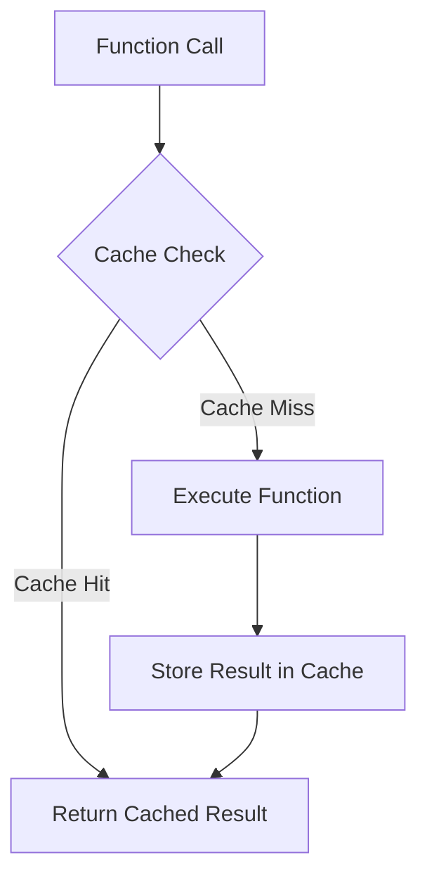

## 5.8. Memoization for Performance

In the realm of functional programming, efficiency and performance are often achieved through clever use of immutable data structures and pure functions. One such technique that stands out for its ability to significantly enhance performance is **memoization**. This section will delve into what memoization is, how it works, and how you can leverage it in Clojure to optimize your applications.

### What is Memoization?

Memoization is a technique used to cache the results of expensive function calls and reuse the cached result when the same inputs occur again. This can drastically reduce the time complexity of algorithms, especially those involving recursive computations or repeated function calls with the same parameters.

#### How Memoization Works

At its core, memoization involves storing the results of function calls in a cache. When a function is called, the memoization process checks if the result for the given input is already in the cache:
- If it is, the cached result is returned immediately.
- If not, the function is executed, and the result is stored in the cache for future use.

This approach is particularly beneficial for functions with a high computational cost or those that are called frequently with the same arguments.

### Memoization in Clojure

Clojure provides a built-in `memoize` function that can be used to easily apply memoization to any function. Let's explore how to use this function effectively.

#### Using the `memoize` Function

The `memoize` function in Clojure wraps a given function with a caching mechanism. Here's a simple example to illustrate its usage:

```clojure
(defn slow-fib [n]
  (if (<= n 1)
    n
    (+ (slow-fib (- n 1)) (slow-fib (- n 2)))))

(def memoized-fib (memoize slow-fib))

;; Using the memoized version
(memoized-fib 40) ;; This will be much faster on subsequent calls
```

In this example, `slow-fib` is a naive implementation of the Fibonacci sequence, which is notoriously inefficient due to its exponential time complexity. By wrapping it with `memoize`, we create `memoized-fib`, which caches results and significantly improves performance.

#### Key Points to Consider

- **Cache Size**: The cache used by `memoize` is unbounded, which means it can grow indefinitely. This can lead to increased memory usage if not managed properly.
- **Cache Invalidation**: There is no built-in mechanism for cache invalidation in Clojure's `memoize`. If the function's logic changes or if you need to clear the cache, you'll have to implement this manually.
- **Thread Safety**: The `memoize` function is thread-safe, making it suitable for concurrent applications.

### Use Cases for Memoization

Memoization is particularly useful in scenarios where:

- **Expensive Computations**: Functions that involve heavy computations or complex algorithms can benefit from memoization by avoiding redundant calculations.
- **Recursive Functions**: Recursive algorithms, such as those used in dynamic programming, can see significant performance improvements.
- **Repeated Calls**: Functions that are called multiple times with the same arguments can leverage memoization to reduce execution time.

### Best Practices for Implementing Memoization

To effectively implement memoization in your Clojure applications, consider the following best practices:

1. **Identify Suitable Functions**: Not all functions benefit from memoization. Focus on those with high computational costs or frequent repeated calls.
2. **Monitor Memory Usage**: Keep an eye on memory consumption, especially for functions with a large number of unique inputs.
3. **Custom Cache Management**: For more control over caching, consider implementing a custom memoization mechanism with cache eviction policies.
4. **Test Thoroughly**: Ensure that memoized functions behave as expected, especially in concurrent environments.

### Visualizing Memoization

To better understand how memoization works, let's visualize the process using a flowchart:



**Figure 1**: Memoization Flowchart - This diagram illustrates the decision-making process in memoization, where a function call either retrieves a cached result or computes and stores a new result.

### Try It Yourself

To get hands-on experience with memoization, try modifying the `memoized-fib` function:

- **Experiment with Different Functions**: Apply `memoize` to other recursive functions, such as factorial or combinatorial calculations.
- **Implement Custom Caching**: Create a custom memoization function that includes cache eviction based on size or time.

### Knowledge Check

Before we wrap up, let's reinforce what we've learned with some questions and exercises:

- **Question**: What are the potential downsides of using memoization?
- **Exercise**: Implement a memoized version of a function that calculates the nth number in the Fibonacci sequence using dynamic programming.

### Summary

Memoization is a powerful technique that can greatly enhance the performance of your Clojure applications by caching the results of expensive function calls. By understanding when and how to use memoization, you can optimize your code for efficiency and speed.

Remember, this is just the beginning. As you progress, you'll discover more advanced techniques and patterns that will further enhance your Clojure programming skills. Keep experimenting, stay curious, and enjoy the journey!

## **Ready to Test Your Knowledge?**



### What is memoization?

- [x] A technique to cache function results for performance improvement.
- [ ] A method to optimize memory usage.
- [ ] A way to parallelize function execution.
- [ ] A technique to handle errors in functions.

> **Explanation:** Memoization is a technique used to cache the results of function calls to improve performance by avoiding redundant calculations.

### Which Clojure function is used for memoization?

- [x] `memoize`
- [ ] `cache`
- [ ] `store`
- [ ] `remember`

> **Explanation:** The `memoize` function in Clojure is used to wrap a function with a caching mechanism for memoization.

### What is a potential downside of memoization?

- [x] Increased memory usage due to unbounded cache.
- [ ] Slower function execution.
- [ ] Increased CPU usage.
- [ ] Reduced code readability.

> **Explanation:** Memoization can lead to increased memory usage because the cache is unbounded and can grow indefinitely.

### Is Clojure's `memoize` function thread-safe?

- [x] Yes
- [ ] No

> **Explanation:** Clojure's `memoize` function is thread-safe, making it suitable for concurrent applications.

### When is memoization most beneficial?

- [x] For functions with high computational costs.
- [x] For functions with repeated calls.
- [ ] For functions with low computational costs.
- [ ] For functions with unique inputs every time.

> **Explanation:** Memoization is most beneficial for functions with high computational costs and repeated calls, as it avoids redundant calculations.

### What should you monitor when using memoization?

- [x] Memory usage
- [ ] CPU usage
- [ ] Disk space
- [ ] Network bandwidth

> **Explanation:** It's important to monitor memory usage when using memoization, as the cache can grow indefinitely.

### How can you manage cache size in memoization?

- [x] Implement custom cache eviction policies.
- [ ] Use a smaller data type.
- [ ] Increase CPU resources.
- [ ] Use a faster disk.

> **Explanation:** Implementing custom cache eviction policies can help manage cache size and prevent excessive memory usage.

### What is a common use case for memoization?

- [x] Recursive functions
- [ ] File I/O operations
- [ ] Network requests
- [ ] Logging

> **Explanation:** Memoization is commonly used for recursive functions to avoid redundant calculations and improve performance.

### Can memoization be used for all functions?

- [ ] Yes
- [x] No

> **Explanation:** Not all functions benefit from memoization. It is most effective for functions with high computational costs or frequent repeated calls.

### Memoization helps in reducing the time complexity of algorithms.

- [x] True
- [ ] False

> **Explanation:** Memoization helps reduce the time complexity of algorithms by caching results and avoiding redundant calculations.


