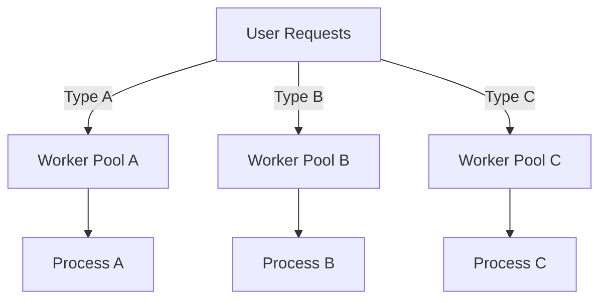

---

linkTitle: "5.8 Bulkhead Pattern"
title: "Bulkhead Pattern in Go: Enhancing Resilience and Isolation in Concurrency"
description: "Explore the Bulkhead Pattern in Go to improve application resilience by isolating critical components, managing resources, and containing failures."
categories:
- Concurrency
- Design Patterns
- Go Programming
tags:
- Bulkhead Pattern
- Concurrency
- Go
- Resilience
- Isolation
date: 2024-10-25
type: docs
nav_weight: 580000
canonical: "https://softwarepatternslexicon.com/patterns-clojure/5/8"
license: "© 2024 Tokenizer Inc. CC BY-NC-SA 4.0"
---

## 5.8 Bulkhead Pattern

In the world of software design, ensuring that an application remains resilient and responsive under varying loads and potential failures is crucial. The Bulkhead Pattern, inspired by the compartmentalization technique used in shipbuilding, is a concurrency design pattern that helps achieve this by isolating different parts of a system to prevent failures from cascading. In this article, we'll explore how the Bulkhead Pattern can be effectively implemented in Go to enhance application resilience and reliability.

### Introduction to the Bulkhead Pattern

The Bulkhead Pattern is a design strategy that involves isolating different components or services within an application to prevent a failure in one part from affecting the entire system. This is akin to the bulkheads in a ship, which are watertight compartments that prevent water from flooding the entire vessel if one section is breached.

In Go, the Bulkhead Pattern can be implemented using goroutines and channels to manage concurrency and resource allocation effectively. By isolating critical components into separate goroutines or worker pools, we can ensure that failures are contained and do not impact the overall system performance.

### Detailed Explanation

#### Isolation Techniques

1. **Separate Critical Components:**
   - Critical components of an application can be isolated into their own goroutines or worker pools. This ensures that if one component fails or becomes overloaded, it does not affect the others.
   - For example, in a web server handling multiple types of requests, each request type can be processed by a dedicated worker pool.

2. **Limit Resource Consumption:**
   - Limit the number of resources (such as goroutines or memory) that each component can consume. This prevents any single component from monopolizing system resources and affecting others.

```go
package main

import (
    "fmt"
    "sync"
    "time"
)

type WorkerPool struct {
    maxWorkers int
    jobs       chan func()
}

func NewWorkerPool(maxWorkers int) *WorkerPool {
    return &WorkerPool{
        maxWorkers: maxWorkers,
        jobs:       make(chan func(), maxWorkers),
    }
}

func (wp *WorkerPool) Start() {
    var wg sync.WaitGroup
    for i := 0; i < wp.maxWorkers; i++ {
        wg.Add(1)
        go func() {
            defer wg.Done()
            for job := range wp.jobs {
                job()
            }
        }()
    }
    wg.Wait()
}

func (wp *WorkerPool) Submit(job func()) {
    wp.jobs <- job
}

func (wp *WorkerPool) Stop() {
    close(wp.jobs)
}

func main() {
    pool := NewWorkerPool(5)
    go pool.Start()

    for i := 0; i < 10; i++ {
        jobID := i
        pool.Submit(func() {
            fmt.Printf("Processing job %d\n", jobID)
            time.Sleep(1 * time.Second)
        })
    }

    pool.Stop()
}
```

#### Resource Allocation

1. **Proportional Allocation:**
   - Allocate resources proportionally based on the priority or criticality of the components. Critical components should receive more resources to ensure they remain operational under load.

2. **Dynamic Adjustment:**
   - Monitor resource usage and adjust allocations as necessary. This can be achieved by implementing monitoring tools that track the performance and resource consumption of each component.

#### Failure Containment

1. **Prevent Cascading Failures:**
   - Ensure that failures in one bulkhead do not cascade to others. This can be achieved by isolating components and using fallback mechanisms.

2. **Graceful Degradation:**
   - Provide fallback mechanisms or degrade gracefully under load. For instance, if a service becomes unavailable, the system can switch to a secondary service or provide a reduced functionality.

### Visual Aids

#### Conceptual Diagram



This diagram illustrates how user requests are distributed to different worker pools, each handling a specific type of request. This isolation ensures that a failure in one pool does not affect the others.

### Use Cases

- **Web Servers:** Isolating different types of requests (e.g., API calls, static content) into separate worker pools to ensure that a spike in one type does not affect others.
- **Microservices:** Each microservice can be isolated to prevent failures in one service from affecting the entire application.
- **Database Operations:** Separate read and write operations into different bulkheads to ensure that heavy write loads do not impact read performance.

### Advantages and Disadvantages

#### Advantages

- **Resilience:** Increases the resilience of the application by preventing cascading failures.
- **Resource Management:** Efficiently manages resources by isolating components and limiting resource consumption.
- **Scalability:** Enhances scalability by allowing components to be scaled independently.

#### Disadvantages

- **Complexity:** Increases the complexity of the system due to the need for managing multiple worker pools and monitoring resource usage.
- **Overhead:** May introduce overhead due to the additional management of resources and isolation mechanisms.

### Best Practices

- **Monitor Resource Usage:** Continuously monitor the resource usage of each bulkhead to ensure optimal performance.
- **Implement Fallbacks:** Provide fallback mechanisms to handle failures gracefully.
- **Test Under Load:** Regularly test the system under load to identify potential bottlenecks and adjust resource allocations accordingly.

### Comparisons

The Bulkhead Pattern is often compared with the Circuit Breaker Pattern. While both aim to enhance system resilience, the Bulkhead Pattern focuses on isolation and resource management, whereas the Circuit Breaker Pattern is more about preventing repeated failures by stopping requests to a failing service.

### Conclusion

The Bulkhead Pattern is a powerful tool in the arsenal of concurrency design patterns in Go. By isolating components, managing resources, and containing failures, it enhances the resilience and reliability of applications. Implementing this pattern requires careful planning and monitoring but can significantly improve the overall performance and stability of a system.

## Quiz Time!



### What is the primary purpose of the Bulkhead Pattern?

- [x] To isolate components to prevent cascading failures
- [ ] To optimize database queries
- [ ] To enhance user interface design
- [ ] To improve code readability

> **Explanation:** The Bulkhead Pattern is designed to isolate components to prevent failures in one part of the system from affecting others.

### How does the Bulkhead Pattern enhance application resilience?

- [x] By isolating components into separate goroutines or worker pools
- [ ] By increasing the number of database connections
- [ ] By reducing the number of user requests
- [ ] By simplifying the codebase

> **Explanation:** The Bulkhead Pattern enhances resilience by isolating components, ensuring that failures in one part do not affect others.

### What is a key advantage of using the Bulkhead Pattern?

- [x] It prevents cascading failures
- [ ] It simplifies code maintenance
- [ ] It reduces memory usage
- [ ] It increases code readability

> **Explanation:** A key advantage of the Bulkhead Pattern is its ability to prevent cascading failures by isolating components.

### Which of the following is a disadvantage of the Bulkhead Pattern?

- [x] Increased complexity
- [ ] Reduced scalability
- [ ] Decreased performance
- [ ] Limited resource allocation

> **Explanation:** The Bulkhead Pattern can increase system complexity due to the need for managing multiple worker pools and monitoring resources.

### What is a common use case for the Bulkhead Pattern?

- [x] Isolating different types of web server requests
- [ ] Optimizing SQL queries
- [ ] Designing user interfaces
- [ ] Enhancing code readability

> **Explanation:** A common use case for the Bulkhead Pattern is isolating different types of web server requests to prevent one type from affecting others.

### How can resource allocation be managed in the Bulkhead Pattern?

- [x] By allocating resources proportionally based on priority
- [ ] By reducing the number of goroutines
- [ ] By increasing memory usage
- [ ] By simplifying code logic

> **Explanation:** Resource allocation can be managed by allocating resources proportionally based on the priority or criticality of components.

### What is an example of a fallback mechanism in the Bulkhead Pattern?

- [x] Switching to a secondary service if the primary fails
- [ ] Increasing the number of database connections
- [ ] Reducing user request rates
- [ ] Simplifying the codebase

> **Explanation:** A fallback mechanism can involve switching to a secondary service if the primary service fails.

### How does the Bulkhead Pattern relate to the Circuit Breaker Pattern?

- [x] Both enhance system resilience but focus on different aspects
- [ ] Both simplify code maintenance
- [ ] Both reduce memory usage
- [ ] Both increase code readability

> **Explanation:** Both patterns enhance system resilience, but the Bulkhead Pattern focuses on isolation, while the Circuit Breaker Pattern prevents repeated failures.

### What is a potential overhead introduced by the Bulkhead Pattern?

- [x] Additional management of resources and isolation mechanisms
- [ ] Increased database query times
- [ ] Reduced user request rates
- [ ] Simplified code logic

> **Explanation:** The Bulkhead Pattern may introduce overhead due to the additional management of resources and isolation mechanisms.

### True or False: The Bulkhead Pattern is only applicable to web servers.

- [ ] True
- [x] False

> **Explanation:** False. The Bulkhead Pattern can be applied to various systems, not just web servers, to enhance resilience and isolation.




