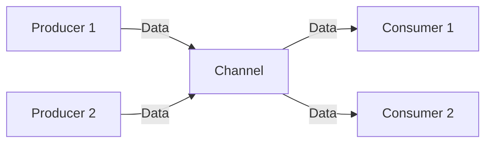

## 5.9 Producer-Consumer Pattern

The Producer-Consumer pattern is a classic concurrency design pattern that is widely used to manage the flow of data between producers, which generate data or tasks, and consumers, which process them. In Go, this pattern is elegantly implemented using channels, which provide a safe and efficient way to communicate between goroutines. This article explores the Producer-Consumer pattern in Go, detailing the implementation of producers and consumers, the use of channel buffering, and techniques for graceful termination.

### Introduction

The Producer-Consumer pattern is essential in scenarios where multiple producers generate data that needs to be processed by multiple consumers. This pattern helps in decoupling the production of data from its consumption, allowing both processes to operate independently and concurrently. In Go, channels serve as the conduit for data transfer between producers and consumers, ensuring thread-safe communication.

### Detailed Explanation

#### Producer Implementation

Producers are responsible for generating data or tasks and sending them to a shared channel. In Go, a producer can be implemented as a goroutine that continuously produces data and sends it to a channel. Here's a simple example:

```go
package main

import (
    "fmt"
    "time"
)

func producer(ch chan<- int, id int) {
    for i := 0; i < 10; i++ {
        fmt.Printf("Producer %d: producing %d\n", id, i)
        ch <- i
        time.Sleep(time.Millisecond * 100) // Simulate work
    }
    close(ch)
}

func main() {
    ch := make(chan int)
    go producer(ch, 1)

    for item := range ch {
        fmt.Printf("Main: received %d\n", item)
    }
}
```

**Handling Backpressure:** If consumers are slower than producers, backpressure can occur. This can be managed by using buffered channels or implementing rate limiting on the producer side.

#### Consumer Implementation

Consumers read from the shared channel and process the data. In Go, consumers can be implemented as goroutines that continuously read from a channel until it is closed. Here's an example:

```go
package main

import (
    "fmt"
)

func consumer(ch <-chan int, id int) {
    for item := range ch {
        fmt.Printf("Consumer %d: consumed %d\n", id, item)
    }
}

func main() {
    ch := make(chan int)
    go producer(ch, 1)
    go consumer(ch, 1)

    time.Sleep(time.Second * 2) // Wait for goroutines to finish
}
```

**Parallel Processing:** Multiple consumers can be spawned to process data in parallel, improving throughput and efficiency.

#### Channel Buffering

Buffered channels can accommodate bursts from producers and help balance the load between producers and consumers. The buffer size should be chosen carefully to minimize memory usage while preventing excessive blocking.

```go
package main

import (
    "fmt"
    "time"
)

func producer(ch chan<- int, id int) {
    for i := 0; i < 10; i++ {
        fmt.Printf("Producer %d: producing %d\n", id, i)
        ch <- i
        time.Sleep(time.Millisecond * 100) // Simulate work
    }
    close(ch)
}

func consumer(ch <-chan int, id int) {
    for item := range ch {
        fmt.Printf("Consumer %d: consumed %d\n", id, item)
    }
}

func main() {
    ch := make(chan int, 5) // Buffered channel
    go producer(ch, 1)
    go consumer(ch, 1)

    time.Sleep(time.Second * 2) // Wait for goroutines to finish
}
```

#### Graceful Termination

To gracefully terminate the producer-consumer system, producers should close the channel once they are done producing. Consumers should handle channel closures without panicking, typically by using a `for range` loop to read from the channel.

```go
package main

import (
    "fmt"
    "time"
)

func producer(ch chan<- int, id int) {
    for i := 0; i < 10; i++ {
        fmt.Printf("Producer %d: producing %d\n", id, i)
        ch <- i
        time.Sleep(time.Millisecond * 100) // Simulate work
    }
    close(ch)
}

func consumer(ch <-chan int, id int) {
    for item := range ch {
        fmt.Printf("Consumer %d: consumed %d\n", id, item)
    }
}

func main() {
    ch := make(chan int)
    go producer(ch, 1)
    go consumer(ch, 1)

    time.Sleep(time.Second * 2) // Wait for goroutines to finish
}
```

### Visual Aids

#### Conceptual Diagram



**Explanation:** This diagram illustrates the flow of data from multiple producers to multiple consumers through a shared channel.

### Use Cases

The Producer-Consumer pattern is applicable in various scenarios, such as:

- **Data Processing Pipelines:** Where data is generated by sensors and processed by different stages.
- **Task Queues:** Where tasks are produced by one part of a system and consumed by workers.
- **Logging Systems:** Where log messages are produced by applications and consumed by a logging service.

### Advantages and Disadvantages

**Advantages:**

- **Decoupling:** Producers and consumers operate independently, improving modularity.
- **Scalability:** Easy to scale by adding more producers or consumers.
- **Concurrency:** Efficient use of resources through concurrent processing.

**Disadvantages:**

- **Complexity:** Managing concurrency and synchronization can be complex.
- **Resource Management:** Requires careful management of channel buffers and goroutines.

### Best Practices

- **Use Buffered Channels:** To handle bursts and reduce blocking.
- **Close Channels Gracefully:** Ensure channels are closed properly to signal completion.
- **Monitor Performance:** Use profiling tools to monitor and optimize performance.

### Comparisons

The Producer-Consumer pattern can be compared to other concurrency patterns like the Pipeline pattern, which also uses channels but focuses on processing data through a series of stages.

### Conclusion

The Producer-Consumer pattern is a powerful concurrency pattern in Go, leveraging channels to efficiently manage data flow between producers and consumers. By understanding and implementing this pattern, developers can build scalable and efficient concurrent applications.

## Quiz Time!



### What is the primary purpose of the Producer-Consumer pattern?

- [x] To manage the flow of data between producers and consumers
- [ ] To increase the speed of data processing
- [ ] To reduce memory usage
- [ ] To simplify code structure

> **Explanation:** The primary purpose of the Producer-Consumer pattern is to manage the flow of data between producers and consumers, allowing them to operate independently and concurrently.

### How can backpressure be handled in a Producer-Consumer system?

- [x] By using buffered channels
- [ ] By increasing the number of producers
- [ ] By decreasing the number of consumers
- [ ] By using unbuffered channels

> **Explanation:** Backpressure can be handled by using buffered channels, which can accommodate bursts from producers and help balance the load.

### What is the role of a consumer in the Producer-Consumer pattern?

- [ ] To generate data or tasks
- [x] To read from the shared channel and process data
- [ ] To manage channel buffering
- [ ] To close the channel

> **Explanation:** The role of a consumer is to read from the shared channel and process the data.

### What should producers do to signal consumers to stop?

- [ ] Send a special message
- [ ] Increase the buffer size
- [x] Close the channel
- [ ] Decrease the number of consumers

> **Explanation:** Producers should close the channel to signal consumers that no more data will be sent, allowing consumers to stop gracefully.

### What is a potential disadvantage of the Producer-Consumer pattern?

- [x] Complexity in managing concurrency
- [ ] Lack of scalability
- [ ] Inefficient use of resources
- [ ] Tight coupling between producers and consumers

> **Explanation:** A potential disadvantage is the complexity in managing concurrency and synchronization.

### How can multiple consumers improve the system?

- [x] By processing data in parallel
- [ ] By reducing the number of producers
- [ ] By increasing memory usage
- [ ] By simplifying the code

> **Explanation:** Multiple consumers can process data in parallel, improving throughput and efficiency.

### What is the benefit of using buffered channels?

- [x] To handle bursts and reduce blocking
- [ ] To simplify code structure
- [ ] To increase the number of producers
- [ ] To decrease the number of consumers

> **Explanation:** Buffered channels can handle bursts from producers and reduce blocking, improving system efficiency.

### What is a common use case for the Producer-Consumer pattern?

- [x] Data processing pipelines
- [ ] Single-threaded applications
- [ ] Static websites
- [ ] Simple scripts

> **Explanation:** A common use case is data processing pipelines, where data is generated and processed in stages.

### What is the recommended way to handle channel closures in consumers?

- [x] Use a `for range` loop
- [ ] Use a `select` statement
- [ ] Use a `defer` statement
- [ ] Use a `panic` statement

> **Explanation:** Using a `for range` loop is recommended to handle channel closures gracefully.

### True or False: The Producer-Consumer pattern is only applicable in Go.

- [ ] True
- [x] False

> **Explanation:** False. The Producer-Consumer pattern is a general concurrency pattern applicable in many programming languages, not just Go.


