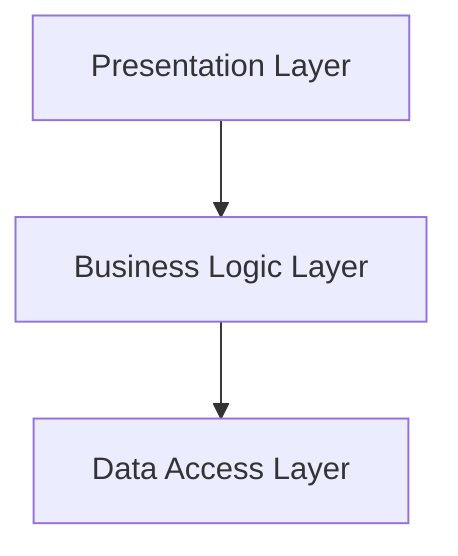
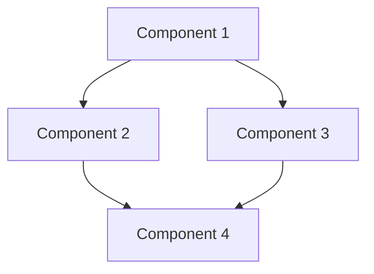
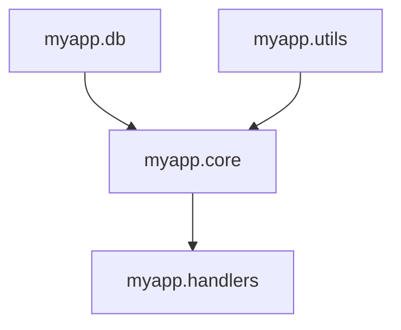

## 5.9. Namespaces and Modular Design

In the world of software development, creating modular and maintainable code is paramount. Clojure, with its emphasis on simplicity and functional programming, provides powerful tools to achieve this through the use of namespaces. In this section, we will delve into the importance of namespaces, explore principles of modular design, and provide practical examples of organizing code across multiple namespaces. We will also discuss how to manage dependencies using `require`, `use`, and aliasing, and highlight patterns for structuring larger projects.

### The Importance of Namespaces

Namespaces in Clojure serve as a mechanism to organize code and manage symbols. They allow developers to group related functions, macros, and data structures, making the codebase more understandable and maintainable. By using namespaces, we can avoid naming conflicts and create a clear separation of concerns, which is a fundamental principle of modular design.

#### Key Benefits of Using Namespaces

1. **Avoiding Naming Conflicts**: Namespaces help prevent clashes between symbols with the same name by providing a context in which they are defined.
2. **Improved Code Organization**: By grouping related code, namespaces make it easier to navigate and understand the codebase.
3. **Enhanced Reusability**: Code organized into namespaces can be reused across different projects or modules.
4. **Facilitating Collaboration**: Namespaces provide a clear structure that helps teams work together more effectively.

### Principles of Modular Design

Modular design is a software design technique that emphasizes separating functionality into independent, interchangeable modules. Each module should encapsulate a specific aspect of the application's functionality, promoting separation of concerns and making the system easier to understand, develop, and maintain.

#### Core Principles

- **Separation of Concerns**: Each module should focus on a single aspect of the application, minimizing dependencies between modules.
- **Encapsulation**: Modules should hide their internal implementation details, exposing only what is necessary for other modules to interact with them.
- **Reusability**: Modules should be designed to be reusable in different contexts or applications.
- **Composability**: Modules should be easy to combine and integrate into larger systems.

### Organizing Code Across Multiple Namespaces

To effectively use namespaces in Clojure, it's important to understand how to organize code across multiple namespaces. This involves creating a logical structure that reflects the application's architecture and facilitates easy navigation and maintenance.

#### Example: Organizing a Simple Web Application

Let's consider a simple web application with the following components:

- **Database Access**: Functions for interacting with the database.
- **Business Logic**: Core application logic.
- **Web Handlers**: Functions for handling HTTP requests.
- **Utilities**: Helper functions used across the application.

We can organize these components into separate namespaces as follows:

```clojure
;; src/myapp/db.clj
(ns myapp.db)

(defn connect []
  ;; Code to connect to the database
  )

(defn query [sql]
  ;; Code to execute a SQL query
  )

;; src/myapp/core.clj
(ns myapp.core
  (:require [myapp.db :as db]))

(defn process-data [data]
  ;; Business logic for processing data
  (db/query "SELECT * FROM table"))

;; src/myapp/handlers.clj
(ns myapp.handlers
  (:require [myapp.core :as core]))

(defn handle-request [request]
  ;; Handle an HTTP request
  (core/process-data (:body request)))

;; src/myapp/utils.clj
(ns myapp.utils)

(defn format-date [date]
  ;; Utility function to format a date
  )
```

### Managing Dependencies with `require`, `use`, and Aliasing

In Clojure, managing dependencies between namespaces is crucial for maintaining a clean and modular codebase. The `require`, `use`, and aliasing mechanisms provide powerful tools for this purpose.

#### Using `require`

The `require` function is used to load and reference other namespaces. It allows us to specify which namespaces are needed and optionally alias them for convenience.

```clojure
(ns myapp.core
  (:require [myapp.db :as db]
            [myapp.utils :refer [format-date]]))
```

In this example, we require the `myapp.db` namespace and alias it as `db`. We also require the `myapp.utils` namespace and refer to the `format-date` function directly.

#### Using `use`

The `use` function is similar to `require`, but it automatically refers all public symbols from the specified namespace. While convenient, it can lead to naming conflicts and is generally discouraged in favor of `require`.

```clojure
(ns myapp.core
  (:use [myapp.utils]))
```

#### Aliasing

Aliasing is a technique used to create a shorthand for a namespace, making it easier to reference its symbols.

```clojure
(ns myapp.core
  (:require [myapp.db :as db]))

(db/connect)
```

In this example, we alias the `myapp.db` namespace as `db`, allowing us to use `db/connect` instead of `myapp.db/connect`.

### Patterns for Structuring Larger Projects

As projects grow in size and complexity, it's important to adopt patterns that facilitate modular design and maintainability. Here are some common patterns for structuring larger Clojure projects:

#### Layered Architecture

A layered architecture divides the application into layers, each responsible for a specific aspect of the functionality. Common layers include:

- **Presentation Layer**: Handles user interaction and presentation logic.
- **Business Logic Layer**: Contains the core application logic.
- **Data Access Layer**: Manages data storage and retrieval.



#### Component-Based Architecture

In a component-based architecture, the application is divided into independent components, each responsible for a specific piece of functionality. This approach promotes reusability and composability.



#### Domain-Driven Design (DDD)

Domain-Driven Design is an approach to software development that emphasizes collaboration between technical and domain experts. It involves organizing code around the domain model, which represents the core business concepts and logic.

### Try It Yourself

To deepen your understanding of namespaces and modular design in Clojure, try the following exercises:

1. **Refactor a Monolithic Namespace**: Take a large, monolithic namespace and refactor it into multiple namespaces based on functionality.
2. **Create a New Project**: Start a new Clojure project and organize it using the layered architecture pattern.
3. **Experiment with Aliasing**: Use aliasing to simplify references to commonly used namespaces in your project.

### Visualizing Namespace Dependencies

To better understand how namespaces interact in a project, it's helpful to visualize their dependencies. Here's a simple diagram illustrating the dependencies in our example web application:



### References and Links

- [Clojure Documentation: Namespaces](https://clojure.org/reference/namespaces)
- [Clojure Style Guide](https://github.com/bbatsov/clojure-style-guide)
- [Functional Programming Principles in Clojure](https://www.coursera.org/learn/functional-programming-clojure)

### Knowledge Check

To reinforce your understanding of namespaces and modular design in Clojure, try answering the following questions:

## **Ready to Test Your Knowledge?**



### What is the primary purpose of namespaces in Clojure?

- [x] To organize code and manage symbols
- [ ] To execute code in parallel
- [ ] To handle errors and exceptions
- [ ] To optimize performance

> **Explanation:** Namespaces in Clojure are used to organize code and manage symbols, preventing naming conflicts and improving code organization.

### Which function is generally preferred over `use` for managing dependencies?

- [x] `require`
- [ ] `import`
- [ ] `include`
- [ ] `load`

> **Explanation:** `require` is preferred over `use` because it allows for more explicit control over which symbols are brought into the current namespace.

### What is a key benefit of modular design?

- [x] Separation of concerns
- [ ] Increased code duplication
- [ ] Reduced code readability
- [ ] Slower development process

> **Explanation:** Modular design promotes separation of concerns, making the codebase easier to understand, develop, and maintain.

### How can you create a shorthand for a namespace in Clojure?

- [x] By aliasing it with `:as`
- [ ] By using `:refer`
- [ ] By using `:use`
- [ ] By using `:import`

> **Explanation:** Aliasing a namespace with `:as` creates a shorthand for referencing its symbols.

### Which architecture pattern divides an application into layers?

- [x] Layered Architecture
- [ ] Component-Based Architecture
- [ ] Domain-Driven Design
- [ ] Microservices Architecture

> **Explanation:** Layered Architecture divides an application into layers, each responsible for a specific aspect of functionality.

### What does the `:refer` keyword do in a `require` statement?

- [x] It brings specific symbols into the current namespace
- [ ] It aliases a namespace
- [ ] It imports Java classes
- [ ] It loads a file

> **Explanation:** The `:refer` keyword in a `require` statement brings specific symbols from another namespace into the current namespace.

### What is a common pitfall of using `use` in Clojure?

- [x] It can lead to naming conflicts
- [ ] It improves code readability
- [ ] It enhances performance
- [ ] It simplifies dependency management

> **Explanation:** Using `use` can lead to naming conflicts because it automatically refers all public symbols from a namespace.

### Which principle of modular design focuses on hiding internal implementation details?

- [x] Encapsulation
- [ ] Reusability
- [ ] Composability
- [ ] Separation of Concerns

> **Explanation:** Encapsulation focuses on hiding internal implementation details, exposing only what is necessary for interaction.

### True or False: Aliasing a namespace is mandatory in Clojure.

- [ ] True
- [x] False

> **Explanation:** Aliasing a namespace is not mandatory, but it is a useful technique for simplifying references to commonly used namespaces.

### What is the role of the presentation layer in a layered architecture?

- [x] It handles user interaction and presentation logic
- [ ] It manages data storage and retrieval
- [ ] It contains the core application logic
- [ ] It coordinates communication between services

> **Explanation:** The presentation layer in a layered architecture handles user interaction and presentation logic.



Remember, mastering namespaces and modular design is a journey. As you continue to explore Clojure, you'll discover new ways to organize and structure your code for maximum efficiency and maintainability. Keep experimenting, stay curious, and enjoy the process!
