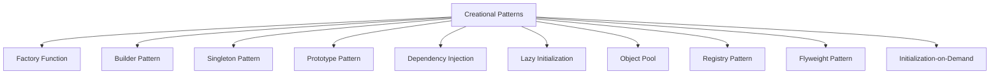

## 6.1. Overview of Creational Patterns in Clojure

### Introduction to Creational Design Patterns

Creational design patterns are a fundamental concept in software engineering, focusing on the process of object creation. These patterns abstract the instantiation process, making a system independent of how its objects are created, composed, and represented. The primary goal is to increase flexibility and reuse of code by decoupling the client code from the specific classes it needs to instantiate.

In traditional object-oriented programming (OOP), creational patterns such as Factory, Singleton, and Builder are used to manage object creation, ensuring that the system remains flexible and scalable. However, in a functional programming language like Clojure, the approach to these patterns is quite different due to the language's emphasis on immutability and first-class functions.

### Relevance of Creational Patterns in Clojure

Clojure, being a functional language, does not rely on classes and objects in the same way as OOP languages. Instead, it uses functions and immutable data structures. This paradigm shift affects how we think about object creation and the application of creational patterns. In Clojure, the focus is on creating and managing data structures and functions rather than objects.

Despite these differences, creational patterns remain relevant in Clojure. They provide a structured approach to creating complex data structures and managing dependencies in a way that promotes code reuse and flexibility. By understanding and adapting these patterns to Clojure's functional style, developers can write more robust and maintainable code.

### Functional Programming and Object Creation

In functional programming, the concept of object creation is replaced by the creation of data structures and functions. Clojure's immutable data structures and first-class functions allow for a different approach to creational patterns. Instead of focusing on instantiating objects, we focus on constructing and composing functions and data.

#### Key Differences in Clojure:

- **Immutability**: Clojure's data structures are immutable, meaning once they are created, they cannot be changed. This immutability simplifies concurrency and makes it easier to reason about code.
- **First-Class Functions**: Functions in Clojure are first-class citizens, meaning they can be passed as arguments, returned from other functions, and assigned to variables. This allows for powerful abstractions and compositions.
- **Data-Driven Design**: Clojure emphasizes data-driven design, where data is separated from behavior. This separation allows for more flexible and reusable code.

### Preparing for Specific Patterns

In the following sections, we will explore specific creational patterns adapted to Clojure's functional paradigm. These patterns include:

- **Factory Function Pattern**: A functional approach to creating data structures or functions, often used to encapsulate the creation logic.
- **Builder Pattern Using Functions and Maps**: A pattern that uses functions and maps to construct complex data structures incrementally.
- **Singleton Pattern and Managing Global State**: Techniques for managing global state in a functional language, ensuring that state is shared safely across the application.
- **Prototype Pattern with Cloneable Data**: A pattern that leverages Clojure's immutable data structures to create copies of data with modifications.
- **Dependency Injection via Higher-Order Functions**: Using higher-order functions to manage dependencies and promote code reuse.
- **Lazy Initialization with `delay` and `force`**: Techniques for deferring computation until it is needed, improving performance and resource management.
- **Object Pool Pattern with Agents and Queues**: Managing a pool of reusable resources using Clojure's concurrency primitives.
- **Registry Pattern Using Atoms and Maps**: A pattern for managing a collection of related data or functions, often used for configuration or service lookup.
- **Flyweight Pattern with Shared Data Structures**: A pattern that uses shared data structures to minimize memory usage and improve performance.
- **Initialization-on-Demand Holder Idiom**: A technique for lazy initialization of resources, ensuring they are created only when needed.

### Goals of Code Reuse and Flexibility

The primary goals of applying creational patterns in Clojure are to enhance code reuse and flexibility. By abstracting the creation process, we can create more modular and maintainable code. This abstraction allows us to:

- **Decouple Code**: By separating the creation logic from the rest of the application, we can change the way objects or data structures are created without affecting the rest of the codebase.
- **Promote Reusability**: Creational patterns encourage the reuse of code by providing a standard way to create objects or data structures. This reduces duplication and improves maintainability.
- **Enhance Flexibility**: By using patterns, we can easily adapt to changing requirements or extend the functionality of the application without significant refactoring.

### Conclusion

Creational patterns in Clojure offer a unique perspective on object creation, adapted to the functional programming paradigm. By understanding these patterns and their application in Clojure, developers can write more flexible, reusable, and maintainable code. As we delve into each specific pattern, keep in mind the overarching goals of code reuse and flexibility, and consider how these patterns can be adapted to your own projects.

### Try It Yourself

To get a hands-on understanding of these concepts, try implementing a simple factory function in Clojure. Experiment with creating different data structures and see how you can encapsulate the creation logic within a function. Consider how you might use higher-order functions to manage dependencies or how you can leverage Clojure's concurrency primitives to manage shared state.

```clojure
;; Define a factory function for creating a user map
(defn create-user [name age]
  {:name name
   :age age
   :id (java.util.UUID/randomUUID)})

;; Create a new user
(def user (create-user "Alice" 30))

;; Print the user map
(println user)
```

### Visualizing Creational Patterns in Clojure

To better understand how these patterns fit into the Clojure ecosystem, let's visualize the relationship between different creational patterns and their components using a Mermaid.js diagram.



This diagram illustrates the various creational patterns we'll explore in Clojure, highlighting their interconnectedness and the broader category they belong to.

### References and Links

For further reading on creational design patterns and their application in functional programming, consider the following resources:

- [Design Patterns: Elements of Reusable Object-Oriented Software](https://en.wikipedia.org/wiki/Design_Patterns) - A foundational book on design patterns.
- [Clojure for the Brave and True](https://www.braveclojure.com/) - A comprehensive guide to learning Clojure.
- [Functional Programming in Clojure](https://www.oreilly.com/library/view/functional-programming-in/9781492044971/) - A book that explores functional programming concepts in Clojure.

### Knowledge Check

To reinforce your understanding of creational patterns in Clojure, consider the following questions and challenges:

- How does immutability affect the implementation of creational patterns in Clojure?
- What are the benefits of using higher-order functions for dependency injection?
- How can lazy initialization improve performance in a Clojure application?

## **Ready to Test Your Knowledge?**



### What is the primary goal of creational design patterns?

- [x] To abstract the instantiation process and make a system independent of how its objects are created.
- [ ] To increase the complexity of the codebase.
- [ ] To ensure that all objects are created using a single method.
- [ ] To eliminate the need for object creation entirely.

> **Explanation:** The primary goal of creational design patterns is to abstract the instantiation process, making a system independent of how its objects are created, composed, and represented.

### How does Clojure's immutability affect creational patterns?

- [x] It simplifies concurrency and makes it easier to reason about code.
- [ ] It makes object creation more complex.
- [ ] It requires the use of mutable data structures.
- [ ] It eliminates the need for creational patterns.

> **Explanation:** Clojure's immutability simplifies concurrency and makes it easier to reason about code, which affects how creational patterns are implemented.

### What is a key feature of Clojure that influences creational patterns?

- [x] First-class functions
- [ ] Object-oriented inheritance
- [ ] Mutable state
- [ ] Class-based design

> **Explanation:** First-class functions in Clojure allow for powerful abstractions and compositions, influencing how creational patterns are implemented.

### Which pattern uses functions and maps to construct complex data structures incrementally?

- [x] Builder Pattern
- [ ] Singleton Pattern
- [ ] Factory Pattern
- [ ] Prototype Pattern

> **Explanation:** The Builder Pattern in Clojure uses functions and maps to construct complex data structures incrementally.

### What is the benefit of using higher-order functions for dependency injection in Clojure?

- [x] It promotes code reuse and flexibility.
- [ ] It makes the code harder to understand.
- [ ] It requires more boilerplate code.
- [ ] It eliminates the need for functions.

> **Explanation:** Using higher-order functions for dependency injection promotes code reuse and flexibility in Clojure.

### How does lazy initialization improve performance?

- [x] By deferring computation until it is needed.
- [ ] By executing all computations upfront.
- [ ] By using more memory.
- [ ] By eliminating the need for computation.

> **Explanation:** Lazy initialization improves performance by deferring computation until it is needed, thus saving resources.

### Which pattern manages a pool of reusable resources using Clojure's concurrency primitives?

- [x] Object Pool Pattern
- [ ] Factory Pattern
- [ ] Singleton Pattern
- [ ] Prototype Pattern

> **Explanation:** The Object Pool Pattern manages a pool of reusable resources using Clojure's concurrency primitives.

### What is the purpose of the Registry Pattern in Clojure?

- [x] To manage a collection of related data or functions.
- [ ] To create a single instance of a class.
- [ ] To eliminate the need for global state.
- [ ] To enforce immutability.

> **Explanation:** The Registry Pattern in Clojure is used to manage a collection of related data or functions, often for configuration or service lookup.

### Which pattern uses shared data structures to minimize memory usage?

- [x] Flyweight Pattern
- [ ] Factory Pattern
- [ ] Builder Pattern
- [ ] Singleton Pattern

> **Explanation:** The Flyweight Pattern uses shared data structures to minimize memory usage and improve performance.

### True or False: Creational patterns in Clojure are irrelevant due to its functional nature.

- [ ] True
- [x] False

> **Explanation:** Creational patterns remain relevant in Clojure as they provide a structured approach to creating complex data structures and managing dependencies, even in a functional language.



Remember, this is just the beginning. As you progress, you'll build more complex and interactive applications using Clojure's unique features. Keep experimenting, stay curious, and enjoy the journey!
