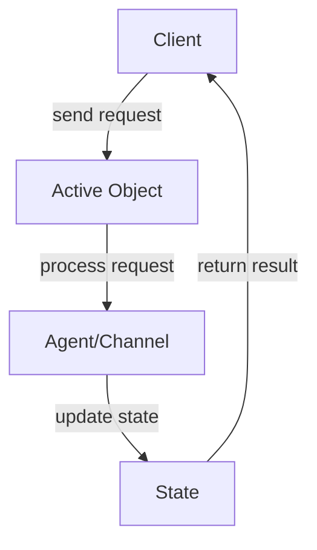

## 6.1 Active Object in Clojure

Concurrency is a critical aspect of modern software development, enabling applications to perform multiple tasks simultaneously and efficiently. The Active Object pattern is a concurrency design pattern that decouples method execution from method invocation, allowing for asynchronous processing and enhancing responsiveness. In this section, we will explore how to implement the Active Object pattern in Clojure using its powerful concurrency primitives, such as agents and core.async channels.

### Introduction to the Active Object Pattern

The Active Object pattern is designed to separate the invocation of a method from its execution. This separation allows methods to be executed asynchronously, enabling the calling thread to continue its execution without waiting for the method to complete. The pattern is particularly useful in scenarios where tasks are time-consuming or when multiple tasks need to be executed concurrently.

#### Key Components of the Active Object Pattern

1. **Active Object:** The entity that encapsulates the state and behavior, processing requests asynchronously.
2. **Method Request:** Represents an invocation of a method on the active object.
3. **Scheduler:** Manages the execution of method requests, typically using a separate thread or event loop.
4. **Result Handling:** Mechanism to handle the results of method executions, often involving callbacks or future objects.

### Implementing Active Object with Clojure Agents

Clojure's agents provide a straightforward way to implement the Active Object pattern. Agents are designed for managing shared, mutable state in a safe and asynchronous manner.

#### Step-by-Step Implementation

1. **Create an Agent to Represent the Active Object:**

   Define an agent that holds the state of the active object.

   ```clojure
   (def active-object (agent {:count 0}))
   ```

2. **Define Functions for Asynchronous Actions:**

   Create functions that define the behavior of the active object. These functions will be applied to the agent's state.

   ```clojure
   (defn increment-count [state increment]
     (update state :count + increment))
   ```

3. **Send Actions to the Agent:**

   Use the `send` function to dispatch actions to the agent asynchronously.

   ```clojure
   (send active-object increment-count 5)
   ```

4. **Handle Agent Errors if Necessary:**

   Set an error handler to manage any exceptions that occur during the agent's operations.

   ```clojure
   (set-error-handler! active-object (fn [agent err] (println "Error:" err)))
   ```

### Implementing Active Object with core.async Channels

Clojure's core.async library provides channels for asynchronous communication, which can be used to implement the Active Object pattern.

#### Step-by-Step Implementation

1. **Create a Channel for Request Dispatching:**

   Define a channel that will be used to send requests to the active object.

   ```clojure
   (require '[clojure.core.async :refer [chan go-loop >!! <!]])

   (def request-chan (chan))
   ```

2. **Define the Active Object Loop:**

   Implement a loop that processes requests from the channel and updates the state accordingly.

   ```clojure
   (go-loop [state {:count 0}]
     (let [request (<! request-chan)]
       (let [new-state (case (:action request)
                         :increment (update state :count + (:value request))
                         state)]
         (recur new-state))))
   ```

3. **Send Requests to the Active Object:**

   Use the channel to send requests to the active object.

   ```clojure
   (>!! request-chan {:action :increment :value 10})
   ```

4. **Process Responses if Needed:**

   If the active object needs to return results, consider using additional channels or callbacks.

### Visualizing the Active Object Pattern

Below is a conceptual diagram illustrating the Active Object pattern using agents and core.async channels in Clojure.



### Use Cases for the Active Object Pattern

- **Asynchronous Task Execution:** Ideal for executing long-running tasks without blocking the main thread.
- **Concurrent Processing:** Suitable for applications that require concurrent processing of multiple requests.
- **Responsive Systems:** Enhances the responsiveness of systems by allowing tasks to be processed in the background.

### Advantages and Disadvantages

#### Advantages

- **Decoupled Execution:** Separates method invocation from execution, improving modularity.
- **Concurrency:** Facilitates concurrent processing of tasks, enhancing performance.
- **Error Handling:** Provides mechanisms for handling errors asynchronously.

#### Disadvantages

- **Complexity:** Introduces additional complexity in managing asynchronous operations.
- **State Management:** Requires careful handling of shared state to avoid inconsistencies.

### Best Practices

- **Use Immutable Data Structures:** Leverage Clojure's immutable data structures to manage state safely.
- **Error Handling:** Implement robust error handling to manage exceptions in asynchronous operations.
- **Performance Monitoring:** Monitor the performance of active objects to ensure efficient resource utilization.

### Conclusion

The Active Object pattern is a powerful tool for managing concurrency in Clojure applications. By leveraging agents and core.async channels, developers can implement this pattern to enhance the responsiveness and scalability of their systems. As with any design pattern, it's important to weigh the benefits against the complexity it introduces and to follow best practices to ensure a robust implementation.

## Quiz Time!



### What is the primary purpose of the Active Object pattern?

- [x] To decouple method execution from method invocation
- [ ] To ensure synchronous execution of methods
- [ ] To simplify error handling in concurrent systems
- [ ] To manage state in a distributed system

> **Explanation:** The Active Object pattern is designed to decouple method execution from method invocation, allowing for asynchronous processing.

### Which Clojure concurrency primitive is used to implement Active Objects by managing shared state asynchronously?

- [x] Agents
- [ ] Atoms
- [ ] Refs
- [ ] Vars

> **Explanation:** Agents in Clojure are used to manage shared state asynchronously, making them suitable for implementing Active Objects.

### How does the Active Object pattern enhance system responsiveness?

- [x] By allowing tasks to be processed in the background
- [ ] By ensuring all tasks are executed sequentially
- [ ] By reducing the number of threads used
- [ ] By simplifying the code structure

> **Explanation:** The Active Object pattern enhances responsiveness by allowing tasks to be processed asynchronously in the background.

### In the context of Clojure, what is the role of core.async channels in the Active Object pattern?

- [x] To facilitate asynchronous communication between components
- [ ] To manage synchronous state updates
- [ ] To replace agents in all scenarios
- [ ] To simplify error handling

> **Explanation:** Core.async channels are used to facilitate asynchronous communication, which is a key aspect of the Active Object pattern.

### What is a potential disadvantage of using the Active Object pattern?

- [x] It introduces additional complexity in managing asynchronous operations
- [ ] It forces synchronous execution of tasks
- [ ] It limits the scalability of the system
- [ ] It reduces the modularity of the code

> **Explanation:** The Active Object pattern can introduce complexity in managing asynchronous operations, which is a potential disadvantage.

### Which of the following is a best practice when implementing the Active Object pattern in Clojure?

- [x] Use immutable data structures
- [ ] Use mutable state for efficiency
- [ ] Avoid error handling to simplify code
- [ ] Execute all tasks synchronously

> **Explanation:** Using immutable data structures is a best practice in Clojure to ensure safe and predictable state management.

### What is the role of the scheduler in the Active Object pattern?

- [x] To manage the execution of method requests
- [ ] To handle error logging
- [ ] To synchronize state updates
- [ ] To simplify method invocation

> **Explanation:** The scheduler manages the execution of method requests, ensuring they are processed asynchronously.

### How can errors be handled when using agents in Clojure?

- [x] By setting an error handler with `set-error-handler!`
- [ ] By ignoring them to improve performance
- [ ] By using synchronous error handling
- [ ] By restarting the agent

> **Explanation:** Errors in agents can be handled by setting an error handler using `set-error-handler!`.

### What is a common use case for the Active Object pattern?

- [x] Asynchronous task execution
- [ ] Synchronous data processing
- [ ] Static code analysis
- [ ] Database schema design

> **Explanation:** A common use case for the Active Object pattern is asynchronous task execution.

### True or False: The Active Object pattern is only applicable to Clojure applications.

- [ ] True
- [x] False

> **Explanation:** The Active Object pattern is a general concurrency design pattern applicable to various programming languages, not just Clojure.


