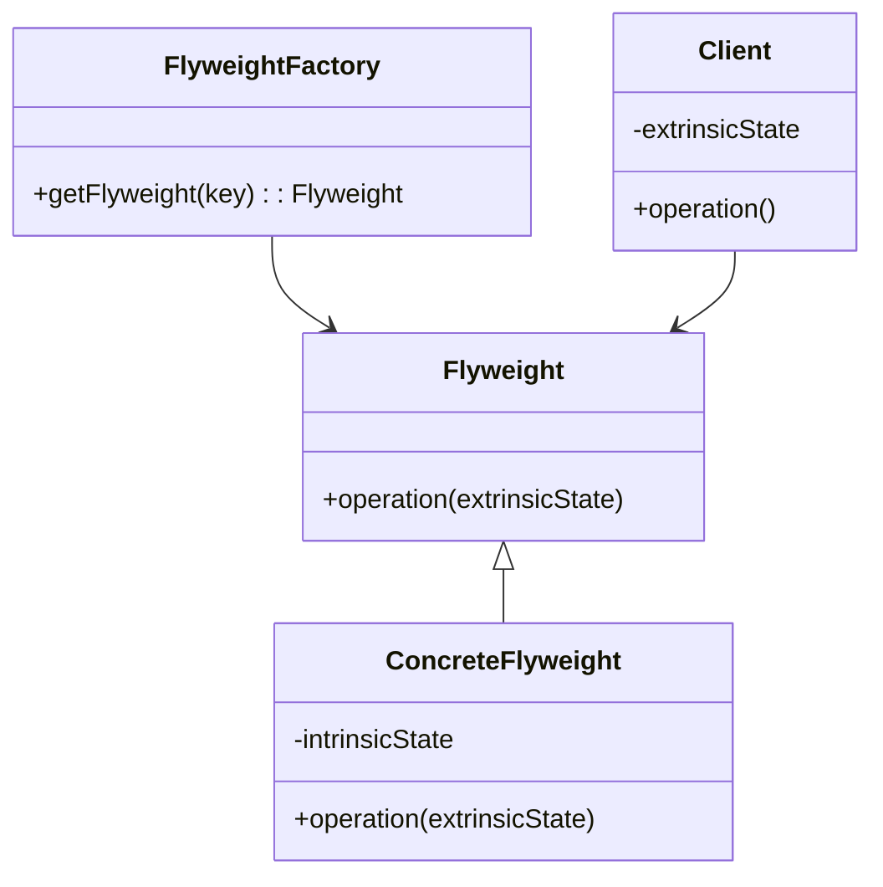

## 6.10. Flyweight Pattern with Shared Data Structures

### Introduction

In the realm of software design patterns, the **Flyweight Pattern** stands out as a powerful technique for optimizing memory usage in applications that handle a large number of similar objects. This pattern is particularly relevant in Clojure, where immutable data structures naturally lend themselves to efficient data sharing. In this section, we will explore the Flyweight Pattern, its implementation in Clojure, and the unique advantages offered by Clojure's immutable data structures.

### Understanding the Flyweight Pattern

The Flyweight Pattern is a structural design pattern that aims to minimize memory usage by sharing as much data as possible with similar objects. This is achieved by storing common data externally and referencing it from multiple objects, rather than duplicating it. The pattern is particularly useful in scenarios where a large number of objects are created, but only a few variations exist among them.

#### Key Participants

- **Flyweight**: The interface through which flyweight objects can act. It defines methods that accept extrinsic state.
- **Concrete Flyweight**: Implements the Flyweight interface and stores intrinsic state that is shared across objects.
- **Flyweight Factory**: Manages the creation and sharing of flyweight objects. It ensures that flyweights are shared properly.
- **Client**: Maintains references to flyweight objects and computes or stores extrinsic state.

### Applicability of the Flyweight Pattern

The Flyweight Pattern is applicable in scenarios where:

- A large number of objects are required.
- The objects share a significant amount of intrinsic state.
- The cost of creating and maintaining these objects is high.
- The application can benefit from reduced memory usage.

### Clojure's Support for Shared Data Structures

Clojure's immutable data structures inherently support sharing, making it an ideal language for implementing the Flyweight Pattern. When you create a new version of a data structure in Clojure, it shares as much of the existing structure as possible, rather than copying it entirely. This is achieved through a technique known as **structural sharing**.

#### Example of Structural Sharing

```clojure
(def original-vector [1 2 3 4 5])

;; Create a new vector by adding an element
(def new-vector (conj original-vector 6))

;; Both vectors share the first five elements
```

In the example above, `original-vector` and `new-vector` share the first five elements, demonstrating how Clojure's data structures optimize memory usage through sharing.

### Implementing the Flyweight Pattern in Clojure

Let's explore how the Flyweight Pattern can be implemented in Clojure using shared data structures. We'll consider a scenario where we need to manage a large number of graphical objects, such as circles, with varying colors and positions.

#### Step 1: Define the Flyweight

First, we'll define a flyweight that represents the intrinsic state of a circle, such as its radius.

```clojure
(defrecord CircleFlyweight [radius])
```

#### Step 2: Create a Flyweight Factory

Next, we'll create a factory that manages the creation and sharing of circle flyweights.

```clojure
(def circle-flyweights (atom {}))

(defn get-circle-flyweight [radius]
  (if-let [flyweight (@circle-flyweights radius)]
    flyweight
    (let [new-flyweight (->CircleFlyweight radius)]
      (swap! circle-flyweights assoc radius new-flyweight)
      new-flyweight)))
```

#### Step 3: Use the Flyweight in the Client

Finally, we'll use the flyweight in a client that manages the extrinsic state, such as color and position.

```clojure
(defn draw-circle [radius color position]
  (let [flyweight (get-circle-flyweight radius)]
    (println "Drawing circle with radius" (:radius flyweight)
             "color" color
             "at position" position)))

(draw-circle 5 "red" [10 20])
(draw-circle 5 "blue" [30 40])
```

In this example, the `draw-circle` function retrieves a shared flyweight for the circle's radius, while managing the extrinsic state (color and position) separately.

### Benefits of Immutability in the Flyweight Pattern

Clojure's immutability provides several benefits when implementing the Flyweight Pattern:

- **Thread Safety**: Immutable data structures are inherently thread-safe, eliminating the need for synchronization when accessing shared data.
- **Memory Efficiency**: Structural sharing reduces memory usage by avoiding duplication of shared data.
- **Simplified Code**: Immutability simplifies code by eliminating side effects and making data flow more predictable.

### Scenarios for Applying the Flyweight Pattern

The Flyweight Pattern is particularly useful in data-heavy applications, such as:

- **Graphical Applications**: Managing large numbers of graphical objects with shared properties.
- **Text Processing**: Handling large volumes of text with repeated patterns or characters.
- **Network Protocols**: Managing protocol data units with shared headers or metadata.

### Visualizing the Flyweight Pattern

To better understand the Flyweight Pattern, let's visualize the relationship between the flyweight objects, the factory, and the client.



In this diagram, the `FlyweightFactory` manages the creation and sharing of `ConcreteFlyweight` objects, while the `Client` maintains the extrinsic state.

### Design Considerations

When implementing the Flyweight Pattern in Clojure, consider the following:

- **Identify Intrinsic and Extrinsic State**: Clearly distinguish between shared (intrinsic) and unique (extrinsic) state.
- **Manage Flyweight Lifecycle**: Use a factory to manage the lifecycle and sharing of flyweight objects.
- **Optimize for Performance**: Ensure that the overhead of managing flyweights does not outweigh the memory savings.

### Clojure's Unique Features

Clojure's unique features, such as immutable data structures and first-class functions, make it well-suited for implementing the Flyweight Pattern. The language's emphasis on immutability and functional programming aligns with the pattern's goals of memory efficiency and data sharing.

### Differences and Similarities with Other Patterns

The Flyweight Pattern is often compared to other structural patterns, such as the **Proxy Pattern** and the **Decorator Pattern**. While all three patterns involve object composition, the Flyweight Pattern focuses specifically on memory optimization through data sharing.

### Try It Yourself

To deepen your understanding of the Flyweight Pattern in Clojure, try modifying the code examples provided:

- Experiment with different intrinsic and extrinsic states.
- Implement a flyweight pattern for a different domain, such as text processing.
- Measure the memory usage before and after applying the Flyweight Pattern.

### Conclusion

The Flyweight Pattern is a powerful tool for optimizing memory usage in data-heavy applications. By leveraging Clojure's immutable data structures and structural sharing, you can implement this pattern efficiently and effectively. Remember, this is just the beginning. As you progress, you'll discover more opportunities to apply the Flyweight Pattern and other design patterns in your Clojure projects. Keep experimenting, stay curious, and enjoy the journey!

## **Ready to Test Your Knowledge?**



### What is the primary goal of the Flyweight Pattern?

- [x] To minimize memory usage by sharing data among similar objects.
- [ ] To enhance the performance of algorithms.
- [ ] To simplify the codebase by reducing the number of classes.
- [ ] To improve the security of the application.

> **Explanation:** The Flyweight Pattern aims to minimize memory usage by sharing as much data as possible with similar objects.

### How does Clojure's immutability benefit the Flyweight Pattern?

- [x] It provides thread safety and reduces memory usage through structural sharing.
- [ ] It allows for dynamic typing and runtime flexibility.
- [ ] It simplifies the syntax of the language.
- [ ] It enhances the speed of execution.

> **Explanation:** Clojure's immutability provides thread safety and reduces memory usage through structural sharing, which aligns with the goals of the Flyweight Pattern.

### Which of the following is an example of intrinsic state in the Flyweight Pattern?

- [x] The radius of a circle in a graphical application.
- [ ] The color of a circle in a graphical application.
- [ ] The position of a circle in a graphical application.
- [ ] The velocity of a moving object.

> **Explanation:** Intrinsic state is shared among objects, such as the radius of a circle, while extrinsic state is unique, like color or position.

### What role does the Flyweight Factory play in the pattern?

- [x] It manages the creation and sharing of flyweight objects.
- [ ] It handles the extrinsic state of objects.
- [ ] It defines the interface for flyweight objects.
- [ ] It provides synchronization for concurrent access.

> **Explanation:** The Flyweight Factory is responsible for managing the creation and sharing of flyweight objects to ensure efficient memory usage.

### In which scenario is the Flyweight Pattern most applicable?

- [x] When a large number of objects share significant intrinsic state.
- [ ] When objects require complex initialization logic.
- [ ] When objects need to be serialized and deserialized frequently.
- [ ] When objects are used in a distributed system.

> **Explanation:** The Flyweight Pattern is most applicable when a large number of objects share significant intrinsic state, allowing for memory optimization.

### What is structural sharing in Clojure?

- [x] A technique where new data structures share parts of existing structures to save memory.
- [ ] A method for organizing code into modules and namespaces.
- [ ] A way to enforce type safety in the language.
- [ ] A pattern for managing concurrent access to data.

> **Explanation:** Structural sharing is a technique where new data structures share parts of existing structures to save memory, which is a key feature of Clojure's immutable data structures.

### How can you measure the effectiveness of the Flyweight Pattern?

- [x] By comparing memory usage before and after applying the pattern.
- [ ] By evaluating the speed of execution of the application.
- [ ] By analyzing the complexity of the codebase.
- [ ] By assessing the security vulnerabilities in the application.

> **Explanation:** The effectiveness of the Flyweight Pattern can be measured by comparing memory usage before and after applying the pattern.

### What is the difference between intrinsic and extrinsic state?

- [x] Intrinsic state is shared among objects, while extrinsic state is unique to each object.
- [ ] Intrinsic state is mutable, while extrinsic state is immutable.
- [ ] Intrinsic state is stored in the database, while extrinsic state is in memory.
- [ ] Intrinsic state is used for computation, while extrinsic state is for storage.

> **Explanation:** Intrinsic state is shared among objects, while extrinsic state is unique to each object, which is a fundamental concept in the Flyweight Pattern.

### Which Clojure feature aligns well with the Flyweight Pattern?

- [x] Immutable data structures.
- [ ] Dynamic typing.
- [ ] Lazy evaluation.
- [ ] Protocols and multimethods.

> **Explanation:** Immutable data structures align well with the Flyweight Pattern because they support structural sharing and memory efficiency.

### True or False: The Flyweight Pattern can be used to improve the performance of algorithms.

- [ ] True
- [x] False

> **Explanation:** The Flyweight Pattern is primarily focused on optimizing memory usage, not directly improving the performance of algorithms.


