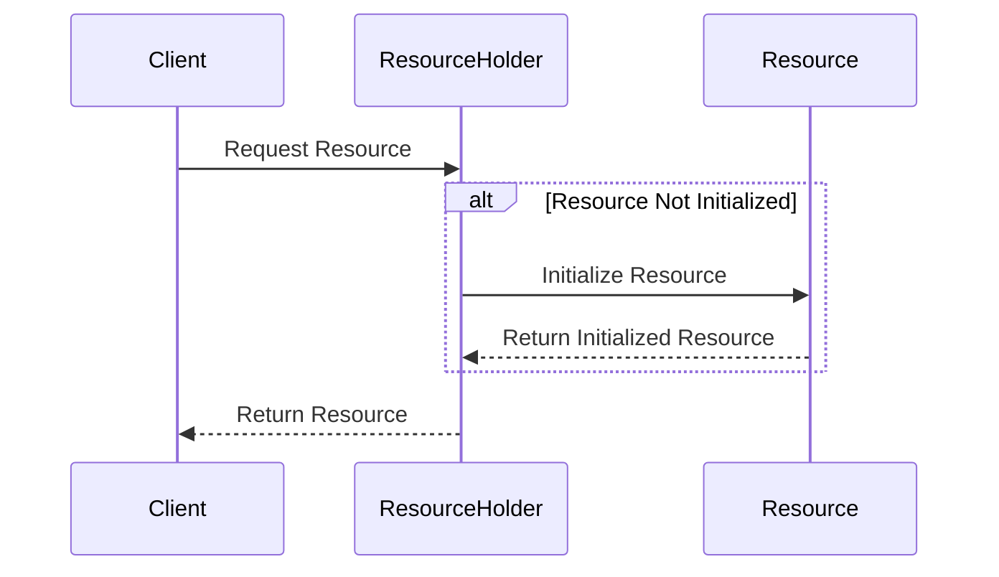

## 6.11. Initialization-on-Demand Holder Idiom

### Introduction

In the realm of software design patterns, the Initialization-on-Demand Holder Idiom is a powerful technique for achieving lazy initialization of resources in a thread-safe manner. This idiom is particularly useful in scenarios where the initialization of a resource is costly, and you want to defer this initialization until the resource is actually needed. In Clojure, a language that emphasizes immutability and concurrency, this idiom can be elegantly implemented using constructs like `delay` and vars.

### Understanding the Initialization-on-Demand Holder Idiom

The Initialization-on-Demand Holder Idiom is a design pattern that ensures a resource is initialized only when it is accessed for the first time. This lazy initialization approach is beneficial for optimizing resource usage and improving application performance. The idiom also guarantees that the resource is initialized in a thread-safe manner, preventing multiple threads from initializing the resource simultaneously.

In traditional object-oriented languages like Java, this idiom is often implemented using static inner classes. However, in Clojure, we can leverage the language's functional programming paradigms and concurrency primitives to achieve the same effect.

### Implementing the Idiom in Clojure

#### Using `delay`

In Clojure, the `delay` function provides a straightforward way to implement lazy initialization. A `delay` is a construct that encapsulates a computation that will only be executed once, the first time its value is needed. Subsequent accesses to the `delay` will return the cached result of the initial computation.

```clojure
(defn expensive-resource []
  (println "Initializing resource...")
  {:resource "Expensive Resource"})

(def resource-holder (delay (expensive-resource)))

;; Accessing the resource
(defn get-resource []
  @resource-holder)

;; Usage
(println (get-resource))  ;; Output: "Initializing resource..." followed by the resource map
(println (get-resource))  ;; Output: Only the resource map, no initialization message
```

In this example, the `expensive-resource` function simulates a costly initialization process. The `resource-holder` is a `delay` that wraps this function, ensuring that the initialization occurs only once, when `get-resource` is first called.

#### Using Vars

Vars in Clojure can also be used to achieve lazy initialization. By using a combination of `defonce` and `var`, we can ensure that a resource is initialized only once and is accessible globally.

```clojure
(defonce ^:dynamic *resource* nil)

(defn initialize-resource []
  (println "Initializing resource...")
  {:resource "Expensive Resource"})

(defn get-resource []
  (if (nil? *resource*)
    (alter-var-root #'*resource* (constantly (initialize-resource))))
  *resource*)

;; Usage
(println (get-resource))  ;; Output: "Initializing resource..." followed by the resource map
(println (get-resource))  ;; Output: Only the resource map, no initialization message
```

Here, `defonce` ensures that `*resource*` is initialized only once. The `alter-var-root` function is used to set the value of the var if it is currently `nil`.

### Thread Safety and Initialization Guarantees

Both `delay` and vars provide thread-safe mechanisms for lazy initialization. The `delay` construct is inherently thread-safe, as it ensures that the computation is executed only once, even in the presence of concurrent accesses. Similarly, `alter-var-root` provides atomic updates to vars, preventing race conditions during initialization.

### Singleton-Like Resources

The Initialization-on-Demand Holder Idiom is often used to manage singleton-like resources, where a single instance of a resource is shared across the application. This pattern is particularly useful for managing resources such as database connections, configuration settings, or any other resource that is expensive to create and should be reused.

### When to Use the Initialization-on-Demand Holder Idiom

This idiom is appropriate in scenarios where:

- **Resource Initialization is Costly**: If the initialization of a resource involves significant computation or I/O operations, deferring this initialization until the resource is needed can improve performance.
- **Resource Usage is Conditional**: If a resource is not always needed, lazy initialization can avoid unnecessary resource consumption.
- **Thread Safety is a Concern**: The idiom provides a thread-safe way to initialize resources, preventing issues related to concurrent access.

### Visualizing the Initialization Process

To better understand the initialization process, let's visualize the flow of lazy initialization using a sequence diagram.



**Figure 1**: This diagram illustrates the lazy initialization process. The `Client` requests the resource from the `ResourceHolder`. If the resource is not yet initialized, the `ResourceHolder` initializes it and returns the initialized resource to the `Client`.

### Try It Yourself

To deepen your understanding, try modifying the code examples provided:

- **Experiment with Different Resources**: Replace the `expensive-resource` function with a different resource initialization logic, such as reading from a file or establishing a network connection.
- **Test Concurrent Access**: Simulate concurrent access to the resource by using Clojure's concurrency primitives, such as `future` or `pmap`, to call `get-resource` from multiple threads.
- **Explore Error Handling**: Introduce error handling in the initialization process to see how the idiom handles exceptions during resource creation.

### Key Takeaways

- The Initialization-on-Demand Holder Idiom is a powerful pattern for lazy initialization of resources in a thread-safe manner.
- Clojure's `delay` and vars provide elegant solutions for implementing this idiom.
- This pattern is particularly useful for managing singleton-like resources that are costly to initialize.
- The idiom ensures that resources are initialized only once, even in the presence of concurrent access.

### References and Further Reading

- [Clojure Documentation on Delay](https://clojure.org/reference/delay)
- [Concurrency in Clojure](https://clojure.org/reference/concurrency)
- [Effective Java by Joshua Bloch](https://www.oreilly.com/library/view/effective-java-3rd/9780134686097/) - A classic book that discusses the Initialization-on-Demand Holder Idiom in Java.

## **Ready to Test Your Knowledge?**



### What is the primary purpose of the Initialization-on-Demand Holder Idiom?

- [x] To achieve lazy initialization of resources in a thread-safe manner.
- [ ] To initialize resources eagerly.
- [ ] To manage multiple instances of a resource.
- [ ] To simplify resource management by using global variables.

> **Explanation:** The Initialization-on-Demand Holder Idiom is designed to achieve lazy initialization of resources in a thread-safe manner, ensuring that resources are only initialized when needed.

### Which Clojure construct is inherently thread-safe for lazy initialization?

- [x] `delay`
- [ ] `atom`
- [ ] `ref`
- [ ] `agent`

> **Explanation:** The `delay` construct in Clojure is inherently thread-safe and ensures that the computation is executed only once, even in the presence of concurrent accesses.

### How does the `defonce` keyword help in lazy initialization?

- [x] It ensures that a var is initialized only once.
- [ ] It allows multiple initializations of a var.
- [ ] It makes a var immutable.
- [ ] It provides thread-local storage.

> **Explanation:** The `defonce` keyword ensures that a var is initialized only once, preventing multiple initializations.

### What is a common use case for the Initialization-on-Demand Holder Idiom?

- [x] Managing singleton-like resources.
- [ ] Creating multiple instances of a resource.
- [ ] Implementing complex algorithms.
- [ ] Simplifying error handling.

> **Explanation:** The idiom is commonly used for managing singleton-like resources, where a single instance of a resource is shared across the application.

### Which function is used to update a var atomically in Clojure?

- [x] `alter-var-root`
- [ ] `swap!`
- [ ] `reset!`
- [ ] `alter`

> **Explanation:** The `alter-var-root` function is used to update a var atomically, ensuring thread safety during initialization.

### What is the output of accessing a `delay` for the first time?

- [x] The result of the encapsulated computation.
- [ ] `nil`
- [ ] An error message.
- [ ] A promise object.

> **Explanation:** Accessing a `delay` for the first time triggers the encapsulated computation, returning its result.

### How can you simulate concurrent access to a resource in Clojure?

- [x] Using `future` or `pmap`.
- [ ] Using `atom`.
- [ ] Using `ref`.
- [ ] Using `agent`.

> **Explanation:** You can simulate concurrent access by using Clojure's concurrency primitives, such as `future` or `pmap`, to call functions from multiple threads.

### What happens if an exception occurs during the initialization of a `delay`?

- [x] The exception is thrown, and the `delay` remains uninitialized.
- [ ] The exception is ignored, and the `delay` is initialized with `nil`.
- [ ] The exception is logged, and the `delay` is initialized with a default value.
- [ ] The exception is caught, and the `delay` is retried.

> **Explanation:** If an exception occurs during the initialization of a `delay`, the exception is thrown, and the `delay` remains uninitialized.

### Which of the following is NOT a benefit of using the Initialization-on-Demand Holder Idiom?

- [ ] Lazy initialization of resources.
- [ ] Thread-safe resource management.
- [ ] Reduced resource consumption.
- [x] Increased complexity of code.

> **Explanation:** The Initialization-on-Demand Holder Idiom simplifies resource management by providing lazy and thread-safe initialization, reducing complexity rather than increasing it.

### True or False: The Initialization-on-Demand Holder Idiom can be used for both expensive and inexpensive resources.

- [x] True
- [ ] False

> **Explanation:** While the idiom is particularly beneficial for expensive resources, it can be used for any resource where lazy initialization and thread safety are desired.



Remember, this is just the beginning. As you progress, you'll build more complex and interactive applications using Clojure's powerful features. Keep experimenting, stay curious, and enjoy the journey!
