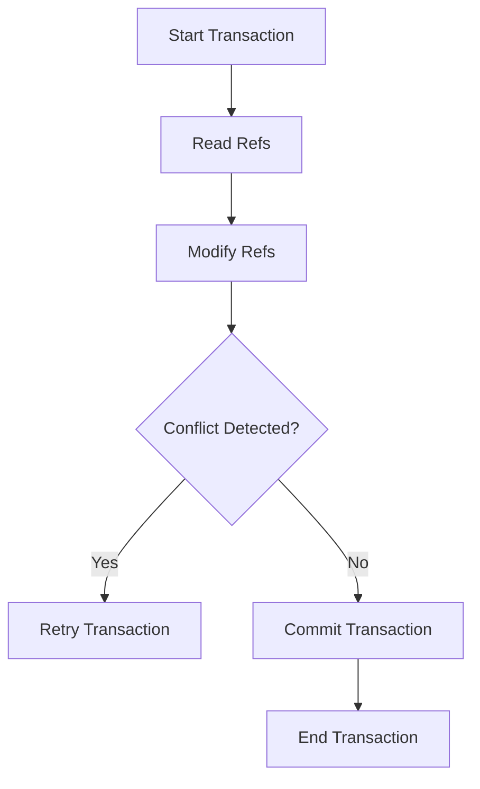

## 6.2 Software Transactional Memory (STM) in Clojure

Concurrency is a critical aspect of modern software development, especially in functional programming languages like Clojure. One of the standout features of Clojure is its Software Transactional Memory (STM) system, which provides a robust mechanism for managing shared state in a concurrent environment. This article delves into the intricacies of STM in Clojure, illustrating how it allows developers to handle mutable state safely and efficiently without the pitfalls of traditional locking mechanisms.

### Introduction to Software Transactional Memory (STM)

Software Transactional Memory (STM) is a concurrency control mechanism akin to database transactions. It allows multiple threads to access shared memory concurrently while maintaining consistency and avoiding conflicts. STM in Clojure is designed to simplify concurrent programming by providing a high-level abstraction for managing shared state.

#### Key Concepts of STM

- **Refs:** Refs are mutable references to shared state that can be safely modified within transactions.
- **Transactions:** Transactions are blocks of code that execute atomically and are retried automatically in case of conflicts.
- **Consistency:** STM ensures that all operations within a transaction appear as a single atomic operation, maintaining data consistency.

### Defining Refs for Shared State

Refs are the cornerstone of Clojure's STM system. They hold mutable state that can be modified safely within transactions. Here's how you can define refs in Clojure:

```clojure
(def account-a (ref 1000))
(def account-b (ref 500))
```

In this example, `account-a` and `account-b` are refs representing bank account balances. These refs can be modified within transactions to ensure consistency.

### Performing Transactions with `dosync`

Transactions in Clojure are defined using the `dosync` macro. Within a `dosync` block, you can perform operations on refs using functions like `alter`, `commute`, and `ref-set`.

```clojure
(dosync
  (alter account-a - 100)
  (alter account-b + 100))
```

In this transaction, we transfer 100 units from `account-a` to `account-b`. The `alter` function is used to apply changes to the refs.

### Using `alter`, `commute`, and `ref-set`

Clojure provides several functions to modify refs within transactions:

- **`alter`:** Used for coordinated state changes that respect transaction order.
  
  ```clojure
  (alter account-a - 100)
  ```

- **`commute`:** Suitable for commutative operations that can be applied in any order, improving performance by reducing conflicts.

  ```clojure
  (commute account-a + 50)
  ```

- **`ref-set`:** Directly replaces the value of a ref, typically used when the new value does not depend on the old value.

  ```clojure
  (ref-set account-a 1500)
  ```

### Avoiding Side Effects within Transactions

It's crucial to avoid side effects within transactions. This means you should not perform I/O operations or modify atoms/agents inside a `dosync` block. Transactions may be retried multiple times, and side effects could lead to inconsistent states or unexpected behavior.

### Handling Validation and Retries

Clojure's STM system allows you to enforce constraints on refs using validators. Validators are functions that check the validity of a ref's value before committing a transaction.

```clojure
(def account-a (ref 1000 :validator pos?))
```

In this example, the validator ensures that `account-a` never holds a negative value. If a transaction attempts to set a negative value, it will be aborted and retried.

### Best Practices for Using STM

- **Keep Transactions Short:** Long-running transactions increase the likelihood of conflicts and retries. Keep them as short as possible to improve performance.
- **Use Validators Wisely:** Validators help maintain data integrity but can add overhead. Use them judiciously to enforce critical constraints.
- **Leverage `commute` for Performance:** When possible, use `commute` for operations that can be reordered, reducing contention and improving throughput.

### Advantages and Disadvantages of STM

#### Advantages

- **Simplicity:** STM abstracts away the complexity of locks, making concurrent programming more accessible.
- **Consistency:** Automatic retries ensure that transactions are consistent and atomic.
- **Composability:** Transactions can be composed, allowing for complex state changes to be expressed succinctly.

#### Disadvantages

- **Overhead:** STM introduces some overhead due to automatic retries and conflict detection.
- **Limited to Refs:** STM is specifically designed for refs, so other concurrency primitives like atoms and agents are not directly compatible.

### Visualizing STM in Action

Below is a conceptual diagram illustrating how STM manages transactions and ensures consistency:



### Conclusion

Software Transactional Memory (STM) in Clojure provides a powerful and elegant solution for managing shared state in concurrent applications. By leveraging refs and transactions, developers can write safe and efficient concurrent code without the complexity of traditional locking mechanisms. While STM introduces some overhead, its benefits in terms of simplicity and consistency make it a valuable tool in the Clojure ecosystem.

## Quiz Time!



### What is the primary purpose of Software Transactional Memory (STM) in Clojure?

- [x] To manage shared state with composable transactions, avoiding locks.
- [ ] To perform I/O operations within transactions.
- [ ] To replace all concurrency primitives in Clojure.
- [ ] To ensure all functions are pure.

> **Explanation:** STM is designed to manage shared state safely using transactions, avoiding the need for locks.

### Which Clojure construct is used to define mutable references for shared state in STM?

- [x] Refs
- [ ] Atoms
- [ ] Agents
- [ ] Vars

> **Explanation:** Refs are used in Clojure's STM to hold mutable state that can be safely modified within transactions.

### What is the role of the `dosync` macro in Clojure's STM?

- [x] It defines a transaction block where refs can be safely modified.
- [ ] It performs asynchronous operations.
- [ ] It locks refs to prevent concurrent access.
- [ ] It validates refs outside of transactions.

> **Explanation:** `dosync` is used to define a transaction block, allowing safe modification of refs.

### Which function is used for commutative operations within a transaction?

- [ ] alter
- [x] commute
- [ ] ref-set
- [ ] swap!

> **Explanation:** `commute` is used for commutative operations that can be applied in any order within a transaction.

### What should be avoided within a `dosync` block?

- [x] Side effects such as I/O operations
- [ ] Modifying refs
- [ ] Using `alter`
- [ ] Using `commute`

> **Explanation:** Side effects should be avoided within transactions because they may be retried, leading to inconsistent states.

### How does Clojure's STM handle transaction conflicts?

- [x] It automatically retries the transaction.
- [ ] It throws an exception and aborts.
- [ ] It locks the refs involved.
- [ ] It ignores the conflict and proceeds.

> **Explanation:** STM automatically retries transactions in case of conflicts to ensure consistency.

### What is a validator in the context of Clojure's STM?

- [x] A function that enforces constraints on a ref's value.
- [ ] A mechanism to lock refs.
- [ ] A tool for performing I/O operations.
- [ ] A way to replace refs with atoms.

> **Explanation:** Validators are functions that check the validity of a ref's value before committing a transaction.

### Which function directly replaces the value of a ref within a transaction?

- [ ] alter
- [ ] commute
- [x] ref-set
- [ ] swap!

> **Explanation:** `ref-set` is used to directly replace the value of a ref within a transaction.

### What is the main advantage of using `commute` over `alter`?

- [x] It reduces contention by allowing operations to be reordered.
- [ ] It locks the ref for exclusive access.
- [ ] It performs operations asynchronously.
- [ ] It validates refs automatically.

> **Explanation:** `commute` allows operations to be reordered, reducing contention and improving performance.

### True or False: STM in Clojure can be used with atoms and agents.

- [ ] True
- [x] False

> **Explanation:** STM is specifically designed for refs, and other concurrency primitives like atoms and agents are not directly compatible.


