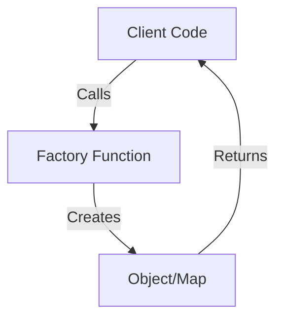

## 6.2. Factory Function Pattern

### Introduction to Factory Functions

In the realm of software design patterns, the Factory Function Pattern stands out as a crucial technique for managing object creation. In Clojure, a language renowned for its functional programming paradigm, factory functions play a pivotal role in encapsulating the logic of object instantiation. This pattern provides a layer of abstraction over the creation process, offering developers flexibility and control.

### What Are Factory Functions?

Factory functions in Clojure are functions that return new instances of data structures or objects. Unlike traditional object-oriented languages where classes and constructors are used, Clojure leverages its functional nature to create objects through functions. This approach aligns with Clojure's emphasis on immutability and simplicity.

#### Purpose of Factory Functions

The primary purpose of factory functions is to encapsulate the creation logic of objects. By doing so, they:

- **Abstract the Instantiation Process**: Hide the complexities involved in creating objects.
- **Provide Flexibility**: Allow for variations in object creation without altering client code.
- **Enhance Maintainability**: Centralize object creation logic, making it easier to manage and modify.

### Factory Functions in Clojure: A Closer Look

Let's delve into how factory functions are implemented in Clojure, using practical examples to illustrate their utility.

#### Basic Factory Function Example

Consider a simple scenario where we need to create a `Person` entity. In Clojure, we can define a factory function to handle this:

```clojure
(defn create-person
  "Factory function to create a new person with a name and age."
  [name age]
  {:name name
   :age age})

;; Usage
(def john (create-person "John Doe" 30))
```

In this example, `create-person` is a factory function that returns a map representing a person. This function abstracts the creation logic, allowing us to easily modify the structure or initialization process without affecting the rest of the codebase.

#### Advanced Factory Function with Validation

Factory functions can also include additional logic, such as validation:

```clojure
(defn create-person
  "Factory function to create a new person with validation."
  [name age]
  (when (or (empty? name) (neg? age))
    (throw (IllegalArgumentException. "Invalid name or age")))
  {:name name
   :age age})

;; Usage
(try
  (def jane (create-person "Jane Doe" -5))
  (catch IllegalArgumentException e
    (println (.getMessage e))))
```

Here, the factory function checks for valid input before creating the person object, encapsulating both creation and validation logic.

### Advantages of Factory Functions

Factory functions offer several advantages, particularly in a functional language like Clojure:

1. **Control Over Initialization**: They provide a centralized place to manage the initialization of objects, allowing for complex setup processes to be encapsulated within a single function.

2. **Encapsulation of Creation Logic**: By hiding the details of object creation, factory functions promote cleaner and more maintainable code.

3. **Flexibility and Extensibility**: They allow for easy modifications to the creation process, such as adding new parameters or changing the internal structure, without impacting client code.

4. **Consistency**: Using factory functions ensures that objects are created in a consistent manner across the application.

### Comparing with Traditional OO Factory Patterns

In traditional object-oriented programming, factory patterns often involve classes and interfaces. Clojure's approach, however, is more aligned with its functional nature:

- **No Classes or Constructors**: Clojure uses functions instead of classes, which simplifies the creation process and reduces boilerplate code.
- **Immutability**: Objects created by factory functions are typically immutable, aligning with Clojure's core principles.
- **Higher-Order Functions**: Clojure's factory functions can leverage higher-order functions to create more dynamic and flexible creation processes.

### When to Use Factory Functions

Factory functions are particularly beneficial in scenarios where:

- **Complex Initialization**: Objects require complex setup or configuration.
- **Multiple Variants**: There are multiple variants of an object that share a common interface.
- **Decoupling**: You want to decouple the creation logic from the rest of the application, allowing for easier testing and maintenance.

### Visualizing Factory Function Pattern

To better understand the flow of the Factory Function Pattern in Clojure, let's visualize it using a Mermaid.js diagram:



**Diagram Description**: This diagram illustrates the interaction between client code and a factory function. The client code calls the factory function, which then creates and returns an object or map.

### Sample Code Snippet: Factory Function with Configuration

Let's explore a more complex example where a factory function is used to create a configuration object:

```clojure
(defn create-config
  "Factory function to create a configuration map with defaults."
  [overrides]
  (let [defaults {:host "localhost"
                  :port 8080
                  :debug false}]
    (merge defaults overrides)))

;; Usage
(def config (create-config {:port 3000 :debug true}))
```

In this example, `create-config` merges default configuration values with any overrides provided by the user. This pattern is useful for managing configuration settings in a flexible and consistent manner.

### Design Considerations

When implementing factory functions in Clojure, consider the following:

- **Simplicity**: Keep the factory function simple and focused on object creation. Avoid adding unrelated logic.
- **Error Handling**: Include error handling and validation within the factory function to ensure robustness.
- **Documentation**: Clearly document the purpose and usage of the factory function to aid understanding and maintenance.

### Clojure Unique Features

Clojure's unique features, such as immutability and higher-order functions, enhance the utility of factory functions:

- **Immutability**: Factory functions naturally align with Clojure's immutable data structures, promoting safe and predictable code.
- **Higher-Order Functions**: Leverage higher-order functions to create more dynamic and flexible factory functions.

### Differences and Similarities with Other Patterns

Factory functions are often compared to other creational patterns, such as the Singleton or Builder patterns. While they share the goal of managing object creation, factory functions are more focused on encapsulating the creation logic and providing flexibility.

### Try It Yourself

To deepen your understanding of factory functions, try modifying the examples provided:

- **Add New Fields**: Extend the `create-person` function to include additional fields, such as `email` or `address`.
- **Implement a Factory for a Different Entity**: Create a factory function for a different entity, such as a `Car` or `Product`.
- **Experiment with Validation**: Enhance the validation logic in the factory function to include more complex rules.

### Knowledge Check

Before we conclude, let's test your understanding of the Factory Function Pattern with a few questions.

## **Ready to Test Your Knowledge?**



### What is the primary purpose of a factory function in Clojure?

- [x] To encapsulate the creation logic of objects
- [ ] To manage memory allocation
- [ ] To perform arithmetic operations
- [ ] To handle user input

> **Explanation:** The primary purpose of a factory function is to encapsulate the creation logic of objects, providing flexibility and abstraction over the instantiation process.

### How do factory functions in Clojure differ from traditional OO factory patterns?

- [x] They use functions instead of classes
- [ ] They require more boilerplate code
- [ ] They are less flexible
- [ ] They do not support immutability

> **Explanation:** Factory functions in Clojure use functions instead of classes, aligning with the language's functional programming paradigm and reducing boilerplate code.

### Which of the following is an advantage of using factory functions?

- [x] They provide control over initialization
- [ ] They increase code complexity
- [ ] They reduce code readability
- [ ] They limit flexibility

> **Explanation:** Factory functions provide control over initialization, allowing for complex setup processes to be encapsulated within a single function.

### What is a common use case for factory functions?

- [x] Creating objects with complex initialization
- [ ] Performing mathematical calculations
- [ ] Managing user sessions
- [ ] Handling network requests

> **Explanation:** Factory functions are commonly used for creating objects with complex initialization, where encapsulating the creation logic is beneficial.

### How can factory functions enhance maintainability?

- [x] By centralizing object creation logic
- [ ] By scattering logic across multiple files
- [ ] By increasing code duplication
- [ ] By reducing code documentation

> **Explanation:** Factory functions enhance maintainability by centralizing object creation logic, making it easier to manage and modify.

### What is a key feature of Clojure that complements factory functions?

- [x] Immutability
- [ ] Dynamic typing
- [ ] Object-oriented inheritance
- [ ] Manual memory management

> **Explanation:** Immutability is a key feature of Clojure that complements factory functions, promoting safe and predictable code.

### Which of the following is NOT a benefit of factory functions?

- [ ] Flexibility
- [ ] Consistency
- [x] Increased complexity
- [ ] Encapsulation

> **Explanation:** Factory functions aim to reduce complexity by encapsulating creation logic, not increase it.

### What should be included in a factory function to ensure robustness?

- [x] Error handling and validation
- [ ] Network requests
- [ ] File I/O operations
- [ ] User interface logic

> **Explanation:** Error handling and validation should be included in a factory function to ensure robustness and reliability.

### True or False: Factory functions in Clojure can leverage higher-order functions.

- [x] True
- [ ] False

> **Explanation:** True. Factory functions in Clojure can leverage higher-order functions to create more dynamic and flexible creation processes.

### What is a recommended practice when implementing factory functions?

- [x] Keep the function simple and focused on object creation
- [ ] Include unrelated logic within the function
- [ ] Avoid documenting the function
- [ ] Use global variables extensively

> **Explanation:** It is recommended to keep the factory function simple and focused on object creation, avoiding unrelated logic.



### Conclusion

The Factory Function Pattern in Clojure is a powerful tool for managing object creation, offering flexibility, encapsulation, and maintainability. By leveraging Clojure's unique features, such as immutability and higher-order functions, developers can create robust and efficient factory functions that enhance their applications. Remember, this is just the beginning. As you progress, you'll discover more ways to apply factory functions in your projects. Keep experimenting, stay curious, and enjoy the journey!
