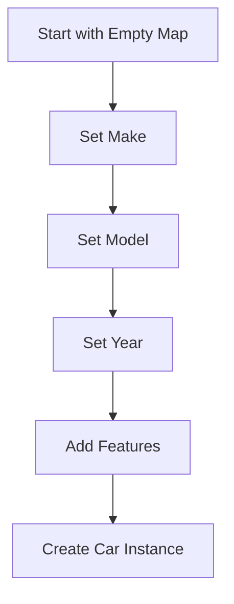

## 6.3. Builder Pattern Using Functions and Maps

In the world of software design patterns, the Builder Pattern stands out as a powerful tool for constructing complex objects in a step-by-step manner. In Clojure, a language that embraces functional programming paradigms, we can leverage functions and maps to implement this pattern effectively. This approach not only aligns with Clojure's emphasis on immutability and simplicity but also enhances code clarity and maintainability.

### Understanding the Builder Pattern

**Intent**: The Builder Pattern is designed to construct a complex object step-by-step. It separates the construction of a complex object from its representation, allowing the same construction process to create different representations.

**Key Participants**:
- **Builder**: Defines the steps to build the complex object.
- **Director**: Constructs an object using the Builder interface.
- **Product**: The complex object that is being constructed.

### Why Use the Builder Pattern in Clojure?

Clojure's functional nature and immutable data structures make it an ideal candidate for implementing the Builder Pattern. By using functions and maps, we can create flexible and reusable builders that construct complex configurations without mutating state. This approach offers several benefits:

- **Immutability**: Ensures that data structures remain unchanged, reducing the risk of side effects.
- **Clarity**: Functions and maps provide a clear and concise way to define and build complex objects.
- **Flexibility**: Allows for easy modification and extension of the building process.

### Implementing the Builder Pattern with Functions and Maps

Let's explore how we can implement the Builder Pattern in Clojure using functions and maps. We'll start by defining a simple example and gradually build upon it to demonstrate the pattern's capabilities.

#### Step 1: Define the Product

First, we need to define the complex object we want to build. In this example, we'll create a `Car` with various attributes such as `make`, `model`, `year`, and `features`.

```clojure
(defrecord Car [make model year features])
```

#### Step 2: Create the Builder Functions

Next, we'll define a series of functions that represent the steps to build a `Car`. Each function will take a map representing the current state of the `Car` and return a new map with the updated state.

```clojure
(defn set-make [car make]
  (assoc car :make make))

(defn set-model [car model]
  (assoc car :model model))

(defn set-year [car year]
  (assoc car :year year))

(defn add-feature [car feature]
  (update car :features conj feature))
```

#### Step 3: Construct the Car

With the builder functions in place, we can now construct a `Car` by chaining these functions together. We'll start with an empty map and apply each function in sequence.

```clojure
(defn build-car []
  (-> {}
      (set-make "Tesla")
      (set-model "Model S")
      (set-year 2024)
      (add-feature "Autopilot")
      (add-feature "Electric")))
```

#### Step 4: Create the Car Instance

Finally, we can create an instance of the `Car` using the constructed map.

```clojure
(def my-car (map->Car (build-car)))

(println my-car)
```

### Visualizing the Builder Pattern

To better understand the flow of the Builder Pattern in Clojure, let's visualize the process using a Mermaid.js diagram.



### Benefits of Using Functions and Maps

The use of functions and maps in implementing the Builder Pattern offers several advantages:

- **Immutability**: Each step in the building process returns a new map, preserving the immutability of the data structure.
- **Reusability**: Builder functions can be reused across different contexts and configurations.
- **Composability**: Functions can be easily composed to create complex building processes.

### Enhancing the Builder Pattern

While the basic implementation of the Builder Pattern in Clojure is straightforward, we can enhance it further by introducing additional features such as validation, default values, and custom builders.

#### Adding Validation

We can add validation to ensure that the constructed object meets certain criteria. For example, we can validate that the `year` is a valid integer.

```clojure
(defn validate-year [year]
  (when (not (integer? year))
    (throw (IllegalArgumentException. "Year must be an integer"))))

(defn set-year [car year]
  (validate-year year)
  (assoc car :year year))
```

#### Providing Default Values

We can also provide default values for certain attributes, allowing the builder to construct a complete object even if some attributes are not explicitly set.

```clojure
(defn build-car []
  (-> {:make "Unknown"
       :model "Unknown"
       :year 0
       :features []}
      (set-make "Tesla")
      (set-model "Model S")
      (set-year 2024)
      (add-feature "Autopilot")
      (add-feature "Electric")))
```

#### Custom Builders

For more complex configurations, we can create custom builders that encapsulate specific building processes.

```clojure
(defn sports-car-builder []
  (-> {}
      (set-make "Ferrari")
      (set-model "488 GTB")
      (set-year 2023)
      (add-feature "V8 Engine")
      (add-feature "Sport Mode")))

(def my-sports-car (map->Car (sports-car-builder)))

(println my-sports-car)
```

### Clojure Unique Features

Clojure's unique features, such as its emphasis on immutability and functional programming, make it particularly well-suited for implementing the Builder Pattern. The use of maps and associative functions allows for a clean and concise implementation that aligns with Clojure's core principles.

### Differences and Similarities with Other Patterns

The Builder Pattern is often compared to the Factory Pattern, as both are used to construct objects. However, the Builder Pattern is more focused on constructing complex objects step-by-step, while the Factory Pattern is typically used for creating objects in a single step.

### Design Considerations

When implementing the Builder Pattern in Clojure, consider the following:

- **Complexity**: Use the Builder Pattern for objects with multiple attributes or configurations.
- **Immutability**: Ensure that each step in the building process returns a new map to maintain immutability.
- **Validation**: Incorporate validation to ensure that the constructed object meets the required criteria.

### Try It Yourself

Now that we've explored the Builder Pattern in Clojure, try modifying the code examples to create different types of objects. Experiment with adding new attributes, validation rules, and custom builders to see how the pattern can be adapted to various scenarios.

### References and Further Reading

- [Clojure Documentation](https://clojure.org/reference)
- [Functional Programming in Clojure](https://www.braveclojure.com/)
- [Design Patterns: Elements of Reusable Object-Oriented Software](https://en.wikipedia.org/wiki/Design_Patterns)

### Summary

The Builder Pattern in Clojure, implemented using functions and maps, provides a powerful and flexible way to construct complex objects. By leveraging Clojure's functional programming paradigms and immutable data structures, we can create clear, concise, and maintainable code that aligns with modern software development practices.

## **Ready to Test Your Knowledge?**



### What is the primary intent of the Builder Pattern?

- [x] To construct complex objects step-by-step
- [ ] To create a single object in one step
- [ ] To manage object lifecycle
- [ ] To encapsulate object creation logic

> **Explanation:** The Builder Pattern is designed to construct complex objects step-by-step, separating construction from representation.

### Which Clojure feature is particularly beneficial for implementing the Builder Pattern?

- [x] Immutability
- [ ] Dynamic typing
- [ ] Macros
- [ ] Lazy evaluation

> **Explanation:** Immutability ensures that data structures remain unchanged, which is beneficial for the step-by-step construction process in the Builder Pattern.

### How do builder functions in Clojure typically modify the object being built?

- [x] By returning a new map with updated state
- [ ] By mutating the original map
- [ ] By using global variables
- [ ] By applying side effects

> **Explanation:** Builder functions in Clojure return a new map with the updated state, preserving immutability.

### What is a key advantage of using functions and maps for the Builder Pattern in Clojure?

- [x] Clarity and composability
- [ ] Increased complexity
- [ ] Dependency on external libraries
- [ ] Reduced performance

> **Explanation:** Functions and maps provide clarity and composability, making the building process straightforward and maintainable.

### Which of the following is a common enhancement to the basic Builder Pattern?

- [x] Adding validation
- [ ] Using global state
- [ ] Removing immutability
- [ ] Ignoring default values

> **Explanation:** Adding validation ensures that the constructed object meets certain criteria, enhancing the Builder Pattern.

### What is the difference between the Builder Pattern and the Factory Pattern?

- [x] Builder Pattern constructs objects step-by-step; Factory Pattern creates objects in one step
- [ ] Builder Pattern is used for simple objects; Factory Pattern for complex objects
- [ ] Builder Pattern uses global state; Factory Pattern uses local state
- [ ] Builder Pattern is less flexible than Factory Pattern

> **Explanation:** The Builder Pattern constructs objects step-by-step, while the Factory Pattern typically creates objects in a single step.

### Which function is used to create an instance of a record from a map in Clojure?

- [x] map->Record
- [ ] assoc
- [ ] update
- [ ] conj

> **Explanation:** The `map->Record` function is used to create an instance of a record from a map in Clojure.

### What is a potential pitfall when implementing the Builder Pattern in Clojure?

- [x] Overcomplicating the building process
- [ ] Using too few functions
- [ ] Relying on immutability
- [ ] Avoiding validation

> **Explanation:** Overcomplicating the building process can make the code difficult to maintain and understand.

### How can default values be provided in a Clojure builder?

- [x] By initializing the map with default values
- [ ] By using global variables
- [ ] By mutating the map
- [ ] By ignoring unset attributes

> **Explanation:** Default values can be provided by initializing the map with default values before applying builder functions.

### True or False: The Builder Pattern in Clojure can only be used for constructing simple objects.

- [ ] True
- [x] False

> **Explanation:** The Builder Pattern is particularly useful for constructing complex objects with multiple attributes or configurations.



Remember, this is just the beginning. As you progress, you'll build more complex and interactive applications using Clojure's powerful features. Keep experimenting, stay curious, and enjoy the journey!
