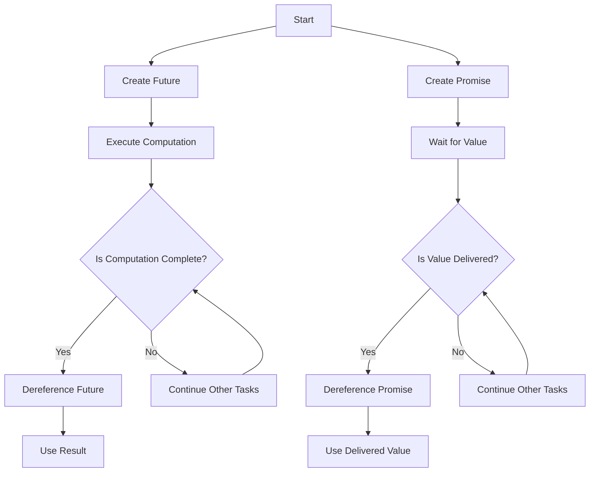

## 6.3 Futures and Promises in Clojure

Concurrency is a fundamental aspect of modern software development, allowing programs to perform multiple tasks simultaneously. In Clojure, futures and promises are powerful abstractions that facilitate asynchronous programming and concurrency, enabling developers to write non-blocking code that efficiently utilizes system resources.

### Introduction

Futures and promises are constructs that help manage asynchronous computations in Clojure. A **future** represents a computation that will be performed in the background, allowing the main program to continue executing without waiting for the result. A **promise**, on the other hand, is a placeholder for a value that will be provided at some point in the future. Together, they enable developers to build responsive and efficient applications.

### Detailed Explanation

#### Futures in Clojure

A future in Clojure is a mechanism for performing asynchronous computations. When you create a future, it immediately starts executing in a separate thread. You can later retrieve the result of the computation by dereferencing the future. This allows your program to continue executing other tasks while the future computation is in progress.

**Creating a Future:**

To create a future, use the `future` macro. Here's an example:

```clojure
(def result (future (compute-result)))
```

In this example, `(compute-result)` is a function that performs some computation. The future will execute this function asynchronously.

**Dereferencing a Future:**

To obtain the result of a future, you dereference it using the `@` symbol:

```clojure
(println @result)
```

Dereferencing a future will block the current thread until the computation is complete and the result is available.

**Checking if a Future is Realized:**

You can check if a future has completed its computation using the `realized?` function:

```clojure
(realized? result) ; Returns true if computation is complete
```

**Handling Exceptions in Futures:**

If an exception occurs during the computation of a future, it will be thrown when you attempt to dereference the future. This allows you to handle errors gracefully.

#### Promises in Clojure

A promise in Clojure is a placeholder for a value that will be delivered at some point in the future. Unlike futures, promises do not start a computation; instead, they wait for a value to be delivered.

**Creating a Promise:**

To create a promise, use the `promise` function:

```clojure
(def p (promise))
```

**Delivering a Value to a Promise:**

You can deliver a value to a promise using the `deliver` function:

```clojure
(deliver p value)
```

Once a value is delivered to a promise, it can be dereferenced to obtain the value.

**Using Promises:**

Promises are particularly useful in scenarios where the producer of a value and the consumer of a value are decoupled. Here is an example of using promises with producers and consumers:

**Consumer:**

```clojure
(def consumer (future (use-value @p)))
```

**Producer:**

```clojure
(deliver p value)
```

In this example, the consumer waits for the promise to be fulfilled, while the producer delivers the value at a later time.

### Visual Aids

To better understand the flow of futures and promises, consider the following diagram illustrating their interactions:



### Use Cases

Futures and promises are ideal for scenarios where you need to perform long-running computations or I/O operations without blocking the main thread. Common use cases include:

- Performing background data processing while maintaining a responsive user interface.
- Fetching data from remote services asynchronously.
- Coordinating tasks that depend on the completion of other tasks.

### Advantages and Disadvantages

**Advantages:**

- **Non-blocking Execution:** Futures and promises allow for non-blocking code execution, improving application responsiveness.
- **Concurrency:** They enable concurrent execution of tasks, making efficient use of system resources.
- **Simplified Error Handling:** Exceptions in futures are propagated when dereferenced, allowing for centralized error handling.

**Disadvantages:**

- **Complexity:** Managing asynchronous code can introduce complexity, especially when coordinating multiple futures and promises.
- **Potential for Deadlocks:** Improper use of promises can lead to deadlocks if not carefully managed.

### Best Practices

- **Avoid Blocking:** Minimize blocking operations when using futures to maintain responsiveness.
- **Handle Exceptions:** Always handle exceptions when dereferencing futures to prevent unexpected crashes.
- **Use Promises for Coordination:** Use promises to coordinate between producers and consumers, ensuring that values are delivered and consumed correctly.

### Comparisons

Futures and promises are often compared to other concurrency constructs such as threads and core.async channels. While threads provide low-level control over concurrency, futures and promises offer a higher-level abstraction that simplifies asynchronous programming. Core.async channels provide a powerful alternative for managing complex workflows and communication between concurrent tasks.

### Conclusion

Futures and promises are essential tools for writing concurrent and asynchronous code in Clojure. By leveraging these constructs, developers can build responsive and efficient applications that make full use of modern multi-core processors. Understanding how to effectively use futures and promises is crucial for any Clojure developer aiming to master concurrency.

## Quiz Time!



### What is a future in Clojure?

- [x] A mechanism for performing asynchronous computations
- [ ] A placeholder for a value that will be delivered in the future
- [ ] A synchronous computation
- [ ] A data structure for storing values

> **Explanation:** A future in Clojure is used for asynchronous computations that can be dereferenced later.

### How do you create a future in Clojure?

- [x] Using the `future` macro
- [ ] Using the `promise` function
- [ ] Using the `async` macro
- [ ] Using the `thread` function

> **Explanation:** The `future` macro is used to create a future in Clojure.

### How do you dereference a future in Clojure?

- [x] Using the `@` symbol
- [ ] Using the `deref` function
- [ ] Using the `get` function
- [ ] Using the `realized?` function

> **Explanation:** You can dereference a future using the `@` symbol to obtain its result.

### What does the `realized?` function do?

- [x] Checks if a future has completed its computation
- [ ] Delivers a value to a promise
- [ ] Creates a new future
- [ ] Dereferences a promise

> **Explanation:** The `realized?` function checks if a future has completed its computation.

### What is a promise in Clojure?

- [x] A placeholder for a value that will be delivered in the future
- [ ] A mechanism for performing asynchronous computations
- [ ] A synchronous computation
- [ ] A data structure for storing values

> **Explanation:** A promise in Clojure is a placeholder for a value that will be delivered in the future.

### How do you create a promise in Clojure?

- [x] Using the `promise` function
- [ ] Using the `future` macro
- [ ] Using the `async` macro
- [ ] Using the `thread` function

> **Explanation:** The `promise` function is used to create a promise in Clojure.

### How do you deliver a value to a promise?

- [x] Using the `deliver` function
- [ ] Using the `@` symbol
- [ ] Using the `deref` function
- [ ] Using the `realized?` function

> **Explanation:** The `deliver` function is used to deliver a value to a promise.

### What happens if an exception occurs in a future?

- [x] It is thrown when the future is dereferenced
- [ ] It is ignored
- [ ] It is logged
- [ ] It stops the program immediately

> **Explanation:** If an exception occurs in a future, it is thrown when the future is dereferenced.

### Can promises be used to coordinate between producers and consumers?

- [x] Yes
- [ ] No

> **Explanation:** Promises can be used to coordinate between producers and consumers by delivering values that consumers can wait for.

### Futures and promises are used for what type of programming?

- [x] Asynchronous programming
- [ ] Synchronous programming
- [ ] Functional programming
- [ ] Object-oriented programming

> **Explanation:** Futures and promises are used for asynchronous programming, allowing non-blocking execution.


