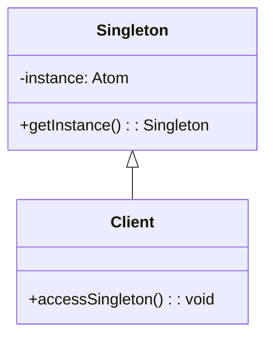

## 6.4. Singleton Pattern and Managing Global State

### Introduction

The Singleton Pattern is a well-known design pattern in object-oriented programming that ensures a class has only one instance and provides a global point of access to it. While this pattern is prevalent in languages like Java and C++, its application in Clojure, a functional programming language, requires a different approach due to Clojure's emphasis on immutability and statelessness.

In this section, we will explore how the Singleton Pattern can be implemented in Clojure, the challenges of managing global state in a functional paradigm, and alternative approaches such as dependency injection. We will also discuss the use of Atoms and Vars to hold singleton instances and the potential drawbacks of using singletons in functional programming.

### Understanding the Singleton Pattern

#### Intent

The Singleton Pattern is designed to restrict the instantiation of a class to a single object. This is useful when exactly one object is needed to coordinate actions across the system. Common use cases include configuration objects, logging, and connection pooling.

#### Key Participants

- **Singleton Class**: The class that is responsible for creating and managing its single instance.
- **Client**: The code that accesses the singleton instance.

#### Applicability

Use the Singleton Pattern when:
- There must be exactly one instance of a class, and it must be accessible to clients from a well-known access point.
- The sole instance should be extensible by subclassing, and clients should be able to use an extended instance without modifying their code.

### Singleton Pattern in Clojure

#### Clojure's Approach to Singleton

In Clojure, the Singleton Pattern can be implemented using Atoms or Vars, which are mutable references that can hold a single instance of an object. However, it's important to note that global state is often discouraged in functional programming due to its potential to introduce side effects and make code harder to reason about.

#### Implementing Singleton with Atoms

Atoms in Clojure provide a way to manage shared, synchronous, and independent state. They are ideal for implementing a singleton because they ensure that updates to the state are atomic and consistent.

```clojure
(defonce singleton-instance (atom nil))

(defn get-singleton-instance []
  (if (nil? @singleton-instance)
    (reset! singleton-instance (create-instance))
    @singleton-instance))

(defn create-instance []
  ;; Logic to create the singleton instance
  {:config "This is a singleton instance"})
```

- **`defonce`**: Ensures that the `singleton-instance` is only defined once, even if the code is reloaded.
- **`atom`**: Holds the singleton instance.
- **`reset!`**: Sets the value of the atom if it is currently `nil`.

#### Implementing Singleton with Vars

Vars in Clojure are another way to manage global state. They are dynamic and can be rebound, making them suitable for cases where the singleton instance might need to change during runtime.

```clojure
(def ^:dynamic *singleton-instance* nil)

(defn get-singleton-instance []
  (when (nil? *singleton-instance*)
    (alter-var-root #'*singleton-instance* (constantly (create-instance))))
  *singleton-instance*)

(defn create-instance []
  ;; Logic to create the singleton instance
  {:config "This is a singleton instance"})
```

- **`^:dynamic`**: Marks the var as dynamic, allowing it to be rebound.
- **`alter-var-root`**: Changes the root binding of the var.

### Managing Global State

#### Challenges of Global State

Global state can lead to several issues in software development, particularly in functional programming:

- **Side Effects**: Global state can introduce side effects, making functions impure and harder to test.
- **Concurrency Issues**: Managing global state in a concurrent environment can lead to race conditions and data inconsistencies.
- **Tight Coupling**: Global state can create dependencies between different parts of the code, making it harder to maintain and extend.

#### Alternatives to Singleton

Instead of relying on singletons, consider using dependency injection, which allows you to pass dependencies explicitly to functions or components. This approach promotes loose coupling and makes your code more modular and testable.

```clojure
(defn create-service [config]
  ;; Service logic using the provided config
  {:service-name "MyService" :config config})

(defn main []
  (let [config {:db "localhost" :port 5432}
        service (create-service config)]
    ;; Use the service
    (println "Service started with config:" (:config service))))
```

### Design Considerations

#### When to Use Singletons

- Use singletons when you need a single point of access to a shared resource, such as a configuration or logging service.
- Ensure that the singleton does not introduce unnecessary global state or side effects.

#### Drawbacks of Singletons

- **Testing Difficulties**: Singletons can make unit testing challenging because they introduce hidden dependencies.
- **Inflexibility**: Singletons can make it difficult to change the implementation or configuration of the singleton instance.
- **Concurrency Issues**: Managing a singleton in a concurrent environment requires careful synchronization to avoid race conditions.

### Clojure's Unique Features

Clojure's emphasis on immutability and functional programming provides unique advantages when implementing design patterns like the Singleton Pattern. By leveraging Atoms and Vars, you can manage state in a controlled and consistent manner, while still adhering to functional programming principles.

### Differences and Similarities

While the Singleton Pattern in Clojure shares similarities with its implementation in other languages, such as ensuring a single instance, the use of Atoms and Vars introduces unique considerations. Unlike traditional object-oriented languages, Clojure's functional paradigm encourages minimizing global state and side effects, making dependency injection a more suitable alternative in many cases.

### Visualizing Singleton Pattern in Clojure



**Diagram Description**: This diagram illustrates the relationship between the Singleton class and the Client. The Singleton class manages a single instance using an Atom, while the Client accesses this instance through the `getInstance` method.

### Try It Yourself

Experiment with the provided code examples by modifying the `create-instance` function to return different configurations. Observe how the singleton instance is managed and accessed across different parts of your code.

### References and Links

- [Clojure Documentation on Atoms](https://clojure.org/reference/atoms)
- [Clojure Documentation on Vars](https://clojure.org/reference/vars)
- [Functional Programming Principles](https://en.wikipedia.org/wiki/Functional_programming)

### Knowledge Check

Test your understanding of the Singleton Pattern and managing global state in Clojure with the following quiz.

## **Ready to Test Your Knowledge?**



### What is the primary purpose of the Singleton Pattern?

- [x] To ensure a class has only one instance and provide a global point of access to it.
- [ ] To allow multiple instances of a class to be created.
- [ ] To encapsulate a group of individual factories.
- [ ] To provide a way to create objects without specifying the exact class of object that will be created.

> **Explanation:** The Singleton Pattern is designed to restrict the instantiation of a class to a single object and provide a global point of access to it.

### Which Clojure construct is used to manage shared, synchronous, and independent state?

- [x] Atom
- [ ] Var
- [ ] Ref
- [ ] Agent

> **Explanation:** Atoms in Clojure are used to manage shared, synchronous, and independent state, ensuring atomic updates.

### Why is global state often discouraged in functional programming?

- [x] It can introduce side effects and make code harder to reason about.
- [ ] It simplifies code and makes it easier to maintain.
- [ ] It allows for more flexible code structures.
- [ ] It enhances the performance of functional programs.

> **Explanation:** Global state is discouraged in functional programming because it can introduce side effects, making functions impure and harder to reason about.

### What is a potential drawback of using singletons in a concurrent environment?

- [x] Race conditions and data inconsistencies.
- [ ] Improved performance and scalability.
- [ ] Simplified code structure.
- [ ] Enhanced modularity and testability.

> **Explanation:** Managing a singleton in a concurrent environment can lead to race conditions and data inconsistencies if not properly synchronized.

### Which alternative approach to singletons promotes loose coupling and modularity?

- [x] Dependency Injection
- [ ] Global Variables
- [ ] Static Methods
- [ ] Monolithic Architecture

> **Explanation:** Dependency injection promotes loose coupling and modularity by explicitly passing dependencies to functions or components.

### How can you ensure that a singleton instance is only defined once in Clojure?

- [x] Use `defonce` to define the singleton instance.
- [ ] Use `def` to define the singleton instance.
- [ ] Use `let` to define the singleton instance.
- [ ] Use `fn` to define the singleton instance.

> **Explanation:** `defonce` ensures that a variable is only defined once, even if the code is reloaded, making it suitable for defining singleton instances.

### What is the role of `alter-var-root` in managing singleton instances with Vars?

- [x] It changes the root binding of the var.
- [ ] It creates a new var instance.
- [ ] It resets the value of the var to `nil`.
- [ ] It locks the var for thread safety.

> **Explanation:** `alter-var-root` is used to change the root binding of a var, allowing you to manage singleton instances dynamically.

### Which Clojure feature allows for dynamic rebinding of vars?

- [x] ^:dynamic
- [ ] ^:static
- [ ] ^:immutable
- [ ] ^:transient

> **Explanation:** The `^:dynamic` metadata allows vars to be dynamically rebound, making them suitable for managing global state.

### What is a common use case for the Singleton Pattern?

- [x] Configuration objects and logging services.
- [ ] Creating multiple instances of a class.
- [ ] Encapsulating a group of related classes.
- [ ] Implementing complex algorithms.

> **Explanation:** The Singleton Pattern is commonly used for configuration objects and logging services, where a single instance is required.

### True or False: In Clojure, Atoms are used to manage asynchronous state.

- [ ] True
- [x] False

> **Explanation:** Atoms in Clojure are used to manage synchronous, independent state, ensuring atomic updates.



### Conclusion

The Singleton Pattern in Clojure presents unique challenges and opportunities due to the language's functional nature. While Atoms and Vars provide mechanisms to implement singletons, it's crucial to consider the implications of global state and explore alternatives like dependency injection. As you continue your journey with Clojure, remember to embrace its functional principles and leverage its powerful features to write clean, efficient, and maintainable code.
