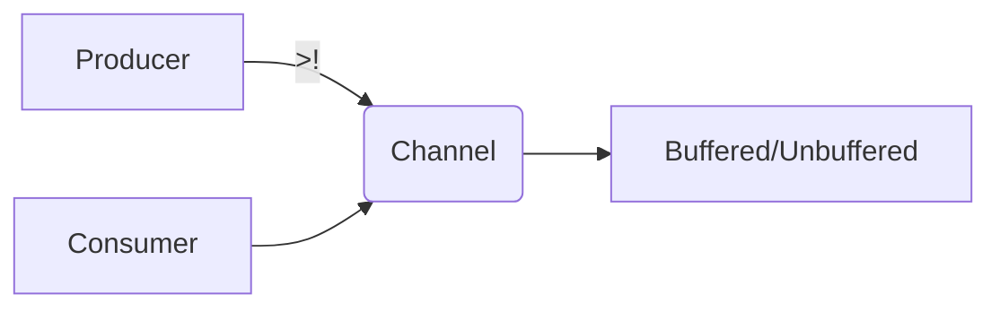

## 6.4 Core.async Channels in Clojure

Concurrency is a fundamental aspect of modern software development, allowing applications to perform multiple tasks simultaneously. In Clojure, the `core.async` library provides a powerful abstraction for managing concurrency through channels, enabling asynchronous communication between threads. This section delves into the mechanics of core.async channels, illustrating how they can be used to write efficient and scalable concurrent programs.

### Introduction

Core.async channels in Clojure offer a way to handle asynchronous communication between different parts of a program. They allow for the decoupling of producers and consumers, facilitating a more modular and maintainable codebase. Channels can be thought of as conduits through which data flows, and they can be either buffered or unbuffered, affecting how data is managed and processed.

### Detailed Explanation

#### Core.async Basics

The `core.async` library introduces the concept of channels, which are used to pass messages between different threads or processes. Channels can be created using the `chan` function, and data can be sent to and received from these channels using operations like `>!`, `<!`, `put!`, and `take!`.

```clojure
(require '[clojure.core.async :refer [chan go <! >! put! take!]])
```

#### Creating and Using Channels

To create a channel, you simply call the `chan` function. This can be done with or without specifying a buffer size.

```clojure
(def ch (chan)) ; Unbuffered channel
(def buffered-ch (chan 10)) ; Buffered channel with a capacity of 10
```

#### Asynchronous Communication with `go` Blocks

The `go` macro is a cornerstone of core.async, allowing you to write asynchronous code that appears synchronous. Within a `go` block, you can perform operations like sending (`>!`) and receiving (`<!`) messages on channels.

```clojure
(go (>! ch "Hello, World!")) ; Asynchronously send a message
(go (let [msg (<! ch)] ; Asynchronously receive a message
      (println "Received:" msg)))
```

#### Continuous Processing with `go-loop`

For continuous processing of messages, `go-loop` is an invaluable construct. It allows you to repeatedly take messages from a channel and process them.

```clojure
(go-loop []
  (when-some [msg (<! ch)]
    (println "Processing:" msg)
    (recur)))
```

#### Buffered vs. Unbuffered Channels

Buffered channels can hold a specified number of messages, allowing producers to continue sending messages even if consumers are not ready to receive them immediately. Unbuffered channels, on the other hand, require a consumer to be ready to receive a message before a producer can send one.

```clojure
(def buffered-ch (chan 5)) ; Buffered channel with a capacity of 5
```

#### Closing Channels

Once a channel is no longer needed, it should be closed to prevent further messages from being sent. This is done using the `close!` function.

```clojure
(close! ch)
```

#### Selecting Over Multiple Channels with `alts!`

The `alts!` function allows you to wait for messages on multiple channels, handling whichever one is ready first.

```clojure
(go (let [[msg ch] (alts! [ch1 ch2])]
      (println "Received from channel:" ch "Message:" msg)))
```

### Visual Aids

#### Conceptual Diagram of Core.async Channels



### Code Examples

Here's a practical example demonstrating the use of core.async channels in a simple producer-consumer scenario:

```clojure
(require '[clojure.core.async :refer [chan go <! >! close!]])

(defn producer [ch]
  (go
    (dotimes [i 5]
      (>! ch i)
      (println "Produced:" i))
    (close! ch)))

(defn consumer [ch]
  (go-loop []
    (when-some [v (<! ch)]
      (println "Consumed:" v)
      (recur))))

(let [ch (chan)]
  (producer ch)
  (consumer ch))
```

### Use Cases

- **Data Pipelines:** Core.async channels are ideal for building data pipelines where data flows through multiple stages of processing.
- **Event Handling:** Channels can be used to manage events in a system, decoupling event producers from consumers.
- **Concurrency Control:** By using channels, you can control the concurrency level of your application, ensuring that resources are used efficiently.

### Advantages and Disadvantages

**Advantages:**
- **Decoupling:** Channels decouple producers and consumers, leading to more modular code.
- **Concurrency:** Simplifies the management of concurrent tasks.
- **Flexibility:** Supports both buffered and unbuffered communication.

**Disadvantages:**
- **Complexity:** Can introduce complexity in understanding and managing channel states.
- **Debugging:** Debugging asynchronous code can be challenging.

### Best Practices

- **Use Buffered Channels Wisely:** Choose the right buffer size based on your application's throughput requirements.
- **Close Channels:** Always close channels when they are no longer needed to avoid resource leaks.
- **Error Handling:** Implement proper error handling within `go` blocks to manage exceptions gracefully.

### Comparisons

Core.async channels can be compared to other concurrency models like Java's `CompletableFuture` or JavaScript's `Promises`. However, channels offer a more flexible and composable approach to concurrency, especially in a functional programming context.

### Conclusion

Core.async channels in Clojure provide a robust framework for managing concurrency and asynchronous communication. By leveraging channels, you can build scalable and efficient applications that handle multiple tasks concurrently. As you explore core.async, consider the best practices and use cases discussed here to maximize the benefits of this powerful library.

## Quiz Time!



### What is the primary purpose of core.async channels in Clojure?

- [x] To facilitate asynchronous communication between threads
- [ ] To manage synchronous I/O operations
- [ ] To replace all concurrency models in Clojure
- [ ] To handle exceptions in a program

> **Explanation:** Core.async channels are designed to enable asynchronous communication between different parts of a program, allowing for concurrent processing.

### How do you create an unbuffered channel in Clojure?

- [x] `(chan)`
- [ ] `(chan 10)`
- [ ] `(unbuffered-chan)`
- [ ] `(create-channel)`

> **Explanation:** An unbuffered channel is created using the `chan` function without specifying a buffer size.

### What is the role of the `go` macro in core.async?

- [x] To allow writing asynchronous code that looks synchronous
- [ ] To create new threads
- [ ] To handle exceptions
- [ ] To manage memory allocation

> **Explanation:** The `go` macro enables writing asynchronous code in a way that appears synchronous, simplifying the handling of concurrency.

### How can you continuously process messages from a channel?

- [x] Using `go-loop`
- [ ] Using `while-loop`
- [ ] Using `for-loop`
- [ ] Using `async-loop`

> **Explanation:** `go-loop` is used to continuously process messages from a channel, allowing for repeated asynchronous operations.

### What is the difference between buffered and unbuffered channels?

- [x] Buffered channels can hold messages temporarily, while unbuffered channels require immediate consumption.
- [ ] Buffered channels are faster than unbuffered channels.
- [ ] Unbuffered channels can hold more messages than buffered channels.
- [ ] There is no difference between buffered and unbuffered channels.

> **Explanation:** Buffered channels have a capacity to hold messages temporarily, allowing producers to send messages even if consumers are not ready.

### How do you close a channel in Clojure?

- [x] `(close! ch)`
- [ ] `(terminate ch)`
- [ ] `(end ch)`
- [ ] `(shutdown ch)`

> **Explanation:** The `close!` function is used to close a channel, preventing further messages from being sent.

### What function allows you to wait for messages on multiple channels?

- [x] `alts!`
- [ ] `select!`
- [ ] `wait!`
- [ ] `listen!`

> **Explanation:** The `alts!` function allows you to wait for messages on multiple channels, handling whichever one is ready first.

### Which of the following is a disadvantage of using core.async channels?

- [x] Debugging asynchronous code can be challenging.
- [ ] Channels are not flexible.
- [ ] Channels are not suitable for concurrent tasks.
- [ ] Channels increase code coupling.

> **Explanation:** Debugging asynchronous code can be more complex due to the nature of concurrent operations and state management.

### What is a common use case for core.async channels?

- [x] Building data pipelines
- [ ] Managing synchronous I/O
- [ ] Handling single-threaded operations
- [ ] Replacing all concurrency models

> **Explanation:** Core.async channels are commonly used for building data pipelines where data flows through multiple stages of processing.

### True or False: Core.async channels can only be used in Clojure.

- [ ] True
- [x] False

> **Explanation:** Core.async channels can also be used in ClojureScript, enabling asynchronous communication in both Clojure and ClojureScript environments.


