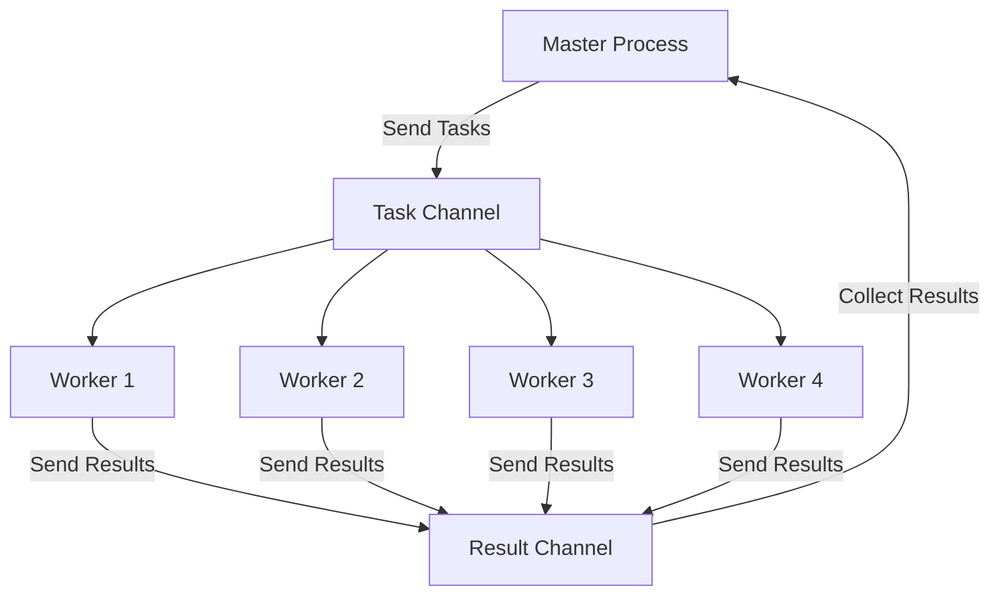

## 6.5 Master-Worker Pattern in Clojure

Concurrency is a critical aspect of modern software development, enabling applications to perform multiple tasks simultaneously, thus improving performance and responsiveness. The Master-Worker pattern is a well-established concurrency design pattern that distributes tasks among multiple worker processes to enhance performance and scalability. In this article, we will delve into the Master-Worker pattern in Clojure, utilizing the powerful `core.async` library to manage task distribution and result collection efficiently.

### Introduction to the Master-Worker Pattern

The Master-Worker pattern involves a master process that delegates tasks to multiple worker processes. Each worker processes a task independently and returns the result to the master. This pattern is particularly useful in scenarios where tasks can be executed concurrently, such as data processing, parallel computations, and distributed systems.

### Detailed Explanation

#### Components of the Master-Worker Pattern

1. **Master Process:** Responsible for distributing tasks to workers and collecting results.
2. **Worker Processes:** Execute tasks independently and return results to the master.
3. **Task Queue:** A channel through which tasks are sent from the master to the workers.
4. **Result Collection:** A channel through which results are sent back from the workers to the master.

#### Workflow

1. **Task Distribution:** The master sends tasks to the task queue.
2. **Task Execution:** Workers retrieve tasks from the task queue, process them, and send results to the result collection channel.
3. **Result Aggregation:** The master collects results from the result collection channel and processes them as needed.

### Implementing the Master-Worker Pattern in Clojure

To implement the Master-Worker pattern in Clojure, we will use the `core.async` library, which provides facilities for asynchronous programming using channels and goroutines.

#### Setting Up Channels for Task Queue and Results

First, we define channels for task distribution and result collection:

```clojure
(require '[clojure.core.async :refer [chan go-loop <! >! >!! close!]])

(def task-ch (chan))
(def result-ch (chan))
```

#### Implementing Worker Processes

Next, we create worker processes that listen for tasks on the task channel, process them, and send results to the result channel:

```clojure
(defn process-task [task]
  ;; Simulate task processing
  (Thread/sleep 100) ; Simulate some work
  (* task task)) ; Example task: squaring a number

(def num-workers 4)

(dotimes [_ num-workers]
  (go-loop []
    (when-some [task (<! task-ch)]
      (let [result (process-task task)]
        (>! result-ch result))
      (recur))))
```

#### Master Sends Tasks to Workers

The master process sends tasks to the workers by placing them on the task channel:

```clojure
(def tasks (range 10)) ; Example tasks: numbers 0 to 9

(doseq [task tasks]
  (>!! task-ch task))
```

#### Master Collects Results

The master collects results from the result channel and processes them:

```clojure
(defn process-results [results]
  (println "Processed results:" results))

(go-loop [results []]
  (if (< (count results) (count tasks))
    (let [result (<! result-ch)]
      (recur (conj results result)))
    (do
      (process-results results)
      (close! task-ch)
      (close! result-ch))))
```

### Visualizing the Master-Worker Pattern

To better understand the flow of the Master-Worker pattern, let's visualize the process using a Mermaid.js diagram:



### Best Practices

- **Channel Management:** Ensure channels are properly closed after processing to avoid resource leaks.
- **Error Handling:** Implement error handling within worker processes to manage exceptions gracefully.
- **Scalability:** Adjust the number of workers based on the workload and available resources to optimize performance.

### Advantages and Disadvantages

#### Advantages

- **Parallel Processing:** Tasks are processed concurrently, improving throughput.
- **Scalability:** Easily scale by adding more workers.
- **Decoupling:** Separation of task distribution and processing logic.

#### Disadvantages

- **Complexity:** Requires careful management of channels and worker processes.
- **Overhead:** Context switching and channel communication may introduce overhead.

### Use Cases

- **Data Processing Pipelines:** Parallelize data transformations and aggregations.
- **Web Crawling:** Distribute URL fetching and parsing tasks.
- **Image Processing:** Apply filters or transformations to large sets of images concurrently.

### Conclusion

The Master-Worker pattern is a powerful tool for leveraging concurrency in Clojure applications. By using `core.async` channels, we can efficiently distribute tasks and collect results, enhancing performance and scalability. This pattern is particularly useful in scenarios where tasks can be executed independently and concurrently.

## Quiz Time!



### What is the primary purpose of the Master-Worker pattern?

- [x] To distribute tasks among multiple worker processes to improve performance.
- [ ] To ensure tasks are executed sequentially.
- [ ] To reduce the number of tasks in a system.
- [ ] To simplify the user interface.

> **Explanation:** The Master-Worker pattern is designed to distribute tasks among multiple worker processes, allowing for concurrent execution and improved performance.

### Which Clojure library is used to implement the Master-Worker pattern in this article?

- [x] core.async
- [ ] clojure.spec
- [ ] clojure.test
- [ ] clojure.java.io

> **Explanation:** The `core.async` library is used to implement the Master-Worker pattern by providing channels for asynchronous communication between the master and worker processes.

### What is the role of the master process in the Master-Worker pattern?

- [x] To distribute tasks and collect results.
- [ ] To execute tasks independently.
- [ ] To manage database connections.
- [ ] To handle user input.

> **Explanation:** The master process is responsible for distributing tasks to worker processes and collecting the results once tasks are completed.

### How do worker processes communicate results back to the master?

- [x] By sending results through a result channel.
- [ ] By writing results to a file.
- [ ] By updating a shared database.
- [ ] By printing results to the console.

> **Explanation:** Worker processes send results back to the master by placing them on a result channel, which the master listens to for collecting results.

### What is a potential disadvantage of the Master-Worker pattern?

- [x] Complexity in managing channels and worker processes.
- [ ] Inability to scale with more workers.
- [ ] Lack of parallel processing capabilities.
- [ ] Difficulty in implementing error handling.

> **Explanation:** The Master-Worker pattern can introduce complexity in managing channels and worker processes, requiring careful design and implementation.

### What is the purpose of closing channels after processing is complete?

- [x] To avoid resource leaks.
- [ ] To speed up task execution.
- [ ] To increase the number of workers.
- [ ] To simplify the code.

> **Explanation:** Closing channels after processing is complete is important to avoid resource leaks and ensure that system resources are managed efficiently.

### In the provided code example, what does the `process-task` function do?

- [x] Simulates task processing by squaring a number.
- [ ] Sends tasks to the task channel.
- [ ] Collects results from the result channel.
- [ ] Closes the task and result channels.

> **Explanation:** The `process-task` function simulates task processing by squaring a number, representing a simple task that a worker might perform.

### How can the number of workers be adjusted in the implementation?

- [x] By changing the `num-workers` variable.
- [ ] By modifying the task channel buffer size.
- [ ] By altering the task processing logic.
- [ ] By closing the result channel earlier.

> **Explanation:** The number of workers can be adjusted by changing the `num-workers` variable, which determines how many worker processes are created.

### What is a common use case for the Master-Worker pattern?

- [x] Data processing pipelines.
- [ ] User interface design.
- [ ] Database schema migration.
- [ ] Logging and monitoring.

> **Explanation:** A common use case for the Master-Worker pattern is data processing pipelines, where tasks can be processed in parallel to improve throughput.

### True or False: The Master-Worker pattern can only be used in Clojure.

- [ ] True
- [x] False

> **Explanation:** False. The Master-Worker pattern is a general concurrency pattern that can be implemented in various programming languages, not just Clojure.


