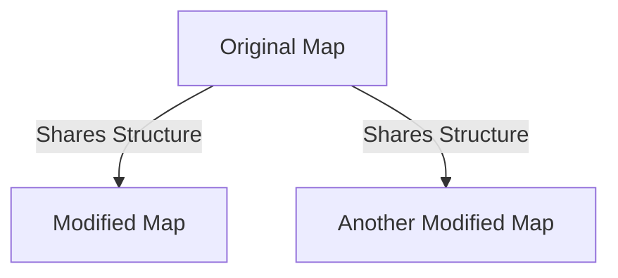

## 6.5. Prototype Pattern with Cloneable Data

### Introduction

The Prototype Pattern is a creational design pattern that allows you to create new objects by copying an existing object, known as the prototype. This pattern is particularly useful when the cost of creating a new instance of an object is more expensive than copying an existing one. In Clojure, the Prototype Pattern is naturally expressed through its immutable data structures and functions that clone and modify data efficiently.

### Intent

The intent of the Prototype Pattern is to reduce the overhead of creating new instances by cloning existing ones. This pattern is especially beneficial in scenarios where object creation is resource-intensive or when the system needs to create many similar objects.

### Key Participants

- **Prototype**: The original object that is cloned to create new instances.
- **Client**: The entity that requests a new object by cloning the prototype.

### Applicability

Use the Prototype Pattern when:

- Object creation is costly or complex.
- You need to create many instances of a class with only a few different configurations.
- You want to avoid subclasses of an object creator in the client application, like a factory method.

### Clojure's Unique Features

Clojure's immutable data structures and functional programming paradigm make it an ideal language for implementing the Prototype Pattern. The language's core functions allow for efficient cloning and modification of data, leveraging structural sharing to minimize memory usage.

### Cloning and Modifying Data Structures in Clojure

In Clojure, data structures are immutable, meaning they cannot be changed once created. Instead, when you "modify" a data structure, you create a new version of it with the desired changes. This is achieved through structural sharing, where the new data structure shares parts of the old one, making the process efficient.

#### Example: Cloning and Modifying a Map

Let's explore how to clone and modify a map in Clojure:

```clojure
(def original-map {:name "Alice" :age 30 :city "Wonderland"})

;; Clone and modify the map
(def modified-map (assoc original-map :age 31 :city "Looking Glass"))

;; Output the original and modified maps
(println "Original Map:" original-map)
(println "Modified Map:" modified-map)
```

In this example, the `assoc` function is used to create a new map with updated values for `:age` and `:city`. The original map remains unchanged, demonstrating the immutability of Clojure's data structures.

### Creating New Instances Based on Existing Ones

The Prototype Pattern in Clojure can be effectively used to create new instances based on existing ones. This is particularly useful in scenarios where you need to create variations of an object with minor differences.

#### Example: Creating Variations of a Prototype

Consider a scenario where we have a prototype for a user profile, and we want to create variations of it:

```clojure
(def user-prototype {:username "user123" :email "user@example.com" :role "member"})

;; Create a new user with a different role
(def admin-user (assoc user-prototype :role "admin"))

;; Create another user with a different email
(def guest-user (assoc user-prototype :email "guest@example.com"))

;; Output the variations
(println "Admin User:" admin-user)
(println "Guest User:" guest-user)
```

Here, we use the `assoc` function to create new user profiles based on the `user-prototype`, modifying only the necessary fields.

### Efficiency Benefits Due to Structural Sharing

One of the significant advantages of using the Prototype Pattern in Clojure is the efficiency gained through structural sharing. When you clone and modify data structures, Clojure reuses parts of the original structure, reducing memory consumption and improving performance.

#### Visualizing Structural Sharing



In this diagram, the original map shares its structure with the modified maps, illustrating how Clojure's data structures are optimized for immutability and efficiency.

### Ease of Prototyping Objects in an Immutable Context

Prototyping objects in Clojure is straightforward due to its immutable nature. The language's core functions provide a simple and efficient way to create variations of objects without the risk of unintended side effects.

#### Example: Prototyping a Configuration Object

Let's prototype a configuration object for different environments:

```clojure
(def base-config {:db-url "jdbc:postgresql://localhost/dev" :cache-size 256})

;; Prototype for production environment
(def prod-config (assoc base-config :db-url "jdbc:postgresql://prod-server/prod" :cache-size 512))

;; Prototype for testing environment
(def test-config (assoc base-config :db-url "jdbc:postgresql://localhost/test" :cache-size 128))

;; Output the configurations
(println "Production Config:" prod-config)
(println "Testing Config:" test-config)
```

In this example, we start with a `base-config` and create specific configurations for production and testing environments by modifying only the necessary fields.

### Design Considerations

When using the Prototype Pattern in Clojure, consider the following:

- **Immutability**: Embrace Clojure's immutable data structures to ensure thread safety and avoid side effects.
- **Structural Sharing**: Leverage structural sharing to optimize memory usage and performance.
- **Function Composition**: Use Clojure's rich set of core functions to compose and transform data efficiently.

### Differences and Similarities with Other Patterns

The Prototype Pattern is often compared to the Factory Method Pattern. While both patterns deal with object creation, the Prototype Pattern focuses on cloning existing objects, whereas the Factory Method Pattern involves creating new instances through a factory interface.

### Try It Yourself

To deepen your understanding of the Prototype Pattern in Clojure, try modifying the code examples provided. Experiment with different data structures, such as vectors or sets, and observe how Clojure's immutability and structural sharing work in practice.

### References and Further Reading

- [Clojure Documentation](https://clojure.org/reference/data_structures)
- [Design Patterns: Elements of Reusable Object-Oriented Software](https://en.wikipedia.org/wiki/Design_Patterns)
- [Functional Programming in Clojure](https://www.braveclojure.com/)

### Knowledge Check

To reinforce your understanding of the Prototype Pattern in Clojure, consider the following questions and exercises.

## **Ready to Test Your Knowledge?**



### What is the primary intent of the Prototype Pattern?

- [x] To create new objects by cloning existing ones
- [ ] To define a family of algorithms
- [ ] To separate the construction of a complex object from its representation
- [ ] To provide a way to access the elements of an aggregate object sequentially

> **Explanation:** The Prototype Pattern's primary intent is to create new objects by cloning existing ones, reducing the overhead of creating new instances from scratch.

### How does Clojure achieve efficient cloning of data structures?

- [x] Through structural sharing
- [ ] By using mutable data structures
- [ ] By duplicating all elements
- [ ] By using a global state

> **Explanation:** Clojure achieves efficient cloning through structural sharing, where new data structures share parts of the original, minimizing memory usage.

### Which Clojure function is commonly used to modify maps?

- [x] `assoc`
- [ ] `conj`
- [ ] `dissoc`
- [ ] `merge`

> **Explanation:** The `assoc` function is commonly used to modify maps by creating a new map with updated key-value pairs.

### What is a key benefit of using immutable data structures in Clojure?

- [x] Thread safety
- [ ] Increased memory usage
- [ ] Slower performance
- [ ] Global state management

> **Explanation:** Immutable data structures in Clojure provide thread safety, as they cannot be changed once created, preventing unintended side effects.

### In Clojure, what does the `assoc` function return?

- [x] A new map with the specified updates
- [ ] The original map with updates
- [ ] A list of keys
- [ ] A vector of values

> **Explanation:** The `assoc` function returns a new map with the specified updates, leaving the original map unchanged.

### What is structural sharing?

- [x] A technique where new data structures share parts of the original
- [ ] A method of copying all elements
- [ ] A way to manage global state
- [ ] A pattern for creating new objects

> **Explanation:** Structural sharing is a technique where new data structures share parts of the original, optimizing memory usage and performance.

### Which pattern is often compared to the Prototype Pattern?

- [x] Factory Method Pattern
- [ ] Singleton Pattern
- [ ] Observer Pattern
- [ ] Strategy Pattern

> **Explanation:** The Factory Method Pattern is often compared to the Prototype Pattern, as both deal with object creation but in different ways.

### What is the role of the client in the Prototype Pattern?

- [x] To request a new object by cloning the prototype
- [ ] To define the prototype
- [ ] To modify the prototype
- [ ] To manage the lifecycle of the prototype

> **Explanation:** In the Prototype Pattern, the client requests a new object by cloning the prototype, utilizing the existing structure.

### True or False: Clojure's immutability makes it difficult to implement the Prototype Pattern.

- [ ] True
- [x] False

> **Explanation:** False. Clojure's immutability makes it easy to implement the Prototype Pattern, as it naturally supports cloning and modification of data structures.

### Which of the following is a benefit of using the Prototype Pattern in Clojure?

- [x] Reduced memory usage due to structural sharing
- [ ] Increased complexity in object creation
- [ ] Dependence on global state
- [ ] Slower performance

> **Explanation:** The Prototype Pattern in Clojure benefits from reduced memory usage due to structural sharing, making it efficient and performant.



Remember, this is just the beginning. As you progress, you'll build more complex and interactive applications using Clojure's powerful features. Keep experimenting, stay curious, and enjoy the journey!
