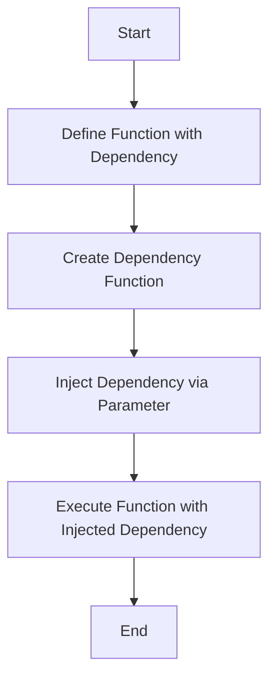

## 6.6. Dependency Injection via Higher-Order Functions

In this section, we delve into the concept of Dependency Injection (DI) and how it can be effectively implemented in Clojure using higher-order functions. This approach leverages the functional programming paradigm to achieve a clean, modular, and testable codebase. Let's explore the benefits, techniques, and practical examples of using higher-order functions for dependency injection in Clojure.

### Understanding Dependency Injection

**Dependency Injection** is a design pattern used to achieve Inversion of Control (IoC) between classes and their dependencies. Instead of a class creating its dependencies, they are passed to it from the outside. This pattern promotes loose coupling and enhances testability by allowing dependencies to be easily swapped out or mocked.

#### Benefits of Dependency Injection

- **Decoupling**: By injecting dependencies, components become less dependent on specific implementations, making them more modular and easier to maintain.
- **Testability**: Dependencies can be easily mocked or stubbed, facilitating unit testing.
- **Flexibility**: Different implementations of a dependency can be injected without changing the dependent code.
- **Configuration Management**: Dependencies can be configured externally, allowing for different configurations in different environments.

### Injecting Dependencies Using Function Parameters

In Clojure, functions are first-class citizens, and higher-order functions (functions that take other functions as arguments or return them) are a natural fit for dependency injection. By passing dependencies as function parameters, we can achieve a form of dependency injection that is both simple and powerful.

#### Example: Basic Dependency Injection

Consider a simple example where we have a function that processes data and requires a logging mechanism. Instead of hardcoding the logger, we can pass it as a parameter:

```clojure
(defn process-data [logger data]
  (logger "Processing data...")
  ;; Process the data
  (logger "Data processed successfully.")
  ;; Return processed data
  data)

(defn console-logger [message]
  (println message))

;; Injecting the console-logger dependency
(process-data console-logger "Sample data")
```

In this example, `process-data` is a function that takes a `logger` as a dependency. We can easily swap `console-logger` with another logging mechanism without changing the `process-data` function.

### Higher-Order Functions and Partial Application

Higher-order functions allow us to abstract and encapsulate behavior, making them ideal for dependency injection. We can use them to create more flexible and reusable components.

#### Example: Using Higher-Order Functions

Let's enhance our previous example by using a higher-order function to create a logger:

```clojure
(defn create-logger [prefix]
  (fn [message]
    (println (str prefix ": " message))))

(def file-logger (create-logger "FileLogger"))
(def db-logger (create-logger "DBLogger"))

;; Injecting different loggers
(process-data file-logger "File data")
(process-data db-logger "Database data")
```

Here, `create-logger` is a higher-order function that returns a logger function with a specific prefix. This approach allows us to easily create and inject different loggers.

#### Partial Application

Partial application is another technique that can be used for dependency injection. It involves fixing a few arguments of a function and producing another function of smaller arity.

```clojure
(defn process-data-with-logger [logger]
  (fn [data]
    (logger "Processing data...")
    ;; Process the data
    (logger "Data processed successfully.")
    ;; Return processed data
    data))

(def process-with-console-logger (process-data-with-logger console-logger))

;; Using the partially applied function
(process-with-console-logger "Sample data")
```

In this example, `process-data-with-logger` returns a new function that has the `logger` dependency partially applied. This technique simplifies the function signature for the consumer.

### Advantages Over Traditional DI Frameworks

Using higher-order functions for dependency injection in Clojure offers several advantages over traditional DI frameworks:

- **Simplicity**: There is no need for complex configuration files or frameworks. Dependencies are passed explicitly, making the code more readable and maintainable.
- **Transparency**: The dependencies are visible in the function signature, making it clear what each function requires.
- **Flexibility**: Functions can be easily composed and reused, allowing for more flexible and dynamic dependency management.
- **Performance**: There is no overhead of a DI container, resulting in better performance.

### Visualizing Dependency Injection with Higher-Order Functions

To better understand how dependency injection works with higher-order functions, let's visualize the process using a flowchart.



**Figure 1**: Flowchart illustrating the process of dependency injection using higher-order functions in Clojure.

### Clojure's Unique Features

Clojure's functional nature and emphasis on immutability make it particularly well-suited for dependency injection via higher-order functions. The language's support for first-class functions and closures allows for elegant and concise dependency management.

- **First-Class Functions**: Functions can be passed around as values, making it easy to inject them as dependencies.
- **Closures**: Functions can capture and retain access to their lexical scope, allowing for flexible dependency management.
- **Immutability**: Immutable data structures ensure that dependencies remain consistent and predictable.

### Differences and Similarities with Other Patterns

Dependency injection via higher-order functions is often compared to other patterns like the Factory Pattern or the Strategy Pattern. While these patterns also involve passing behavior or dependencies, DI focuses on decoupling and flexibility.

- **Factory Pattern**: Focuses on creating objects, whereas DI focuses on injecting dependencies.
- **Strategy Pattern**: Involves selecting an algorithm at runtime, similar to DI, but DI is more about decoupling dependencies.

### Design Considerations

When using dependency injection via higher-order functions, consider the following:

- **Function Signature Clarity**: Ensure that function signatures clearly indicate the dependencies required.
- **Avoid Overuse**: While DI is powerful, overusing it can lead to complex and hard-to-understand code.
- **Balance**: Find a balance between flexibility and simplicity. Not every function needs to have all dependencies injected.

### Try It Yourself

To get hands-on experience, try modifying the examples provided:

1. **Create a new logger** that writes to a file and inject it into the `process-data` function.
2. **Experiment with partial application** by creating a function that processes data with a fixed logger and additional parameters.
3. **Implement a new dependency** (e.g., a database connection) and inject it into a function that requires it.

### Knowledge Check

Before we conclude, let's reinforce what we've learned with a few questions.

- What are the benefits of using dependency injection in Clojure?
- How can higher-order functions be used for dependency injection?
- What are the advantages of using higher-order functions over traditional DI frameworks?

### Summary

In this section, we've explored how dependency injection can be achieved in Clojure using higher-order functions. This approach offers simplicity, transparency, and flexibility, making it a powerful tool for creating modular and testable code. By leveraging Clojure's functional features, we can inject dependencies in a way that is both elegant and efficient.

Remember, this is just the beginning. As you progress, you'll discover more ways to apply these concepts to build robust and maintainable applications. Keep experimenting, stay curious, and enjoy the journey!

## **Ready to Test Your Knowledge?**



### What is a primary benefit of dependency injection?

- [x] Decoupling components
- [ ] Increasing code complexity
- [ ] Reducing code readability
- [ ] Hardcoding dependencies

> **Explanation:** Dependency injection promotes decoupling, making components less dependent on specific implementations.

### How can higher-order functions facilitate dependency injection in Clojure?

- [x] By passing functions as parameters
- [ ] By using global variables
- [ ] By hardcoding dependencies
- [ ] By using macros

> **Explanation:** Higher-order functions allow dependencies to be passed as parameters, promoting flexibility and modularity.

### What is a key advantage of using higher-order functions for DI over traditional frameworks?

- [x] Simplicity and transparency
- [ ] Increased configuration complexity
- [ ] Reduced performance
- [ ] Dependency on external libraries

> **Explanation:** Higher-order functions provide a simple and transparent way to manage dependencies without the need for complex frameworks.

### What is partial application in the context of dependency injection?

- [x] Fixing some arguments of a function to create a new function
- [ ] Using macros to inject dependencies
- [ ] Hardcoding dependencies in a function
- [ ] Using global state for dependencies

> **Explanation:** Partial application involves fixing some arguments of a function, creating a new function with fewer parameters.

### Which Clojure feature is particularly useful for dependency injection?

- [x] First-class functions
- [ ] Global variables
- [ ] Macros
- [ ] Dynamic typing

> **Explanation:** First-class functions allow functions to be passed as values, making them ideal for dependency injection.

### What is a potential downside of overusing dependency injection?

- [x] Increased code complexity
- [ ] Improved testability
- [ ] Enhanced flexibility
- [ ] Better performance

> **Explanation:** Overusing dependency injection can lead to complex and hard-to-understand code.

### How does Clojure's immutability benefit dependency injection?

- [x] Ensures consistent and predictable dependencies
- [ ] Increases code complexity
- [ ] Reduces code readability
- [ ] Hardcodes dependencies

> **Explanation:** Immutability ensures that dependencies remain consistent and predictable, enhancing reliability.

### What is a common pattern that is often compared to dependency injection?

- [x] Strategy Pattern
- [ ] Singleton Pattern
- [ ] Observer Pattern
- [ ] Adapter Pattern

> **Explanation:** The Strategy Pattern is often compared to dependency injection as both involve passing behavior or dependencies.

### What should be considered when designing functions with dependency injection?

- [x] Function signature clarity
- [ ] Hardcoding dependencies
- [ ] Using global variables
- [ ] Avoiding function parameters

> **Explanation:** Function signatures should clearly indicate the dependencies required for clarity and maintainability.

### True or False: Dependency injection via higher-order functions requires a DI container.

- [x] False
- [ ] True

> **Explanation:** Dependency injection via higher-order functions does not require a DI container, as dependencies are passed explicitly.


