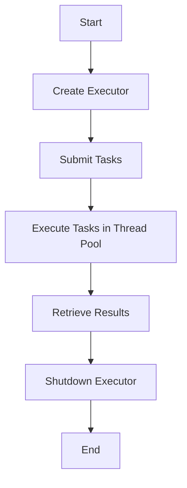

## 6.6 Thread Pools and Executors in Clojure

In modern software development, efficiently managing concurrency is crucial for building responsive and scalable applications. Clojure, being a functional language that runs on the Java Virtual Machine (JVM), allows developers to harness Java's robust concurrency utilities, such as `ExecutorService`, to manage thread pools effectively. This section delves into how Clojure developers can utilize thread pools and executors to optimize task execution, reduce overhead, and improve application performance.

### Introduction

Thread pools and executors are essential tools for managing concurrent execution in applications. By reusing a pool of threads to execute tasks, we can significantly reduce the overhead associated with thread creation and destruction. This approach not only enhances performance but also provides better control over resource utilization.

### Detailed Explanation

#### What are Thread Pools and Executors?

A thread pool is a collection of pre-instantiated reusable threads that can be used to execute tasks concurrently. Executors are higher-level constructs that manage these thread pools, providing a simple interface for task submission and execution.

**Key Benefits:**
- **Resource Efficiency:** Reuses threads, reducing the cost of thread creation.
- **Performance Improvement:** Minimizes latency by keeping threads alive and ready to execute tasks.
- **Scalability:** Manages a large number of concurrent tasks without overwhelming system resources.

#### Integrating Java's ExecutorService in Clojure

Clojure's interoperability with Java allows seamless integration with Java's concurrency utilities. The `ExecutorService` interface in Java provides methods to manage thread pools and execute tasks asynchronously.

**Importing Executors:**

To use Java's `ExecutorService`, we first need to import the necessary classes:

```clojure
(import 'java.util.concurrent.Executors)
```

**Creating a Fixed Thread Pool:**

A fixed thread pool is a pool with a fixed number of threads. It is suitable for scenarios where the number of concurrent tasks is known and stable.

```clojure
(def executor (Executors/newFixedThreadPool num-threads))
```

**Submitting Tasks to the Executor:**

Tasks can be submitted to the executor for asynchronous execution. Each task is wrapped in a `Callable` to allow it to return a result.

```clojure
(def futures
  (map (fn [task]
         (.submit executor ^Callable #(process-task task)))
       tasks))
```

**Retrieving Future Results:**

The `Future` objects returned by the executor can be used to retrieve the results of the tasks once they are completed.

```clojure
(def results
  (map #(.get %) futures))
```

**Shutting Down the Executor:**

It is important to shut down the executor after use to free up resources.

```clojure
(.shutdown executor)
```

### Visualizing the Workflow

Below is a conceptual diagram illustrating the workflow of using a thread pool with an executor in Clojure:



### Advanced Usage: Custom Executors and `future-call`

Clojure provides the `future-call` function, which can be customized to use a specific executor. This allows for more control over task execution.

```clojure
(defn future-with-executor [callable]
  (future-call #(callable) :executor executor))
```

### Parallel Processing with `pmap`

For CPU-bound tasks, Clojure's `pmap` function provides a simple way to achieve parallel processing using a default thread pool. It is ideal for tasks that can be processed independently.

```clojure
(def results (pmap process-task tasks))
```

### Use Cases

- **Web Servers:** Handling multiple incoming requests concurrently.
- **Data Processing:** Performing parallel computations on large datasets.
- **Background Tasks:** Executing non-blocking background operations.

### Advantages and Disadvantages

**Advantages:**
- Efficient resource management.
- Improved application responsiveness.
- Simplified concurrency model.

**Disadvantages:**
- Complexity in managing thread lifecycle.
- Potential for resource contention if not configured properly.

### Best Practices

- **Choose the Right Pool Size:** Match the thread pool size to the number of available CPU cores for optimal performance.
- **Handle Exceptions Gracefully:** Ensure that exceptions in tasks are properly handled to prevent thread leakage.
- **Monitor Thread Pool Usage:** Use monitoring tools to track thread pool performance and adjust configurations as needed.

### Comparisons with Other Patterns

While thread pools are excellent for managing concurrency, they are not always the best choice for all scenarios. For example, `core.async` channels provide a more idiomatic way to handle asynchronous communication in Clojure, especially when dealing with complex workflows.

### Conclusion

Thread pools and executors are powerful tools for managing concurrency in Clojure applications. By leveraging Java's `ExecutorService`, developers can efficiently execute tasks, improve performance, and build scalable systems. Understanding and applying these concepts is essential for any Clojure developer aiming to harness the full potential of concurrent programming.

## Quiz Time!



### What is the primary benefit of using a thread pool?

- [x] Reusing threads reduces the overhead of thread creation.
- [ ] It increases the number of threads indefinitely.
- [ ] It eliminates the need for synchronization.
- [ ] It guarantees task execution order.

> **Explanation:** Thread pools reuse a fixed number of threads, reducing the overhead associated with creating and destroying threads for each task.


### How do you import the Executors class in Clojure?

- [x] `(import 'java.util.concurrent.Executors)`
- [ ] `(require 'java.util.concurrent.Executors)`
- [ ] `(use 'java.util.concurrent.Executors)`
- [ ] `(import 'java.util.concurrent.ExecutorService)`

> **Explanation:** The correct syntax for importing Java classes in Clojure is using the `import` function.


### What is the purpose of the `.submit` method in the context of executors?

- [x] To submit tasks for asynchronous execution.
- [ ] To immediately execute tasks synchronously.
- [ ] To shut down the executor.
- [ ] To retrieve the result of a task.

> **Explanation:** The `.submit` method is used to submit tasks to the executor for asynchronous execution.


### How do you retrieve the result of a task submitted to an executor?

- [x] Using the `.get` method on the Future object.
- [ ] Using the `.submit` method on the executor.
- [ ] Using the `.shutdown` method on the executor.
- [ ] Using the `future` function in Clojure.

> **Explanation:** The `.get` method on a Future object is used to retrieve the result of a task once it is completed.


### Why is it important to shut down the executor after use?

- [x] To free up system resources and prevent memory leaks.
- [ ] To immediately execute all pending tasks.
- [ ] To increase the number of available threads.
- [ ] To ensure tasks are executed in order.

> **Explanation:** Shutting down the executor releases system resources and prevents potential memory leaks.


### What is the advantage of using `pmap` in Clojure?

- [x] It provides a simple way to achieve parallel processing.
- [ ] It guarantees task execution order.
- [ ] It eliminates the need for thread pools.
- [ ] It increases the number of threads indefinitely.

> **Explanation:** `pmap` allows for parallel processing of tasks using a default thread pool, making it easy to process tasks concurrently.


### Which function allows customization of the executor used in Clojure?

- [x] `future-call`
- [ ] `future`
- [ ] `pmap`
- [ ] `map`

> **Explanation:** `future-call` can be customized to use a specific executor, providing more control over task execution.


### What is a potential disadvantage of using thread pools?

- [x] Complexity in managing thread lifecycle.
- [ ] Guaranteed task execution order.
- [ ] Elimination of synchronization needs.
- [ ] Unlimited resource availability.

> **Explanation:** Managing the lifecycle of threads in a pool can be complex and requires careful configuration to avoid resource contention.


### How does a fixed thread pool differ from a cached thread pool?

- [x] A fixed thread pool has a set number of threads, while a cached thread pool can grow as needed.
- [ ] A fixed thread pool can grow indefinitely, while a cached thread pool has a set number of threads.
- [ ] A fixed thread pool eliminates the need for synchronization.
- [ ] A fixed thread pool guarantees task execution order.

> **Explanation:** A fixed thread pool maintains a set number of threads, whereas a cached thread pool can dynamically adjust the number of threads based on demand.


### True or False: Executors in Clojure can only be used for CPU-bound tasks.

- [ ] True
- [x] False

> **Explanation:** Executors can be used for both CPU-bound and I/O-bound tasks, depending on the configuration and use case.


