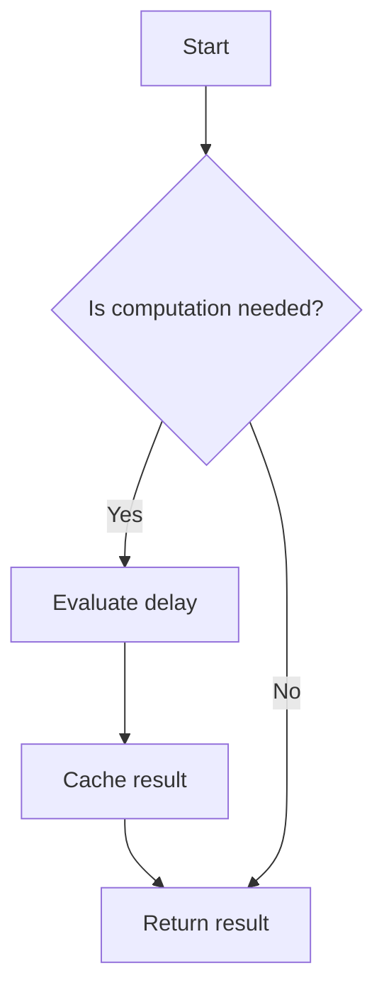

## 6.7. Lazy Initialization with `delay` and `force`

In the world of functional programming, laziness is a powerful concept that allows developers to defer computation until the result is actually needed. Clojure, being a functional language, embraces this concept through various constructs, including lazy sequences and the `delay` and `force` mechanism. In this section, we will delve into how Clojure provides lazy initialization using `delay` and `force`, explore their use cases, and compare them with other forms of laziness in Clojure.

### Understanding `delay` and `force`

#### What is `delay`?

In Clojure, `delay` is a construct that allows you to defer the evaluation of an expression until its value is explicitly needed. When you wrap an expression with `delay`, it returns a "delay object" that encapsulates the computation. This computation is not executed until you explicitly request the value using `force`.

```clojure
(def delayed-value (delay (println "Computing...") (+ 1 2)))

;; At this point, "Computing..." has not been printed yet.
```

#### What is `force`?

`force` is used to trigger the evaluation of a delayed computation. When you call `force` on a delay object, it evaluates the encapsulated expression and caches the result. Subsequent calls to `force` on the same delay object will return the cached result without re-evaluating the expression.

```clojure
(println "Before force")
(println "Result:" (force delayed-value))
;; Output:
;; Before force
;; Computing...
;; Result: 3

;; Subsequent calls to force do not re-evaluate the expression.
(println "Cached Result:" (force delayed-value))
;; Output:
;; Cached Result: 3
```

### Use Cases for Lazy Initialization

Lazy initialization is particularly useful in scenarios where:

- **Expensive Computations**: You have computations that are resource-intensive and should only be performed if absolutely necessary.
- **Conditional Execution**: You want to defer execution until certain conditions are met.
- **Avoiding Side Effects**: You need to control when side effects occur, ensuring they only happen when required.
- **Improving Performance**: By deferring computation, you can improve the performance of your application by avoiding unnecessary work.

#### Example: Deferring Expensive Computations

Consider a scenario where you need to perform a complex calculation that is only required under specific conditions. Using `delay`, you can defer this computation until it is needed:

```clojure
(defn expensive-calculation []
  (println "Performing expensive calculation...")
  (Thread/sleep 2000) ; Simulate a time-consuming task
  42)

(def result (delay (expensive-calculation)))

;; The expensive calculation is not performed until we force the result.
(when (some-condition?)
  (println "Calculation result:" (force result)))
```

### Thread Safety and Idempotence

One of the key considerations when using `delay` and `force` is thread safety. Clojure ensures that the computation encapsulated by a delay is only evaluated once, even in a concurrent environment. This makes `delay` a thread-safe way to perform lazy initialization.

Additionally, the result of a delay is cached after the first evaluation, making subsequent calls to `force` idempotent. This means that no matter how many times you call `force`, the computation will only be performed once, and the cached result will be returned.

### Comparison with Lazy Sequences

Clojure also provides lazy sequences, which are another form of laziness. While both `delay` and lazy sequences defer computation, they serve different purposes:

- **Lazy Sequences**: Primarily used for collections, allowing you to work with potentially infinite data structures without evaluating the entire sequence at once.
- **Delay**: Used for deferring the evaluation of a single expression or computation, not necessarily related to collections.

#### Example: Lazy Sequences vs. Delay

```clojure
;; Lazy sequence example
(defn lazy-seq-example []
  (println "Generating sequence...")
  (range 10))

(def lazy-seq (lazy-seq (lazy-seq-example)))

;; The sequence is not generated until we consume it.
(take 3 lazy-seq)
;; Output:
;; Generating sequence...
;; (0 1 2)

;; Delay example
(def delayed-computation (delay (println "Computing...") (+ 1 2)))

;; The computation is not performed until we force it.
(force delayed-computation)
;; Output:
;; Computing...
;; 3
```

### Design Considerations

When using `delay` and `force`, consider the following:

- **Use `delay` for Single Computations**: If you need to defer a single computation, `delay` is the appropriate choice. For collections, consider lazy sequences.
- **Be Mindful of Side Effects**: Ensure that any side effects within a delayed computation are intentional and controlled.
- **Thread Safety**: Rely on the thread safety of `delay` to ensure computations are only performed once, even in concurrent environments.

### Clojure Unique Features

Clojure's approach to laziness, immutability, and concurrency makes `delay` and `force` particularly powerful. The language's emphasis on immutability ensures that once a delayed computation is evaluated, its result remains consistent and unchanged, providing a reliable mechanism for lazy initialization.

### Differences and Similarities

While `delay` and lazy sequences both defer computation, they are used in different contexts. Lazy sequences are ideal for working with collections, while `delay` is suited for individual computations. Understanding these differences will help you choose the right tool for your specific use case.

### Try It Yourself

Experiment with the following code to deepen your understanding of `delay` and `force`. Modify the conditions and computations to see how lazy initialization can be applied in different scenarios.

```clojure
(defn simulate-heavy-task []
  (println "Simulating heavy task...")
  (Thread/sleep 3000)
  "Task Complete")

(def lazy-task (delay (simulate-heavy-task)))

;; Try forcing the lazy task under different conditions
(when (rand-nth [true false])
  (println "Lazy task result:" (force lazy-task)))

;; Observe how the task is only executed once, even if forced multiple times
(println "Cached result:" (force lazy-task))
```

### Visualizing Lazy Initialization

To better understand how `delay` and `force` work, let's visualize the process using a flowchart:



**Caption**: This flowchart illustrates the decision-making process of lazy initialization using `delay` and `force`. The computation is only evaluated if needed, and the result is cached for future use.

### References and Links

For further reading on lazy evaluation and Clojure's approach to functional programming, consider the following resources:

- [Clojure Documentation on Delay and Force](https://clojure.org/reference/delay)
- [Functional Programming in Clojure](https://www.braveclojure.com/)
- [Concurrency in Clojure](https://clojure.org/reference/atoms)

### Knowledge Check

Let's test your understanding of lazy initialization with `delay` and `force` in Clojure.

## **Ready to Test Your Knowledge?**



### What does `delay` do in Clojure?

- [x] Defers the evaluation of an expression until needed
- [ ] Immediately evaluates an expression
- [ ] Caches the result of an expression without evaluation
- [ ] Forces the evaluation of an expression

> **Explanation:** `delay` defers the evaluation of an expression until it is explicitly needed, encapsulating the computation in a delay object.

### How do you trigger the evaluation of a delayed computation?

- [x] Using `force`
- [ ] Using `eval`
- [ ] Using `realize`
- [ ] Using `execute`

> **Explanation:** `force` is used to trigger the evaluation of a delayed computation, returning the result and caching it for future use.

### What is a key benefit of using `delay`?

- [x] It allows deferring expensive computations
- [ ] It speeds up all computations
- [ ] It guarantees thread safety for all operations
- [ ] It automatically optimizes code

> **Explanation:** `delay` allows you to defer expensive computations until they are actually needed, improving performance and resource management.

### How many times is a delayed computation evaluated?

- [x] Once
- [ ] Twice
- [ ] Every time `force` is called
- [ ] It depends on the computation

> **Explanation:** A delayed computation is evaluated only once, and the result is cached for subsequent calls to `force`.

### What is the difference between `delay` and lazy sequences?

- [x] `delay` is for single computations, lazy sequences are for collections
- [ ] `delay` is faster than lazy sequences
- [ ] `delay` is only for concurrent programming
- [ ] `delay` cannot be used with collections

> **Explanation:** `delay` is used for deferring single computations, while lazy sequences are used for collections, allowing deferred evaluation of potentially infinite data structures.

### Is `delay` thread-safe?

- [x] Yes
- [ ] No
- [ ] Only in certain conditions
- [ ] It depends on the implementation

> **Explanation:** `delay` is thread-safe, ensuring that the computation is only evaluated once, even in concurrent environments.

### What happens if you call `force` multiple times on the same delay object?

- [x] The cached result is returned
- [ ] The computation is re-evaluated each time
- [ ] An error is thrown
- [ ] The delay object is reset

> **Explanation:** When `force` is called multiple times on the same delay object, the cached result is returned without re-evaluating the computation.

### Can `delay` be used for computations with side effects?

- [x] Yes, but with caution
- [ ] No, it is not allowed
- [ ] Only if the side effects are idempotent
- [ ] Only in single-threaded environments

> **Explanation:** `delay` can be used for computations with side effects, but it's important to ensure that the side effects are intentional and controlled.

### What is the purpose of caching the result of a delayed computation?

- [x] To avoid re-evaluating the computation
- [ ] To speed up the initial evaluation
- [ ] To ensure thread safety
- [ ] To optimize memory usage

> **Explanation:** Caching the result of a delayed computation avoids re-evaluating the computation, improving performance and efficiency.

### True or False: `delay` and `force` are used for lazy initialization in Clojure.

- [x] True
- [ ] False

> **Explanation:** True. `delay` and `force` are used for lazy initialization in Clojure, allowing deferred computation until the value is needed.



Remember, mastering lazy initialization with `delay` and `force` is just one step in your journey to becoming a proficient Clojure developer. Keep experimenting, stay curious, and enjoy the process of learning and applying these powerful concepts!
