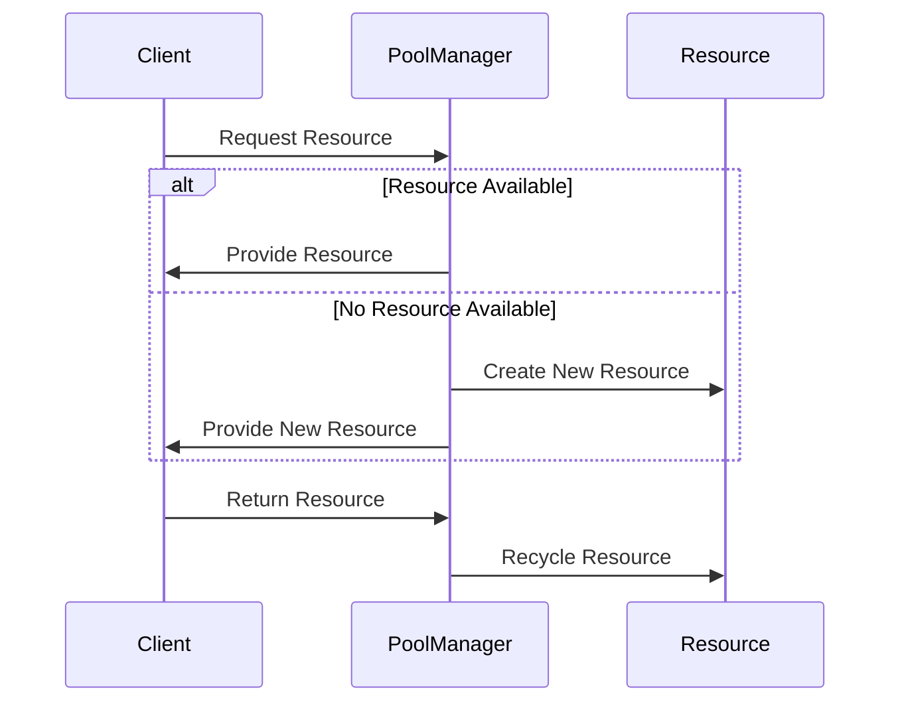

## 6.8. Object Pool Pattern with Agents and Queues

In this section, we delve into the Object Pool Pattern, a creational design pattern that is particularly useful in scenarios where the cost of creating and destroying objects is high. By implementing this pattern using Clojure's agents and queues, we can efficiently manage a pool of reusable resources, ensuring optimal performance and resource utilization in high-load applications.

### **Understanding the Object Pool Pattern**

The Object Pool Pattern is a design pattern that allows for the reuse of objects that are expensive to create. Instead of creating and destroying objects on demand, an object pool maintains a collection of pre-initialized objects that can be borrowed and returned as needed. This approach is particularly beneficial in scenarios involving:

- **High object creation cost**: When objects are resource-intensive to create, such as database connections or network sockets.
- **Frequent object reuse**: When the same type of object is needed repeatedly within a short time frame.
- **Performance optimization**: Reducing the overhead of garbage collection and object initialization.

### **Key Participants in the Object Pool Pattern**

- **Pool Manager**: Manages the lifecycle of the objects in the pool, including creation, allocation, and deallocation.
- **Client**: Requests objects from the pool and returns them after use.
- **Reusable Object**: The object that is managed by the pool and reused by clients.

### **Applicability of the Object Pool Pattern**

Consider using the Object Pool Pattern in the following scenarios:

- When you need to manage a limited number of resources that are expensive to create and destroy.
- When you require a controlled number of instances of a class.
- When you need to improve performance by reusing objects instead of creating new ones.

### **Implementing the Object Pool Pattern in Clojure**

In Clojure, we can leverage agents and queues to implement an efficient object pool. Agents provide a way to manage state changes asynchronously, while queues help in managing the pool of objects.

#### **Using Agents for Object Pool Management**

Agents in Clojure are ideal for managing state changes in a concurrent environment. They allow us to update the state of an object asynchronously, making them suitable for implementing an object pool.

```clojure
(ns object-pool.core
  (:require [clojure.core.async :as async]))

(defn create-resource []
  ;; Simulate resource creation
  (println "Creating resource")
  {})

(defn initialize-pool [size]
  ;; Initialize a pool with a given size
  (let [resources (repeatedly size create-resource)]
    (agent resources)))

(defn acquire-resource [pool]
  ;; Acquire a resource from the pool
  (send pool
        (fn [resources]
          (if (empty? resources)
            (do
              (println "No resources available, creating new one")
              (conj resources (create-resource)))
            (let [resource (first resources)]
              (println "Acquired resource")
              (rest resources))))))

(defn release-resource [pool resource]
  ;; Release a resource back to the pool
  (send pool
        (fn [resources]
          (println "Releasing resource")
          (conj resources resource))))
```

In this example, we define a simple object pool using an agent. The `initialize-pool` function creates a pool of resources, while `acquire-resource` and `release-resource` manage the borrowing and returning of resources.

#### **Managing Resource Checkout and Return**

The process of checking out and returning resources is crucial in an object pool. We must ensure that resources are properly managed to avoid resource leaks and ensure thread safety.

```clojure
(defn with-resource [pool f]
  ;; Use a resource from the pool, applying function f
  (let [resource (acquire-resource pool)]
    (try
      (f resource)
      (finally
        (release-resource pool resource)))))
```

The `with-resource` function demonstrates how to safely use a resource from the pool. It acquires a resource, applies a function to it, and ensures the resource is returned to the pool even if an exception occurs.

### **Concurrency Considerations**

Concurrency is a critical aspect of implementing an object pool. Clojure's agents provide a thread-safe way to manage state changes, but we must be mindful of potential bottlenecks and contention when accessing the pool.

- **Avoid blocking operations**: Ensure that operations on the pool do not block, as this can lead to performance degradation.
- **Minimize contention**: Use non-blocking data structures like queues to reduce contention when accessing the pool.

### **Performance Benefits in High-Load Scenarios**

The Object Pool Pattern offers significant performance benefits in high-load scenarios by:

- **Reducing object creation overhead**: By reusing objects, we minimize the cost associated with object creation and destruction.
- **Improving resource utilization**: By maintaining a pool of reusable objects, we ensure that resources are used efficiently.
- **Enhancing scalability**: By managing resources effectively, we can handle increased load without degrading performance.

### **Try It Yourself**

To experiment with the object pool pattern, try modifying the code examples to:

- Change the size of the pool and observe the impact on performance.
- Implement a timeout mechanism for acquiring resources.
- Add logging to track resource usage and identify potential bottlenecks.

### **Visualizing the Object Pool Pattern**

To better understand the flow of the Object Pool Pattern, let's visualize the process using a sequence diagram:



This diagram illustrates the interaction between the client, pool manager, and resources, highlighting the process of acquiring and returning resources.

### **Clojure Unique Features**

Clojure's functional programming paradigm and concurrency primitives make it uniquely suited for implementing the Object Pool Pattern. Key features include:

- **Immutable data structures**: Ensure thread safety and prevent data races.
- **Agents and atoms**: Provide a simple and efficient way to manage state changes asynchronously.
- **Core.async library**: Offers powerful tools for managing concurrency and asynchronous operations.

### **Design Considerations**

When implementing the Object Pool Pattern in Clojure, consider the following:

- **Resource lifecycle management**: Ensure that resources are properly initialized and cleaned up.
- **Error handling**: Implement robust error handling to manage exceptions and resource leaks.
- **Scalability**: Design the pool to handle varying loads and adapt to changing requirements.

### **Differences and Similarities with Other Patterns**

The Object Pool Pattern is often compared to other creational patterns like the Singleton Pattern. While both manage the lifecycle of objects, the Object Pool Pattern focuses on reusing multiple instances, whereas the Singleton Pattern restricts the instantiation to a single instance.

### **References and Further Reading**

- [Clojure Documentation](https://clojure.org/reference/documentation)
- [Core.async Library](https://clojure.github.io/core.async/)
- [Design Patterns: Elements of Reusable Object-Oriented Software](https://en.wikipedia.org/wiki/Design_Patterns)

## **Ready to Test Your Knowledge?**



### What is the primary benefit of using the Object Pool Pattern?

- [x] Reducing the overhead of object creation and destruction
- [ ] Increasing the number of objects in memory
- [ ] Simplifying object initialization
- [ ] Enhancing object encapsulation

> **Explanation:** The Object Pool Pattern reduces the overhead of object creation and destruction by reusing objects.

### Which Clojure feature is particularly useful for managing state changes in an object pool?

- [x] Agents
- [ ] Refs
- [ ] Vars
- [ ] Macros

> **Explanation:** Agents are useful for managing state changes asynchronously in a thread-safe manner.

### What is a key consideration when implementing an object pool?

- [x] Thread safety and concurrency
- [ ] Object inheritance
- [ ] Interface design
- [ ] Serialization

> **Explanation:** Thread safety and concurrency are crucial to ensure that the pool operates correctly under load.

### How does the `with-resource` function ensure resource safety?

- [x] By using `try` and `finally` to release resources
- [ ] By locking resources during use
- [ ] By duplicating resources
- [ ] By ignoring exceptions

> **Explanation:** The `with-resource` function uses `try` and `finally` to ensure resources are released even if an exception occurs.

### What is a potential drawback of using the Object Pool Pattern?

- [x] Increased complexity in resource management
- [ ] Reduced performance in low-load scenarios
- [ ] Limited object reuse
- [ ] Increased memory usage

> **Explanation:** The Object Pool Pattern can increase complexity in managing the lifecycle of resources.

### Which data structure is recommended to minimize contention in an object pool?

- [x] Queues
- [ ] Lists
- [ ] Sets
- [ ] Trees

> **Explanation:** Queues help minimize contention by providing a non-blocking way to manage resources.

### What is the role of the Pool Manager in the Object Pool Pattern?

- [x] Managing the lifecycle of objects in the pool
- [ ] Creating new object types
- [ ] Destroying unused objects
- [ ] Monitoring object usage

> **Explanation:** The Pool Manager is responsible for managing the lifecycle of objects, including creation, allocation, and deallocation.

### How does the Object Pool Pattern enhance scalability?

- [x] By efficiently managing resources to handle increased load
- [ ] By increasing the number of available objects
- [ ] By simplifying object creation
- [ ] By reducing the number of threads

> **Explanation:** The Object Pool Pattern enhances scalability by efficiently managing resources to handle increased load.

### What is a common use case for the Object Pool Pattern?

- [x] Managing database connections
- [ ] Implementing user interfaces
- [ ] Designing algorithms
- [ ] Creating data structures

> **Explanation:** The Object Pool Pattern is commonly used to manage database connections, which are expensive to create and destroy.

### True or False: The Object Pool Pattern is only applicable in object-oriented programming.

- [ ] True
- [x] False

> **Explanation:** The Object Pool Pattern can be applied in both object-oriented and functional programming paradigms.



Remember, this is just the beginning. As you progress, you'll build more complex and efficient systems using Clojure's powerful features. Keep experimenting, stay curious, and enjoy the journey!
