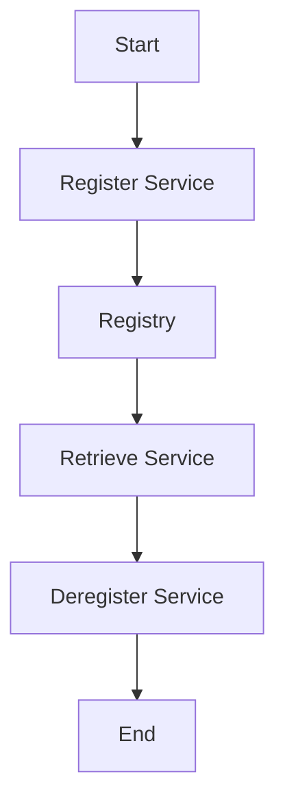

## 6.9. Registry Pattern Using Atoms and Maps

In the world of software design patterns, the Registry Pattern is a powerful tool for managing shared resources or services. In Clojure, a language known for its functional programming paradigm and immutable data structures, implementing the Registry Pattern can be elegantly achieved using atoms and maps. This section will guide you through understanding the Registry Pattern, its purpose, and how to implement it in Clojure using atoms and maps.

### Understanding the Registry Pattern

**Definition and Purpose**

The Registry Pattern is a structural design pattern that provides a centralized location for storing and retrieving instances of classes or services. It acts as a global repository where objects can be registered and accessed by other parts of the application. This pattern is particularly useful in scenarios where multiple components need to share or access common resources, such as configuration settings, service instances, or shared data.

**Key Participants**

- **Registry**: The central repository that holds references to shared resources or services.
- **Clients**: Components or modules that interact with the registry to register, retrieve, or deregister resources.

**Applicability**

The Registry Pattern is applicable in scenarios where:
- Multiple components need access to shared resources.
- There is a need to decouple resource creation from resource usage.
- A centralized management of resources is beneficial for the application architecture.

### Implementing the Registry Pattern in Clojure

In Clojure, we can leverage the power of atoms and maps to implement the Registry Pattern. Atoms provide a way to manage mutable state in a thread-safe manner, while maps offer a convenient data structure for storing key-value pairs.

#### Using an Atom to Hold a Registry Map

An atom in Clojure is a reference type that provides a way to manage shared, mutable state. It ensures that updates to the state are atomic and thread-safe, making it an ideal choice for implementing a registry.

```clojure
(def registry (atom {}))
```

In this example, we define an atom named `registry` that holds an empty map. This map will serve as our registry, where keys represent resource identifiers and values represent the resources themselves.

#### Registering Services

To register a service in the registry, we can use the `swap!` function to update the atom's state. The `swap!` function applies a given function to the current state of the atom and updates it with the result.

```clojure
(defn register-service [key service]
  (swap! registry assoc key service))
```

In this function, `register-service`, we take a `key` and a `service` as arguments and use `assoc` to add the service to the registry map.

#### Retrieving Services

Retrieving a service from the registry is straightforward. We simply use the `get` function to access the value associated with a given key.

```clojure
(defn get-service [key]
  (get @registry key))
```

Here, `get-service` takes a `key` and returns the corresponding service from the registry.

#### Deregistering Services

To remove a service from the registry, we can use the `dissoc` function within a `swap!` call.

```clojure
(defn deregister-service [key]
  (swap! registry dissoc key))
```

The `deregister-service` function removes the service associated with the given key from the registry.

### Synchronization and Thread Safety

One of the key advantages of using atoms in Clojure is their built-in support for synchronization and thread safety. Atoms ensure that updates to the state are atomic, meaning that they are applied in a single, indivisible operation. This eliminates the need for explicit locks or synchronization mechanisms, making the code simpler and less error-prone.

However, it's important to note that while atoms provide atomic updates, they do not guarantee consistency across multiple operations. If you need to perform a sequence of operations that must be consistent, consider using transactions with Clojure's Software Transactional Memory (STM) or other synchronization techniques.

### Potential Pitfalls and Best Practices

While the Registry Pattern offers many benefits, there are some potential pitfalls to be aware of:

- **Global State**: The registry introduces a form of global state, which can lead to tight coupling and make testing more difficult. Consider using dependency injection or other techniques to manage dependencies more effectively.
- **Concurrency**: While atoms provide thread safety, be mindful of potential race conditions when multiple threads access the registry simultaneously. Ensure that operations on the registry are atomic and consistent.
- **Memory Management**: Be cautious of memory leaks if services are not properly deregistered. Implement cleanup mechanisms to remove unused services from the registry.

**Best Practices**

- **Use Clear Naming Conventions**: Use descriptive names for keys to make the registry easy to understand and maintain.
- **Encapsulate Registry Operations**: Provide a clear API for interacting with the registry, encapsulating the underlying implementation details.
- **Document Registry Usage**: Clearly document the purpose and usage of the registry to ensure that all team members understand its role in the application architecture.

### Clojure Unique Features

Clojure's functional programming paradigm and immutable data structures offer unique advantages when implementing the Registry Pattern:

- **Immutability**: Clojure's emphasis on immutability reduces the risk of unintended side effects and makes the code easier to reason about.
- **Concurrency Primitives**: Clojure provides powerful concurrency primitives, such as atoms, refs, and agents, that simplify the management of shared state.
- **Lisp Syntax**: Clojure's Lisp syntax and homoiconicity make it easy to create domain-specific languages (DSLs) for managing registries and other patterns.

### Differences and Similarities

The Registry Pattern is often compared to the Service Locator Pattern. While both patterns provide a way to manage shared resources, the Registry Pattern focuses on a centralized repository, while the Service Locator Pattern provides a mechanism for locating services at runtime. Understanding these distinctions can help you choose the right pattern for your application.

### Try It Yourself

To deepen your understanding of the Registry Pattern in Clojure, try modifying the code examples provided. Experiment with different types of services, keys, and operations. Consider implementing additional features, such as service discovery or dependency injection, to enhance the registry's functionality.

### Visualizing the Registry Pattern

To help visualize the Registry Pattern, consider the following diagram, which illustrates the flow of registering, retrieving, and deregistering services in a Clojure application:



This diagram shows the sequence of operations involved in managing services using the Registry Pattern.

### References and Links

For further reading on the Registry Pattern and related concepts, consider the following resources:

- [Clojure Documentation](https://clojure.org/reference/atoms)
- [Functional Programming in Clojure](https://www.braveclojure.com/)
- [Design Patterns: Elements of Reusable Object-Oriented Software](https://en.wikipedia.org/wiki/Design_Patterns)

### Knowledge Check

To reinforce your understanding of the Registry Pattern in Clojure, try answering the following questions and challenges.

## **Ready to Test Your Knowledge?**



### What is the primary purpose of the Registry Pattern?

- [x] To provide a centralized location for storing and retrieving shared resources or services.
- [ ] To manage user authentication and authorization.
- [ ] To handle database transactions.
- [ ] To optimize memory usage.

> **Explanation:** The Registry Pattern is used to manage shared resources or services by providing a centralized repository.


### Which Clojure construct is ideal for implementing a registry due to its thread-safe nature?

- [x] Atom
- [ ] Ref
- [ ] Agent
- [ ] Var

> **Explanation:** Atoms provide a way to manage mutable state in a thread-safe manner, making them ideal for implementing a registry.


### How do you register a service in a Clojure registry using an atom?

- [x] Use `swap!` with `assoc` to add the service to the registry map.
- [ ] Use `reset!` with `assoc` to add the service to the registry map.
- [ ] Use `alter` with `assoc` to add the service to the registry map.
- [ ] Use `send` with `assoc` to add the service to the registry map.

> **Explanation:** The `swap!` function is used with `assoc` to atomically update the registry map with a new service.


### What function is used to retrieve a service from a Clojure registry?

- [x] `get`
- [ ] `assoc`
- [ ] `dissoc`
- [ ] `conj`

> **Explanation:** The `get` function is used to retrieve the value associated with a given key in a map.


### What is a potential pitfall of using the Registry Pattern?

- [x] It introduces a form of global state.
- [ ] It requires complex synchronization mechanisms.
- [ ] It is not compatible with functional programming.
- [ ] It cannot handle concurrent access.

> **Explanation:** The Registry Pattern introduces a form of global state, which can lead to tight coupling and testing difficulties.


### Which of the following is a best practice when using the Registry Pattern?

- [x] Use clear naming conventions for keys.
- [ ] Avoid encapsulating registry operations.
- [ ] Use global variables for registry access.
- [ ] Minimize documentation of registry usage.

> **Explanation:** Clear naming conventions for keys help make the registry easy to understand and maintain.


### How can you ensure consistency across multiple operations on a registry?

- [x] Use transactions with Clojure's Software Transactional Memory (STM).
- [ ] Use multiple atoms for each operation.
- [ ] Use `swap!` for all operations.
- [ ] Use `reset!` for all operations.

> **Explanation:** Transactions with STM ensure consistency across multiple operations by allowing them to be executed atomically.


### What is the difference between the Registry Pattern and the Service Locator Pattern?

- [x] The Registry Pattern focuses on a centralized repository, while the Service Locator Pattern provides a mechanism for locating services at runtime.
- [ ] The Registry Pattern is used for user authentication, while the Service Locator Pattern is used for resource management.
- [ ] The Registry Pattern is specific to Clojure, while the Service Locator Pattern is used in Java.
- [ ] The Registry Pattern is used for database transactions, while the Service Locator Pattern is used for caching.

> **Explanation:** The Registry Pattern provides a centralized repository, whereas the Service Locator Pattern focuses on locating services at runtime.


### True or False: Atoms in Clojure guarantee consistency across multiple operations.

- [x] False
- [ ] True

> **Explanation:** Atoms provide atomic updates but do not guarantee consistency across multiple operations. For consistency, use STM or other synchronization techniques.


### Which Clojure feature helps reduce the risk of unintended side effects when implementing the Registry Pattern?

- [x] Immutability
- [ ] Dynamic typing
- [ ] Homoiconicity
- [ ] Macros

> **Explanation:** Clojure's emphasis on immutability reduces the risk of unintended side effects, making the code easier to reason about.



Remember, mastering the Registry Pattern in Clojure is just the beginning. As you continue your journey, explore other design patterns and techniques to build robust, efficient, and elegant applications. Keep experimenting, stay curious, and enjoy the process!
