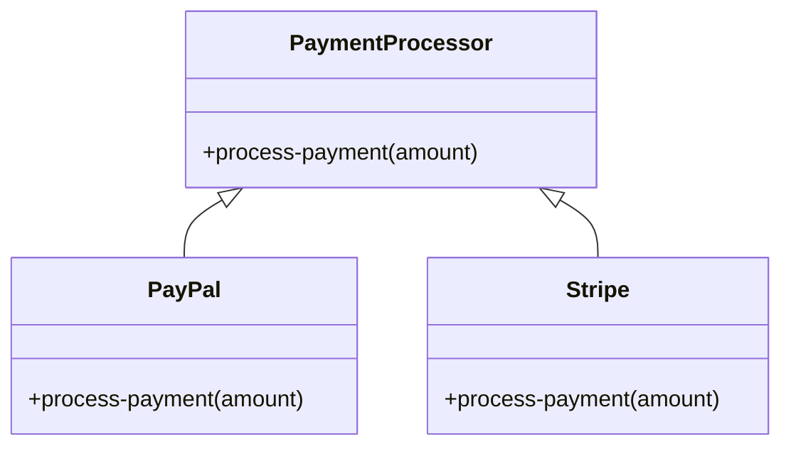

## 7.1. Adapter Pattern Using Protocols

### Introduction

In the world of software development, we often encounter situations where different systems or components need to work together, but their interfaces are incompatible. The Adapter Pattern is a structural design pattern that helps bridge these gaps by allowing incompatible interfaces to work together. In Clojure, we can leverage protocols to implement the Adapter Pattern effectively, providing a flexible and reusable solution to interface incompatibility.

### Understanding the Adapter Pattern

#### Definition and Intent

The Adapter Pattern is a design pattern that allows objects with incompatible interfaces to collaborate. It acts as a bridge between two incompatible interfaces, enabling them to work together without modifying their existing code. The primary intent of the Adapter Pattern is to convert the interface of a class into another interface that clients expect, thus allowing classes to work together that couldn't otherwise because of incompatible interfaces.

#### Key Participants

1. **Target Interface**: The interface that the client expects.
2. **Adaptee**: The existing interface that needs adapting.
3. **Adapter**: The class that implements the target interface and adapts the adaptee to it.
4. **Client**: The class that interacts with the target interface.

### Protocols as Adapters in Clojure

#### What Are Protocols?

In Clojure, protocols are a mechanism for polymorphism. They define a set of methods that can be implemented by different types, allowing for a form of dynamic dispatch based on the type of the first argument. Protocols provide a way to define a common interface that different data types can implement, making them an ideal tool for implementing the Adapter Pattern.

#### How Protocols Serve as Adapters

Protocols in Clojure can serve as adapters by defining a common interface that different types can implement. By creating a protocol that represents the target interface, we can implement this protocol for the existing types (adaptees) that need to be adapted. This allows us to use these types interchangeably through the protocol, effectively adapting them to the target interface.

### Implementing the Adapter Pattern Using Protocols

Let's explore how to implement the Adapter Pattern in Clojure using protocols with a practical example.

#### Example: Adapting Different Payment Systems

Suppose we have two different payment systems, `PayPal` and `Stripe`, each with its own interface. We want to create a unified interface for processing payments, allowing us to use either system interchangeably.

```clojure
;; Define the protocol for the target interface
(defprotocol PaymentProcessor
  (process-payment [this amount]))

;; Define the PayPal type
(defrecord PayPal []
  PaymentProcessor
  (process-payment [this amount]
    (println "Processing PayPal payment of" amount)))

;; Define the Stripe type
(defrecord Stripe []
  PaymentProcessor
  (process-payment [this amount]
    (println "Processing Stripe payment of" amount)))

;; Usage
(def paypal (->PayPal))
(def stripe (->Stripe))

(process-payment paypal 100)
(process-payment stripe 200)
```

In this example, we define a `PaymentProcessor` protocol with a `process-payment` method. We then create two types, `PayPal` and `Stripe`, each implementing the `PaymentProcessor` protocol. This allows us to use both types interchangeably through the `process-payment` function, effectively adapting them to a common interface.

### Benefits of Using Protocols as Adapters

#### Polymorphism

Protocols provide polymorphism by allowing different types to implement the same interface. This enables us to write code that can work with any type that implements the protocol, making our code more flexible and reusable.

#### Code Reuse

By defining a common interface through protocols, we can reuse the same logic for different types. This reduces code duplication and makes our codebase easier to maintain.

#### Flexibility

Protocols allow us to extend existing types with new functionality without modifying their original code. This makes it easy to adapt third-party libraries or legacy code to work with new interfaces.

### Real-World Use Cases

#### Integrating Third-Party Libraries

When integrating third-party libraries into your application, you may encounter incompatible interfaces. By using protocols as adapters, you can create a common interface that your application can interact with, regardless of the underlying library.

#### Migrating Legacy Code

When migrating legacy code to a new system, you may need to adapt old interfaces to work with new ones. Protocols provide a way to create adapters that bridge the gap between old and new interfaces, facilitating a smooth migration process.

#### Building Modular Systems

In a modular system, different components may have different interfaces. By defining protocols as adapters, you can create a unified interface that allows these components to work together seamlessly.

### Visualizing the Adapter Pattern with Protocols

To better understand how the Adapter Pattern works with protocols, let's visualize the relationship between the target interface, adaptee, and adapter.



In this diagram, `PaymentProcessor` is the protocol that defines the target interface. `PayPal` and `Stripe` are the adaptees that implement the `PaymentProcessor` protocol, allowing them to be used interchangeably through the adapter.

### Design Considerations

#### When to Use the Adapter Pattern

- **Interface Incompatibility**: Use the Adapter Pattern when you need to integrate components with incompatible interfaces.
- **Legacy Code Integration**: When migrating legacy systems, adapters can help bridge the gap between old and new interfaces.
- **Third-Party Integration**: Adapters are useful when integrating third-party libraries with different interfaces.

#### Important Considerations

- **Performance**: While protocols provide flexibility, they may introduce a slight performance overhead due to dynamic dispatch. Consider the performance implications when using protocols in performance-critical code.
- **Complexity**: Introducing adapters can add complexity to your codebase. Ensure that the benefits of using adapters outweigh the added complexity.

### Clojure's Unique Features

Clojure's support for protocols and dynamic dispatch makes it uniquely suited for implementing the Adapter Pattern. The language's emphasis on immutability and functional programming encourages the use of protocols to create flexible and reusable code.

### Differences and Similarities with Other Patterns

The Adapter Pattern is often confused with the Decorator Pattern, as both involve wrapping existing functionality. However, the Adapter Pattern focuses on interface compatibility, while the Decorator Pattern focuses on adding new behavior.

### Try It Yourself

To deepen your understanding of the Adapter Pattern using protocols, try modifying the example code to add a new payment system, such as `Square`. Implement the `PaymentProcessor` protocol for the new system and test it with the existing code.

### Knowledge Check

- What is the primary intent of the Adapter Pattern?
- How do protocols in Clojure facilitate the Adapter Pattern?
- What are the benefits of using protocols as adapters?
- Can you think of a real-world scenario where the Adapter Pattern would be useful?
- How does the Adapter Pattern differ from the Decorator Pattern?

### Conclusion

The Adapter Pattern is a powerful tool for bridging incompatible interfaces, and Clojure's protocols provide an elegant way to implement this pattern. By leveraging protocols, we can create flexible, reusable, and maintainable code that adapts to changing requirements. Remember, this is just the beginning. As you progress, you'll discover more ways to harness the power of Clojure's protocols to build robust and adaptable software systems. Keep experimenting, stay curious, and enjoy the journey!

## **Ready to Test Your Knowledge?**



### What is the primary intent of the Adapter Pattern?

- [x] To allow incompatible interfaces to work together
- [ ] To add new behavior to existing objects
- [ ] To create a single interface for multiple classes
- [ ] To separate the construction of a complex object from its representation

> **Explanation:** The Adapter Pattern is designed to allow incompatible interfaces to work together by acting as a bridge between them.

### How do protocols in Clojure facilitate the Adapter Pattern?

- [x] By defining a common interface that different types can implement
- [ ] By providing a way to add new behavior to existing objects
- [ ] By allowing objects to be created without specifying their concrete classes
- [ ] By enabling the separation of an object's construction from its representation

> **Explanation:** Protocols in Clojure define a common interface that different types can implement, allowing them to be used interchangeably and facilitating the Adapter Pattern.

### What are the benefits of using protocols as adapters?

- [x] Polymorphism and code reuse
- [ ] Increased complexity and performance overhead
- [ ] Reduced flexibility and maintainability
- [ ] Limited integration with third-party libraries

> **Explanation:** Protocols provide polymorphism and code reuse, making them beneficial for implementing the Adapter Pattern.

### Can you think of a real-world scenario where the Adapter Pattern would be useful?

- [x] Integrating third-party libraries with different interfaces
- [ ] Adding new behavior to existing objects
- [ ] Creating a single interface for multiple classes
- [ ] Separating the construction of a complex object from its representation

> **Explanation:** The Adapter Pattern is useful for integrating third-party libraries with different interfaces by creating a common interface for interaction.

### How does the Adapter Pattern differ from the Decorator Pattern?

- [x] The Adapter Pattern focuses on interface compatibility, while the Decorator Pattern focuses on adding new behavior
- [ ] The Adapter Pattern adds new behavior, while the Decorator Pattern focuses on interface compatibility
- [ ] Both patterns focus on adding new behavior to existing objects
- [ ] Both patterns focus on creating a single interface for multiple classes

> **Explanation:** The Adapter Pattern focuses on interface compatibility, while the Decorator Pattern focuses on adding new behavior to existing objects.

### What is a key participant in the Adapter Pattern?

- [x] Adapter
- [ ] Builder
- [ ] Singleton
- [ ] Observer

> **Explanation:** The Adapter is a key participant in the Adapter Pattern, as it implements the target interface and adapts the adaptee to it.

### What is a potential downside of using protocols as adapters?

- [x] Performance overhead due to dynamic dispatch
- [ ] Increased code duplication
- [ ] Reduced flexibility
- [ ] Limited integration with legacy systems

> **Explanation:** Protocols may introduce a slight performance overhead due to dynamic dispatch, which is a potential downside of using them as adapters.

### What is the role of the client in the Adapter Pattern?

- [x] To interact with the target interface
- [ ] To define the target interface
- [ ] To implement the adaptee
- [ ] To add new behavior to existing objects

> **Explanation:** The client interacts with the target interface, which is implemented by the adapter to adapt the adaptee.

### How can protocols help in migrating legacy code?

- [x] By creating adapters that bridge the gap between old and new interfaces
- [ ] By adding new behavior to legacy code
- [ ] By reducing the complexity of legacy code
- [ ] By eliminating the need for legacy code

> **Explanation:** Protocols can help in migrating legacy code by creating adapters that bridge the gap between old and new interfaces.

### True or False: The Adapter Pattern can only be used with object-oriented programming languages.

- [ ] True
- [x] False

> **Explanation:** The Adapter Pattern can be used in functional programming languages like Clojure, where protocols can serve as adapters to bridge incompatible interfaces.


