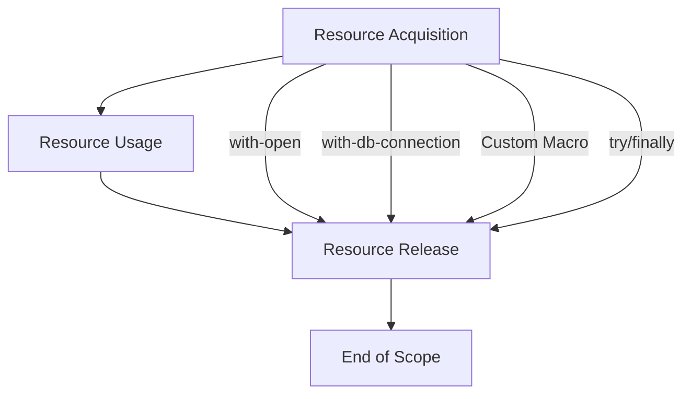

## 7.1 Resource Acquisition Is Initialization (RAII) in Clojure

Resource Acquisition Is Initialization (RAII) is a programming idiom that ties resource management to object lifespan, ensuring that resources are properly released when they are no longer needed. While Clojure, being a functional language with garbage collection, doesn't support deterministic destruction like languages such as C++, it offers powerful constructs to manage resources effectively. This section explores how Clojure developers can implement RAII principles using macros, ensuring robust and leak-free resource management.

### Introduction to RAII

RAII is a concept that originated in C++ to manage resources such as memory, file handles, and network connections. The idea is to bind the lifecycle of a resource to the scope of an object, ensuring that resources are automatically released when the object goes out of scope. In Clojure, we achieve similar outcomes using constructs like `with-open`, custom macros, and `try`/`finally` blocks.

### Detailed Explanation

In Clojure, resource management is crucial for preventing leaks and ensuring that resources like file handles, database connections, and network sockets are properly closed. Although Clojure's garbage collector handles memory management, explicit resource management is necessary for non-memory resources.

#### Using `with-open` for Auto-Closing Resources

The `with-open` macro in Clojure is a common idiom for managing resources that implement the `java.io.Closeable` interface. It ensures that resources are automatically closed when the block exits, even if an exception occurs.

```clojure
(with-open [reader (clojure.java.io/reader "file.txt")]
  (doseq [line (line-seq reader)]
    (println line)))
```

In this example, `reader` is automatically closed after reading the file, preventing resource leaks.

#### Managing Database Connections with `with-db-connection`

For database connections, libraries like `clojure.java.jdbc` provide macros such as `with-db-connection` to manage connections efficiently.

```clojure
(require '[clojure.java.jdbc :as jdbc])

(jdbc/with-db-connection [conn db-spec]
  (jdbc/query conn ["SELECT * FROM users"]))
```

This macro ensures that the database connection is properly closed after the query execution.

#### Creating Custom Macros for Resource Management

Custom macros can be created to manage resources that don't have built-in support. Here's an example of a custom macro for resource management:

```clojure
(defmacro with-resource [binding & body]
  `(let [~(first binding) ~(second binding)]
     (try
       ~@body
       (finally
         (.close ~(first binding))))))
```

This macro can be used to manage any resource that requires explicit closing.

#### Using `try` / `finally` Blocks When Macros Aren't Available

In cases where macros aren't available, `try`/`finally` blocks can be used to ensure resources are released:

```clojure
(let [conn (open-connection)]
  (try
    (use-connection conn)
    (finally
      (close-connection conn))))
```

The `finally` block guarantees that `close-connection` is called, even if an exception occurs during `use-connection`.

### Visual Aids

#### Conceptual Diagram of RAII in Clojure



This diagram illustrates the flow of resource management in Clojure using RAII principles.

### Use Cases

- **File Handling:** Reading and writing files where resources need to be closed after operations.
- **Database Connections:** Managing connections to ensure they are closed after queries.
- **Network Sockets:** Ensuring sockets are closed after communication.

### Advantages and Disadvantages

#### Advantages

- **Automatic Resource Management:** Ensures resources are released automatically, reducing the risk of leaks.
- **Simplified Code:** Reduces boilerplate code for resource management.
- **Exception Safety:** Resources are released even if exceptions occur.

#### Disadvantages

- **Limited to Closeable Resources:** `with-open` and similar constructs are limited to resources that implement `Closeable`.
- **Manual Management for Non-Closeable Resources:** Requires custom solutions for resources that don't fit the `Closeable` pattern.

### Best Practices

- **Use `with-open` and Similar Macros:** Prefer built-in macros for managing resources whenever possible.
- **Create Custom Macros for Reusability:** Encapsulate resource management logic in macros for reuse across projects.
- **Ensure Proper Closing in `finally` Blocks:** Always release resources in `finally` blocks to handle exceptions gracefully.
- **Avoid Side Effects:** Prefer pure functions and immutable data structures to minimize resource management needs.

### Comparisons

- **RAII vs. Manual Management:** RAII provides a more structured approach compared to manual resource management, reducing the risk of errors.
- **Macros vs. `try`/`finally`:** Macros offer a more concise and reusable way to manage resources compared to `try`/`finally` blocks.

### Conclusion

RAII in Clojure, while not as deterministic as in languages with explicit destructors, provides a robust framework for managing resources. By leveraging macros like `with-open` and creating custom solutions, developers can ensure that resources are handled efficiently and safely, preventing leaks and maintaining application stability.

## Quiz Time!



### What is the primary purpose of RAII?

- [x] To tie resource management to the lifespan of an object
- [ ] To improve code readability
- [ ] To enhance performance
- [ ] To simplify syntax

> **Explanation:** RAII is designed to manage resources by tying their lifecycle to the scope of an object, ensuring they are released when no longer needed.

### Which Clojure macro is commonly used for managing file resources?

- [x] with-open
- [ ] with-file
- [ ] try-with-resources
- [ ] open-file

> **Explanation:** `with-open` is used to manage file resources, ensuring they are closed after use.

### How does `with-db-connection` help in resource management?

- [x] It ensures database connections are closed after use
- [ ] It improves query performance
- [ ] It simplifies SQL syntax
- [ ] It caches database results

> **Explanation:** `with-db-connection` ensures that database connections are properly closed after executing queries.

### What is a disadvantage of using RAII in Clojure?

- [x] Limited to Closeable resources
- [ ] Increases code complexity
- [ ] Reduces performance
- [ ] Requires additional libraries

> **Explanation:** RAII in Clojure is limited to resources that implement the `Closeable` interface.

### Which block should always contain resource release logic?

- [x] finally
- [ ] catch
- [ ] try
- [ ] let

> **Explanation:** The `finally` block is used to ensure resources are released, even if an exception occurs.

### What is a benefit of using custom macros for resource management?

- [x] Reusability across projects
- [ ] Improved performance
- [ ] Simplified syntax
- [ ] Enhanced security

> **Explanation:** Custom macros encapsulate resource management logic, making it reusable across different projects.

### How does RAII enhance exception safety?

- [x] By ensuring resources are released even if exceptions occur
- [ ] By catching all exceptions
- [ ] By logging errors
- [ ] By preventing exceptions

> **Explanation:** RAII ensures that resources are released in the `finally` block, even if exceptions occur during execution.

### What should be avoided to minimize resource management needs?

- [x] Side effects
- [ ] Pure functions
- [ ] Immutable data structures
- [ ] Functional programming

> **Explanation:** Avoiding side effects reduces the need for resource management, as pure functions and immutable data structures are easier to manage.

### Which of the following is a key advantage of RAII?

- [x] Automatic resource management
- [ ] Improved syntax
- [ ] Faster execution
- [ ] Reduced memory usage

> **Explanation:** RAII automatically manages resources, reducing the risk of leaks and simplifying code.

### RAII in Clojure is as deterministic as in C++.

- [ ] True
- [x] False

> **Explanation:** Clojure's garbage collection and lack of explicit destructors make RAII less deterministic compared to C++.


