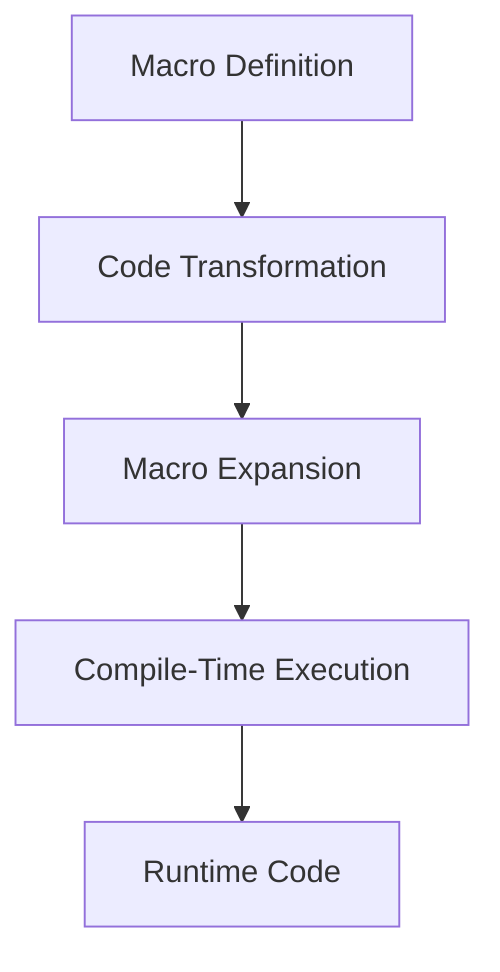

## 7.10. Extending Functionality with Macros

Macros in Clojure are a powerful tool that allow developers to extend the language and add functionality at compile time. They enable the implementation of structural patterns through code transformation, providing a way to encapsulate recurring patterns and automate boilerplate code. In this section, we will delve into the world of macros, exploring their power, advantages, risks, and best practices for their responsible use.

### Understanding Macros in Clojure

Macros in Clojure are a form of metaprogramming that allow you to write code that writes code. They operate at the syntactic level, transforming code before it is evaluated. This capability makes macros an essential tool for extending the language and implementing complex patterns that would otherwise require verbose and repetitive code.

#### The Power of Macros

Macros provide several powerful features:

- **Code Generation**: Macros can generate code dynamically, reducing boilerplate and improving maintainability.
- **Compile-Time Execution**: Macros execute at compile time, allowing for optimizations and transformations before runtime.
- **Language Extension**: Macros can introduce new syntactic constructs, effectively extending the language.

Let's explore a simple macro example to illustrate these concepts:

```clojure
(defmacro unless [condition & body]
  `(if (not ~condition)
     (do ~@body)))

;; Usage
(unless false
  (println "This will print because the condition is false."))
```

In this example, the `unless` macro inverts the logic of an `if` statement, executing the body only if the condition is false. The macro uses backticks (`) for quoting and tilde (`~`) for unquoting, allowing it to construct the desired code structure.

### Encapsulating Recurring Patterns with Macros

Macros are particularly useful for encapsulating recurring patterns, reducing redundancy, and improving code clarity. Let's consider a scenario where we need to log the execution time of various functions. Instead of manually adding logging code to each function, we can create a macro to automate this process:

```clojure
(defmacro time-execution [expr]
  `(let [start# (System/nanoTime)
         result# ~expr
         end# (System/nanoTime)]
     (println "Execution time:" (/ (- end# start#) 1e6) "ms")
     result#))

;; Usage
(time-execution
  (Thread/sleep 1000)) ;; Simulates a long-running operation
```

Here, the `time-execution` macro measures and prints the execution time of the given expression. The use of `#` in `start#`, `result#`, and `end#` ensures unique variable names, preventing clashes with existing variables in the user's code.

### Advantages of Using Macros

Macros offer several advantages:

- **Reduction of Boilerplate Code**: By abstracting repetitive patterns, macros reduce boilerplate, making code more concise and maintainable.
- **Improved Readability**: Encapsulating complex patterns in macros can improve code readability by hiding implementation details.
- **Performance Optimizations**: Since macros operate at compile time, they can perform optimizations that are not possible at runtime.

### Risks and Challenges of Macros

Despite their power, macros come with risks and challenges:

- **Complexity**: Macros can introduce complexity, making code harder to understand and debug.
- **Readability**: Overuse of macros can obscure the flow of the program, reducing readability.
- **Hygiene Issues**: Macros can inadvertently capture or shadow variables, leading to subtle bugs.

To mitigate these risks, it's essential to follow best practices when using macros.

### Best Practices for Using Macros

#### 1. Use Macros Sparingly

Only use macros when necessary. If a problem can be solved with functions, prefer functions over macros. Macros should be reserved for cases where compile-time code transformation is essential.

#### 2. Maintain Hygiene

Ensure that macros do not unintentionally capture or shadow variables. Use unique names for internal variables, often achieved with the `gensym` function or by appending `#` to variable names.

#### 3. Document Macros Thoroughly

Provide clear documentation for macros, explaining their purpose, usage, and any potential side effects. This helps other developers understand and use the macros correctly.

#### 4. Test Macros Extensively

Since macros operate at compile time, they can introduce subtle bugs. Test macros thoroughly to ensure they behave as expected in various scenarios.

#### 5. Keep Macros Simple

Avoid writing overly complex macros. If a macro becomes too complex, consider breaking it down into smaller, more manageable pieces or reevaluating its necessity.

### Responsible Use of Macros

Macros are a powerful tool, but with great power comes great responsibility. When used judiciously, macros can significantly enhance the expressiveness and efficiency of your code. However, misuse can lead to complexity and maintenance challenges. Always weigh the benefits against the potential risks and strive for simplicity and clarity in your code.

### Try It Yourself

To get hands-on experience with macros, try modifying the examples provided. For instance, extend the `time-execution` macro to log additional information, such as the function name or arguments. Experiment with creating your own macros to encapsulate patterns you encounter in your projects.

### Visualizing Macro Expansion

To better understand how macros work, let's visualize the macro expansion process using a flowchart:



**Figure 1**: The macro expansion process in Clojure, from definition to runtime code.

### Further Reading

For more information on macros and metaprogramming in Clojure, consider exploring the following resources:

- [Clojure Macros](https://clojure.org/reference/macros) - Official Clojure documentation on macros.
- [Clojure for the Brave and True](https://www.braveclojure.com/) - A comprehensive guide to Clojure, including a chapter on macros.
- [The Joy of Clojure](https://www.manning.com/books/the-joy-of-clojure) - A book that covers advanced Clojure topics, including macros.

### Knowledge Check

To reinforce your understanding of macros, try answering the following questions:

## **Ready to Test Your Knowledge?**



### What is the primary purpose of macros in Clojure?

- [x] To perform code transformation at compile time
- [ ] To execute code at runtime
- [ ] To manage state in a functional way
- [ ] To handle errors gracefully

> **Explanation:** Macros in Clojure are used for code transformation at compile time, allowing for language extension and optimization.

### Which of the following is a risk associated with using macros?

- [x] Increased complexity
- [ ] Improved readability
- [ ] Reduced boilerplate code
- [ ] Enhanced performance

> **Explanation:** Macros can introduce complexity, making code harder to understand and debug.

### How can you prevent variable capture in macros?

- [x] Use unique names for internal variables
- [ ] Avoid using variables in macros
- [ ] Use global variables
- [ ] Rely on runtime checks

> **Explanation:** Using unique names for internal variables, often achieved with `gensym` or appending `#`, prevents variable capture.

### What is a best practice when using macros?

- [x] Document macros thoroughly
- [ ] Use macros for all code transformations
- [ ] Avoid testing macros
- [ ] Keep macros as complex as possible

> **Explanation:** Documenting macros thoroughly helps other developers understand their purpose and usage.

### Which function is commonly used to generate unique symbols in macros?

- [x] `gensym`
- [ ] `def`
- [ ] `let`
- [ ] `fn`

> **Explanation:** `gensym` is used to generate unique symbols, preventing variable capture in macros.

### What is the benefit of using macros for code generation?

- [x] Reduction of boilerplate code
- [ ] Increased runtime complexity
- [ ] Decreased readability
- [ ] Slower compile time

> **Explanation:** Macros reduce boilerplate code by automating repetitive patterns, improving maintainability.

### When should you prefer functions over macros?

- [x] When compile-time code transformation is not necessary
- [ ] When you need to extend the language
- [ ] When you want to optimize performance
- [ ] When you need to handle errors

> **Explanation:** Prefer functions over macros when compile-time code transformation is not necessary, as functions are simpler and more readable.

### What is a common use case for macros?

- [x] Encapsulating recurring patterns
- [ ] Managing state
- [ ] Handling exceptions
- [ ] Performing I/O operations

> **Explanation:** Macros are commonly used to encapsulate recurring patterns, reducing redundancy and improving code clarity.

### True or False: Macros execute at runtime.

- [ ] True
- [x] False

> **Explanation:** Macros execute at compile time, transforming code before it is evaluated.

### What should you do if a macro becomes too complex?

- [x] Break it down into smaller pieces
- [ ] Add more features
- [ ] Use it as is
- [ ] Avoid testing it

> **Explanation:** If a macro becomes too complex, consider breaking it down into smaller, more manageable pieces.



Remember, this is just the beginning. As you progress, you'll discover more ways to leverage macros to enhance your Clojure projects. Keep experimenting, stay curious, and enjoy the journey!
