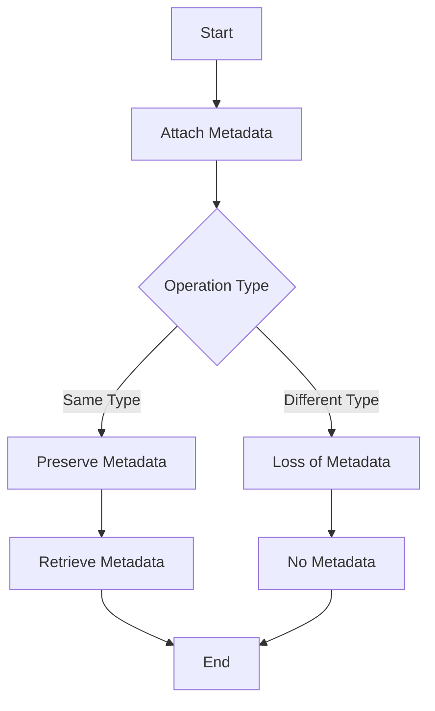

## 7.11. Use of Metadata for Enrichment

Metadata in Clojure is a powerful feature that allows developers to attach additional information to data structures and functions without altering their inherent behavior. This capability enables a wide range of applications, from documentation and type hints to debugging and optimization. In this section, we will explore what metadata is, how it can be used, and its implications in Clojure programming.

### What is Metadata in Clojure?

Metadata is auxiliary information that can be associated with Clojure's immutable data structures, such as lists, vectors, maps, and sets, as well as with functions. This information is stored separately from the data itself, ensuring that the data's behavior remains unchanged. Metadata can be used for various purposes, including documentation, type annotations, and optimization hints.

#### Attaching Metadata

In Clojure, metadata is attached to data structures using the `with-meta` function or the `^` reader macro. The `meta` function is used to retrieve the metadata associated with a data structure.

```clojure
;; Using with-meta to attach metadata
(def my-data (with-meta [1 2 3] {:doc "A vector of numbers"}))

;; Using ^ reader macro to attach metadata
(def my-data ^{:doc "A vector of numbers"} [1 2 3])

;; Retrieving metadata
(meta my-data)
;; => {:doc "A vector of numbers"}
```

### Using Metadata for Various Purposes

Metadata can serve multiple purposes in Clojure, enhancing the functionality and maintainability of your code.

#### Documentation

One of the most common uses of metadata is to provide documentation for data structures and functions. This can be particularly useful for generating API documentation or providing inline comments that do not clutter the code.

```clojure
(defn ^{:doc "Adds two numbers"} add [a b]
  (+ a b))

;; Retrieving function documentation
(:doc (meta #'add))
;; => "Adds two numbers"
```

#### Type Hints

Type hints can be used to optimize performance by providing the Clojure compiler with information about the expected types of function arguments or return values. This can help avoid reflection and improve execution speed.

```clojure
(defn ^long add-long [^long a ^long b]
  (+ a b))
```

#### Annotations and Tags

Metadata can also be used to annotate data with tags or other information that can be used for processing or categorization.

```clojure
(def tagged-data ^{:tag :important} [42 "Answer"])
```

### Preservation and Loss of Metadata

While metadata is a powerful tool, it's important to understand when it is preserved and when it might be lost during operations.

#### Preservation of Metadata

Metadata is preserved when using functions that return the same type of data structure. For example, when using `conj` on a vector, the metadata is retained.

```clojure
(def my-vector ^{:doc "A vector of numbers"} [1 2 3])
(def new-vector (conj my-vector 4))

(meta new-vector)
;; => {:doc "A vector of numbers"}
```

#### Loss of Metadata

Metadata is lost when operations result in a different type of data structure. For instance, converting a vector to a list will result in the loss of metadata.

```clojure
(def my-vector ^{:doc "A vector of numbers"} [1 2 3])
(def my-list (seq my-vector))

(meta my-list)
;; => nil
```

### Use Cases for Metadata

Metadata can be leveraged in various scenarios to enhance the functionality and maintainability of your Clojure code.

#### Serialization

Metadata can be used to store serialization information, such as format or version, which can be helpful when persisting data structures.

```clojure
(def my-data ^{:format :json, :version 1} {:name "Alice", :age 30})
```

#### Debugging

Attaching debugging information to data structures can help trace issues without affecting the program's logic.

```clojure
(def debug-data ^{:debug-info "Initial state"} {:state "active"})
```

#### Optimization

Type hints and other optimization-related metadata can improve performance by guiding the compiler.

```clojure
(defn ^double calculate-area [^double radius]
  (* Math/PI (* radius radius)))
```

### Non-Intrusive Nature of Metadata

One of the key advantages of metadata is its non-intrusive nature. Since metadata is stored separately from the data itself, it does not affect the behavior or the equality of data structures. This allows developers to enrich their code with additional information without altering its core functionality.

### Visualizing Metadata Usage

To better understand how metadata is used in Clojure, let's visualize the process of attaching and retrieving metadata using a flowchart.



**Figure 1:** Flowchart illustrating the process of attaching, preserving, and losing metadata in Clojure.

### Try It Yourself

Experiment with metadata in your Clojure projects by trying the following:

1. Attach metadata to a map and retrieve it.
2. Use metadata to document a function and access the documentation.
3. Apply type hints to a function and observe any performance improvements.
4. Explore how metadata behaves with different operations and data structures.

### References and Links

- [Clojure Documentation on Metadata](https://clojure.org/reference/metadata)
- [ClojureDocs: Metadata Examples](https://clojuredocs.org/clojure.core/with-meta)

### Knowledge Check

To reinforce your understanding of metadata in Clojure, try answering the following questions.

## **Ready to Test Your Knowledge?**



### What is metadata in Clojure?

- [x] Auxiliary information attached to data structures and functions
- [ ] A type of data structure
- [ ] A built-in Clojure function
- [ ] A method for data serialization

> **Explanation:** Metadata is auxiliary information that can be attached to data structures and functions in Clojure.

### How do you attach metadata to a data structure in Clojure?

- [x] Using `with-meta` or the `^` reader macro
- [ ] Using `assoc`
- [ ] Using `conj`
- [ ] Using `meta`

> **Explanation:** Metadata is attached using `with-meta` or the `^` reader macro.

### What function is used to retrieve metadata from a data structure?

- [x] `meta`
- [ ] `with-meta`
- [ ] `assoc`
- [ ] `conj`

> **Explanation:** The `meta` function is used to retrieve metadata from a data structure.

### When is metadata preserved in Clojure?

- [x] When operations return the same type of data structure
- [ ] When converting data structures
- [ ] When using `assoc`
- [ ] When using `dissoc`

> **Explanation:** Metadata is preserved when operations return the same type of data structure.

### What is a common use of metadata in Clojure?

- [x] Documentation
- [ ] Data storage
- [ ] Function execution
- [ ] Memory management

> **Explanation:** Metadata is commonly used for documentation purposes.

### Can metadata affect the behavior of a data structure?

- [x] No
- [ ] Yes
- [ ] Sometimes
- [ ] Only in specific cases

> **Explanation:** Metadata does not affect the behavior of a data structure.

### How can metadata be used for optimization?

- [x] By providing type hints
- [ ] By changing data types
- [ ] By altering function logic
- [ ] By increasing memory usage

> **Explanation:** Metadata can be used for optimization by providing type hints.

### What happens to metadata when converting a vector to a list?

- [x] It is lost
- [ ] It is preserved
- [ ] It is modified
- [ ] It is duplicated

> **Explanation:** Metadata is lost when converting a vector to a list.

### Is metadata intrusive to the data structure it is attached to?

- [x] No
- [ ] Yes
- [ ] Sometimes
- [ ] Only in specific cases

> **Explanation:** Metadata is non-intrusive to the data structure it is attached to.

### True or False: Metadata can be used for debugging purposes.

- [x] True
- [ ] False

> **Explanation:** Metadata can be used for debugging purposes by attaching debugging information to data structures.



Remember, this is just the beginning. As you progress, you'll discover more ways to leverage metadata in Clojure to write robust, efficient, and elegant code. Keep experimenting, stay curious, and enjoy the journey!
