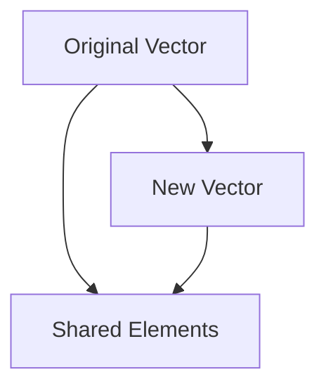

## 7.12. Persistent Data Structures for Sharing Data

In the realm of functional programming, Clojure stands out with its robust support for immutable and persistent data structures. These structures are not only central to Clojure's design but also pivotal in enabling safe and efficient data sharing across different parts of an application. In this section, we will delve into the concept of persistent data structures, explore their role in concurrent programming, and understand how they contribute to writing safer and more performant code.

### Understanding Persistent Data Structures

**Persistent data structures** are a type of data structure that preserves the previous version of itself when modified. Instead of altering the original data, these structures create a new version that reflects the changes, while the old version remains intact. This characteristic is crucial in functional programming, where immutability is a core principle.

#### Key Characteristics

1. **Immutability**: Once created, the data structure cannot be changed. Any operation that would modify the data results in a new data structure.
2. **Structural Sharing**: To optimize memory usage and performance, persistent data structures share parts of the data that remain unchanged between versions.
3. **Efficiency**: Despite their immutability, persistent data structures are designed to be efficient in both time and space, often providing logarithmic time complexity for updates and lookups.

### How Persistent Data Structures Facilitate Safe Sharing

In concurrent programming, data sharing is a common requirement. However, mutable shared data can lead to race conditions and other concurrency issues. Persistent data structures mitigate these problems by ensuring that data is immutable and changes are isolated to new versions.

#### Safe Access Without Conflicts

- **Concurrency**: Since persistent data structures are immutable, multiple threads can safely access the same data without the risk of one thread modifying it and causing inconsistencies.
- **Isolation**: Each modification results in a new version of the data structure, ensuring that changes are isolated and do not affect other parts of the application that rely on the original data.

### Code Examples in Concurrent Contexts

Let's explore how persistent data structures can be used in a concurrent context with Clojure.

```clojure
(ns example.concurrent
  (:require [clojure.core.async :as async]))

(defn process-data [data]
  ;; Simulate data processing
  (Thread/sleep 100)
  (assoc data :processed true))

(defn concurrent-processing [data]
  (let [ch (async/chan 10)]
    ;; Start multiple threads to process data concurrently
    (dotimes [_ 5]
      (async/go
        (let [result (process-data data)]
          (async/>! ch result))))
    ;; Collect results
    (loop [results []]
      (if (< (count results) 5)
        (recur (conj results (async/<!! ch)))
        results))))

(def original-data {:id 1 :value "sample"})

;; Use persistent data structure for safe concurrent processing
(def processed-data (concurrent-processing original-data))

(println "Original Data:" original-data)
(println "Processed Data:" processed-data)
```

In this example, `original-data` remains unchanged even as multiple threads process it concurrently, demonstrating the safety of using persistent data structures.

### Performance Considerations

While persistent data structures offer significant benefits in terms of safety and immutability, they also come with performance considerations.

#### Memory Usage

- **Structural Sharing**: By sharing unchanged parts of the data, persistent data structures minimize memory overhead. However, the creation of new versions can still lead to increased memory usage compared to in-place updates in mutable structures.

#### Time Complexity

- **Efficient Operations**: Operations on persistent data structures, such as updates and lookups, are typically optimized to be logarithmic in time complexity. This efficiency is achieved through advanced data structures like hash array mapped tries (HAMTs) for maps and vectors.

### Promoting Safer Code with Persistent Data Structures

The use of persistent data structures in Clojure promotes safer code by eliminating common pitfalls associated with mutable state.

#### Benefits

1. **Predictability**: With immutability, the state of data structures is predictable, reducing bugs related to unexpected state changes.
2. **Ease of Reasoning**: Developers can reason about code more easily when data structures do not change unexpectedly.
3. **Simplified Concurrency**: By removing the need for locks and other synchronization mechanisms, persistent data structures simplify concurrent programming.

### Visualizing Structural Sharing

To better understand how structural sharing works, let's visualize it using a simple example of a vector.



In this diagram, the original vector shares elements with the new vector, illustrating how structural sharing minimizes memory usage.

### Try It Yourself

Experiment with the provided code example by modifying the number of threads or the data being processed. Observe how the use of persistent data structures ensures that the original data remains unchanged, regardless of concurrent modifications.

### Further Reading

For more information on persistent data structures and their implementation in Clojure, consider exploring the following resources:

- [Clojure's Official Documentation on Data Structures](https://clojure.org/reference/data_structures)
- [Rich Hickey's Talk on Persistent Data Structures](https://www.youtube.com/watch?v=I7Gx7mU8xTg)

### Knowledge Check

To reinforce your understanding of persistent data structures, try answering the following questions.

## **Ready to Test Your Knowledge?**



### What is a key characteristic of persistent data structures?

- [x] Immutability
- [ ] Mutability
- [ ] Volatility
- [ ] Transience

> **Explanation:** Persistent data structures are immutable, meaning they do not change once created.

### How do persistent data structures optimize memory usage?

- [x] Structural Sharing
- [ ] Copying all data
- [ ] Using mutable arrays
- [ ] Deleting old versions

> **Explanation:** Structural sharing allows persistent data structures to share unchanged parts of the data, minimizing memory usage.

### What is a benefit of using persistent data structures in concurrent programming?

- [x] Safe data sharing
- [ ] Increased complexity
- [ ] Data corruption
- [ ] Race conditions

> **Explanation:** Persistent data structures enable safe data sharing by ensuring immutability, which prevents data corruption and race conditions.

### Which operation is typically optimized in persistent data structures?

- [x] Updates
- [ ] Deletions
- [ ] Sorting
- [ ] Copying

> **Explanation:** Updates in persistent data structures are optimized to be efficient, often with logarithmic time complexity.

### What is the role of structural sharing in persistent data structures?

- [x] Minimizing memory usage
- [ ] Increasing memory usage
- [ ] Slowing down operations
- [ ] Making data mutable

> **Explanation:** Structural sharing minimizes memory usage by sharing unchanged parts of the data between versions.

### How do persistent data structures promote safer code?

- [x] By eliminating mutable state
- [ ] By allowing direct modifications
- [ ] By using global variables
- [ ] By increasing complexity

> **Explanation:** Persistent data structures promote safer code by eliminating mutable state, making code more predictable and easier to reason about.

### What is a common performance consideration with persistent data structures?

- [x] Memory usage
- [ ] Data loss
- [ ] Increased speed
- [ ] Simplified algorithms

> **Explanation:** While persistent data structures optimize memory usage through structural sharing, the creation of new versions can still lead to increased memory usage.

### What is an advantage of immutability in persistent data structures?

- [x] Predictability
- [ ] Complexity
- [ ] Volatility
- [ ] Inconsistency

> **Explanation:** Immutability ensures that data structures are predictable, reducing bugs related to unexpected state changes.

### Which Clojure feature is essential for concurrent programming with persistent data structures?

- [x] Core.Async
- [ ] Mutable arrays
- [ ] Global state
- [ ] Direct memory access

> **Explanation:** Core.Async is essential for concurrent programming in Clojure, allowing safe and efficient data sharing with persistent data structures.

### True or False: Persistent data structures in Clojure can lead to race conditions.

- [ ] True
- [x] False

> **Explanation:** Persistent data structures are immutable, which prevents race conditions by ensuring that data cannot be modified concurrently.



Remember, mastering persistent data structures is just the beginning. As you continue your journey with Clojure, you'll discover even more powerful techniques for writing robust and efficient code. Keep experimenting, stay curious, and enjoy the journey!
