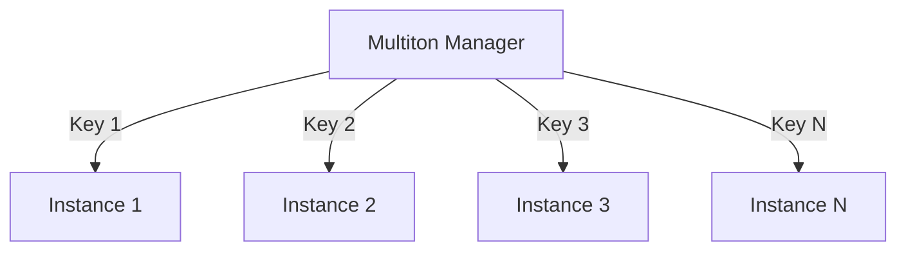

## 7.13. The Multiton Pattern with Dynamic Vars

### Introduction

In the world of software design patterns, the Singleton pattern is well-known for ensuring that a class has only one instance and provides a global point of access to it. However, there are scenarios where you might need multiple instances, each identified by a unique key. This is where the Multiton pattern comes into play. In this section, we will explore the Multiton pattern and how it can be effectively implemented in Clojure using dynamic vars.

### Understanding the Multiton Pattern

#### Definition

The Multiton pattern is a variation of the Singleton pattern. While the Singleton pattern restricts a class to a single instance, the Multiton pattern allows for multiple instances, each associated with a unique key. This pattern is particularly useful when you need to manage a set of related objects that should be globally accessible but distinct from each other.

#### Differences from Singleton

- **Multiple Instances**: Unlike Singleton, which has only one instance, Multiton allows multiple instances, each identified by a key.
- **Key-Based Access**: Instances are accessed using keys, providing a way to manage and retrieve specific instances.
- **Flexibility**: Offers more flexibility in managing instances compared to Singleton, which is limited to a single instance.

### Implementing the Multiton Pattern with Dynamic Vars

In Clojure, dynamic vars provide a powerful mechanism for implementing the Multiton pattern. Dynamic vars are mutable and can be rebound within a thread, making them suitable for managing multiple instances in a concurrent environment.

#### Dynamic Vars in Clojure

Dynamic vars are special variables in Clojure that can be dynamically rebound within a thread. They are declared using `def` with the `^:dynamic` metadata. Here's a simple example:

```clojure
(def ^:dynamic *my-var* "Initial Value")

(binding [*my-var* "New Value"]
  (println *my-var*)) ; Prints "New Value"

(println *my-var*) ; Prints "Initial Value"
```

In this example, `*my-var*` is a dynamic var that is temporarily rebound within the `binding` form.

#### Using Dynamic Vars for Multiton

To implement the Multiton pattern, we can use a dynamic var to hold a map of instances, where each instance is associated with a unique key. Here's how we can achieve this:

```clojure
(def ^:dynamic *instances* (atom {}))

(defn get-instance [key]
  (if-let [instance (get @*instances* key)]
    instance
    (let [new-instance (create-instance key)]
      (swap! *instances* assoc key new-instance)
      new-instance)))

(defn create-instance [key]
  ;; Create a new instance based on the key
  {:key key :data (str "Instance for " key)})
```

In this implementation:

- `*instances*` is a dynamic var holding an atom, which is a map of instances.
- `get-instance` retrieves an instance by key, creating a new one if it doesn't exist.
- `create-instance` is a helper function to create a new instance.

### Accessing and Managing Instances

#### Accessing Instances

Instances can be accessed using the `get-instance` function, which ensures that each key has a corresponding instance. This function checks if an instance exists for the given key and returns it; otherwise, it creates a new instance.

#### Managing Instances

Managing instances involves adding, updating, and removing instances from the multiton. Here's how you can manage these operations:

```clojure
(defn add-instance [key instance]
  (swap! *instances* assoc key instance))

(defn update-instance [key update-fn]
  (swap! *instances* update key update-fn))

(defn remove-instance [key]
  (swap! *instances* dissoc key))
```

- `add-instance` adds a new instance for a given key.
- `update-instance` updates an existing instance using a provided function.
- `remove-instance` removes an instance associated with a key.

### Thread-Local Bindings

Dynamic vars in Clojure support thread-local bindings, which means that changes to a dynamic var within a `binding` form are local to the current thread. This feature is particularly useful in concurrent programming, where you want to ensure that changes to shared data do not affect other threads.

#### Example of Thread-Local Bindings

```clojure
(def ^:dynamic *config* {:env "production"})

(defn print-config []
  (println "Current config:" *config*))

(defn run-with-test-config []
  (binding [*config* {:env "test"}]
    (print-config)))

(print-config) ; Prints "Current config: {:env \"production\"}"
(run-with-test-config) ; Prints "Current config: {:env \"test\"}"
(print-config) ; Prints "Current config: {:env \"production\"}"
```

In this example, `*config*` is a dynamic var that is temporarily rebound to a test configuration within the `run-with-test-config` function.

### Use Cases and Potential Issues

#### Use Cases

- **Configuration Management**: Managing different configurations for different environments (e.g., development, testing, production).
- **Resource Management**: Handling multiple resources, such as database connections or network sockets, identified by unique keys.
- **State Management**: Managing stateful objects in a concurrent environment where each state is associated with a unique key.

#### Potential Issues

- **Concurrency**: While dynamic vars provide thread-local bindings, care must be taken when accessing shared data to avoid race conditions.
- **Memory Usage**: Storing multiple instances can lead to increased memory usage, especially if instances are not properly managed or released.
- **Complexity**: Managing multiple instances can add complexity to the codebase, especially if the logic for creating and managing instances is not well-defined.

### Visualizing the Multiton Pattern

To better understand the Multiton pattern, let's visualize it using a diagram. The diagram below illustrates how multiple instances are managed using keys:



**Diagram Description**: The Multiton Manager holds multiple instances, each identified by a unique key. Instances can be accessed and managed through the manager.

### Try It Yourself

To gain a deeper understanding of the Multiton pattern, try modifying the code examples provided. Here are a few suggestions:

- **Add Logging**: Modify the `get-instance` function to log when a new instance is created.
- **Thread Safety**: Experiment with accessing instances from multiple threads to see how dynamic vars handle concurrency.
- **Custom Instances**: Implement a custom `create-instance` function that generates instances with different properties based on the key.

### Conclusion

The Multiton pattern is a powerful design pattern that extends the capabilities of the Singleton pattern by allowing multiple instances identified by keys. In Clojure, dynamic vars provide a flexible and efficient way to implement this pattern, especially in concurrent environments. By understanding and applying the Multiton pattern, you can manage complex sets of related objects with ease.

### Ready to Test Your Knowledge?



### What is the primary difference between the Singleton and Multiton patterns?

- [x] Multiton allows multiple instances identified by keys, while Singleton allows only one instance.
- [ ] Singleton allows multiple instances identified by keys, while Multiton allows only one instance.
- [ ] Both patterns allow only one instance.
- [ ] Both patterns allow multiple instances identified by keys.

> **Explanation:** The Multiton pattern allows multiple instances, each identified by a unique key, whereas the Singleton pattern restricts to a single instance.

### How are dynamic vars declared in Clojure?

- [x] Using `def` with the `^:dynamic` metadata.
- [ ] Using `def` with the `^:static` metadata.
- [ ] Using `let` with the `^:dynamic` metadata.
- [ ] Using `var` with the `^:dynamic` metadata.

> **Explanation:** Dynamic vars in Clojure are declared using `def` with the `^:dynamic` metadata, allowing them to be dynamically rebound.

### What is the purpose of the `binding` form in Clojure?

- [x] To temporarily rebind dynamic vars within a thread.
- [ ] To permanently change the value of a dynamic var.
- [ ] To create a new dynamic var.
- [ ] To delete a dynamic var.

> **Explanation:** The `binding` form is used to temporarily rebind dynamic vars within the scope of a thread.

### Which function is used to add a new instance in the Multiton pattern?

- [x] `add-instance`
- [ ] `get-instance`
- [ ] `remove-instance`
- [ ] `update-instance`

> **Explanation:** The `add-instance` function is used to add a new instance associated with a key in the Multiton pattern.

### What is a potential issue when using the Multiton pattern?

- [x] Increased memory usage due to multiple instances.
- [ ] Difficulty in creating instances.
- [ ] Lack of flexibility in managing instances.
- [ ] Inability to access instances by key.

> **Explanation:** The Multiton pattern can lead to increased memory usage if instances are not properly managed or released.

### How can you ensure thread safety when accessing instances in the Multiton pattern?

- [x] Use thread-local bindings with dynamic vars.
- [ ] Use global variables.
- [ ] Avoid using keys.
- [ ] Use static methods.

> **Explanation:** Thread-local bindings with dynamic vars help ensure thread safety by allowing temporary rebinding within a thread.

### What is a common use case for the Multiton pattern?

- [x] Managing different configurations for different environments.
- [ ] Creating a single instance for global access.
- [ ] Managing unrelated objects.
- [ ] Avoiding the use of keys.

> **Explanation:** The Multiton pattern is commonly used for managing different configurations for different environments, where each configuration is identified by a key.

### What does the `swap!` function do in the context of atoms?

- [x] It updates the value of an atom using a function.
- [ ] It creates a new atom.
- [ ] It deletes an atom.
- [ ] It reads the value of an atom.

> **Explanation:** The `swap!` function updates the value of an atom by applying a function to its current value.

### Can dynamic vars be used for managing global state?

- [x] Yes, they can be dynamically rebound within threads.
- [ ] No, they are only for local state management.
- [ ] No, they cannot be rebound.
- [ ] Yes, but only for static values.

> **Explanation:** Dynamic vars can be used for managing global state as they allow dynamic rebinding within threads.

### True or False: The Multiton pattern is suitable for managing a single instance.

- [ ] True
- [x] False

> **Explanation:** The Multiton pattern is designed for managing multiple instances, each identified by a unique key, not a single instance.



Remember, this is just the beginning. As you progress, you'll build more complex and interactive applications using the Multiton pattern. Keep experimenting, stay curious, and enjoy the journey!
