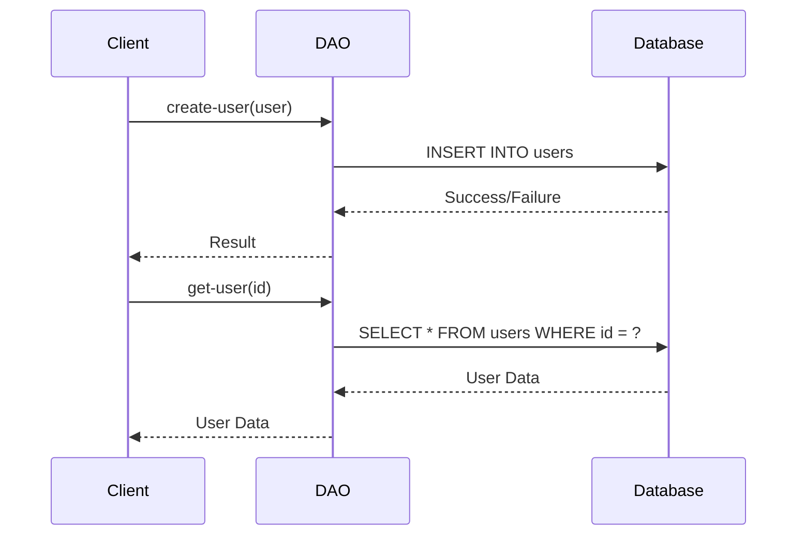

## 7.14. Data Access Object (DAO) Pattern

The Data Access Object (DAO) pattern is a structural design pattern that provides an abstract interface to some type of database or other persistence mechanism. By mapping application calls to the persistence layer, the DAO pattern provides a separation between the business logic and data access layers, enhancing modularity and maintainability.

### Intent

The primary intent of the DAO pattern is to abstract and encapsulate all access to the data source. This separation allows for a more modular application architecture, where the business logic is decoupled from the data access logic. This decoupling facilitates easier testing, maintenance, and potential changes in the data source without affecting the business logic.

### Key Participants

- **DAO Interface**: Defines the standard operations to be performed on a model object(s).
- **Concrete DAO Class**: Implements the DAO interface and interacts with the data source.
- **Model Object**: Represents the data that is being accessed or manipulated.
- **Client**: Uses the DAO to perform operations on the data.

### Applicability

Use the DAO pattern when you need to:

- Separate the data access logic from the business logic.
- Provide a clear API for data operations.
- Facilitate testing by mocking the data access layer.
- Support multiple data sources or change data sources without affecting business logic.

### Implementing DAOs in Clojure

In Clojure, implementing the DAO pattern involves creating a set of functions or protocols that define the operations for interacting with the data source. Let's explore how to implement a DAO pattern in Clojure with a practical example.

#### Example: Implementing a DAO for a User Entity

Suppose we have a simple user entity with fields like `id`, `name`, and `email`. We will create a DAO to handle CRUD (Create, Read, Update, Delete) operations for this entity.

```clojure
(ns user-dao
  (:require [clojure.java.jdbc :as jdbc]))

(def db-spec {:subprotocol "h2"
              :subname "//localhost:9092/mem:testdb"
              :user "sa"
              :password ""})

(defprotocol UserDAO
  (create-user [this user])
  (get-user [this id])
  (update-user [this user])
  (delete-user [this id]))

(defrecord UserDAOImpl []
  UserDAO
  (create-user [this user]
    (jdbc/insert! db-spec :users user))
  (get-user [this id]
    (jdbc/query db-spec ["SELECT * FROM users WHERE id = ?" id]))
  (update-user [this user]
    (jdbc/update! db-spec :users user ["id = ?" (:id user)]))
  (delete-user [this id]
    (jdbc/delete! db-spec :users ["id = ?" id])))

(defn make-user-dao []
  (->UserDAOImpl))
```

In this example, we define a `UserDAO` protocol with CRUD operations and implement it in the `UserDAOImpl` record. The `jdbc` library is used for database interactions.

### Benefits of the DAO Pattern

1. **Separation of Concerns**: By separating data access logic from business logic, the DAO pattern promotes a clean architecture.
2. **Testability**: DAOs can be easily mocked or stubbed, facilitating unit testing of business logic without requiring a live database.
3. **Maintainability**: Changes to the data source or data access logic are isolated within the DAO, minimizing the impact on other parts of the application.
4. **Flexibility**: DAOs can be implemented to support multiple data sources, allowing for easy switching or integration of new data sources.

### Best Practices for DAO Implementation

1. **Error Handling**: Implement robust error handling within DAOs to manage database exceptions and ensure that resources are properly released.
2. **Resource Management**: Use connection pooling and ensure that database connections are closed after use to prevent resource leaks.
3. **Transaction Management**: Consider using transactions for operations that require atomicity to ensure data consistency.
4. **Use of Protocols**: Define protocols for DAOs to provide a clear contract for data operations, facilitating polymorphism and flexibility.

### Error Handling and Resource Management

Error handling and resource management are critical aspects of implementing DAOs. Let's explore how to handle these effectively in Clojure.

#### Error Handling

Clojure provides several mechanisms for error handling, including `try`, `catch`, and `finally` blocks. Here's an example of handling errors in a DAO method:

```clojure
(defn safe-get-user [dao id]
  (try
    (get-user dao id)
    (catch Exception e
      (println "Error fetching user:" (.getMessage e))
      nil)))
```

In this example, we wrap the `get-user` call in a `try` block and catch any exceptions, logging an error message and returning `nil`.

#### Resource Management

Using connection pooling is a common practice for managing database resources efficiently. Libraries like HikariCP can be integrated with Clojure to manage database connections.

```clojure
(def db-pool
  (let [config {:jdbc-url "jdbc:h2:mem:testdb"
                :username "sa"
                :password ""
                :maximum-pool-size 10}]
    (HikariDataSource. (HikariConfig. config))))
```

### Try It Yourself

Experiment with the DAO pattern by modifying the example code. Try adding new methods to the `UserDAO` protocol, such as `find-users-by-name`, and implement them in the `UserDAOImpl` record. Test your implementation by interacting with the database using different queries.

### Visualizing the DAO Pattern

To better understand the DAO pattern, let's visualize the interaction between the components using a sequence diagram.



This diagram illustrates the sequence of interactions between the client, DAO, and database for creating and retrieving a user.

### Conclusion

The Data Access Object (DAO) pattern is a powerful tool for managing data access in Clojure applications. By abstracting the data access logic, it promotes a clean separation of concerns, enhances testability, and improves maintainability. Implementing DAOs in Clojure involves defining protocols and records, managing resources efficiently, and handling errors gracefully. By following best practices, you can create robust and flexible data access layers that support your application's needs.

## **Ready to Test Your Knowledge?**



### What is the primary intent of the DAO pattern?

- [x] To abstract and encapsulate all access to the data source.
- [ ] To enhance the performance of database operations.
- [ ] To provide a user interface for database management.
- [ ] To replace the need for a database.

> **Explanation:** The primary intent of the DAO pattern is to abstract and encapsulate all access to the data source, providing a separation between business logic and data access layers.

### Which Clojure construct is used to define a DAO interface?

- [ ] defn
- [ ] defrecord
- [x] defprotocol
- [ ] defmacro

> **Explanation:** In Clojure, a DAO interface is typically defined using `defprotocol`, which specifies the operations that the DAO should implement.

### What is a key benefit of using the DAO pattern?

- [x] It enhances testability by allowing data access logic to be mocked.
- [ ] It eliminates the need for a database.
- [ ] It automatically optimizes database queries.
- [ ] It provides a graphical user interface for data access.

> **Explanation:** One of the key benefits of the DAO pattern is that it enhances testability by allowing the data access logic to be mocked or stubbed, facilitating unit testing.

### How can error handling be implemented in a Clojure DAO?

- [x] Using try, catch, and finally blocks.
- [ ] By ignoring exceptions.
- [ ] By using global variables.
- [ ] By writing custom exception classes.

> **Explanation:** Error handling in a Clojure DAO can be implemented using `try`, `catch`, and `finally` blocks to manage exceptions and ensure resources are released properly.

### What is a common practice for managing database resources in Clojure?

- [ ] Using global variables.
- [x] Using connection pooling.
- [ ] Using hard-coded connections.
- [ ] Using file-based databases.

> **Explanation:** A common practice for managing database resources in Clojure is using connection pooling, which efficiently manages database connections.

### Which of the following is a method defined in the UserDAO protocol?

- [x] create-user
- [ ] connect-database
- [ ] close-connection
- [ ] execute-query

> **Explanation:** The `create-user` method is defined in the `UserDAO` protocol for creating a new user in the database.

### What is the purpose of the `defrecord` construct in the DAO implementation?

- [ ] To define a new database.
- [x] To implement the DAO interface.
- [ ] To create a new protocol.
- [ ] To manage database connections.

> **Explanation:** The `defrecord` construct is used to implement the DAO interface, providing concrete implementations of the defined methods.

### What is the role of the client in the DAO pattern?

- [x] To use the DAO to perform operations on the data.
- [ ] To manage database connections.
- [ ] To define the DAO interface.
- [ ] To implement the DAO methods.

> **Explanation:** In the DAO pattern, the client uses the DAO to perform operations on the data, interacting with the data access layer.

### Which library is used in the example to interact with the database?

- [ ] clojure.core
- [x] clojure.java.jdbc
- [ ] clojure.data.json
- [ ] clojure.string

> **Explanation:** The `clojure.java.jdbc` library is used in the example to interact with the database, providing functions for executing SQL queries.

### True or False: The DAO pattern can support multiple data sources.

- [x] True
- [ ] False

> **Explanation:** True. The DAO pattern can be implemented to support multiple data sources, allowing for flexibility in data access.


