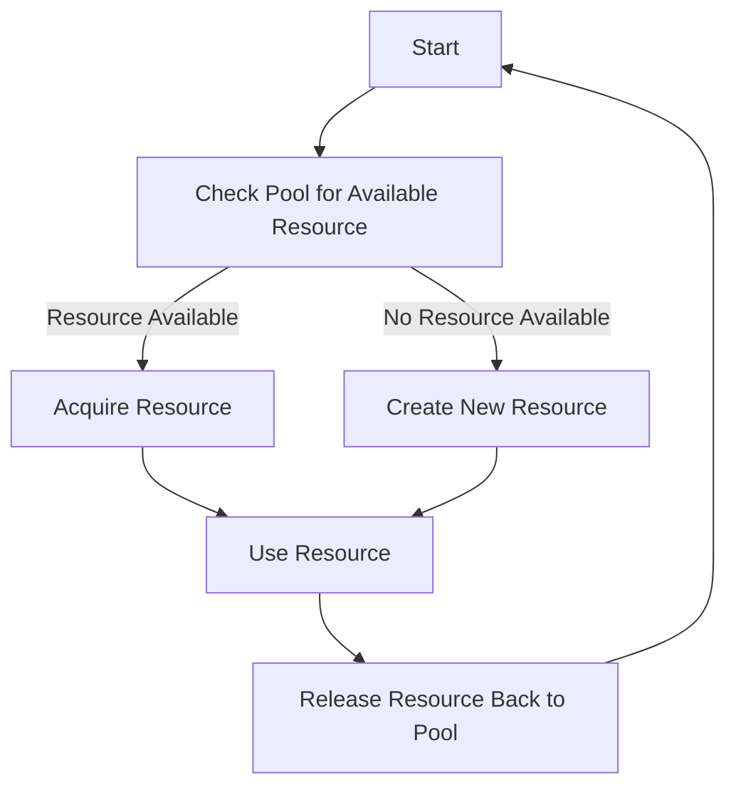

## 7.2 Object Pool in Clojure

In modern software development, efficient resource management is crucial, especially when dealing with expensive-to-create objects such as database connections, network sockets, or thread pools. The Object Pool design pattern provides a solution by reusing objects, thereby reducing the overhead associated with object creation and garbage collection. This article delves into the implementation of the Object Pool pattern in Clojure, leveraging its functional programming paradigms and concurrency primitives.

### Introduction to the Object Pool Pattern

The Object Pool pattern is a creational design pattern that manages a set of initialized objects ready for use. Instead of creating a new object every time one is needed, the pattern allows for the reuse of existing objects, which can significantly enhance performance and resource utilization.

#### Key Benefits:
- **Performance Improvement:** Reduces the time and resources required to create new objects.
- **Resource Management:** Limits the number of objects in use, preventing resource exhaustion.
- **Garbage Collection Reduction:** Minimizes the frequency of garbage collection by reusing objects.

### Detailed Explanation

In Clojure, the Object Pool pattern can be effectively implemented using atoms or agents to manage the pool state in a thread-safe manner. Atoms provide a straightforward way to handle state changes atomically, ensuring that the pool remains consistent even in a concurrent environment.

#### Components of the Object Pool Pattern:
1. **Resource Pool:** A collection of reusable objects.
2. **Acquire Resource:** A method to retrieve an object from the pool.
3. **Release Resource:** A method to return an object to the pool.
4. **Resource Creation:** A fallback mechanism to create new resources if the pool is empty.

### Visualizing the Object Pool Pattern

Let's visualize the workflow of the Object Pool pattern using a conceptual diagram:



### Implementing the Object Pool in Clojure

#### Step 1: Initialize an Atom to Hold the Pool

We start by defining an atom to manage the pool of resources. This atom will hold a vector of resources that can be reused.

```clojure
(def resource-pool (atom []))
```

#### Step 2: Create Functions to Acquire and Release Resources

Next, we define functions to acquire and release resources. The `acquire-resource` function retrieves a resource from the pool, and if none are available, it creates a new one. The `release-resource` function returns a resource to the pool.

```clojure
(defn create-new-resource []
  ;; Placeholder for resource creation logic
  (println "Creating a new resource")
  {})

(defn acquire-resource []
  (let [resource (first @resource-pool)]
    (if resource
      (do
        (swap! resource-pool rest)
        resource)
      (create-new-resource))))

(defn release-resource [resource]
  (swap! resource-pool conj resource))
```

#### Step 3: Use the Pool in Application Code

The following function demonstrates how to use the resource pool within application logic. It acquires a resource, performs operations, and ensures the resource is released back to the pool.

```clojure
(defn do-something-with [resource]
  ;; Placeholder for operations using the resource
  (println "Using resource"))

(defn use-resource-pool []
  (let [res (acquire-resource)]
    (try
      (do-something-with res)
      (finally
        (release-resource res)))))
```

### Best Practices and Considerations

#### Ensure Thread Safety

All modifications to the pool should be done atomically to prevent race conditions. Clojure's atoms provide atomic state transitions, ensuring thread safety.

#### Implement Pool Size Limits

To prevent exhausting system resources, consider implementing limits on the pool size. This can be achieved by checking the pool size before adding new resources.

#### Consider Using Existing Libraries

For more advanced pooling needs, consider using existing libraries such as `commons-pool2` via Java interop. These libraries offer robust features like resource validation and eviction policies.

### Advantages and Disadvantages

#### Advantages:
- **Efficiency:** Reduces the cost of object creation and garbage collection.
- **Scalability:** Manages resources effectively, supporting high-load scenarios.

#### Disadvantages:
- **Complexity:** Introduces additional complexity in managing the pool.
- **Resource Management:** Requires careful handling to avoid resource leaks.

### Conclusion

The Object Pool pattern is a powerful tool for managing expensive-to-create resources efficiently. By leveraging Clojure's concurrency primitives, developers can implement this pattern in a thread-safe manner, enhancing application performance and resource utilization. As with any design pattern, it's essential to weigh the benefits against the complexity it introduces and consider using existing libraries for advanced requirements.

## Quiz Time!



### What is the primary purpose of the Object Pool pattern?

- [x] To reuse objects that are expensive to create
- [ ] To create new objects for every request
- [ ] To manage immutable data structures
- [ ] To simplify function composition

> **Explanation:** The Object Pool pattern is designed to reuse objects that are expensive to create, such as database connections, to improve performance and resource management.

### Which Clojure construct is commonly used to manage the state of an object pool?

- [x] Atom
- [ ] Ref
- [ ] Var
- [ ] Delay

> **Explanation:** Atoms are commonly used in Clojure to manage the state of an object pool due to their ability to handle atomic state transitions.

### What is a potential disadvantage of using the Object Pool pattern?

- [x] It introduces additional complexity
- [ ] It reduces performance
- [ ] It increases garbage collection frequency
- [ ] It simplifies resource management

> **Explanation:** While the Object Pool pattern can improve performance, it introduces additional complexity in managing the pool and ensuring resources are properly handled.

### How does the `acquire-resource` function handle an empty pool?

- [x] It creates a new resource
- [ ] It throws an exception
- [ ] It returns `nil`
- [ ] It waits for a resource to become available

> **Explanation:** The `acquire-resource` function creates a new resource if the pool is empty, ensuring that the application can continue to function.

### What is the role of the `release-resource` function?

- [x] To return a resource to the pool
- [ ] To remove a resource from the pool
- [ ] To create a new resource
- [ ] To check the pool size

> **Explanation:** The `release-resource` function returns a resource to the pool, making it available for future use.

### Why is thread safety important in the Object Pool pattern?

- [x] To prevent race conditions
- [ ] To increase resource creation speed
- [ ] To simplify code structure
- [ ] To enhance garbage collection

> **Explanation:** Thread safety is crucial in the Object Pool pattern to prevent race conditions and ensure consistent pool state in a concurrent environment.

### What is a benefit of using existing libraries like `commons-pool2`?

- [x] They offer advanced features like resource validation
- [ ] They simplify the creation of new resources
- [ ] They eliminate the need for thread safety
- [ ] They reduce the need for garbage collection

> **Explanation:** Libraries like `commons-pool2` offer advanced features such as resource validation and eviction policies, which can enhance the robustness of the object pool.

### What is a common use case for the Object Pool pattern?

- [x] Database connection management
- [ ] Immutable data structure manipulation
- [ ] Function composition
- [ ] Lazy sequence generation

> **Explanation:** A common use case for the Object Pool pattern is managing database connections, which are expensive to create and can benefit from reuse.

### How can pool size limits be implemented in Clojure?

- [x] By checking the pool size before adding new resources
- [ ] By using a fixed-size vector
- [ ] By limiting the number of threads
- [ ] By using lazy sequences

> **Explanation:** Pool size limits can be implemented by checking the pool size before adding new resources, ensuring that system resources are not exhausted.

### True or False: The Object Pool pattern reduces the frequency of garbage collection.

- [x] True
- [ ] False

> **Explanation:** The Object Pool pattern reduces the frequency of garbage collection by reusing objects, which minimizes the creation of new objects and the associated garbage collection overhead.


