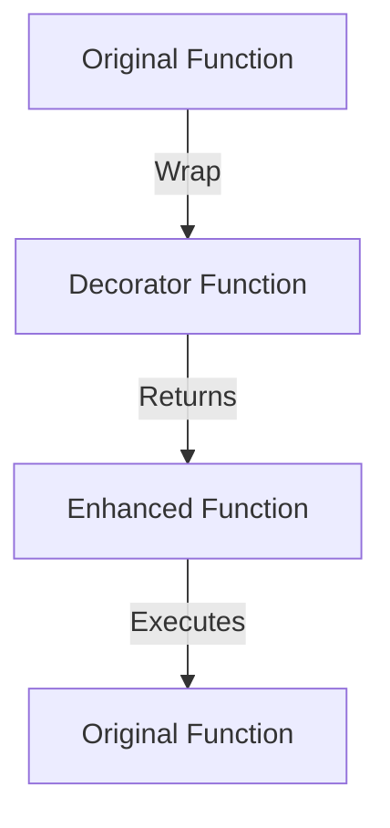

## 7.2. Decorator Pattern with Function Wrapping

The Decorator Pattern is a structural design pattern that allows behavior to be added to individual objects, either statically or dynamically, without affecting the behavior of other objects from the same class. In Clojure, a functional programming language, we can implement this pattern using function wrapping. This approach enables us to dynamically augment the behavior of functions without modifying their original implementation.

### Intent

The primary intent of the Decorator Pattern is to provide a flexible alternative to subclassing for extending functionality. By wrapping functions, we can add new behaviors or responsibilities to existing functions in a modular and reusable way.

### Key Participants

- **Component**: The original function that needs to be extended.
- **Decorator**: A higher-order function that wraps the component to add new behavior.
- **Concrete Decorator**: Specific implementations of decorators that add particular functionalities.

### Applicability

Use the Decorator Pattern when:

- You want to add responsibilities to individual objects dynamically and transparently.
- You want to avoid subclassing to extend functionality.
- You need to add functionalities that can be withdrawn.

### Clojure Unique Features

Clojure's support for higher-order functions and closures makes it particularly well-suited for implementing the Decorator Pattern. The language's emphasis on immutability and function composition allows decorators to be composed and reused easily.

### Implementing the Decorator Pattern in Clojure

In Clojure, we can implement the Decorator Pattern by creating higher-order functions that wrap existing functions. Let's explore this concept with examples.

#### Example 1: Logging Decorator

A common use case for decorators is logging. We can create a logging decorator that logs the input and output of a function.

```clojure
(defn log-decorator [f]
  (fn [& args]
    (println "Calling with arguments:" args)
    (let [result (apply f args)]
      (println "Result:" result)
      result)))

(defn add [a b]
  (+ a b))

(def logged-add (log-decorator add))

;; Usage
(logged-add 3 4)
;; Output:
;; Calling with arguments: (3 4)
;; Result: 7
```

In this example, `log-decorator` is a higher-order function that takes a function `f` and returns a new function that logs the arguments and result of `f`.

#### Example 2: Caching Decorator

Another common use case is caching. We can create a caching decorator that stores the results of function calls to avoid redundant computations.

```clojure
(defn cache-decorator [f]
  (let [cache (atom {})]
    (fn [& args]
      (if-let [cached-result (get @cache args)]
        cached-result
        (let [result (apply f args)]
          (swap! cache assoc args result)
          result)))))

(defn expensive-computation [x]
  (Thread/sleep 1000) ;; Simulate a time-consuming computation
  (* x x))

(def cached-computation (cache-decorator expensive-computation))

;; Usage
(time (cached-computation 5)) ;; Takes time
(time (cached-computation 5)) ;; Returns instantly
```

Here, `cache-decorator` uses an `atom` to store cached results. The decorator checks if the result for the given arguments is already cached and returns it if available; otherwise, it computes the result and caches it.

### Higher-Order Functions and Closures

Higher-order functions are functions that take other functions as arguments or return them as results. Closures are functions that capture the lexical scope in which they were defined. In Clojure, decorators are typically implemented as higher-order functions that return closures.

#### Flexibility and Composability

One of the strengths of using function wrapping in Clojure is the ability to compose decorators. You can apply multiple decorators to a function by chaining them together.

```clojure
(def logged-and-cached-computation
  (-> expensive-computation
      cache-decorator
      log-decorator))

;; Usage
(logged-and-cached-computation 5)
```

In this example, we first apply the `cache-decorator` and then the `log-decorator`, demonstrating how decorators can be composed to build complex behaviors.

### Design Considerations

- **Performance**: Be mindful of the performance implications of adding multiple layers of decorators, especially if they involve I/O operations like logging.
- **Order of Application**: The order in which decorators are applied can affect the behavior of the decorated function.
- **State Management**: If decorators maintain state (e.g., caching), ensure that state is managed correctly to avoid unintended side effects.

### Differences and Similarities

The Decorator Pattern is often confused with the Proxy Pattern. While both involve wrapping functions, the Proxy Pattern is primarily used for controlling access to an object, whereas the Decorator Pattern is used for adding behavior.

### Visualizing the Decorator Pattern

Below is a diagram illustrating the flow of function wrapping in the Decorator Pattern:



**Diagram Description**: This diagram shows how an original function is wrapped by a decorator function, resulting in an enhanced function that executes the original function with additional behavior.

### Try It Yourself

Experiment with the provided code examples by modifying the decorators to add different behaviors, such as timing the execution of functions or handling exceptions.

### References and Links

- [Clojure Documentation](https://clojure.org/reference/documentation)
- [Functional Programming in Clojure](https://www.braveclojure.com/)

### Knowledge Check

## **Ready to Test Your Knowledge?**



### What is the primary purpose of the Decorator Pattern?

- [x] To add behavior to individual objects dynamically
- [ ] To create a new class hierarchy
- [ ] To encapsulate object creation
- [ ] To provide a global point of access

> **Explanation:** The Decorator Pattern is used to add behavior to individual objects dynamically without affecting other objects from the same class.

### How can we implement the Decorator Pattern in Clojure?

- [x] By using higher-order functions to wrap existing functions
- [ ] By subclassing existing classes
- [ ] By using global variables
- [ ] By modifying the original function directly

> **Explanation:** In Clojure, the Decorator Pattern is implemented using higher-order functions that wrap existing functions to add new behavior.

### What is a common use case for decorators?

- [x] Logging function calls
- [ ] Creating new data types
- [ ] Managing memory allocation
- [ ] Compiling code

> **Explanation:** A common use case for decorators is logging function calls to track input and output.

### What is the role of closures in implementing decorators?

- [x] They capture the lexical scope and allow state to be maintained
- [ ] They provide a way to subclass functions
- [ ] They are used to compile functions
- [ ] They are used to manage memory

> **Explanation:** Closures capture the lexical scope in which they are defined, allowing decorators to maintain state if needed.

### Which of the following is a benefit of using decorators in Clojure?

- [x] Flexibility and composability
- [ ] Increased memory usage
- [ ] Reduced code readability
- [ ] Increased complexity

> **Explanation:** Decorators provide flexibility and composability, allowing multiple behaviors to be added to functions in a modular way.

### What is a potential downside of using multiple decorators?

- [x] Performance overhead
- [ ] Reduced functionality
- [ ] Increased memory usage
- [ ] Decreased code modularity

> **Explanation:** Using multiple decorators can introduce performance overhead, especially if they involve I/O operations.

### How does the order of applying decorators affect the behavior?

- [x] The order can change the behavior of the decorated function
- [ ] The order does not matter
- [ ] The order only affects performance
- [ ] The order affects memory usage

> **Explanation:** The order in which decorators are applied can affect the behavior of the decorated function, as each decorator adds its behavior.

### What is the difference between the Decorator and Proxy Patterns?

- [x] Decorators add behavior, while Proxies control access
- [ ] Proxies add behavior, while Decorators control access
- [ ] Both patterns are identical
- [ ] Neither pattern involves function wrapping

> **Explanation:** The Decorator Pattern adds behavior to functions, while the Proxy Pattern is used to control access to an object.

### What is a key feature of higher-order functions in Clojure?

- [x] They can take functions as arguments or return them as results
- [ ] They are used for memory management
- [ ] They are only used for recursion
- [ ] They cannot be composed

> **Explanation:** Higher-order functions can take other functions as arguments or return them as results, making them ideal for implementing decorators.

### True or False: Decorators in Clojure can only be applied to pure functions.

- [ ] True
- [x] False

> **Explanation:** Decorators in Clojure can be applied to any function, not just pure functions, to add behavior dynamically.



Remember, this is just the beginning. As you progress, you'll build more complex and interactive applications using the Decorator Pattern. Keep experimenting, stay curious, and enjoy the journey!
