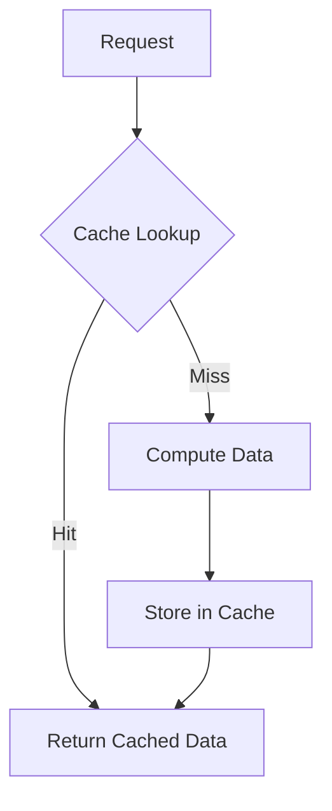

## 7.3 Caching in Clojure

Caching is a powerful technique used to enhance the performance of applications by storing frequently accessed data in memory. This reduces latency and alleviates the load on backend systems. In Clojure, caching can be implemented in various ways, from simple in-memory caches using atoms to more sophisticated solutions leveraging external libraries. This article delves into the intricacies of caching in Clojure, offering insights, code examples, and best practices.

### Introduction to Caching

Caching involves temporarily storing data so that future requests for that data can be served faster. This is particularly useful for expensive computations or data retrieval operations that are frequently repeated. By caching the results, applications can avoid redundant processing, thus improving response times and reducing the load on databases or other backend services.

### Detailed Explanation

#### Basic Caching with Atoms

Atoms in Clojure provide a straightforward way to implement simple in-memory caches. They are ideal for scenarios where the cache is accessed and modified by a single thread. Here's how you can set up a basic cache using atoms:

```clojure
(def cache (atom {}))

(defn get-cached [key]
  (@cache key))

(defn put-cached [key value]
  (swap! cache assoc key value))
```

In this example, `cache` is an atom holding a map. The `get-cached` function retrieves a value by key, while `put-cached` updates the cache with a new key-value pair.

#### Memoization for Function Caching

Memoization is a technique where the results of expensive function calls are cached, so subsequent calls with the same arguments return the cached result instead of recomputing. Clojure provides a built-in `memoize` function for this purpose:

```clojure
(def expensive-fn (memoize (fn [x] (do (Thread/sleep 1000) x))))
```

This memoized function will only compute the result once for each unique argument, storing the result for future calls.

#### Implementing a Custom Memoization Function

For more control over the caching behavior, you can implement your own memoization function:

```clojure
(defn memoize-fn [f]
  (let [cache (atom {})]
    (fn [& args]
      (if-let [result (get @cache args)]
        result
        (let [result (apply f args)]
          (swap! cache assoc args result)
          result)))))
```

This custom memoization function uses an atom to store results keyed by the function arguments.

#### Time-Based Expiration (TTL Cache)

To ensure that cached data remains fresh, you can implement a time-to-live (TTL) cache where entries expire after a specified duration:

```clojure
(defn ttl-cache [ttl-ms]
  (let [cache (atom {})]
    {:get (fn [key]
            (let [{:keys [value expires]} (get @cache key)]
              (when (> expires (System/currentTimeMillis))
                value)))
     :put (fn [key value]
            (swap! cache assoc key {:value value
                                    :expires (+ (System/currentTimeMillis) ttl-ms)}))}))

(def my-cache (ttl-cache 60000)) ; Entries expire after 60 seconds
```

This TTL cache stores each entry with an expiration timestamp, ensuring that stale data is not returned.

#### Leveraging `clojure.core.cache` Library

For more sophisticated caching needs, Clojure's `core.cache` library offers a variety of cache implementations, including TTL caches, LRU caches, and more:

```clojure
(require '[clojure.core.cache :as cache])

(def my-cache
  (cache/ttl-cache-factory {} :ttl 60000))

(defn cached-computation [key compute-fn]
  (let [cached-value (cache/lookup my-cache key ::not-found)]
    (if (not= cached-value ::not-found)
      cached-value
      (let [result (compute-fn)]
        (swap! my-cache cache/miss key result)
        result))))
```

This example demonstrates using a TTL cache from the `core.cache` library to store computation results.

### Cache Invalidation Strategies

Managing cache invalidation is critical to ensure data consistency. Common strategies include:

- **Time-Based Expiry:** Automatically remove entries after a certain period.
- **Explicit Invalidation:** Manually remove or update cache entries when the underlying data changes.
- **Event-Driven Invalidation:** Use events to trigger cache updates or invalidations.

### Distributed Caching

In distributed systems, consider using external caching solutions like Redis or Memcached to share cache across multiple nodes. These systems provide robust features for cache synchronization and persistence.

### Visualizing Cache Workflow

Here's a conceptual diagram illustrating a typical caching workflow:



### Best Practices

- **Choose the Right Cache Type:** Select a cache type that fits your application's needs, considering factors like data volatility and access patterns.
- **Monitor Cache Performance:** Regularly monitor cache hit rates and performance to ensure effectiveness.
- **Balance Freshness and Performance:** Find a balance between data freshness and performance gains from caching.

### Advantages and Disadvantages

**Advantages:**
- Reduces latency and improves response times.
- Offloads backend systems, reducing load and improving scalability.

**Disadvantages:**
- Requires careful management of cache invalidation.
- Can introduce complexity, especially in distributed environments.

### Conclusion

Caching is an essential technique for optimizing application performance in Clojure. By understanding and implementing effective caching strategies, developers can significantly enhance the responsiveness and scalability of their applications. Whether using simple in-memory caches or sophisticated distributed solutions, the key is to balance performance gains with data consistency and freshness.

## Quiz Time!



### What is the primary purpose of caching in applications?

- [x] To improve performance by storing frequently accessed data in memory
- [ ] To increase the complexity of the application
- [ ] To reduce the amount of code needed
- [ ] To ensure data is always up-to-date

> **Explanation:** Caching improves performance by storing frequently accessed data in memory, reducing the need to recompute or fetch data from slower sources.

### Which Clojure construct is commonly used for simple in-memory caching?

- [x] Atom
- [ ] Ref
- [ ] Agent
- [ ] Delay

> **Explanation:** Atoms are commonly used for simple in-memory caching due to their ease of use and ability to manage state changes in a single-threaded context.

### What is memoization in the context of caching?

- [x] Caching the results of expensive function calls
- [ ] Storing all function calls in a database
- [ ] Logging function calls for debugging
- [ ] Automatically optimizing function performance

> **Explanation:** Memoization involves caching the results of expensive function calls to avoid redundant computations for the same inputs.

### How does a TTL cache ensure data freshness?

- [x] By expiring entries after a specified time period
- [ ] By constantly updating entries with new data
- [ ] By storing data in a distributed system
- [ ] By using a larger cache size

> **Explanation:** A TTL (Time-To-Live) cache ensures data freshness by expiring entries after a specified time period, preventing stale data from being returned.

### Which library provides sophisticated caching solutions in Clojure?

- [x] clojure.core.cache
- [ ] clojure.core.async
- [ ] clojure.java.jdbc
- [ ] clojure.spec

> **Explanation:** The `clojure.core.cache` library provides sophisticated caching solutions, including various cache types like TTL and LRU caches.

### What is a common strategy for cache invalidation?

- [x] Time-based expiry
- [ ] Increasing cache size
- [ ] Using a different data structure
- [ ] Reducing the number of cache entries

> **Explanation:** Time-based expiry is a common strategy for cache invalidation, where entries are automatically removed after a certain period.

### What is a potential disadvantage of caching?

- [x] It can introduce complexity, especially in distributed environments
- [ ] It always reduces application performance
- [ ] It makes data retrieval slower
- [ ] It requires more code to implement

> **Explanation:** Caching can introduce complexity, particularly in distributed environments where cache consistency and synchronization become challenging.

### What is the role of a cache in a distributed system?

- [x] To share cached data across multiple nodes
- [ ] To store all application data permanently
- [ ] To replace databases entirely
- [ ] To increase the number of servers needed

> **Explanation:** In a distributed system, a cache shares cached data across multiple nodes, improving performance and scalability.

### How does memoization differ from a simple cache?

- [x] Memoization caches function results based on arguments
- [ ] Memoization stores all data in a database
- [ ] Memoization requires a distributed system
- [ ] Memoization is only used for logging

> **Explanation:** Memoization specifically caches function results based on their arguments, allowing for efficient reuse of computed results.

### True or False: Caching always ensures data is up-to-date.

- [ ] True
- [x] False

> **Explanation:** Caching does not always ensure data is up-to-date; it requires careful management of cache invalidation to maintain data consistency.


