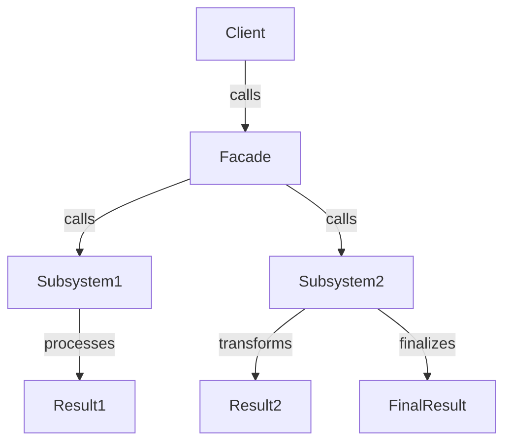

## 7.3. Facade Pattern via Namespaces and APIs

In the realm of software design, the Facade Pattern is a structural pattern that provides a simplified interface to a complex subsystem. This pattern is particularly useful in Clojure, where namespaces and APIs can be leveraged to create clean, organized, and user-friendly interfaces. In this section, we will explore how to implement the Facade Pattern in Clojure, focusing on the use of namespaces and public APIs to streamline interactions with complex systems.

### Understanding the Facade Pattern

The Facade Pattern is designed to provide a unified interface to a set of interfaces in a subsystem. It defines a higher-level interface that makes the subsystem easier to use. This pattern is beneficial in scenarios where a system is complex and has multiple interdependent classes or functions. By using a facade, you can reduce the complexity for the client and hide the intricate details of the subsystem.

#### Key Participants

- **Facade**: The main interface that clients interact with. It provides simplified methods that internally call the complex subsystem's methods.
- **Subsystem Classes**: The classes or functions that perform the actual work. They are complex and have detailed interactions.
- **Client**: The entity that uses the facade to interact with the subsystem.

### Implementing the Facade Pattern in Clojure

In Clojure, the Facade Pattern can be effectively implemented using namespaces and APIs. Namespaces allow you to group related functions and data, providing a clear structure to your code. By exposing only the necessary functions through a public API, you can create a facade that simplifies the interaction with the underlying system.

#### Organizing Code with Namespaces

Namespaces in Clojure serve as a way to organize code and manage the visibility of functions and variables. By carefully structuring your namespaces, you can create a facade that exposes only the essential functionality.

```clojure
(ns myapp.facade
  (:require [myapp.subsystem1 :as s1]
            [myapp.subsystem2 :as s2]))

(defn perform-action
  "A high-level function that simplifies interaction with the subsystems."
  [data]
  (let [result1 (s1/process data)
        result2 (s2/transform result1)]
    (s2/finalize result2)))
```

In this example, the `myapp.facade` namespace acts as a facade by providing the `perform-action` function, which internally calls functions from `myapp.subsystem1` and `myapp.subsystem2`. The client only needs to interact with `perform-action`, without worrying about the details of the subsystems.

#### Benefits of Using a Facade

- **Simplification**: The facade provides a simple interface, reducing the learning curve for new developers.
- **Decoupling**: Clients are decoupled from the complex subsystems, making the system easier to maintain and modify.
- **Encapsulation**: Implementation details are hidden, promoting encapsulation and reducing the risk of unintended interference.

### Best Practices in API Design

When designing a facade using namespaces and APIs, consider the following best practices:

- **Minimalism**: Expose only the necessary functions. Avoid cluttering the API with too many options.
- **Consistency**: Ensure that the API is consistent in naming conventions and parameter structures.
- **Documentation**: Provide clear documentation for each public function, explaining its purpose and usage.
- **Error Handling**: Implement robust error handling to manage unexpected situations gracefully.

### Example: Building a Facade for a Web Application

Let's consider a scenario where we have a web application with multiple subsystems for handling user authentication, data processing, and reporting. We can create a facade to simplify interactions with these subsystems.

```clojure
(ns myapp.web.facade
  (:require [myapp.auth :as auth]
            [myapp.data :as data]
            [myapp.report :as report]))

(defn login
  "Authenticate a user and return a session token."
  [username password]
  (auth/authenticate username password))

(defn process-data
  "Process user data and generate a report."
  [user-id data]
  (let [processed-data (data/process user-id data)]
    (report/generate processed-data)))
```

In this example, the `myapp.web.facade` namespace provides two high-level functions, `login` and `process-data`, which internally call functions from the `auth`, `data`, and `report` namespaces. This facade simplifies the interaction for the client, who only needs to call `login` and `process-data`.

### Visualizing the Facade Pattern

To better understand the flow of the Facade Pattern in Clojure, let's visualize the interaction between the client, facade, and subsystems using a Mermaid.js diagram.



**Diagram Description**: This diagram illustrates how the client interacts with the facade, which in turn communicates with the subsystems to perform the necessary operations.

### Try It Yourself

To deepen your understanding of the Facade Pattern in Clojure, try modifying the code examples provided. Here are a few suggestions:

- **Add Logging**: Enhance the facade functions to include logging for each operation.
- **Error Handling**: Implement error handling in the facade to manage exceptions from the subsystems.
- **Extend Functionality**: Add new functions to the facade that combine different subsystem operations.

### Knowledge Check

Before we conclude, let's reinforce what we've learned with a few questions:

- What is the primary purpose of the Facade Pattern?
- How do namespaces help in implementing the Facade Pattern in Clojure?
- What are the benefits of using a facade in software design?

### Conclusion

The Facade Pattern is a powerful tool in software design, especially in a language like Clojure that emphasizes simplicity and functional programming. By using namespaces and APIs, you can create clean, organized, and user-friendly interfaces that hide the complexity of underlying systems. Remember, this is just the beginning. As you progress, you'll build more complex and interactive applications. Keep experimenting, stay curious, and enjoy the journey!

## **Ready to Test Your Knowledge?**



### What is the primary purpose of the Facade Pattern?

- [x] To provide a simplified interface to a complex subsystem
- [ ] To increase the complexity of the system
- [ ] To expose all internal details of a subsystem
- [ ] To reduce the number of classes in a system

> **Explanation:** The Facade Pattern aims to provide a simple interface to a complex subsystem, making it easier for clients to interact with the system.

### How do namespaces help in implementing the Facade Pattern in Clojure?

- [x] By organizing code and managing the visibility of functions
- [ ] By increasing the complexity of the code
- [ ] By exposing all functions to the client
- [ ] By making the code harder to maintain

> **Explanation:** Namespaces help organize code and manage the visibility of functions, allowing you to create a facade that exposes only the necessary functionality.

### What are the benefits of using a facade in software design?

- [x] Simplification, decoupling, and encapsulation
- [ ] Increased complexity and coupling
- [ ] Exposing all internal details
- [ ] Making the system harder to maintain

> **Explanation:** The benefits of using a facade include simplification, decoupling, and encapsulation, which make the system easier to use and maintain.

### Which of the following is a key participant in the Facade Pattern?

- [x] Facade
- [ ] Singleton
- [ ] Adapter
- [ ] Observer

> **Explanation:** The Facade is a key participant in the Facade Pattern, providing a simplified interface to the subsystem.

### What is a best practice in API design?

- [x] Minimalism and consistency
- [ ] Exposing all functions
- [ ] Using inconsistent naming conventions
- [ ] Avoiding documentation

> **Explanation:** Best practices in API design include minimalism and consistency, ensuring that the API is easy to use and understand.

### What is the role of the client in the Facade Pattern?

- [x] To interact with the facade to perform operations
- [ ] To directly interact with the subsystems
- [ ] To increase the complexity of the system
- [ ] To expose internal details

> **Explanation:** The client interacts with the facade to perform operations, without needing to know the details of the subsystems.

### How can you extend the functionality of a facade?

- [x] By adding new functions that combine different subsystem operations
- [ ] By exposing all internal functions
- [ ] By making the code more complex
- [ ] By removing existing functions

> **Explanation:** You can extend the functionality of a facade by adding new functions that combine different subsystem operations, providing more capabilities to the client.

### What is a common pitfall to avoid when using the Facade Pattern?

- [x] Exposing too many internal details
- [ ] Simplifying the interface
- [ ] Decoupling the client from the subsystem
- [ ] Encapsulating the subsystem

> **Explanation:** A common pitfall is exposing too many internal details, which defeats the purpose of the facade.

### What is the benefit of hiding implementation details in a facade?

- [x] It promotes encapsulation and reduces the risk of unintended interference
- [ ] It makes the system more complex
- [ ] It exposes all internal functions
- [ ] It increases the risk of errors

> **Explanation:** Hiding implementation details promotes encapsulation and reduces the risk of unintended interference, making the system more robust.

### True or False: The Facade Pattern is only useful in object-oriented programming.

- [ ] True
- [x] False

> **Explanation:** False. The Facade Pattern is useful in any programming paradigm, including functional programming, as it simplifies interactions with complex systems.


