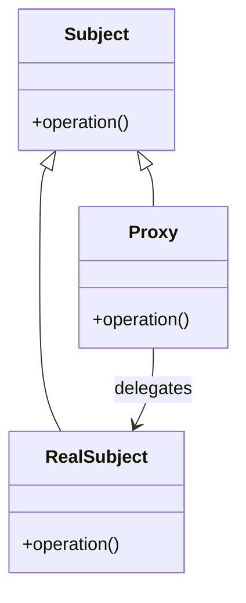

## 7.4. Proxy Pattern with Macros and Functions

The Proxy Pattern is a structural design pattern that provides a surrogate or placeholder for another object to control access to it. In Clojure, the Proxy Pattern can be effectively implemented using macros and functions, allowing developers to manage access to underlying objects or functions with ease. This section will guide you through the concepts, implementation, and use cases of the Proxy Pattern in Clojure, leveraging the power of macros and higher-order functions.

### Intent of the Proxy Pattern

The primary intent of the Proxy Pattern is to provide a level of indirection to an object, enabling additional functionality such as access control, lazy initialization, logging, or remote method invocation without altering the original object's code. Proxies can serve various purposes, including:

- **Access Control**: Restricting or logging access to certain methods or properties.
- **Lazy Loading**: Deferring the creation or initialization of an object until it is needed.
- **Remote Method Invocation**: Facilitating communication with objects in different address spaces.
- **Pre/Post Processing**: Adding behavior before or after method calls.

### Key Participants

In the Proxy Pattern, the key participants include:

- **Subject**: The common interface that both the RealSubject and Proxy implement.
- **RealSubject**: The actual object that the proxy represents.
- **Proxy**: The object that controls access to the RealSubject, providing additional functionality.

### Applicability

Use the Proxy Pattern when:

- You need to control access to an object.
- You want to add additional functionality to an object without modifying its code.
- You need to manage resources efficiently, such as through lazy loading.
- You require a placeholder for objects that are expensive to create or require remote access.

### Implementing the Proxy Pattern in Clojure

In Clojure, we can implement the Proxy Pattern using macros and functions. Macros allow us to generate code at compile time, while higher-order functions enable us to wrap existing functions with additional behavior.

#### Using Macros to Generate Proxy Code

Macros in Clojure are powerful tools for code generation. They allow us to create abstractions that can generate proxy code dynamically. Let's explore how to use macros to implement a simple proxy pattern.

```clojure
(defmacro defproxy
  [name target & methods]
  `(defn ~name [& args#]
     (let [target# (apply ~target args#)]
       (reify
         ~@(mapcat (fn [[method-name method-fn]]
                     `(~method-name [this# & args#]
                        (println "Calling" '~method-name "with args:" args#)
                        (apply ~method-fn target# args#)))
                   methods)))))

(defn real-object
  [x]
  {:value x})

(defproxy proxy-object real-object
  (get-value :value))

;; Usage
(let [proxy (proxy-object 42)]
  (println "Value:" (.get-value proxy)))
```

In this example, `defproxy` is a macro that generates a proxy function. It takes a name, a target function, and a list of methods. The proxy function creates an instance of the target and wraps its methods with additional behavior, such as logging.

#### Function Wrapping for Access Control

Higher-order functions in Clojure allow us to wrap existing functions with additional logic. This is useful for implementing access control or pre/post-processing.

```clojure
(defn wrap-access-control
  [f]
  (fn [& args]
    (println "Accessing function with args:" args)
    (apply f args)))

(defn sensitive-operation
  [x y]
  (+ x y))

(def secured-operation (wrap-access-control sensitive-operation))

;; Usage
(println "Result:" (secured-operation 3 4))
```

Here, `wrap-access-control` is a higher-order function that wraps `sensitive-operation`, logging access to it. This pattern is useful for adding security or logging to existing functions.

### Use Cases for the Proxy Pattern

#### Lazy Loading

Lazy loading is a common use case for the Proxy Pattern. It involves deferring the creation or initialization of an object until it is needed, which can improve performance and resource utilization.

```clojure
(defn lazy-proxy
  [create-fn]
  (let [initialized (atom false)
        instance (atom nil)]
    (fn [& args]
      (when-not @initialized
        (reset! instance (apply create-fn args))
        (reset! initialized true))
      @instance)))

(defn expensive-object
  [x]
  (println "Creating expensive object")
  {:value x})

(def lazy-object (lazy-proxy expensive-object))

;; Usage
(println "First access:" (lazy-object 42))
(println "Second access:" (lazy-object 42))
```

In this example, `lazy-proxy` is a function that creates a proxy for lazy loading. It uses atoms to track whether the object has been initialized, deferring its creation until it is accessed.

#### Remote Method Invocation

The Proxy Pattern can also be used for remote method invocation, allowing communication with objects in different address spaces.

```clojure
(defn remote-proxy
  [invoke-fn]
  (fn [method & args]
    (println "Invoking remote method:" method "with args:" args)
    (apply invoke-fn method args)))

(defn remote-invocation
  [method & args]
  ;; Simulate remote invocation
  (println "Remote invocation of" method "with args:" args)
  (apply str "Result of " method))

(def remote-object (remote-proxy remote-invocation))

;; Usage
(println "Remote call result:" (remote-object "add" 1 2))
```

Here, `remote-proxy` is a function that wraps a remote invocation function, logging the method and arguments. This pattern is useful for distributed systems and network communication.

### Design Considerations

When implementing the Proxy Pattern in Clojure, consider the following:

- **Transparency**: Ensure that the proxy is transparent to the client, meaning it should behave like the real object.
- **Performance**: Be mindful of the performance overhead introduced by the proxy, especially in high-performance applications.
- **Complexity**: Avoid adding unnecessary complexity to the codebase. Use the Proxy Pattern only when it provides clear benefits.

### Clojure Unique Features

Clojure's unique features, such as macros and higher-order functions, make it well-suited for implementing the Proxy Pattern. Macros allow for powerful code generation, while higher-order functions enable flexible function wrapping and composition.

### Differences and Similarities

The Proxy Pattern is often confused with the Decorator Pattern. While both patterns involve wrapping objects, the Proxy Pattern focuses on controlling access and adding functionality, whereas the Decorator Pattern is primarily used for adding behavior.

### Try It Yourself

Experiment with the code examples provided in this section. Try modifying the proxy implementations to add new behaviors, such as caching or authentication. Consider how these patterns can be applied to your own projects.

```clojure
;; Try adding caching to the lazy-proxy example
(defn caching-proxy
  [create-fn]
  (let [cache (atom {})]
    (fn [& args]
      (if-let [result (get @cache args)]
        result
        (let [result (apply create-fn args)]
          (swap! cache assoc args result)
          result)))))

(def cached-object (caching-proxy expensive-object))

;; Usage
(println "First access with caching:" (cached-object 42))
(println "Second access with caching:" (cached-object 42))
```

### Visualizing the Proxy Pattern

To better understand the Proxy Pattern, let's visualize its structure using a Mermaid.js diagram.



This diagram illustrates the relationship between the Subject, RealSubject, and Proxy. The Proxy implements the same interface as the RealSubject and delegates calls to it, adding additional behavior as needed.

### References and Links

For further reading on the Proxy Pattern and its applications, consider the following resources:

- [Design Patterns: Elements of Reusable Object-Oriented Software](https://en.wikipedia.org/wiki/Design_Patterns) by Erich Gamma, Richard Helm, Ralph Johnson, and John Vlissides.
- [Clojure Documentation](https://clojure.org/reference/documentation) for more on macros and functions.
- [Functional Programming in Clojure](https://www.braveclojure.com/) for a deeper dive into Clojure's functional programming paradigms.

### Knowledge Check

To reinforce your understanding of the Proxy Pattern in Clojure, try answering the following questions.

## **Ready to Test Your Knowledge?**



### What is the primary intent of the Proxy Pattern?

- [x] To provide a surrogate or placeholder for another object to control access to it.
- [ ] To add behavior to an object without modifying its code.
- [ ] To create a new object with additional functionality.
- [ ] To manage resources efficiently.

> **Explanation:** The Proxy Pattern provides a level of indirection to an object, enabling additional functionality such as access control, lazy initialization, logging, or remote method invocation.

### Which Clojure feature is particularly useful for implementing the Proxy Pattern?

- [x] Macros
- [ ] Atoms
- [ ] Refs
- [ ] Agents

> **Explanation:** Macros in Clojure are powerful tools for code generation, allowing developers to create abstractions that can generate proxy code dynamically.

### What is a common use case for the Proxy Pattern?

- [x] Lazy Loading
- [ ] Data Transformation
- [ ] Error Handling
- [ ] State Management

> **Explanation:** Lazy loading involves deferring the creation or initialization of an object until it is needed, which can improve performance and resource utilization.

### How does the Proxy Pattern differ from the Decorator Pattern?

- [x] The Proxy Pattern focuses on controlling access, while the Decorator Pattern adds behavior.
- [ ] The Proxy Pattern adds behavior, while the Decorator Pattern controls access.
- [ ] Both patterns serve the same purpose.
- [ ] The Proxy Pattern is used for error handling, while the Decorator Pattern is not.

> **Explanation:** The Proxy Pattern is primarily used for controlling access and adding functionality, whereas the Decorator Pattern is used for adding behavior.

### What is a potential drawback of using the Proxy Pattern?

- [x] Performance overhead
- [ ] Increased security
- [ ] Simplified codebase
- [ ] Improved resource utilization

> **Explanation:** The Proxy Pattern can introduce performance overhead, especially in high-performance applications, due to the additional layer of indirection.

### Which of the following is NOT a key participant in the Proxy Pattern?

- [ ] Subject
- [ ] RealSubject
- [ ] Proxy
- [x] Decorator

> **Explanation:** The key participants in the Proxy Pattern are the Subject, RealSubject, and Proxy. The Decorator is not part of the Proxy Pattern.

### What is the role of the Proxy in the Proxy Pattern?

- [x] To control access to the RealSubject and provide additional functionality.
- [ ] To add behavior to the RealSubject.
- [ ] To create a new object with additional functionality.
- [ ] To manage resources efficiently.

> **Explanation:** The Proxy controls access to the RealSubject and can provide additional functionality such as logging, access control, or lazy loading.

### How can higher-order functions be used in the Proxy Pattern?

- [x] By wrapping existing functions with additional logic.
- [ ] By creating new functions with additional functionality.
- [ ] By managing resources efficiently.
- [ ] By controlling access to objects.

> **Explanation:** Higher-order functions in Clojure allow developers to wrap existing functions with additional logic, which is useful for implementing access control or pre/post-processing.

### What is a benefit of using lazy loading in the Proxy Pattern?

- [x] Improved performance and resource utilization.
- [ ] Increased security.
- [ ] Simplified codebase.
- [ ] Enhanced error handling.

> **Explanation:** Lazy loading defers the creation or initialization of an object until it is needed, which can improve performance and resource utilization.

### True or False: The Proxy Pattern can be used for remote method invocation.

- [x] True
- [ ] False

> **Explanation:** The Proxy Pattern can be used for remote method invocation, allowing communication with objects in different address spaces.



Remember, this is just the beginning. As you progress, you'll build more complex and interactive applications using the Proxy Pattern in Clojure. Keep experimenting, stay curious, and enjoy the journey!
