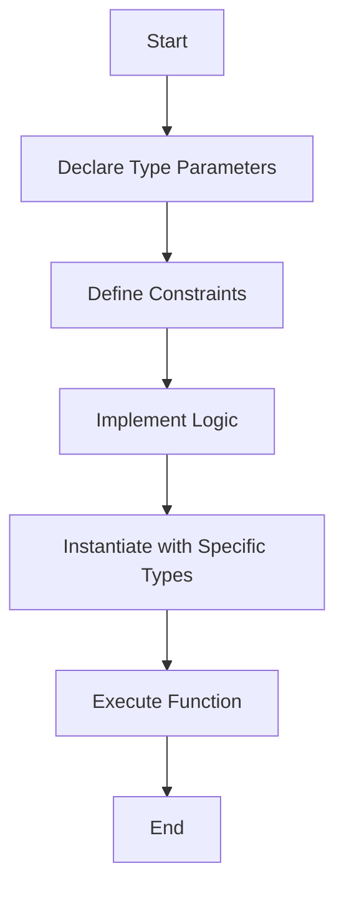

## 7.5 Generics in Go

Generics in Go represent a significant enhancement to the language, allowing developers to write more flexible and reusable code without sacrificing type safety. Introduced in Go 1.18, generics enable the creation of functions and data structures that can operate on any data type, provided they satisfy certain constraints. This section delves into the mechanics of Go generics, their implementation, and practical use cases.

### Understanding Go Generics

Generics allow you to define algorithms and data structures in a way that is abstracted over the types they operate on. This abstraction is achieved using type parameters, which are specified in square brackets. By using generics, you can write code that is both reusable and type-safe.

#### Key Concepts

- **Type Parameters:** These are placeholders for types that are specified when the function or type is instantiated.
- **Type Constraints:** These define the requirements that a type must meet to be used as a type parameter. Constraints can be interfaces or specific types.

### Implementation Steps

Implementing generics in Go involves several key steps, from declaring type parameters to defining constraints and writing generic logic.

#### Declare Type Parameters

Type parameters are declared using square brackets (`[]`) immediately following the function or type name. Each type parameter is followed by a constraint, which specifies the types that are permissible.

```go
func Sum[T int | float64](values []T) T {
    var total T
    for _, v := range values {
        total += v
    }
    return total
}
```

In this example, `T` is a type parameter that can be either `int` or `float64`.

#### Define Constraints

Constraints are essential for ensuring that the operations performed on type parameters are valid. You can use interfaces or predeclared types to define constraints.

```go
type Number interface {
    int | float64
}

func Sum[T Number](values []T) T {
    var total T
    for _, v := range values {
        total += v
    }
    return total
}
```

Here, the `Number` interface is used as a constraint to allow only `int` and `float64` types.

#### Implement Generic Functions and Types

Once type parameters and constraints are defined, you can implement the logic using these parameters. This approach allows the same code to work with multiple types.

```go
type Pair[T any] struct {
    First, Second T
}

func NewPair[T any](first, second T) Pair[T] {
    return Pair[T]{First: first, Second: second}
}
```

In this example, `Pair` is a generic type that can hold two values of any type.

### Use Cases

Generics are particularly useful in scenarios where you need to write code that works with multiple types. Here are some common use cases:

- **Generic Data Structures:** Create data structures like lists, maps, or trees that can store any type of data.
- **Algorithm Implementation:** Implement algorithms that can operate on any type satisfying the constraints, such as sorting or searching algorithms.

### Go-Specific Tips

When working with generics in Go, consider the following best practices to maximize their effectiveness:

- **Generalize Constraints:** Keep type constraints as broad as possible to increase the reusability of your generic code.
- **Thorough Testing:** Test generic code across different types to ensure it behaves correctly in all scenarios.

### Visualizing Generics

To better understand how generics work in Go, consider the following diagram illustrating the flow of a generic function:



### Advantages and Disadvantages

#### Advantages

- **Code Reusability:** Write functions and types once, and use them with different data types.
- **Type Safety:** Maintain type safety, reducing runtime errors related to type mismatches.
- **Cleaner Code:** Reduce code duplication by abstracting common logic.

#### Disadvantages

- **Complexity:** Generics can introduce complexity, especially for developers new to the concept.
- **Compilation Time:** May increase compilation time due to additional type checking.

### Best Practices

- **Use Descriptive Type Parameter Names:** Use meaningful names for type parameters to improve code readability.
- **Limit the Number of Type Parameters:** Avoid using too many type parameters, as it can make the code harder to understand.
- **Document Constraints Clearly:** Clearly document the constraints and intended use of your generic functions and types.

### Conclusion

Generics in Go provide a powerful tool for writing flexible, reusable, and type-safe code. By understanding how to declare type parameters, define constraints, and implement generic logic, you can leverage generics to enhance your Go applications. As with any feature, it's important to use generics judiciously, balancing the benefits of code reuse with the potential for increased complexity.

## Quiz Time!



### What are generics in Go?

- [x] A way to write functions and types that are generalized over types.
- [ ] A method for optimizing Go code performance.
- [ ] A feature for handling errors in Go.
- [ ] A tool for managing Go dependencies.

> **Explanation:** Generics allow you to write functions and types that can operate on any data type, enhancing code reuse and type safety.

### How do you declare type parameters in Go?

- [x] Using square brackets immediately following the function or type name.
- [ ] Using parentheses immediately following the function or type name.
- [ ] Using curly braces immediately following the function or type name.
- [ ] Using angle brackets immediately following the function or type name.

> **Explanation:** Type parameters are declared using square brackets (`[]`) immediately following the function or type name.

### What is the purpose of type constraints in Go generics?

- [x] To define the requirements that a type must meet to be used as a type parameter.
- [ ] To optimize the performance of generic functions.
- [ ] To handle errors in generic code.
- [ ] To manage dependencies in Go projects.

> **Explanation:** Type constraints specify the types that are permissible for a type parameter, ensuring valid operations.

### Which of the following is a valid use case for generics in Go?

- [x] Creating generic data structures like lists or maps.
- [ ] Handling errors in Go applications.
- [ ] Managing Go dependencies.
- [ ] Optimizing Go code performance.

> **Explanation:** Generics are useful for creating data structures and algorithms that can operate on multiple types.

### What is a potential disadvantage of using generics in Go?

- [x] Increased complexity for developers new to the concept.
- [ ] Reduced code readability.
- [ ] Decreased code performance.
- [ ] Limited code reusability.

> **Explanation:** Generics can introduce complexity, especially for developers unfamiliar with the concept.

### How can you maximize the reusability of generic code in Go?

- [x] Keep type constraints as broad as possible.
- [ ] Use as many type parameters as possible.
- [ ] Avoid documenting constraints.
- [ ] Limit the use of generics to specific types.

> **Explanation:** Keeping type constraints broad increases the reusability of generic code.

### What is a best practice when naming type parameters in Go?

- [x] Use descriptive names to improve code readability.
- [ ] Use single-letter names to keep code concise.
- [ ] Use numeric names to differentiate parameters.
- [ ] Use random names to avoid conflicts.

> **Explanation:** Descriptive names for type parameters improve code readability and understanding.

### How do generics enhance code safety in Go?

- [x] By maintaining type safety and reducing runtime errors.
- [ ] By optimizing code performance.
- [ ] By managing dependencies.
- [ ] By handling errors automatically.

> **Explanation:** Generics maintain type safety, reducing the likelihood of runtime errors related to type mismatches.

### What should you do to ensure the correctness of generic code across types?

- [x] Test the code thoroughly with different types.
- [ ] Limit the code to specific types.
- [ ] Avoid using constraints.
- [ ] Use single-letter type parameters.

> **Explanation:** Thorough testing with different types ensures the correctness of generic code.

### True or False: Generics in Go can only be used with functions.

- [ ] True
- [x] False

> **Explanation:** Generics can be used with both functions and types in Go.


