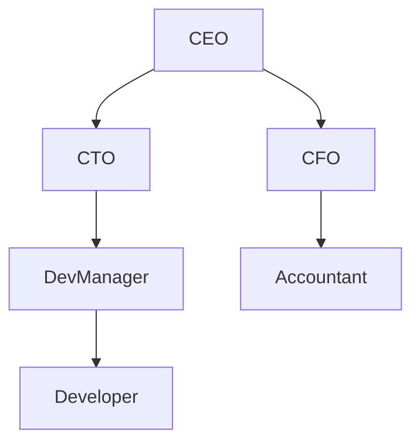

## 7.5. Composite Pattern with Nested Data Structures

### Introduction

The Composite Pattern is a structural design pattern that allows you to compose objects into tree-like structures to represent part-whole hierarchies. This pattern is particularly useful when you want to treat individual objects and compositions of objects uniformly. In Clojure, we can leverage nested data structures such as maps and vectors to implement the Composite Pattern, providing a simple and flexible way to model hierarchical data.

### Understanding the Composite Pattern

#### Intent

The intent of the Composite Pattern is to allow clients to treat individual objects and compositions of objects uniformly. This is achieved by defining a common interface for both simple and complex objects, enabling recursive composition.

#### Key Participants

- **Component**: An interface for all objects in the composition, both leaf and composite.
- **Leaf**: Represents leaf objects in the composition. A leaf has no children.
- **Composite**: Represents a composite object that can have children. It implements child-related operations.

#### Applicability

Use the Composite Pattern when you have a hierarchy of objects and you want to treat individual objects and compositions of objects uniformly. This pattern is particularly useful in scenarios such as:

- Representing part-whole hierarchies of objects.
- Allowing clients to ignore the difference between compositions of objects and individual objects.

### Modeling Composite Structures with Nested Data Structures

In Clojure, we can use nested maps and vectors to represent composite structures. This approach leverages Clojure's immutable data structures, providing a natural fit for modeling hierarchical data.

#### Example: Representing an Organization Chart

Let's consider an example of representing an organization chart using nested maps and vectors.

```clojure
(def organization
  {:name "CEO"
   :subordinates [{:name "CTO"
                   :subordinates [{:name "Dev Manager"
                                   :subordinates [{:name "Developer"}]}]}
                  {:name "CFO"
                   :subordinates [{:name "Accountant"}]}]})

;; Function to print the organization chart
(defn print-organization [org level]
  (println (str (apply str (repeat level "-")) (:name org)))
  (doseq [subordinate (:subordinates org)]
    (print-organization subordinate (inc level))))

(print-organization organization 0)
```

In this example, we use a map to represent each position in the organization, with a `:name` key for the position name and a `:subordinates` key for the list of subordinates. The `print-organization` function recursively traverses the organization chart, printing each position with indentation to represent the hierarchy.

### Traversal and Manipulation of Composite Structures

Traversing and manipulating composite structures in Clojure can be done using recursive functions and core library functions like `map`, `reduce`, and `filter`.

#### Traversing a Composite Structure

To traverse a composite structure, we can use recursive functions that process each node and its children.

```clojure
(defn find-position [org name]
  (if (= (:name org) name)
    org
    (some #(find-position % name) (:subordinates org))))

(find-position organization "Developer")
```

In this example, the `find-position` function recursively searches for a position by name in the organization chart. It returns the first matching position found.

#### Manipulating a Composite Structure

Manipulating a composite structure involves updating nodes or adding/removing nodes. We can use Clojure's `assoc`, `update`, and `dissoc` functions to perform these operations.

```clojure
(defn add-subordinate [org name new-subordinate]
  (if (= (:name org) name)
    (update org :subordinates conj new-subordinate)
    (update org :subordinates #(mapv #(add-subordinate % name new-subordinate) %))))

(def updated-organization
  (add-subordinate organization "CTO" {:name "New Developer"}))
```

Here, the `add-subordinate` function adds a new subordinate to a specified position in the organization chart. It uses `update` to modify the `:subordinates` vector.

### Benefits of Using Nested Data Structures

Using nested data structures to implement the Composite Pattern in Clojure offers several benefits:

- **Simplicity**: Clojure's immutable data structures provide a simple and intuitive way to model hierarchical data without the need for complex class hierarchies.
- **Flexibility**: Nested maps and vectors allow for easy manipulation and traversal of composite structures using Clojure's core library functions.
- **Immutability**: Clojure's immutable data structures ensure that changes to composite structures do not affect other parts of the program, reducing the risk of unintended side effects.

### Visualizing Composite Structures

To better understand the structure of composite data, let's visualize the organization chart using a tree diagram.



This diagram represents the hierarchical structure of the organization chart, with the CEO at the top and subordinates branching out below.

### Clojure's Unique Features

Clojure's unique features, such as immutability and first-class functions, make it particularly well-suited for implementing the Composite Pattern with nested data structures. The language's emphasis on data-oriented programming allows developers to focus on the structure and manipulation of data rather than complex object hierarchies.

### Differences and Similarities with Other Patterns

The Composite Pattern is often compared to the Decorator Pattern, as both involve recursive composition. However, the Composite Pattern focuses on part-whole hierarchies, while the Decorator Pattern focuses on adding behavior to individual objects.

### Try It Yourself

Experiment with the provided code examples by modifying the organization chart or adding new functions to manipulate the composite structure. Try adding new positions, removing existing ones, or implementing additional traversal functions.

### Conclusion

The Composite Pattern is a powerful tool for representing hierarchical data in Clojure. By leveraging nested data structures, we can create simple and flexible models that are easy to traverse and manipulate. This approach takes full advantage of Clojure's strengths, including immutability and data-oriented programming.

## **Ready to Test Your Knowledge?**



### What is the primary intent of the Composite Pattern?

- [x] To allow clients to treat individual objects and compositions of objects uniformly.
- [ ] To add behavior to individual objects.
- [ ] To separate abstraction from implementation.
- [ ] To provide a way to create objects without specifying their concrete classes.

> **Explanation:** The Composite Pattern allows clients to treat individual objects and compositions of objects uniformly, enabling recursive composition.

### Which Clojure data structures are commonly used to implement the Composite Pattern?

- [x] Maps and vectors
- [ ] Lists and sets
- [ ] Atoms and refs
- [ ] Strings and numbers

> **Explanation:** Maps and vectors are commonly used to represent hierarchical data structures in Clojure, making them suitable for implementing the Composite Pattern.

### What is a key benefit of using nested data structures in Clojure for the Composite Pattern?

- [x] Simplicity and flexibility
- [ ] Increased complexity
- [ ] Reduced performance
- [ ] Limited scalability

> **Explanation:** Nested data structures in Clojure provide simplicity and flexibility, allowing for easy manipulation and traversal of composite structures.

### How can you traverse a composite structure in Clojure?

- [x] Using recursive functions
- [ ] Using global variables
- [ ] Using class hierarchies
- [ ] Using imperative loops

> **Explanation:** Recursive functions are commonly used to traverse composite structures in Clojure, processing each node and its children.

### What function is used to add a new subordinate in the provided example?

- [x] `add-subordinate`
- [ ] `find-position`
- [ ] `remove-subordinate`
- [ ] `update-position`

> **Explanation:** The `add-subordinate` function is used to add a new subordinate to a specified position in the organization chart.

### Which Clojure feature ensures that changes to composite structures do not affect other parts of the program?

- [x] Immutability
- [ ] Dynamic typing
- [ ] Homoiconicity
- [ ] Macros

> **Explanation:** Immutability ensures that changes to composite structures do not affect other parts of the program, reducing the risk of unintended side effects.

### What is the role of the `Component` participant in the Composite Pattern?

- [x] It defines an interface for all objects in the composition.
- [ ] It represents leaf objects in the composition.
- [ ] It represents a composite object that can have children.
- [ ] It provides a way to create objects without specifying their concrete classes.

> **Explanation:** The `Component` participant defines an interface for all objects in the composition, both leaf and composite.

### Which pattern is often compared to the Composite Pattern?

- [x] Decorator Pattern
- [ ] Singleton Pattern
- [ ] Factory Pattern
- [ ] Observer Pattern

> **Explanation:** The Composite Pattern is often compared to the Decorator Pattern, as both involve recursive composition.

### What is a common use case for the Composite Pattern?

- [x] Representing part-whole hierarchies of objects
- [ ] Adding behavior to individual objects
- [ ] Separating abstraction from implementation
- [ ] Creating objects without specifying their concrete classes

> **Explanation:** A common use case for the Composite Pattern is representing part-whole hierarchies of objects, allowing clients to treat individual objects and compositions uniformly.

### True or False: The Composite Pattern is only applicable in object-oriented programming.

- [ ] True
- [x] False

> **Explanation:** False. The Composite Pattern can be applied in functional programming languages like Clojure using nested data structures to represent hierarchical relationships.


