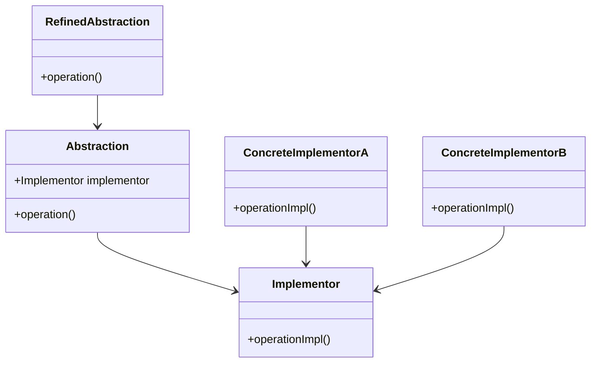

## 7.6. Bridge Pattern for Separating Abstraction

The Bridge Pattern is a structural design pattern that aims to separate abstraction from its implementation, allowing both to evolve independently. This pattern is particularly useful in Clojure, where the language's features such as protocols and multimethods can be leveraged to achieve this separation effectively. In this section, we will delve into the Bridge Pattern, understand its objectives, and explore how it can be applied in Clojure to create scalable and flexible software systems.

### Understanding the Bridge Pattern

#### Definition and Objectives

The Bridge Pattern is designed to decouple an abstraction from its implementation so that the two can vary independently. This separation is achieved by creating a bridge interface that connects the abstraction and its implementation. The primary objectives of the Bridge Pattern are:

- **Decoupling Abstraction and Implementation**: By separating these two components, changes to one do not necessitate changes to the other.
- **Enhancing Flexibility**: The pattern allows for the addition of new abstractions and implementations without altering existing code.
- **Promoting Scalability**: As systems grow, the Bridge Pattern facilitates the management of complexity by maintaining clear boundaries between abstraction and implementation.

#### Key Participants

In the Bridge Pattern, the key participants include:

- **Abstraction**: Defines the abstraction's interface and maintains a reference to the implementor.
- **Refined Abstraction**: Extends the abstraction interface.
- **Implementor**: Defines the interface for implementation classes.
- **Concrete Implementor**: Implements the implementor interface.

### Applying the Bridge Pattern in Clojure

In Clojure, the Bridge Pattern can be implemented using protocols and multimethods, which provide a flexible mechanism for separating abstraction from implementation.

#### Using Protocols

Protocols in Clojure define a set of functions that can be implemented by different types. They are an excellent tool for defining the abstraction in the Bridge Pattern.

```clojure
(defprotocol Renderer
  (render [this content]))

(defrecord HTMLRenderer []
  Renderer
  (render [this content]
    (str "<html><body>" content "</body></html>")))

(defrecord JSONRenderer []
  Renderer
  (render [this content]
    (str "{\"content\": \"" content "\"}")))
```

In this example, `Renderer` is the abstraction, while `HTMLRenderer` and `JSONRenderer` are concrete implementations. The protocol allows us to define a common interface for rendering content, which can be implemented in various ways.

#### Using Multimethods

Multimethods in Clojure provide another way to achieve separation of abstraction and implementation. They allow for dynamic dispatch based on the value of one or more arguments.

```clojure
(defmulti render-content (fn [format content] format))

(defmethod render-content :html [format content]
  (str "<html><body>" content "</body></html>"))

(defmethod render-content :json [format content]
  (str "{\"content\": \"" content "\"}"))
```

Here, `render-content` is a multimethod that dispatches based on the `format` argument. This approach provides flexibility in adding new formats without modifying existing code.

### Scenarios for Using the Bridge Pattern

The Bridge Pattern is particularly beneficial in scenarios where:

- **Multiple Implementations**: There are multiple ways to implement an abstraction, and these implementations may change independently.
- **Evolving Systems**: The system is expected to grow, requiring new abstractions and implementations over time.
- **Complex Systems**: The system's complexity necessitates clear separation between abstraction and implementation to manage dependencies effectively.

### Importance in Large or Evolving Systems

In large or evolving systems, the Bridge Pattern plays a crucial role in maintaining codebase flexibility and scalability. By decoupling abstraction from implementation, developers can introduce new features or modify existing ones with minimal impact on the overall system. This separation also facilitates parallel development, as teams can work on different parts of the system without interfering with each other.

### Visualizing the Bridge Pattern

To better understand the Bridge Pattern, let's visualize its structure using a class diagram.



This diagram illustrates how the abstraction and its implementations are separated, with a bridge interface connecting them.

### Clojure Unique Features

Clojure's unique features, such as protocols and multimethods, make it an ideal language for implementing the Bridge Pattern. These features provide a high degree of flexibility and dynamism, allowing for seamless extension and modification of both abstractions and implementations.

### Differences and Similarities

The Bridge Pattern is often confused with the Adapter Pattern. While both patterns involve interfaces, the key difference is that the Adapter Pattern is used to make incompatible interfaces work together, whereas the Bridge Pattern is used to separate abstraction from implementation.

### Try It Yourself

To deepen your understanding of the Bridge Pattern in Clojure, try modifying the code examples provided. Experiment with adding new renderers or changing the dispatch logic in the multimethod example. This hands-on approach will help solidify your grasp of the pattern and its applications.

### Knowledge Check

To reinforce your understanding, consider the following questions:

- How does the Bridge Pattern enhance flexibility in software design?
- What are the key differences between protocols and multimethods in Clojure?
- In what scenarios is the Bridge Pattern most beneficial?

### Summary

The Bridge Pattern is a powerful tool for separating abstraction from implementation, promoting flexibility, scalability, and maintainability in software design. By leveraging Clojure's protocols and multimethods, developers can implement this pattern effectively, creating robust systems that can adapt to changing requirements.

## **Ready to Test Your Knowledge?**



### What is the primary objective of the Bridge Pattern?

- [x] To separate abstraction from implementation
- [ ] To make incompatible interfaces work together
- [ ] To enhance performance
- [ ] To simplify code

> **Explanation:** The Bridge Pattern's primary objective is to separate abstraction from implementation, allowing them to vary independently.

### Which Clojure feature is ideal for defining the abstraction in the Bridge Pattern?

- [x] Protocols
- [ ] Atoms
- [ ] Refs
- [ ] Agents

> **Explanation:** Protocols in Clojure define a set of functions that can be implemented by different types, making them ideal for defining the abstraction in the Bridge Pattern.

### How do multimethods in Clojure achieve separation of abstraction and implementation?

- [x] By allowing dynamic dispatch based on argument values
- [ ] By providing a fixed set of functions
- [ ] By enforcing strict typing
- [ ] By using global state

> **Explanation:** Multimethods in Clojure allow for dynamic dispatch based on the value of one or more arguments, achieving separation of abstraction and implementation.

### In which scenario is the Bridge Pattern particularly beneficial?

- [x] When there are multiple ways to implement an abstraction
- [ ] When performance is the primary concern
- [ ] When the system is small and simple
- [ ] When using a single implementation

> **Explanation:** The Bridge Pattern is beneficial when there are multiple ways to implement an abstraction, allowing for independent evolution of abstraction and implementation.

### What is a key difference between the Bridge Pattern and the Adapter Pattern?

- [x] The Bridge Pattern separates abstraction from implementation, while the Adapter Pattern makes incompatible interfaces work together.
- [ ] The Bridge Pattern is used for performance optimization, while the Adapter Pattern is not.
- [ ] The Bridge Pattern is simpler than the Adapter Pattern.
- [ ] The Bridge Pattern is only applicable in Clojure.

> **Explanation:** The Bridge Pattern separates abstraction from implementation, whereas the Adapter Pattern is used to make incompatible interfaces work together.

### Which of the following is a key participant in the Bridge Pattern?

- [x] Implementor
- [ ] Observer
- [ ] Singleton
- [ ] Factory

> **Explanation:** The Implementor is a key participant in the Bridge Pattern, defining the interface for implementation classes.

### How can the Bridge Pattern enhance scalability in software systems?

- [x] By allowing independent development of abstraction and implementation
- [ ] By reducing the number of classes
- [ ] By enforcing strict type checking
- [ ] By using global variables

> **Explanation:** The Bridge Pattern enhances scalability by allowing independent development and evolution of abstraction and implementation.

### What is the role of the Refined Abstraction in the Bridge Pattern?

- [x] To extend the abstraction interface
- [ ] To implement the concrete logic
- [ ] To manage global state
- [ ] To simplify code

> **Explanation:** The Refined Abstraction extends the abstraction interface, providing additional functionality.

### Which Clojure feature allows for dynamic dispatch based on argument values?

- [x] Multimethods
- [ ] Protocols
- [ ] Atoms
- [ ] Refs

> **Explanation:** Multimethods in Clojure allow for dynamic dispatch based on the value of one or more arguments.

### True or False: The Bridge Pattern is only applicable in large systems.

- [ ] True
- [x] False

> **Explanation:** The Bridge Pattern is applicable in both small and large systems, but it is particularly beneficial in large or evolving systems where flexibility and scalability are crucial.



Remember, this is just the beginning. As you progress, you'll build more complex and interactive systems using the Bridge Pattern. Keep experimenting, stay curious, and enjoy the journey!
