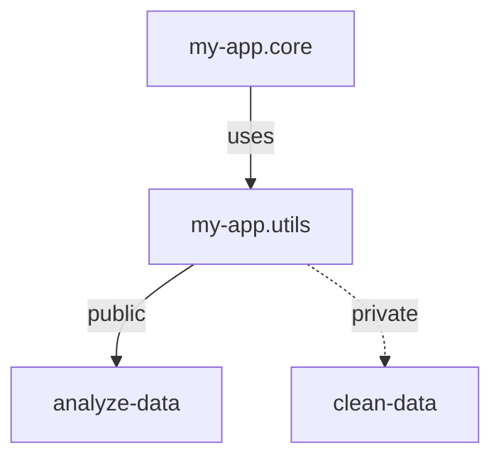

## 7.8. Modules and Namespaces for Encapsulation

In the world of software design, encapsulation is a fundamental concept that helps manage complexity by controlling the visibility and accessibility of code components. In Clojure, this is achieved through the use of modules and namespaces. This section explores how Clojure's namespaces provide encapsulation, the importance of encapsulation in software design, and best practices for module design.

### Understanding Encapsulation

Encapsulation is the practice of bundling data and the methods that operate on that data within a single unit, or module, and restricting access to some of the object's components. This is a key principle in software design because it helps to:

- **Reduce Complexity**: By hiding the internal workings of a module, developers can focus on the interface and not worry about the implementation details.
- **Enhance Maintainability**: Encapsulation allows for changes in the implementation without affecting other parts of the program.
- **Improve Security**: By restricting access to certain parts of a module, encapsulation can prevent unintended interference and misuse.

### Clojure's Approach to Encapsulation

Clojure, being a functional language, approaches encapsulation differently than object-oriented languages. Instead of classes and objects, Clojure uses namespaces to group related functions and data. Let's explore how namespaces work in Clojure.

#### What is a Namespace?

A namespace in Clojure is a context for identifiers. It allows you to organize your code into logical units, making it easier to manage and understand. Namespaces help prevent naming conflicts by providing a way to qualify names.

```clojure
(ns my-app.core)

(defn greet [name]
  (str "Hello, " name "!"))
```

In the example above, `my-app.core` is a namespace that contains the `greet` function. This function can be accessed from other namespaces using its fully qualified name, `my-app.core/greet`.

#### Creating and Using Namespaces

To create a namespace, use the `ns` macro. This macro not only defines the namespace but also allows you to require other namespaces and import Java classes.

```clojure
(ns my-app.utils
  (:require [clojure.string :as str]))

(defn capitalize-words [sentence]
  (str/capitalize sentence))
```

Here, `my-app.utils` is a namespace that requires the `clojure.string` namespace and aliases it as `str`. This allows us to use `str/capitalize` within our namespace.

#### Hiding and Exposing Details

Namespaces in Clojure provide a mechanism to hide or expose internal details. By default, all functions and variables defined in a namespace are public. However, you can make a function private by using the `defn-` macro.

```clojure
(defn- private-helper [x]
  (* x x))

(defn public-function [y]
  (private-helper y))
```

In this example, `private-helper` is a private function and cannot be accessed outside of its namespace. This is a simple yet effective way to encapsulate functionality.

### Best Practices for Module Design

When designing modules in Clojure, it's important to strike a balance between encapsulation and accessibility. Here are some best practices to consider:

1. **Organize Code Logically**: Group related functions and data into namespaces that reflect their purpose. This makes your codebase easier to navigate and understand.

2. **Use Descriptive Names**: Choose meaningful names for your namespaces and functions. This helps convey the intent and functionality of your code.

3. **Limit Public API**: Expose only the functions and data that are necessary for other parts of your application. Keep the rest private to reduce the risk of unintended interactions.

4. **Document Your Code**: Provide clear documentation for your public API. This includes function signatures, expected inputs and outputs, and any side effects.

5. **Use Aliases Wisely**: When requiring other namespaces, use aliases to avoid long and cumbersome fully qualified names. However, be mindful of potential naming conflicts.

6. **Avoid Circular Dependencies**: Ensure that your namespaces do not depend on each other in a circular manner. This can lead to complex and hard-to-debug issues.

7. **Refactor Regularly**: As your codebase grows, regularly refactor your namespaces to maintain a clean and organized structure.

### Balancing Encapsulation and Accessibility

While encapsulation is important, it's equally important to ensure that your code is accessible and easy to use. Here are some tips for achieving this balance:

- **Provide Clear Interfaces**: Design your public API to be intuitive and easy to use. This includes providing sensible defaults and clear error messages.

- **Use Documentation Tools**: Leverage tools like `clojure.repl` and docstrings to generate documentation for your namespaces. This makes it easier for others to understand and use your code.

- **Encourage Collaboration**: Share your code with others and encourage feedback. This can help identify areas where your code may be difficult to use or understand.

### Code Examples

Let's look at a more comprehensive example that demonstrates these concepts in action.

```clojure
(ns my-app.core
  (:require [my-app.utils :as utils]))

(defn process-data [data]
  (let [cleaned-data (utils/clean-data data)]
    (utils/analyze-data cleaned-data)))

(ns my-app.utils)

(defn- clean-data [data]
  ;; Private function to clean data
  (filter some? data))

(defn analyze-data [data]
  ;; Public function to analyze data
  (reduce + data))
```

In this example, `my-app.core` is the main namespace that uses functions from `my-app.utils`. The `clean-data` function is private and used internally within `my-app.utils`, while `analyze-data` is public and can be accessed by other namespaces.

### Visualizing Namespaces and Encapsulation

To better understand how namespaces and encapsulation work in Clojure, let's visualize the relationship between namespaces and their functions.



In this diagram, `my-app.core` uses the `my-app.utils` namespace. The `analyze-data` function is public and accessible, while `clean-data` is private and hidden from other namespaces.

### Try It Yourself

To deepen your understanding, try modifying the code examples above. Here are some suggestions:

- Add a new private function to `my-app.utils` and use it within `analyze-data`.
- Create a new namespace and move some functions from `my-app.utils` to this new namespace.
- Experiment with different aliasing strategies when requiring namespaces.

### References and Further Reading

- [Clojure Official Documentation](https://clojure.org/reference/namespaces)
- [Clojure Programming by Chas Emerick, Brian Carper, and Christophe Grand](https://www.oreilly.com/library/view/clojure-programming/9781449310387/)
- [Functional Programming in Clojure](https://www.braveclojure.com/)

### Knowledge Check

To reinforce your learning, let's test your knowledge with some questions.

## **Ready to Test Your Knowledge?**



### What is the primary purpose of encapsulation in software design?

- [x] To control the visibility and accessibility of code components
- [ ] To increase the complexity of the code
- [ ] To make all functions public
- [ ] To remove all private functions

> **Explanation:** Encapsulation is used to control the visibility and accessibility of code components, reducing complexity and enhancing maintainability.

### How do you create a private function in Clojure?

- [x] Using the `defn-` macro
- [ ] Using the `defn` macro
- [ ] By placing the function in a separate file
- [ ] By using a special keyword

> **Explanation:** The `defn-` macro is used to create private functions in Clojure, making them inaccessible from other namespaces.

### What is the role of namespaces in Clojure?

- [x] To organize code into logical units
- [ ] To increase the size of the codebase
- [ ] To make all functions private
- [ ] To remove the need for documentation

> **Explanation:** Namespaces in Clojure are used to organize code into logical units, preventing naming conflicts and improving code manageability.

### Which of the following is a best practice for module design in Clojure?

- [x] Limit the public API to necessary functions
- [ ] Make all functions public
- [ ] Avoid using aliases
- [ ] Use circular dependencies

> **Explanation:** Limiting the public API to necessary functions is a best practice for module design, reducing the risk of unintended interactions.

### How can you prevent naming conflicts in Clojure?

- [x] By using namespaces
- [ ] By using global variables
- [ ] By making all functions private
- [ ] By avoiding the use of functions

> **Explanation:** Namespaces help prevent naming conflicts by providing a way to qualify names, ensuring unique identifiers.

### What is the benefit of using aliases when requiring namespaces?

- [x] To avoid long and cumbersome fully qualified names
- [ ] To make all functions private
- [ ] To increase the complexity of the code
- [ ] To remove the need for documentation

> **Explanation:** Aliases help avoid long and cumbersome fully qualified names, making the code more readable and manageable.

### What should you do to maintain a clean and organized code structure?

- [x] Regularly refactor your namespaces
- [ ] Avoid using private functions
- [ ] Make all functions public
- [ ] Use circular dependencies

> **Explanation:** Regularly refactoring your namespaces helps maintain a clean and organized code structure, improving code quality and maintainability.

### How can you make your code more accessible and easy to use?

- [x] Provide clear interfaces and documentation
- [ ] Make all functions private
- [ ] Avoid using aliases
- [ ] Use circular dependencies

> **Explanation:** Providing clear interfaces and documentation makes your code more accessible and easy to use, enhancing usability.

### Which tool can you use to generate documentation for your namespaces?

- [x] `clojure.repl`
- [ ] `defn-`
- [ ] `ns`
- [ ] `require`

> **Explanation:** `clojure.repl` can be used to generate documentation for your namespaces, helping others understand and use your code.

### True or False: Encapsulation in Clojure is achieved through classes and objects.

- [ ] True
- [x] False

> **Explanation:** Encapsulation in Clojure is achieved through namespaces, not classes and objects, as Clojure is a functional programming language.



Remember, mastering encapsulation in Clojure is a journey. As you continue to explore and experiment, you'll gain a deeper understanding of how to effectively organize and manage your code. Keep learning, stay curious, and enjoy the process!
