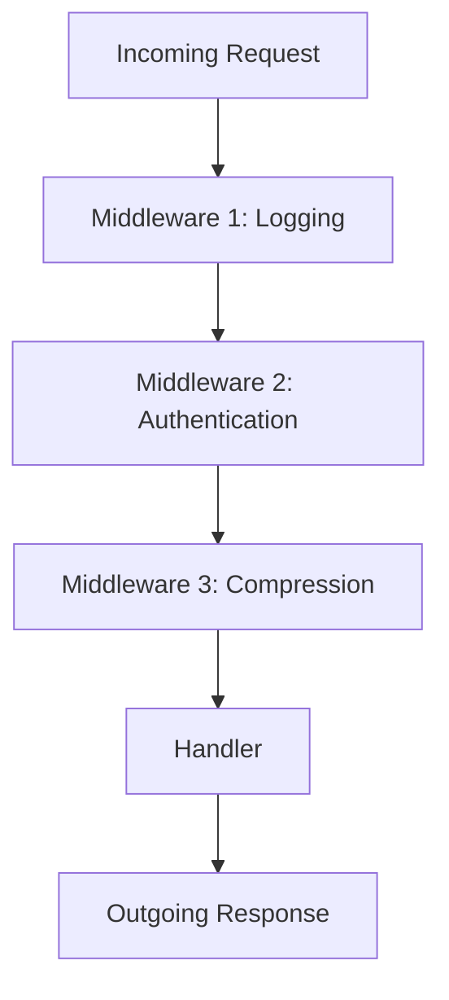

## 7.9. Implementing Wrappers and Middleware

In the realm of software development, especially in functional programming languages like Clojure, the concepts of wrappers and middleware play a crucial role in enhancing modularity and addressing cross-cutting concerns. This section delves into these concepts, providing a comprehensive guide on how to implement them effectively in Clojure.

### What Are Wrappers and Middleware?

**Wrappers** and **middleware** are design patterns used to add additional behavior or functionality to existing code without modifying its core logic. They are particularly useful for handling cross-cutting concerns such as logging, authentication, and metrics.

- **Wrappers**: These are functions or constructs that "wrap" around other functions, adding pre-processing or post-processing logic. They are often used to modify the behavior of a function or to add additional functionality.
  
- **Middleware**: In the context of web applications, middleware refers to a series of functions that process requests and responses. Middleware functions are typically chained together, allowing each one to perform a specific task, such as authentication or logging, before passing control to the next function in the chain.

### The Role of Middleware in Clojure Web Applications

In Clojure, middleware is a central concept in web development, especially when using the Ring library. Ring is a Clojure web application library that provides a simple and flexible way to handle HTTP requests and responses. Middleware in Ring is used to process requests and responses, allowing developers to add functionality such as session management, authentication, and logging.

#### Example: Using Ring's Middleware

Let's explore a simple example of using middleware in a Ring-based web application. We'll create a basic web server and add middleware to log incoming requests.

```clojure
(ns myapp.core
  (:require [ring.adapter.jetty :refer [run-jetty]]
            [ring.middleware.logger :refer [wrap-with-logger]]
            [ring.util.response :refer [response]]))

(defn handler [request]
  (response "Hello, World!"))

(def app
  (-> handler
      (wrap-with-logger)))

(defn -main []
  (run-jetty app {:port 3000}))
```

In this example, we use the `wrap-with-logger` middleware to log incoming requests. The `->` threading macro is used to chain the middleware functions, making the code more readable and modular.

### Implementing Custom Middleware

Creating custom middleware in Clojure is straightforward. A middleware function is a higher-order function that takes a handler function as an argument and returns a new handler function. This new handler function can modify the request, response, or both.

#### Example: Custom Authentication Middleware

Let's implement a simple authentication middleware that checks for a specific header in the request.

```clojure
(defn wrap-authentication [handler]
  (fn [request]
    (if (= "secret-token" (get-in request [:headers "authorization"]))
      (handler request)
      {:status 401
       :headers {"Content-Type" "text/plain"}
       :body "Unauthorized"})))

(def app
  (-> handler
      (wrap-authentication)
      (wrap-with-logger)))
```

In this example, the `wrap-authentication` middleware checks for an "authorization" header. If the header is present and matches the expected value, the request is passed to the next handler. Otherwise, a 401 Unauthorized response is returned.

### Benefits of Modularity and Separation of Concerns

Using wrappers and middleware promotes modularity and separation of concerns in your applications. By encapsulating cross-cutting concerns in middleware, you can:

- **Enhance Code Reusability**: Middleware functions can be reused across different parts of an application or even in different projects.
- **Improve Maintainability**: By separating concerns, you make your codebase easier to understand and maintain.
- **Facilitate Testing**: Middleware functions can be tested independently, making it easier to ensure the correctness of your application.

### Beyond Web Development: Applicability of Middleware

While middleware is commonly associated with web development, its principles can be applied to other domains. For example, in data processing pipelines, middleware-like functions can be used to transform data at various stages. Similarly, in event-driven systems, middleware can be used to process events before they reach their final destination.

### Visualizing Middleware Flow

To better understand how middleware functions work together, let's visualize the flow of a request through a series of middleware functions.



In this diagram, an incoming request passes through a series of middleware functions before reaching the final handler. Each middleware function can modify the request or response, adding functionality such as logging, authentication, or compression.

### Try It Yourself

Now that we've explored the basics of wrappers and middleware, it's time to experiment with these concepts. Try modifying the code examples to add additional middleware functions or create your own custom middleware. Consider implementing middleware for tasks such as:

- **Rate Limiting**: Limit the number of requests a client can make in a given time period.
- **Caching**: Cache responses to improve performance.
- **Error Handling**: Catch and handle errors in a centralized manner.

### Knowledge Check

Before we conclude, let's reinforce what we've learned with a few questions:

1. What is the primary purpose of middleware in a web application?
2. How does the `->` threading macro help in chaining middleware functions?
3. What are some benefits of using middleware in your applications?
4. Can middleware be used outside of web development? Provide an example.
5. How would you implement a custom middleware function in Clojure?

### Summary

In this section, we've explored the concepts of wrappers and middleware in Clojure, focusing on their role in enhancing modularity and addressing cross-cutting concerns. We've seen how middleware can be used in web applications to add functionality such as logging and authentication, and we've discussed the benefits of using middleware to promote separation of concerns. Remember, this is just the beginning. As you continue to explore Clojure, you'll discover even more ways to leverage these powerful patterns in your applications.

## **Ready to Test Your Knowledge?**



### What is the primary purpose of middleware in a web application?

- [x] To handle cross-cutting concerns like logging and authentication
- [ ] To directly modify the core logic of the application
- [ ] To replace the main application handler
- [ ] To serve static files

> **Explanation:** Middleware is used to handle cross-cutting concerns such as logging, authentication, and metrics, without modifying the core logic of the application.

### How does the `->` threading macro help in chaining middleware functions?

- [x] It allows for a readable and modular way to apply multiple middleware functions
- [ ] It executes middleware functions in parallel
- [ ] It reverses the order of middleware execution
- [ ] It only works with built-in middleware

> **Explanation:** The `->` threading macro helps in chaining middleware functions in a readable and modular manner, allowing each function to be applied in sequence.

### What are some benefits of using middleware in your applications?

- [x] Enhances code reusability and maintainability
- [x] Facilitates testing by allowing independent testing of middleware functions
- [ ] Increases the complexity of the codebase
- [ ] Requires rewriting the core application logic

> **Explanation:** Middleware enhances code reusability and maintainability by separating concerns and allows for independent testing of middleware functions.

### Can middleware be used outside of web development? Provide an example.

- [x] Yes, in data processing pipelines for data transformation
- [ ] No, middleware is exclusive to web development
- [ ] Yes, but only for handling file I/O
- [ ] Yes, but only for database transactions

> **Explanation:** Middleware principles can be applied outside of web development, such as in data processing pipelines where data is transformed at various stages.

### How would you implement a custom middleware function in Clojure?

- [x] By creating a higher-order function that takes a handler and returns a new handler
- [ ] By modifying the core application logic directly
- [ ] By using a built-in Clojure library exclusively
- [ ] By creating a new namespace for each middleware

> **Explanation:** A custom middleware function in Clojure is implemented as a higher-order function that takes a handler and returns a new handler, allowing for request and response modification.

### What is a common use case for middleware in web applications?

- [x] Authentication and authorization
- [ ] Direct database access
- [ ] Rendering HTML templates
- [ ] Serving static files

> **Explanation:** A common use case for middleware in web applications is handling authentication and authorization, ensuring that only authorized users can access certain resources.

### What is the advantage of using custom middleware over built-in middleware?

- [x] Custom middleware can be tailored to specific application needs
- [ ] Built-in middleware is always more efficient
- [ ] Custom middleware requires less testing
- [ ] Built-in middleware cannot be modified

> **Explanation:** Custom middleware can be tailored to meet specific application needs, providing flexibility and control over the request and response processing.

### How does middleware promote separation of concerns?

- [x] By encapsulating cross-cutting concerns in separate functions
- [ ] By combining all concerns into a single function
- [ ] By directly modifying the core application logic
- [ ] By eliminating the need for a main application handler

> **Explanation:** Middleware promotes separation of concerns by encapsulating cross-cutting concerns in separate functions, allowing for cleaner and more maintainable code.

### What is a potential drawback of using too much middleware?

- [x] It can lead to increased complexity and performance overhead
- [ ] It simplifies the application logic too much
- [ ] It eliminates the need for testing
- [ ] It makes the application less secure

> **Explanation:** Using too much middleware can lead to increased complexity and performance overhead, as each middleware function adds additional processing to requests and responses.

### True or False: Middleware can only be used in Clojure web applications.

- [ ] True
- [x] False

> **Explanation:** False. While middleware is commonly used in web applications, its principles can be applied to other domains, such as data processing pipelines and event-driven systems.



Remember, this is just the beginning. As you progress, you'll build more complex and interactive applications using Clojure's powerful features. Keep experimenting, stay curious, and enjoy the journey!
